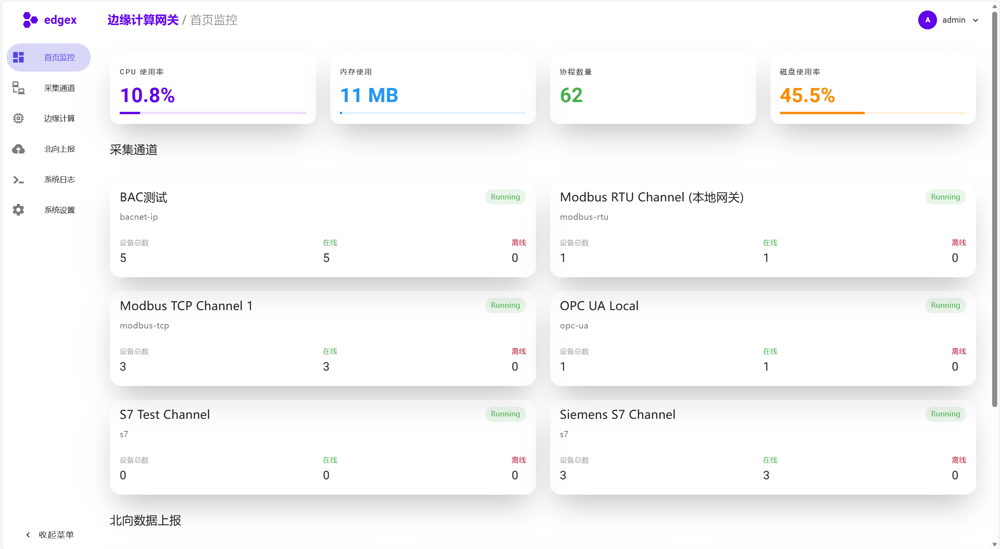

# Industrial Edge Gateway

Industrial Edge Gateway 是一个轻量级的工业边缘计算网关，旨在连接工业现场设备（南向）与云端/上层应用（北向），并提供本地边缘计算能力。项目采用 Go 语言开发后端，Vue 3 开发前端管理界面。

<div align="center">
  
</div>

## ✨ 主要特性

### 🔌 南向采集协议 (Southbound)

| 协议 | 状态 | 说明 |
| :--- | :--- | :--- |
| **Modbus TCP / RTU / RTU Over TCP** | ✅ 已实现 | 完整支持，基于 `simonvetter/modbus` |
| **BACnet IP** | ✅ 已实现 | 支持设备发现 (Who-Is/I-Am)、多网口广播 + 单播回退（尊重 I-Am 源端口）、对象扫描与点位读写、批量读失败自动回退到单读、异常端口回退至 47808、读超时与自动恢复优化。**新增本地模拟器支持**：针对 Windows 本地运行的模拟器，自动尝试 localhost 单播发现。 |
| **OPC UAClient** | ✅ 已实现 | 基于 `gopcua/opcua` 实现，支持读写操作、订阅 (Subscription) 与监控 (Monitoring)，支持断线自动重连 |
| **Siemens S7** | 🚧 开发中 | 支持 S7-200Smart/1200/1500 等 (定制开发) |
| **EtherNet/IP (ODVA)** | 🚧 开发中 | 开发实现 |
| **Mitsubishi MELSEC (SLMP)** | 🚧 开发中 | 开发实现 |
| **Omron FINS (TCP/UDP)** | 🚧 开发中 | 开发实现 |
| **DL/T645-2007** | 🚧 开发中 | 开发实现 |

### ☁️ 北向上报协议 (Northbound)

| 协议 | 状态 | 说明 |
| :--- | :--- | :--- |
| **MQTT** | ✅ 已实现 | 支持自定义 Topic、Payload 模板 支持批量点位映射与反向控制，提供服务端运行监控（数据统计）|
| **Sparkplug B** | ✅ 已实现 | 支持 NBIRTH, NDEATH, DDATA 消息规范 |
| **OPC UAServer** | ✅ 已实现 | 基于 `awcullen/opcua` 实现，支持多种认证方式（匿名/用户名/证书），支持数据点位映射与反向控制，提供服务端运行监控（客户端数/订阅数/写统计） |

### 🧠 边缘计算 & 管理
*   **规则引擎**: 内置轻量级规则引擎，支持 `expr` 表达式进行逻辑判断和联动控制。
*   **日志系统**:
    *   **实时日志**: 支持 WebSocket 实时推送，具备暂停/继续、日志级别筛选（INFO/WARN/ERROR等）、清屏功能。
    *   **历史日志**: 分钟级快照持久化（bbolt），支持按日期查询与 CSV 导出。
    *   **UI体验**: 现代化控制台风格，支持分页显示（每页30行）与倒序排列。
*   **可视化管理**:
    *   基于 Vue 3 + Vuetify 的现代化 UI。
    *   **登录安全**: 支持 JWT 认证、登录倒计时保护。
    *   **视图切换**: 通道列表支持卡片/列表视图切换。
    *   **北向管理**: 提供 OPC UAServer 安全配置（用户/证书）与实时运行状态监控看板。
*   **配置管理**: 采用模块化 YAML 配置 (`conf/` 目录)，支持热重载（部分）。
*   **离线支持**: 前端依赖已优化，支持完全离线局域网运行。

## 🧠 边缘计算指南 (Edge Computing Guide)

本网关内置强大的边缘计算引擎，支持基于规则的本地联动控制，特别针对工业位操作（Bitwise Operations）进行了深度优化。

### 1. 表达式语法 (Expression Syntax)

规则引擎兼容 `expr` 语言，并扩展了工业场景专用的语法糖：

#### 基础变量
*   `v`: 当前点位的实时值 (Value)。

#### 位操作增强
针对 PLC/控制器常见的位逻辑，支持 **1-based** (v.N) 和 **0-based** (v.bit.N) 两种风格：

| 语法/函数 | 索引方式 | 说明 | 等效函数 |
| :--- | :--- | :--- | :--- |
| **`v.N`** | **1-based** | 获取第 N 位 (从1开始) | `bitget(v, N-1)` |
| **`v.bit.N`** | **0-based** | 获取第 N 位 (索引从0开始) | `bitget(v, N)` |

**内置位运算函数**:
*   `bitget(v, n)`: 获取第 n 位 (0/1)
*   `bitset(v, n)`: 将第 n 位置 1
*   `bitclr(v, n)`: 将第 n 位置 0
*   `bitand(a, b)`, `bitor(a, b)`, `bitxor(a, b)`, `bitnot(a)`
*   `bitshl(v, n)` (左移), `bitshr(v, n)` (右移)

### 2. 智能写入机制 (Read-Modify-Write)

当对寄存器进行位操作写入时，网关采用 **RMW (读-改-写)** 机制，确保**不破坏其他位的状态**。

*   **场景**: 仅修改 16位 状态字中的第 4 位 (v.4)，保持第 1-3 位不变。
*   **流程**:
    1.  **Read**: 驱动读取当前点位完整值 (e.g., `0001`)。
    2.  **Modify**: 根据公式 `v.4` (置位) 计算新值 (`1001`)。
    3.  **Write**: 将新值 `1001` 写入设备。
*   **配置**: 在动作 (Action) 的写入公式中直接使用 `v.N` 即可触发此机制。

### 3. 批量控制 (Batch Control)
支持单条规则触发多个设备的动作：
*   **多目标**: 在 UI 中为同一个动作添加多个 Target (设备+点位)。
*   **并行执行**: 引擎会自动并发处理所有目标的写入请求。

### 4. UI 辅助
*   **表达式测试**: 规则编辑器内置“计算器”图标，可实时测试表达式结果。
*   **函数文档**: 点击“查看函数文档”可浏览完整支持的函数列表与示例。

## 🛠️ 技术栈

*   **后端**: Go 1.25+
    *   Web 框架: [Fiber](https://github.com/gofiber/fiber)
    *   MQTT: [Paho MQTT](https://github.com/eclipse/paho.mqtt.golang)
    *   Modbus: [simonvetter/modbus](https://github.com/simonvetter/modbus)
    *   OPC UA: [gopcua/opcua](https://github.com/gopcua/opcua)
    *   表达式引擎: [expr](https://github.com/expr-lang/expr)
*   **前端**: Vue 3
    *   构建工具: Vite
    *   UI 库: Vuetify 3
    *   路由: Vue Router 4
    *   HTTP 客户端: Axios (带自动 Token 注入)

## 🚀 快速开始

### 前置要求
*   [Go](https://go.dev/dl/) 1.25+
*   [Node.js](https://nodejs.org/) 16+ (仅用于编译前端)

### 1. 启动后端

后端支持通过 `-conf` 参数指定配置目录（默认为 `./conf`）。

```bash
# 获取依赖
go mod tidy

# 运行网关
go run cmd/main.go

# 或者指定配置目录
go run cmd/main.go -conf ./conf/
```

### 2. 编译前端

前端代码位于 `ui/` 目录下。生产环境构建后，后端会自动托管 `ui/dist` 静态资源。

```bash
cd ui

# 安装依赖 (建议使用 npm 或 pnpm)
npm install

# 编译生产环境代码
npm run build
```

访问 `http://localhost:8082` (默认端口) 即可进入管理界面。  
默认账号见 `conf/users.yaml`（admin / passwd@123）。

### 3. 设备扫描与点位管理（BACnet）
- 通道页面进入设备 → 点位列表 → 点击“扫描点位”即可从设备读取对象列表（并行富化 Vendor/Model/ObjectName/当前值）。
- 勾选后点击“添加选定点位”，系统将以 `Type:Instance` 地址和合适的数据类型（AI/AV→float32，Binary→bool，MultiState→uint16）批量注册。
- 发现流程：优先单播 WhoIs（目标 IP/端口），失败后进行多网口广播；仍失败时使用配置地址回退构造设备并标记为离线。
- 扫描结果结构（示例字段）：`device_id`, `ip`, `port`, `vendor_name`, `model_name`, `object_name`。
- 读取策略：批量读取失败时自动回退到单属性读取；读取/传输层超时已提升（典型 10s）并配合 30s 冷却的自动恢复机制。
- 端口策略：尊重设备 I-Am 的源端口进行后续单播通信，异常时回退到标准端口 47808。
- 网关通过 WebSocket 将最新值实时推送到前端，列表可见质量标签（Good/Bad）与时间戳。
- 本机同时运行网关与模拟器时，如遇 47808 端口冲突，请将网关绑定到指定网卡 IP（例如 `192.168.3.106:47808`）而非 `0.0.0.0:47808`。

## 📡 API 概览
- 所有 API 需要携带认证头：`Authorization: Bearer <token>`（默认账号见 `conf/users.yaml`）。
- 扫描通道设备（多网口广播 + 单播回退）  
  POST `/api/channels/:channelId/scan`
- 扫描设备对象（设备级，对 BACnet 注入 `device_id`/`ip`）  
  POST `/api/channels/:channelId/devices/:deviceId/scan`
- 设备点位管理  
  GET `/api/channels/:channelId/devices/:deviceId/points`  
  POST `/api/channels/:channelId/devices/:deviceId/points`  
  PUT `/api/channels/:channelId/devices/:deviceId/points/:pointId`  
  DELETE `/api/channels/:channelId/devices/:deviceId/points/:pointId`
- 实时数据订阅（WebSocket）  
  GET `/api/ws/values`
- 边缘计算日志与导出  
  GET `/api/edge/logs`  
  GET `/api/edge/logs/export`

## ⚙️ 配置结构

配置文件已拆分为模块化 YAML 文件，位于 `conf/` 目录：

*   `server.yaml`: HTTP 服务器端口、静态资源路径
*   `channels.yaml`: 南向通道及设备配置
*   `northbound.yaml`: 北向 MQTT/SparkplugB 配置
*   `edge_rules.yaml`: 边缘计算规则配置
*   `system.yaml`: 系统级网络配置
*   `users.yaml`: 用户账号管理
*   `storage.yaml`: 数据库路径配置

示例（BACnet 通道片段）：

```yaml
id: bac-test-1
protocol: bacnet-ip
config:
  interface_port: 47808
devices:
  - id: "2228316"
    enable: true
    interval: 2s
    config:
      device_id: 2228316
      ip: 192.168.3.106
      port: 47808
    points:
      - id: AnalogInput_0
        name: Temperature.Indoor
        address: AnalogInput:0
        datatype: float32
        readwrite: R
```

## 📅 TODO / Roadmap

### 核心驱动完善
- [x] **OPC UAClient**: 对接 `gopcua/opcua` 实现真实读写。
- [ ] **Siemens S7**: 实现 S7 协议的真实 TCP 通信。
- [ ] **EtherNet/IP**: 实现 CIP/EIP 协议栈。
- [ ] **其他驱动**: 逐步替换 Mitsubishi, Omron, DL/T645 的开发实现。

### 北向增强
- [x] **OPC UAServer**: 实现基于 `awcullen/opcua` 的服务端，支持多重认证（匿名/用户名/证书）与运行监控。
- [ ] **HTTP Push**: 支持通过 HTTP POST 推送数据到第三方 HTTP 服务器。

### 系统功能
- [ ] **真实系统监控**: 替换 Dashboard 中的模拟 CPU/内存数据为真实系统调用 (如 `gopsutil`)。
- [ ] **日志持久化**: 提供基于文件的日志查看和下载功能。
- [ ] **数据存储**: 增强时序数据存储能力（目前仅存储配置和少量状态）。

## 📸 界面预览 (Gallery)

### 📊 概览与系统

#### 登录页


#### 首页监控


#### 系统设置


### 🔌 南向采集 (BACnet / OPC UA)

#### 通道列表


#### BACnet 设备发现


#### BACnet 设备发现结果


#### BACnet 点位扫描


#### OPC UA模型扫描


#### OPC UA模型扫描结果


#### OPC UA数据订阅


#### OPC UA数据转换


### 🧠 边缘计算

#### 计算监控


#### 规则配置


#### 边缘计算规则支持类型


#### 边缘计算规则支持动作类型


#### 规则帮助手册


#### 规则日志


### ☁️ 北向数据

#### 北向总览


#### MQTT 监控


#### MQTT 手册


## 📄 License

Mozilla Public License 2.0 (MPL-2.0)
