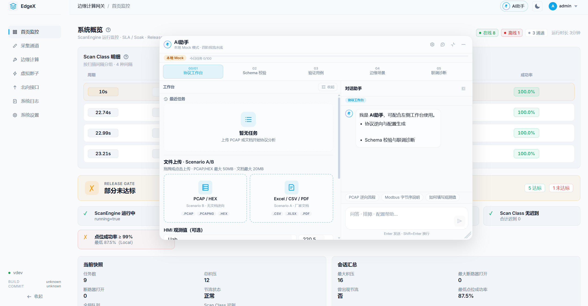
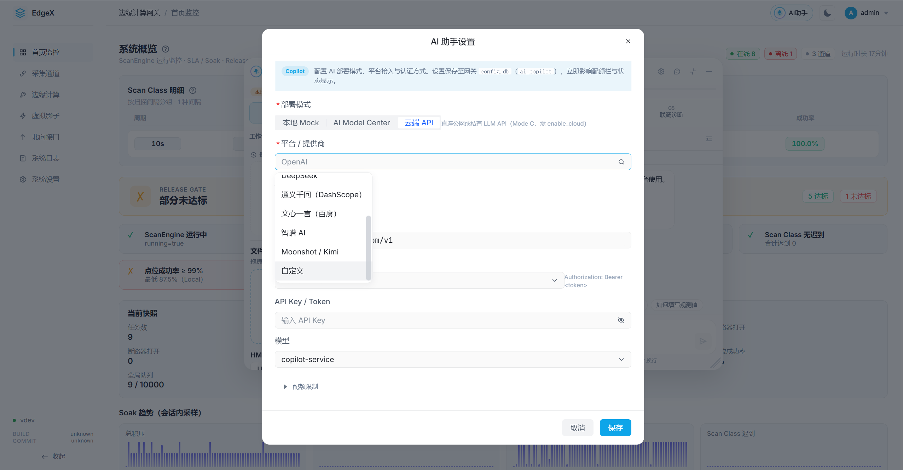

# EdgeX AI协同规划 — 工业协议逆向工程 · 生产配置交付

> **产品定位**：**工业协议工程 Copilot** — **不是**聊天助手。输入厂家资料与/或报文抓包，输出 **Protocol Model + Point Definition + Driver Parameter + Validation Case**，经人工确认后可直接导入 EdgeX 生产环境。  
> **核心价值**：「工程师花 2 天分析协议」→「AI 30 分钟生成候选配置，工程师确认上线」。  
> **工程铁律**：任何 AI 能力不得以牺牲稳定性为代价；**禁止** AI 调用进入 ScanEngine / Pipeline Worker 热路径；所有写配置须经 **Human-in-the-loop** 确认后落库。  
> **架构结论**：**工业边缘自治 + AI 协同中心** — RK3588/3688 等边缘网关运行 EdgeX 采集内核、**报文捕获/解码**与 AI Agent Client；LLM/VLM/Embedding 与 **protocol_knowledge.db（bbolt）** 统一由远端 **AI Model Center** 承担；**AI 故障不得影响工业采集与规则执行**。


| 项       | 内容                                                                                                            |
| ------- | ------------------------------------------------------------------------------------------------------------- |
| 版本      | **V1.4**                                                                                                      |
| 更新      | 2026-07-09                                                                                                    |
| 状态      | **规划中**                                                                                                       |
| 产品名     | **EdgeX Industrial Protocol Copilot**（代码路径 `internal/ai_agent/` 可保留）                                          |
| 架构基线    | [TODO 索引 §1 新架构约束](./index.md) · [边缘网关架构设计总览](../edge/边缘网关架构设计总览.md)                                          |
| 关联 TODO | [设备点位读写系统升级改造计划](./设备点位读写系统升级改造计划.md) · [边缘计算优化升级 2.0](./边缘计算优化升级2.0.md)                                      |
| 用户文档    | [边缘计算场景手册](../edge/EDGE_COMPUTING_SCENARIO_MANUAL.md) · [边缘计算最佳实践](../guide/EDGE_COMPUTING_BEST_PRACTICES.md) |


---
<div align="center">
  
  <p><small>图 1: 边缘AI 助手</small></p>
</div>
---
<div align="center">
  
  <p><small>图 2: 支持本地模型和在线接口</small></p>
</div>

## §0 背景与目标


### 0.1 背景

EdgeX 南向已支持 Modbus / OPC UA / S7 / BACnet / EIP / SNMP / IEC104 等 12+ 协议，采集内核以 **ScanEngine → ShadowCore → DataPipeline** 为统一数据面。现场集成仍高度依赖人工：

1. **阅读厂家 PDF / DOC / 寄存器表 / 点表 Excel / 上位机监控表 / 抓包文件**，手工录入 `model.Point`（地址、数据类型、缩放、读写属性）
2. **对照协议差异**（Modbus 功能码、S7 DB 块、BACnet ObjectType 等）反复试错；**仅有 HMI 显示值而无寄存器地址**时，需对照 PCAP 人工逆向
3. **编写通道驱动参数**（从站号、IP/端口、字节序、扫描类）与 EdgeRule 场景骨架
4. **联调排障**依赖 `/api/diagnostics/`* 与日志，缺少上下文化建议

上述工作重复、易错，且与协议栈知识强耦合。本模块以 **工业协议逆向工程引擎（Industrial Protocol Reverse Engineering Engine）** 为核心，在**冷路径**将厂家资料与报文分析转化为 **可生产部署的 EdgeX 配置**，而非生成可读性报告或文档摘要。

### 0.2 目标


| #      | 目标                        | 可度量结果                                                                       |
| ------ | ------------------------- | --------------------------------------------------------------------------- |
| **G0** | **协议逆向 → 生产配置**（模块核心）     | 无文档设备：PCAP + 显示值 → 30min 内产出候选点位 + Channel/Point JSON；工程师确认后 import         |
| G1     | 厂家文档 / 监控表 → 结构化点位 + 驱动参数 | 单设备 50～200 点表，人工校对时间 ↓ 60%+                                                 |
| G2     | 输出与驱动规范对齐                 | Protocol Model / Point Definition / Driver Parameter 导入前 Schema 校验通过率 ≥ 95% |
| G3     | 附带 Validation Case        | 每批候选含可回放验证用例（期望读数、容差、证据链）                                                   |
| G4     | 边缘垂直场景草稿（辅助）              | 从场景描述生成 EdgeRule / 场景模版 JSON 草案                                             |
| G5     | 联调诊断辅助（辅助）                | 结合 diagnostics + 日志给出可执行排查步骤                                                |
| G6     | Token 成本可控                | 网关侧配额可限、可审计；**本地 Mock UI 仅展示每日任务配额**，Token 用量在 **AI Model Center（remote）** 模式下可见 |


### 0.3 非目标（明确边界）

- **不**做通用聊天助手或文档摘要工具——AI 输出 **不是** Markdown 报告，而是 **EdgeX 可导入 JSON**
- **不**在 ScanEngine / ExecutionLayer / Pipeline Worker 循环内调用 LLM
- **不**在 RK3588 / ARM64 边缘网关上运行 LLM 推理（无 Ollama / vLLM 本地模型）
- **不**让 LLM 解码字节——字节解析由 **Decoder（确定性）** 与 **Rule Engine** 完成
- **不**自动写入 `config.db` 或下发写点指令（须 UI/API 显式确认）
- **不**将完整现场配置、凭证、北向密钥上传至公网（默认脱敏 + 可选私有 AI Server）
- **不**替代驱动 `decoder_test.go` 与联机测试报告


### 0.4 最终交付物（四类产出）


| 交付物                  | 说明                                                      | 落库路径                     |
| -------------------- | ------------------------------------------------------- | ------------------------ |
| **Protocol Model**   | `protocol_id`、帧特征、地址模型、字节序规则、功能码惯例                      | 校验 + 通道配置参考              |
| **Point Definition** | `[]ImportPoint` 对齐 `model.Point`：地址、类型、scale、scan_class | `POST .../points/import` |
| **Driver Parameter** | Channel JSON：协议、IP、端口、slave、rack/slot、device_instance 等 | 通道配置 API                 |
| **Validation Case**  | 期望读数、容差 ε、证据（帧偏移/寄存器/时间戳）、置信度                           | 联调回放；不入 config.db        |


---


## §1 核心能力定位


### 1.1 模块 centerpiece：工业协议逆向工程引擎

**Industrial Protocol Reverse Engineering Engine** 是本模块 **P0+ 核心能力**，而非文档解析的附属功能。引擎贯通 **协议识别 → 报文结构解析 → 物理量推理 → 生产配置生成** 四阶段流水线（见 §2），支撑 **Scenario B（无文档）** 高价值场景，并由 **Scenario A（有文档）** 提供地址真源与交叉验证。

### 1.2 双输入场景


#### Scenario A — 有文档（Supporting · P0）

厂家已提供可解析资料，AI 抽取结构化字段后生成生产配置。

```text
PDF / Excel / DOC / PLC变量表 / HMI点表
    ↓  文档解析（AI Server：OCR/RAG/LLM 结构化）
协议 ID 推断 → 地址模型 → datatype → 换算规则（scale/offset/byte_order）
    ↓  Rule Engine + Schema 校验
Point Definition + Driver Parameter + Validation Case
    ↓  Human Confirm
EdgeX Point Model + Channel JSON → import
```


| 输入类型             | 典型来源        | 产出                   |
| ---------------- | ----------- | -------------------- |
| 厂家 PDF / 协议手册    | 寄存器表章节      | 地址 + 类型 + scale      |
| Excel / CSV 点表   | 厂家交付、HMI 导出 | 批量 Point JSON        |
| PLC 变量表 / TIA 导出 | `.xml`、符号表  | S7 DB 偏移映射           |
| 上位机监控表           | WinCC、组态王等  | 标签名 + 描述 + 可选 I/O 地址 |


#### Scenario B — 无文档（Core · P0+ · 更高价值）

现场**无可靠寄存器表**，仅有 HMI 显示值与 PCAP/串口 HEX 抓包。引擎被动分析报文，推理候选点位，经人工确认后上线。

```text
PCAP / 串口 HEX 抓包
    ↓  网关本地：Capture + Decoder（确定性，复用驱动 decoder）
协议 ID（Rule Engine 优先）→ 通信行为分析（轮询周期、FC 序列）
    ↓  字段候选：datatype × byte_order × scale 组合
物理量推理（LLM：数值关联，如 220.5/221.1/219.8 → Uab/Ubc/Uca）
    ↓  candidate points + confidence
Human Confirm → Production Config（Channel + Point JSON）→ import
```

> **Scenario B 是产品差异化核心**：解决「有显示值、无地址」的现场痛点，将 2 天人工逆向压缩至 30 分钟候选生成。


### 1.3 能力价值表


| 能力          | 价值                  |
| ----------- | ------------------- |
| 厂家 PDF 解析   | 自动生成点表与驱动参数         |
| Excel 点表解析  | 快速批量导入              |
| **PCAP 逆向** | **无文档设备接入（核心）**     |
| 串口 HEX 分析   | 老设备 / Modbus RTU 兼容 |
| 协议识别        | 自动选择驱动与解码策略         |
| 点位推理        | 减少工程调试与试错           |
| 配置生成        | 直接生产部署，非可读报告        |


### 1.4 场景对照

```text
┌─────────────────────────────────────────────────────────────────────────┐
│           EdgeX Industrial Protocol Copilot                              │
├──────────────────────────────┬──────────────────────────────────────────┤
│  Scenario A（有文档）         │  Scenario B（无文档 · 核心）              │
│  PDF/Excel/DOC/PLC表/HMI点表  │  PCAP / 串口 HEX + HMI 显示值            │
│         ↓                    │         ↓                                │
│  文档解析 + RAG              │  网关 Decoder + Rule Engine              │
│         ↓                    │         ↓                                │
│  结构化字段抽取              │  报文结构 + 字段候选                      │
│         ↓                    │         ↓                                │
│  ───────────── 四阶段流水线（§2）────────────────────────────────────  │
│         ↓                    │         ↓                                │
│  Protocol Model + Points + Driver Param + Validation Case              │
│         ↓                                                                │
│  Human Confirm → EdgeX config.db（Channel + Point import）              │
└─────────────────────────────────────────────────────────────────────────┘
```

---


## §2 四阶段分析流水线

所有协议分析任务（Scenario A/B）统一经过四阶段流水线。**阶段 1～2 以确定性解码为主；阶段 3 为 LLM 最高价值区；阶段 4 输出生产 JSON。**

### 2.1 阶段一：协议识别（Protocol Identification）

**Rule Engine 优先，非 LLM 猜测。**


| 协议             | 识别特征                                                     | 置信度来源                        |
| -------------- | -------------------------------------------------------- | ---------------------------- |
| **Modbus TCP** | TCP 502 + MBAP 头（TransactionId/ProtocolId/Length/UnitId） | 端口 + PDU 结构匹配                |
| **S7**         | TCP 102 + TPKT/COTP + S7 PDU                             | 握手 Setup Communication       |
| **BACnet/IP**  | UDP 47808 + BVLC（type 0x81）                              | Who-Is / I-Am / ReadProperty |
| Modbus RTU     | 串口透传 / RTU-over-TCP + CRC                                | 从站地址 + FC + CRC 校验           |


```text
输入帧 / PCAP 摘要
    ↓
Rule Engine：端口 + 魔数 + 帧头模式匹配
    ↓
protocol_id + confidence_score（0～1）
    ↓
confidence < 0.7 → UI 提示人工选择协议；不进入阶段二
```


### 2.2 阶段二：报文结构解析（Message Structure Parsing）

**Decoder 提取确定性字段**（复用 `internal/driver/*/decoder.go`）：


| 协议     | 提取字段                                                                                |
| ------ | ----------------------------------------------------------------------------------- |
| Modbus | `slave_id`, `function_code`, `start_address`, `quantity`, response `raw[]`          |
| BACnet | `device_instance`, `object_type`, `instance`, `property_id`, `present-value` octets |
| S7     | `area`, `db`, `offset`, response raw                                                |


对 response raw 尝试 **UINT16 / INT32 / UINT32 / FLOAT32** 及 **ABCD / CDAB / BADC / DCBA** 字节序变体，产出 **candidate_fields[]**（每项含解码值、偏移、datatype 假设）。

### 2.3 阶段三：物理量推理（Physical Quantity Inference）

**LLM 最高价值环节**——仅做语义理解与关联推理，**不**解码字节：


| LLM 职责  | 示例                                            |
| ------- | --------------------------------------------- |
| 数值关联    | 220.5、221.1、219.8 → 推断为 Uab / Ubc / Uca 三相线电压 |
| 单位与量纲   | 描述「线电压」+ 数值域 200～250 → V                      |
| 多标签联合评分 | Ia/Ib/Ic 同时匹配 → 提升置信度                         |
| 命名建议    | `CHILLER_P1_TEMP1` → 中文名「冷机1蒸发侧进水温度」          |


输入：`candidate_fields[]` + 监控表观测值（可选）+ `protocol_knowledge.db`（bbolt）检索片段。  
输出：`point_candidates[]` 含 `confidence`、`evidence`、`semantic_label`。

### 2.4 阶段四：生产配置生成（Production Config Generation）

输出 **EdgeX 可直接导入的 JSON**，非人类可读报告：

- **Channel JSON**：`protocol_id`, `ip`, `port`, `slave_id`, 协议专属参数
- **Point JSON**：`id`, `name`, `address`, `datatype`, `scale`, `scan_class`, `function_code`, `byte_order`
- **Validation Case**：期望读数、容差、关联帧证据

```text
阶段一 ──► 阶段二 ──► 阶段三 ──► 阶段四
Rule ID     Decoder      LLM 语义     Channel + Point JSON
            候选字段      物理量关联    + Validation Case
                                              ↓
                                    Result Validator → UI Diff → Confirm → import
```

---


## §3 Decoder / Rule Engine / LLM 分工


### 3.1 流水线架构（CRITICAL）

```text
PCAP / HEX / 文档表格
    ↓
┌──────────────────────────────────────────────────────────────────┐
│  网关（RK3588）                                                    │
│  Capture（gopacket）→ Decoder（确定性 · 复用驱动 decoder）         │
│       ↓                                                            │
│  协议字段摘要 JSON（不上传原始 PCAP 全量）                          │
└───────────────────────────────┬──────────────────────────────────┘
                                │ gRPC / MQTT
┌───────────────────────────────▼──────────────────────────────────┐
│  AI Server（AI Model Center）                                     │
│  Rule Engine（协议识别 · 模式匹配 · 寄存器惯例）                   │
│       ↓                                                            │
│  candidate_fields[]（datatype/offset/scale 组合枚举结果）          │
│       ↓                                                            │
│  LLM（仅语义层：推理 · 关联 · 命名 · 置信度解释）                   │
│       ↓                                                            │
│  Point Candidate + Protocol Model + Driver Parameter               │
└───────────────────────────────┬──────────────────────────────────┘
                                │
┌───────────────────────────────▼──────────────────────────────────┐
│  网关 Result Validator → Human Confirm → config.db import          │
└──────────────────────────────────────────────────────────────────┘
```


### 3.2 职责矩阵


| 组件              | 执行位置                             | 做什么                            | **不**做什么 |
| --------------- | -------------------------------- | ------------------------------ | -------- |
| **Capture**     | 网关 `internal/ai_agent/pcap/`     | gopacket 解帧、串口 HEX 解析          | LLM 调用   |
| **Decoder**     | 网关（复用 `driver/*/decoder.go`）     | 字节 → 结构化字段；FC/地址/raw 提取        | 猜测物理量含义  |
| **Rule Engine** | AI Server（可同步规则至网关只读缓存）          | 协议 ID、端口模式、寄存器映射惯例、datatype 枚举 | 自然语言理解   |
| **LLM**         | AI Server                        | 语义理解、物理量推断、多值关联、命名             | **解码字节** |
| **Validator**   | 网关 `internal/ai_agent/validate/` | Schema、驱动规范、冲突检测               | 推理       |


### 3.3 设计原则

```text
确定性优先：能用 Rule + Decoder 解决的，不用 LLM
LLM 最小化：仅阶段三语义推理消耗 Token
知识沉淀：每次确认上线的映射写入 protocol_knowledge.db bbolt 桶（§8）
```

---


## §4 组件定位（EdgeX 架构中的位置）


### 4.1 架构分层：边缘网关 vs AI 推理中心

**EdgeX Industrial Protocol Copilot** 采用 **边缘网关 + AI 推理中心分离** 架构。网关侧运行 **Capture / Decoder / Task Agent**（`internal/ai_agent/`）；文档解析、RAG、LLM 路由、**protocol_knowledge.db（bbolt）** 在远端 **AI Model Center** 完成。

```text
┌─────────────────────────────────────────────────────────────────────────────┐
│  UI：点位列表 · 设备配置 · Industrial Protocol Copilot 面板（新）            │
└───────────────────────────────┬─────────────────────────────────────────────┘
                                │ REST / WebSocket（异步任务）
┌───────────────────────────────▼─────────────────────────────────────────────┐
│  边缘网关（RK3588 / ARM64）— 工业自治域 · 热路径优先                          │
│  ┌─────────────────────────────────────────────────────────────────────────┐ │
│  │  AI Agent Client  internal/ai_agent/                                     │ │
│  │  ┌──────────────┐ ┌─────────────────┐ ┌──────────────┐ ┌──────────────┐ │ │
│  │  │ Task Manager │ │ AI Gateway      │ │ Result       │ │ Human        │ │ │
│  │  │ 任务队列/状态 │ │ Client (gRPC/   │ │ Validator    │ │ Confirm      │ │ │
│  │  │ 机 · bbolt   │ │ MQTT/NATS)      │ │ Schema 校验  │ │ 确认落库     │ │ │
│  │  └──────┬───────┘ └────────┬────────┘ └──────┬───────┘ └──────┬───────┘ │ │
│  │  ┌──────▼───────────────────▼─────────────────▼────────────────┐         │ │
│  │  │ Capture + Decoder  internal/ai_agent/pcap/  （确定性 · 无 LLM）       │ │ │
│  │  └─────────────────────────────────────────────────────────────┘         │ │
│  │                         每日任务配额（UI）+ Token 计数（后端 · remote UI 可见）+ Audit Log   │ │
│  └─────────────────────────────────────────────────────────────────────────┘ │
│  ┌─────────────────────────────────────────────────────────────────────────┐ │
│  │  现有配置面（不变）                                                       │ │
│  │  ChannelManager · config.db · POST .../points/import                    │ │
│  └─────────────────────────────────────────────────────────────────────────┘ │
│  ┌─────────────────────────────────────────────────────────────────────────┐ │
│  │  数据面（热路径 · AI 禁止介入）                                           │ │
│  │  ScanEngine → ExecutionLayer → Driver.ReadPoints/WritePoint            │ │
│  └─────────────────────────────────────────────────────────────────────────┘ │
└───────────────────────────────┬─────────────────────────────────────────────┘
                                │ gRPC（主）/ MQTT·NATS（弱网）
┌───────────────────────────────▼─────────────────────────────────────────────┐
│  AI Model Center（独立服务器 / 私有云）                                       │
│  ┌─────────────────────────────────────────────────────────────────────────┐ │
│  │  AI Service + Protocol Knowledge Base                                    │ │
│  │  ┌──────────────┐ ┌──────────────┐ ┌──────────────┐ ┌──────────────────┐ │ │
│  │  │ Document     │ │ Rule Engine  │ │ LLM Router   │ │ protocol_        │ │ │
│  │  │ Parser       │ │ 协议识别/模式 │ │ 语义推理     │ │ knowledge.db     │ │ │
│  │  │ PDF/OCR/RAG  │ │ 寄存器惯例   │ │              │ │ (bbolt)          │ │ │
│  │  └──────────────┘ └──────────────┘ └──────────────┘ └──────────────────┘ │ │
│  └─────────────────────────────────────────────────────────────────────────┘ │
└─────────────────────────────────────────────────────────────────────────────┘
```

**职责边界**：


| 侧                   | 模块路径                 | 职责                                                      | 禁止                            |
| ------------------- | -------------------- | ------------------------------------------------------- | ----------------------------- |
| **边缘网关**            | `internal/ai_agent/` | **Capture、Decoder**、任务编排、远端调用、结果校验、人工确认                 | LLM 推理、大文件 OCR、向量索引构建         |
| **AI Model Center** | AI Service（独立部署）     | 文档解析、Rule Engine、RAG、LLM 语义推理、**protocol_knowledge.db（bbolt 主库）** | 直接写 `config.db`、调度 ScanEngine |


### 4.2 与「Protocol Token Bucket」区分

ExecutionLayer 背压中的 **Token Rate** 指**协议 IO 令牌桶限流**，与 LLM **API Token 用量**无关。


| 术语                 | 含义                                  |
| ------------------ | ----------------------------------- |
| **LLM Token**      | 模型输入/输出计费单位；由 AI Model Center 统计    |
| **Protocol Token** | ScanEngine 执行层协议速率限制；**不**与 AI 模块共享 |


### 4.3 RK3588 / ARM64 资源约束


| 约束                     | 说明                                     |
| ---------------------- | -------------------------------------- |
| **ScanEngine 优先**      | 采集调度、驱动解码、Shadow 写入始终最高优先级             |
| **单 AI Worker**        | 每网关仅 **1** 个 AI Agent Worker goroutine |
| **无本地推理**              | RK3588 **不**部署 Ollama / vLLM           |
| **Capture/Decoder 本地** | PCAP 解帧、串口 HEX 解析在网关完成，**不经 LLM**      |
| **故障隔离**               | AI Model Center 不可达时，采集与规则 **零影响**     |


---


## §5 部署架构：边缘网关 + AI 推理中心分离


### 5.1 设计原则

```text
工业边缘自治 + AI 协同中心
├── 边缘网关：EdgeX 运行时 + Capture/Decoder + AI Agent Client
│   └── RK3588：ScanEngine / 驱动 / 报文解码 — 不跑 LLM
└── AI Model Center：PDF/OCR/RAG/LLM + protocol_knowledge.db（bbolt）
    └── 语义推理 + 文档结构化 — 不直接写 config.db
```


| 原则       | 说明                                      |
| -------- | --------------------------------------- |
| **推理外置** | LLM 仅在 AI Model Center                  |
| **解码下沉** | Capture + Decoder 在网关，复用驱动纯函数           |
| **工业优先** | AI 故障 **不得**影响 ScanEngine               |
| **默认禁云** | `enable_cloud=false`；仅 Mode C 显式开启公网 AI |


### 5.2 三种部署模式


| 模式         | 名称    | 拓扑                            | 适用场景         | 推荐度      |
| ---------- | ----- | ----------------------------- | ------------ | -------- |
| **Mode A** | 工业标准  | RK3588 网关 + **就近 AI Server**  | 单项目 1～20 台网关 | ⭐ **推荐** |
| **Mode B** | 企业私有  | 1 台 GPU Server 服务 **100+** 网关 | 集团多站点        | 企业级      |
| **Mode C** | 云端 AI | 网关 → 公网 AI API                | 演示、PoC       | 非工业默认    |


```text
Mode A（工业标准 · 推荐）
┌──────────────┐  gRPC/MQTT   ┌─────────────────────────────┐
│ RK3588 网关  │◄────────────►│ AI Server（同网段）          │
│ EdgeX        │  局域网      │ LLM + RAG + protocol_       │
│ Capture/     │              │ knowledge.db（bbolt）       │
│ Decoder/     │              │ + Rule Engine               │
│ Agent Client │              │                             │
└──────────────┘              └─────────────────────────────┘
```


### 5.3 通信协议（gRPC 主通道）

网关 `AI Gateway Client` ↔ AI Service `CopilotService`：

```protobuf
service CopilotService {
  rpc CreateTask(CreateTaskRequest) returns (CreateTaskResponse);
  rpc GetTask(GetTaskRequest) returns (GetTaskResponse);
  rpc StreamResult(StreamResultRequest) returns (stream StreamResultEvent);
  rpc CancelTask(CancelTaskRequest) returns (CancelTaskResponse);
}

message CreateTaskRequest {
  string gateway_id = 1;
  string skill = 2;            // protocol-reverse | doc-parse | point-gen | config-gen | ...
  string protocol_id = 3;      // 可选；留空则由 Rule Engine 识别
  bytes payload = 4;           // 解码摘要 JSON / 文档片段 / 观测值
  map<string, string> meta = 5;
}
```

- **默认端口**：`50051`；弱网降级 MQTT/NATS（见 V1.2 §2.3.2，保持不变）
- **任务状态机**：`pending → queued → processing → waiting_model → validating → waiting_confirm → applied | failed | cancelled`


### 5.4 网关侧模块结构


| 子模块                   | 路径                            | 职责                                  |
| --------------------- | ----------------------------- | ----------------------------------- |
| **Task Manager**      | `internal/ai_agent/task/`     | 任务队列、状态机、bbolt 持久化                  |
| **Capture + Decoder** | `internal/ai_agent/pcap/`     | gopacket 解帧、串口 HEX；**复用驱动 decoder** |
| **AI Gateway Client** | `internal/ai_agent/client/`   | gRPC / MQTT / NATS                  |
| **Result Validator**  | `internal/ai_agent/validate/` | 四类产出 Schema 校验                      |
| **Human Confirm**     | `internal/ai_agent/confirm/`  | Diff 预览、apply 审计                    |
| **Token 配额**          | `internal/ai_agent/quota/`    | 本地硬限 + AI Server 同步                 |


### 5.5 RK3588 资源保护（systemd）

```ini
CPUQuota=10%
MemoryMax=256M
Nice=10
IOSchedulingClass=idle
OOMScoreAdjust=500
```

验收：ScanEngine 1w Tag 压测时，AI Agent 满载 CPU ≤ 10%，lag P99 增幅 < 5%。

### 5.6 数据上传安全


| ✅ 允许                 | ❌ 禁止           |
| -------------------- | -------------- |
| 协议字段摘要（Decoder 输出）   | 原始 PCAP 全量（默认） |
| 用户选定文档分块             | 完整 `config.db` |
| 掩码或 IP（`192.168.1.*`） | 凭证、PLC 密码      |
| 待分析点位片段              | 已投产全量点表        |


---


## §6 Token 调用与配额管理

（配置项、`config.db` → `ai_copilot`、`runtime.db` → `ai_task` / `ai_token_usage` / `protocol_knowledge_cache` bbolt 结构、用量统计、任务分级路由矩阵 — 与 V1.2 §3 保持一致，知识库详见 §8。）

**UI 展示策略**（`AiQuotaBar.vue`）：

| 部署模式 | 配额栏展示 | 设置入口 |
| -------- | ---------- | -------- |
| **local**（本地 Mock） | 模式徽章 + 今日任务数 / 上限 + 进度条；**不展示 Token 环与用量数字** | 面板标题栏 ⚙ → `AiSettingsDialog` |
| **remote**（AI Model Center） | 模式徽章 + Token 环 + 用量 + 今日任务 | 同上；可配置 gRPC 端点 |
| **cloud**（直连 LLM API） | 同 remote（Token 可见） | 同上；需 `enable_cloud=true`；支持 OpenAI / Anthropic / Azure / DeepSeek / 通义 / 文心 / 智谱等 |

后端 `GET /api/ai/quota` 仍返回 `tokens_used` / `tokens_limit`（本地 Mock 用于硬限与审计）；仅 UI 在 local 模式下隐藏 Token 相关控件。


| 任务               | 执行位置                   | Token       |
| ---------------- | ---------------------- | ----------- |
| PCAP 解帧 / HEX 解析 | **网关 Capture+Decoder** | 无           |
| 协议识别 Rule Engine | AI Server              | 无           |
| datatype 枚举      | AI Server Rule Engine  | 无           |
| **物理量推理**        | AI Server LLM          | **有**（核心消耗） |
| 文档结构化            | AI Server LLM          | 有           |
| diagnostics 摘要   | AI Server 小模型或模板       | 低           |


---


## §7 核心技能规划

> **技能组织原则**：**§7.1 工业协议逆向工程引擎** 为模块 centerpiece；§7.2 文档解析为支撑能力；§7.3 生产配置生成为统一出口。


### 7.1 工业协议逆向工程引擎（Industrial Protocol Reverse Engineering Engine）— **P0+ 核心**

> **场景**：集成工程师**不知道精确点位地址**，但能从 HMI / 监控表获知**显示读数**（如 220.5 V、15.2 A），并持有 **PCAP / 串口 HEX**。引擎经四阶段流水线（§2）输出带置信度的 **Point Definition + Driver Parameter + Validation Case**。


#### 7.1.1 输入输出


| 输入                     | 必填  | 说明                   |
| ---------------------- | --- | -------------------- |
| PCAP / PCAPNG / 串口 HEX | ✅   | 网关本地 Capture+Decoder |
| 监控表或手动观测值              | 推荐  | 标签 + 显示值@时间 T        |
| 协议提示                   | 可选  | 可由 Rule Engine 从端口推断 |


| 输出（四类交付物）            | 说明                                                           |
| -------------------- | ------------------------------------------------------------ |
| **Protocol Model**   | `protocol_id`、帧特征、地址模型、byte_order 规则                         |
| **Point Definition** | `candidate_mappings[]`：地址、datatype、scale、confidence、evidence |
| **Driver Parameter** | Channel JSON：ip、port、slave_id 等                              |
| **Validation Case**  | 期望读数、容差、帧证据、unmatched_observations                           |


#### 7.1.2 工作流（与 §2/§3 对齐）

```text
① PCAP/HEX → 网关 Capture+Decoder → 协议字段摘要
② AI Server Rule Engine → protocol_id + candidate_fields[]
③ LLM 物理量推理 → point_candidates[]（语义关联，不解码字节）
④ 生产配置生成 → Channel JSON + Point JSON + Validation Case
⑤ 网关 Validator → UI Diff → Human Confirm → import
```


#### 7.1.3 协议覆盖


| 协议                 | MVP   | Decoder 要点                             |
| ------------------ | ----- | -------------------------------------- |
| **Modbus TCP/RTU** | ✅ P0+ | FC03/04 响应；MBAP/Unit ID；字节序变体          |
| **BACnet/IP**      | P1    | Who-Is/I-Am；ReadProperty present-value |
| **S7**             | P2    | Read Var DB 偏移                         |
| **EtherNet/IP**    | P2    | CIP Read Tag                           |
| **串口 HEX**         | P1    | Modbus RTU CRC + 透传帧                   |


**Modbus 主路径**：

1. Rule Engine 识别 TCP 502 + MBAP → `modbus-tcp`
2. Decoder 提取 FC03/04 请求-响应对 → `raw[]`
3. 枚举 datatype × endianness × scale → `candidate_fields[]`
4. LLM 关联 Uab/Ubc/Uca、Ia/Ib/Ic → 联合置信度
5. 生成 Point JSON + Channel JSON


#### 7.1.4 评分与关联


| 技术     | 说明                             |
| ------ | ------------------------------ |
| 数值指纹   | `                              |
| 轮询周期相关 | FC 请求间隔与 HMI 刷新对齐              |
| 多观测联合  | 六相电压/电流同时匹配 → 加分               |
| 寄存器邻域  | 连续地址合理物理量组合 → 加分               |
| 低置信度阻断 | `confidence < 0.6` 默认不勾选 apply |


```text
score = w1·value_match + w2·unit_plausibility + w3·polling_corr + w4·multi_tag_joint
confidence = sigmoid(score) · protocol_prior · knowledge_db_prior
```


#### 7.1.5 驱动集成


| 模块         | 路径                                  | 复用                          |
| ---------- | ----------------------------------- | --------------------------- |
| Modbus 解码  | `internal/driver/modbus/decoder.go` | `PointDecoder.Decode`、字节序   |
| BACnet 编解码 | `internal/driver/bacnet/encoding/*` | Who-Is/I-Am/ReadProp        |
| PCAP 解析    | `internal/ai_agent/pcap/`（新）        | gopacket；**不**链入 ScanEngine |
| 点位导入       | `POST .../points/import`            | Human Confirm 后             |


### 7.2 厂家文档与协议工件解析（Supporting · P0）

**输入**：PDF、DOC/DOCX、XLS/XLSX、CSV、PLC 变量表、HMI 点表、GSD/EDS 等。

#### 7.2.1 协议工件类型


| 类型              | 解析目标                                    | 场景             |
| --------------- | --------------------------------------- | -------------- |
| 寄存器表 / 点表       | `register_address`, `scale`, `datatype` | Scenario A     |
| 上位机监控表          | 标签名、描述、单位；有地址则直映；无地址则作 Scenario B 关联输入  | A + B          |
| PCAP            | 协议帧字段                                   | Scenario B 主输入 |
| PLC 符号 / TIA 导出 | S7 DB 偏移                                | Scenario A     |


#### 7.2.2 监控表示例（`test/上位机监控表PLC.csv`）

关键列映射：`Tag Name` → `id`；`I/O Address` → S7 地址；`Type` → `datatype`；`I/O Address` 缺失时归入 §7.1 逆向引擎。

#### 7.2.3 文档解析流水线

```text
Upload → MIME 探测
    ├─ 文档类 → 文本/表格/OCR → 分块 → AI Server 结构化 → Point + Driver Param
    ├─ PCAP → 网关 Decoder → 摘要 → §7.1 逆向引擎
    └─ 监控表 → 段头识别 → Common Variant 行解析 → 直映或关联输入
```


### 7.3 生产配置生成（统一出口 · P0）

所有技能最终产出对齐以下结构，经 Validator 后供 import。

#### 7.3.1 Protocol Model

```json
{
  "protocol_id": "modbus-tcp",
  "confidence": 0.95,
  "frame_pattern": {
    "transport": "tcp",
    "port": 502,
    "header": "mbap",
    "default_byte_order": "ABCD"
  },
  "address_model": "holding_register_4xxxx",
  "datatype_rules": ["float32@2regs", "uint16@1reg"],
  "conversion_rules": {"scale_range": [0.001, 0.01, 0.1, 1, 10]}
}
```


#### 7.3.2 Point Definition

```json
{
  "skill": "protocol-reverse",
  "protocol_id": "modbus-tcp",
  "points": [{
    "id": "uab",
    "name": "Uab线电压",
    "address": "40001",
    "register_type": "holding",
    "function_code": 3,
    "datatype": "float32",
    "byte_order": "ABCD",
    "scale": 0.1,
    "offset": 0,
    "unit": "V",
    "readwrite": "R",
    "scan_class": "normal",
    "slave_id": 1,
    "confidence": 0.87,
    "evidence": "FC03 rsp offset=0 raw=0x43DC6666 → 220.4V; polling 5s"
  }],
  "warnings": ["Ib 无唯一匹配，存在 3 个并列候选"]
}
```


#### 7.3.3 Driver Parameter（Channel JSON）

```json
{
  "protocol_id": "modbus-tcp",
  "name": "chiller-modbus-01",
  "connection": {
    "ip": "192.168.1.100",
    "port": 502,
    "slave_id": 1,
    "timeout_ms": 3000,
    "retries": 2
  },
  "scan_defaults": {
    "scan_class": "normal",
    "report_mode": "on_change"
  }
}
```


#### 7.3.4 Validation Case

```json
{
  "validation_cases": [{
    "point_id": "uab",
    "expected_value": 220.5,
    "tolerance_pct": 0.5,
    "observation_time": "2026-07-08T10:00:00+08:00",
    "frame_evidence": {
      "fc": 3,
      "start_addr": 0,
      "raw_hex": "43DC6666",
      "decoded": 220.4
    },
    "confidence": 0.87
  }]
}
```

**落库路径**（确认后）：

- `POST /api/channels/:channelId/devices/:deviceId/points/import`
- 通道配置经 ChannelManager API
- Validation Case 仅存 `ai_task` 审计，不入 `config.db`


### 7.4 点位校验与冲突检测

校验在 **AI 输出后、用户确认前** 由网关 `Result Validator` 执行：


| 校验项           | 规则                                  |
| ------------- | ----------------------------------- |
| 地址格式          | 对照 `protocol_id` 与驱动 `decoder_test` |
| 数据类型          | `datatype` ∈ 驱动支持集                  |
| 功能码           | Modbus FC 与 `register_type` 一致      |
| ID 唯一         | 同设备内不重复                             |
| ScanEngine 负载 | `fast` 类点位过多时警告                     |
| 低置信度          | `confidence < 0.6` 强制人工复核           |


### 7.5 边缘计算垂直场景辅助（P1 · 辅助）

EdgeRule 草稿、场景模版扩展、expr 子集检查 — 与 V1.2 §4.4 相同，**非模块核心**。

### 7.6 联调与诊断辅助（P1 · 辅助）

diagnostics 摘要 → 排查清单 — 与 V1.2 §4.5 相同，**非模块核心**。

---


## §8 protocol_knowledge.db（协议知识库 · bbolt）


### 8.1 定位

**protocol_knowledge.db** 存储跨项目的协议模式与设备映射经验，随每次 Human Confirm 上线 **持续沉淀**。采用项目既有 **bbolt 单文件 + Bucket + JSON 值** 模式（对齐 `internal/storage/config_store.go` · `boltdb.go`），**不引入 SQLite**。部署于 **AI Server** 读写主库；网关侧通过 `runtime.db` 只读缓存 bucket 供 Rule Engine 离线增强。

### 8.2 存储位置与双库分工


| 侧 | 文件 / Bucket | 模式 | 对齐现有基础设施 |
| --- | --- | --- | --- |
| **AI Server（主库）** | `data/protocol_knowledge.db`（**bbolt**） | 读写；`NoGrowSync: false` 强一致 | 复用 `openBoltDB` + `SaveData`/`GetData` JSON 序列化 |
| **网关 — Copilot 配置** | `config.db` → `ai_copilot` bucket | 读写；AI Server 端点、部署模式、配额 | 对齐 `ConfigStore.saveJSON` 单键模式 |
| **网关 — 任务审计** | `runtime.db` → `ai_task` bucket | 读写；任务状态机、Validation Case 审计 | 对齐 `edge_event_recorder` 异步写模式 |
| **网关 — Token 用量** | `runtime.db` → `ai_token_usage` bucket | 读写；本地配额计数 | 可清理 bucket |
| **网关（可选缓存）** | `runtime.db` → `protocol_knowledge_cache` bucket | **只读快照**；定期 pull | 对齐 `runtime.db` 可 compact 治理策略 |

> **设计原则**：知识主库独立于 `config.db` / `runtime.db`（跨项目共享、部署在 AI Server），但 **Bucket 命名、Key 编码、JSON Value 格式** 与网关双库完全一致，便于快照同步与 `internal/storage` 代码复用。

### 8.3 Bucket 布局（AI Server `protocol_knowledge.db`）

| Bucket | Key 格式 | Value（JSON） | 说明 |
| --- | --- | --- | --- |
| `KnowledgeVersion` | `version` | `"1.0"` 或单调递增 `uint64` 字符串 | 对齐 `ConfigVersion` bucket；快照版本号 |
| `protocol_pattern` | `{id}` | `ProtocolPattern` | 协议帧模式；`id` 建议 `modbus-tcp\|tcp\|502` |
| `manufacturer` | `{manufacturer}` | `Manufacturer` | 厂家元数据；key 小写归一化 |
| `device_model` | `{manufacturer}\|{model_name}` | `DeviceModel` | 设备型号；含 `default_params`、`project_count` |
| `register_mapping` | `{manufacturer}\|{model_name}\|{address}` | `RegisterMapping` | 沉淀自 confirm 的点位映射 |
| `datatype_rules` | `{protocol_id}\|{raw_pattern}` | `DatatypeRule` | 如 `modbus-tcp\|2_regs_float` |
| `byte_order_rules` | `{protocol_id}\|{manufacturer}` | `ByteOrderRule` | 厂家缺省用 `_default`：`modbus-tcp\|_default` |
| `conversion_rules` | `{protocol_id}\|{semantic_type}` | `ConversionRule` | 如 `modbus-tcp\|voltage` |

**Key 编码约定**（对齐 `Devices` bucket 的 `{device_id}` 与 `bblot` 的 `{ruleID}_{minute}` 模式）：

- 分隔符 `|`（管道符），字段内禁止含 `|`
- `manufacturer`、`model_name`、`address` 写入前 `strings.ToLower` + trim
- `address` 保留驱动原生格式（如 `40001`、`DB1.DBD0`）

**Value 示例**（`register_mapping`）：

```json
{
  "id": "rm_8f3a2b",
  "manufacturer": "siemens",
  "model_name": "s7-1200",
  "point_semantic": "Uab线电压",
  "protocol_id": "modbus-tcp",
  "address": "40001",
  "register_type": "holding",
  "function_code": 3,
  "datatype": "float32",
  "byte_order": "ABCD",
  "scale": 0.1,
  "offset": 0,
  "unit": "V",
  "confidence": 0.92,
  "source": "protocol-reverse",
  "evidence": "pcap_offset_12",
  "confirmed_at": "2026-07-08T10:30:00Z",
  "gateway_id": "gw-rk3588-01"
}
```

**写入 API**（AI Server 侧，复用项目模式）：

```go
// 对齐 internal/storage/boltdb.go SaveData
store.SaveData("register_mapping", "siemens|s7-1200|40001", mapping)
store.SaveData("KnowledgeVersion", "version", fmt.Sprintf("%d", newVersion))
```

### 8.4 网关侧 Bucket 集成

#### 8.4.1 `config.db` → `ai_copilot`

| Key | Value | 说明 |
| --- | --- | --- |
| `settings` | `AICopilotSettings` JSON | AI Server 端点、部署模式、配额上限 |
| `knowledge_snapshot_version` | `uint64` 字符串 | 本地已同步的知识库版本号 |

#### 8.4.2 `runtime.db` → `ai_task`

| Key | Value | 说明 |
| --- | --- | --- |
| `{task_id}` | `AITaskRecord` JSON | 任务状态机、四类产出摘要、Validation Case |
| `{task_id}_audit` | `ApplyAudit` JSON | Human Confirm apply 审计链 |

Key 示例：`task_20260708_abc123`（对齐任务 ID 唯一性）。

#### 8.4.3 `runtime.db` → `protocol_knowledge_cache`

结构与 AI Server 主库 **同 Bucket 名 + 同 Key 编码**，Value 为只读 JSON 快照副本。Rule Engine 在 AI Server 不可达时从此 bucket 检索先例。

### 8.5 快照同步机制（网关 ← AI Server）

```text
AI Server protocol_knowledge.db
    KnowledgeVersion.version = N
    ↓  gRPC SyncKnowledgeSnapshot（或 MQTT 增量）
网关 runtime.db → protocol_knowledge_cache
    同 Key 全量/增量 UPSERT
    ai_copilot.knowledge_snapshot_version = N
    ↓
Rule Engine 离线检索 → confidence_prior 加权
```

| 步骤 | 行为 |
| --- | --- |
| ① 版本探测 | 网关定时（默认 1h）或任务创建前调用 `GetKnowledgeVersion` |
| ② 增量拉取 | `version` 不一致时拉取变更 Key 列表 + Value JSON |
| ③ 本地写入 | `SaveData("protocol_knowledge_cache", key, value)` 批量事务 |
| ④ 版本落盘 | 更新 `ai_copilot` → `knowledge_snapshot_version` |
| ⑤ 治理 | 缓存随 `runtime.db` 可 `compact-runtime`；pull 可重建 |

> **铁律**：网关缓存 **只读**；知识沉淀 UPSERT 仅在 AI Server 主库执行（confirm apply 回流后）。

### 8.6 增长与检索

```text
Human Confirm → apply import（网关 config.db）
    ↓
ai_task 审计写入（runtime.db）
    ↓
gRPC 回流 → AI Server register_mapping UPSERT
    device_model.project_count++
    KnowledgeVersion.version++
    ↓
RAG 检索：新任务按 protocol_id + manufacturer + semantic 查 Top-K 先例
    ↓
Rule Engine confidence_prior 加权；LLM Prompt 注入映射片段
```

**检索路径**：

| 场景 | 数据源 |
| --- | --- |
| AI Server 在线 | `protocol_knowledge.db` 主库直接 `LoadRange` / 向量索引 |
| AI Server 离线 | 网关 `protocol_knowledge_cache` bucket |
| 冷启动种子 | `docs/drivers/*`、`pointTemplates.json` 导入主库 |

### 8.7 与现有 Bucket 关系总览

```text
config.db
├── Channels / Devices / …（现有配置面）
└── ai_copilot          ← Copilot 设置 + 知识快照版本

runtime.db
├── values / RuleState / …（现有运行时）
├── ai_task             ← 任务状态 + Validation Case 审计
├── ai_token_usage      ← Token 配额计数
└── protocol_knowledge_cache  ← 知识库只读快照（pull from AI Server）

protocol_knowledge.db（AI Server 独立 bbolt 文件）
├── KnowledgeVersion
├── protocol_pattern / manufacturer / device_model
├── register_mapping / datatype_rules / byte_order_rules
└── conversion_rules
```

---


## §9 与现有模块集成点


| 模块          | 路径 / API                              | 集成方式                                                |
| ----------- | ------------------------------------- | --------------------------------------------------- |
| **南向采集**    | `scan_engine.go`                      | 只读 diagnostics；AI 不调度采集                             |
| **通道与驱动**   | `channel_manager.go`                  | 读取 `protocol_id`；生成 Driver Parameter                |
| **点位读写**    | `ChannelManager.AddPoints`            | Confirm 后 `points/import`                           |
| **协议解码**    | `internal/driver/modbus/decoder.go` 等 | Capture+Decoder 冷路径复用                               |
| **PCAP 解析** | `internal/ai_agent/pcap/`             | gopacket 离线解帧                                       |
| **UI**      | `AiAssistantPanel.vue` / `AiQuotaBar.vue` / `AiSettingsDialog.vue` | Industrial Protocol Copilot 面板：上传 PCAP/文档、预览配置、确认导入；**local 模式配额栏仅显示今日任务**；**面板标题栏齿轮按钮**打开 AI 设置（部署模式、平台、认证、配额） |


### 9.1 建议 API 草案


| 方法   | 路径                              | 说明                                                                 |
| ---- | ------------------------------- | ------------------------------------------------------------------ |
| POST | `/api/ai-agent/tasks`           | 创建任务（`skill`: `**protocol-reverse**` / `doc-parse` / `config-gen`） |
| GET  | `/api/ai-agent/tasks/:id`       | 四类产出预览 + 置信度                                                       |
| POST | `/api/ai-agent/tasks/:id/apply` | Human Confirm → import Channel + Points                            |
| GET  | `/api/ai-agent/usage`           | Token 用量                                                           |
| GET  | `/api/ai/settings`              | 读取 AI Copilot 设置（密钥脱敏）                                         |
| PUT  | `/api/ai/settings`              | 保存部署模式 / 平台 / 端点 / 认证 / 配额                                   |
| PUT  | `/api/ai-agent/settings`        | 部署模式 / AI Server 端点（与 `/api/ai/settings` 对齐，后续合并）              |


---


## §10 技能清单与优先级

> **V1.4 变更**：协议知识库由 SQLite 改为 **bbolt**（§8），复用 `internal/storage` 双库模式；网关 `protocol_knowledge_cache` 只读快照同步。  
> **V1.3 变更**：S15 升格为模块 centerpiece；文档解析降为支撑；新增 S19 生产配置生成、S20 protocol_knowledge 沉淀。


| ID      | 技能                                                             | 优先级        | 依赖                                  |
| ------- | -------------------------------------------------------------- | ---------- | ----------------------------------- |
| **S15** | **工业协议逆向工程引擎（Modbus TCP/RTU + HEX + 监控表关联）**                   | **P0+ 核心** | Capture+Decoder + Rule Engine + LLM |
| **S19** | **生产配置生成（Protocol Model + Point + Channel + Validation Case）** | **P0+**    | S15 + Point/Channel Schema          |
| S3      | 点位 Schema 校验与冲突检测                                              | **P0**     | S19 + 驱动规范库                         |
| S4      | UI 预览 + import API 对接                                          | **P0**     | S3                                  |
| S5      | Token Manager + 配额 + 审计                                        | **P0**     | config.db                           |
| S1      | 文档上传与文本/表格抽取                                                   | **P0 支撑**  | AI Server                           |
| S2      | Modbus 寄存器表 → 点位 JSON                                          | **P0 支撑**  | S1 + S19                            |
| **S20** | **protocol_knowledge.db（bbolt）沉淀与检索**                          | **P1**     | S15 confirm 回流                      |
| S6      | 上位机监控表 CSV/Excel 解析                                            | **P1**     | S1                                  |
| **S16** | 协议逆向 — BACnet ReadProperty                                     | **P1**     | S15 + `bacnet/encoding`             |
| S7      | S7 / BACnet / OPC UA 点表生成                                      | **P1**     | 各驱动文档                               |
| S8      | EdgeRule / 场景模版草稿                                              | **P1 辅助**  | edgeSceneTemplates                  |
| S9      | diagnostics 联调助手                                               | **P1 辅助**  | diagnostics API                     |
| S10     | PDF 扫描件 OCR                                                    | **P2**     | AI Server VLM                       |
| S11     | gRPC Client + MQTT 弱网回退                                        | **P2**     | Mode A                              |
| S17     | 协议逆向扩展（S7 / EIP）                                               | **P2**     | S15                                 |
| S18     | Mode B 多网关队列调度                                                 | **P2**     | AI Service 扩展                       |


---


## §11 技术方案概要


### 11.1 RAG 与知识增强（AI Server）

```text
文档片段 / 解码摘要 / protocol_knowledge.db（bbolt）先例
    → Chunk + 协议标签（modbus_register_map · pcap_session · hmi_tag）
    → Embedding → 向量库
    → Top-K + 重排序 → 注入 LLM Prompt（仅阶段三语义推理）
```

冷启动语料：`docs/drivers/*`、`pointTemplates.json`、`protocol_knowledge.db`（bbolt）种子数据导入。

### 11.2 结构化输出约束

- AI Server **JSON Schema / 函数调用** 约束四类产出
- 网关 `Result Validator` **三次校验**
- 不通过：自动重试（≤2 次）或降级为「仅 Validation Case、不生成 Point」


### 11.3 Human-in-the-loop

```text
① 上传 PCAP / 文档 / 选择协议
② 网关 Capture+Decoder 预处理 → 提交 AI Server
③ 四阶段流水线 → 四类产出 JSON
④ Validator → UI Diff（新增/冲突/低置信度）
⑤ 用户编辑 / 确认
⑥ apply → Channel + Point import + protocol_knowledge.db bbolt 沉淀（AI Server）
```

**铁律**：步骤 ⑥ 之前 **零** `config.db` 写操作。

---


## §12 安全与合规

（与 V1.2 §8 保持一致，补充：）


| 要求            | 措施                                |
| ------------- | --------------------------------- |
| **LLM 不解码字节** | Decoder 与 Rule Engine 承担全部字节解析    |
| **被动抓包**      | 默认离线 PCAP；禁止未授权主动扫寄存器             |
| **知识库脱敏**     | `register_mapping` 不含客户项目名称；仅技术映射 |
| **AI 故障隔离**   | AI Server 不可达时采集零影响               |


---


## §13 分阶段实施路线图


| 阶段      | 时间      | 交付                                                                                     | 验收                                                                                                      |
| ------- | ------- | -------------------------------------------------------------------------------------- | ------------------------------------------------------------------------------------------------------- |
| **MVP** | 2026 Q3 | **S15+S19+S3–S5** + Mode A：Modbus PCAP/HEX 逆向 → **30min 候选配置**；文档点表导入；gRPC；四类产出 import | 无文档设备：PCAP+6 点显示值 → 30min 内候选 Channel+Point JSON；confirm → Shadow 与 HMI 一致（ε≤1%）；`test/` 夹具 Top-1 ≥ 70% |
| **增强**  | 2026 Q4 | S6/S16/S20 + MQTT 弱网；BACnet 逆向；监控表多格式；protocol_knowledge.db bbolt 沉淀                                  | 3 项目试点；断网 `ai_task` 自动重投；`protocol_knowledge_cache` 离线检索 |
| **企业级** | 2027 Q1 | S10/S17/S18：OCR、S7/EIP 逆向、Mode B 多网关                                                   | 100+ 网关共享 GPU Server                                                                                    |
| **持续**  | —       | protocol_knowledge.db 随项目增长；ROADMAP Phase 4 对齐                                                  | 月度 Token 成本报告                                                                                           |


```text
MVP ──► 增强 ──► 企业级
 │        │          │
 逆向引擎  BACnet     S7/EIP
 30min    bbolt知识  Mode B
 生产配置  沉淀       多网关
 Mode A   MQTT弱网
```

---


## §14 验收标准与成功指标


### 14.1 架构验收


| #   | 标准                                     |
| --- | -------------------------------------- |
| A1  | AI Agent **零**注册为 DataPipeline handler |
| A2  | 未 confirm 的产出 **零** `config.db` 写入     |
| A3  | AI Server 不可达 **不**影响采集                |
| A4  | LLM **不**参与字节解码（代码审查 + 日志验证）           |
| A5  | Capture+Decoder 在网关本地完成，不上传原始 PCAP     |
| A6  | RK3588 **零** LLM 进程；AI Agent CPU ≤ 10% |


### 14.2 功能验收（生产配置导向）


| #   | 标准                                                                                 |
| --- | ---------------------------------------------------------------------------------- |
| F1  | Scenario A：Modbus 寄存器表 → Point+Channel JSON → import → Shadow 有值                   |
| F2  | **Scenario B**：Modbus PCAP + 显示值 → **30min** 内四类产出 → confirm → import → 读数与 HMI 一致 |
| F3  | 冲突检测：重复 address 阻断 apply                                                           |
| F4  | Validation Case 可回放：证据链含帧偏移与 decoded 值                                             |
| F5  | Mode A gRPC 小任务端到端 < 500ms（不含 LLM 等待）                                              |
| F6  | protocol_knowledge.db（bbolt）：confirm 后映射可检索并提升后续任务置信度                                     |


### 14.3 成功指标（试点 90 天）


| 指标             | 目标                                |
| -------------- | --------------------------------- |
| **无文档设备接入工时**  | 2 天 → **≤ 4h**（含 30min AI + 人工确认） |
| 有文档点表集成工时      | 较纯人工 ↓ ≥ 50%                      |
| 首次采集成功率        | AI 辅助导入设备 ≥ 85%（24h Quality Good） |
| 候选配置 apply 率   | ≥ 70%                             |
| 误配置事故          | 0 起「未确认自动写 PLC」                   |
| ScanEngine 稳定性 | AI 满载时 lag P99 增幅 < 5%            |


---


## §15 风险与依赖


| 风险               | 影响  | 缓解                               |
| ---------------- | --- | -------------------------------- |
| LLM 幻觉（语义层）      | 高   | 仅用于阶段三；Decoder 提供确定性证据；低置信度阻断    |
| 逆向误匹配            | 高   | 多观测联合 + protocol_knowledge_cache 先例 + 人工并列候选 |
| Rule Engine 覆盖不足 | 中   | 协议模式持续沉淀；人工协议选择兜底                |
| Token 成本         | 中   | LLM 最小化；本地 Decoder 优先            |
| 数据合规             | 高   | §5.6 白名单 + `enable_cloud=false`  |


**依赖**：点位读写 TODO、驱动 `decoder_test`、`test/*.pcap` · `test/上位机监控表PLC.csv`、AI Model Center 部署包。

---


## §16 与项目技能规划对齐（Cursor / 集成商交付）

建议在 `.cursor/skills/` 维护 **EdgeX Industrial Protocol Copilot Skills**：


| Skill                            | 触发场景                                     |
| -------------------------------- | ---------------------------------------- |
| `edgex-protocol-reverse`         | PCAP/HEX + 显示值 → 四类生产配置（**P0+ 核心**）      |
| `edgex-protocol-identify`        | 抓包摘要 → Rule Engine 协议识别                  |
| `edgex-doc-to-modbus-points`     | Modbus 手册 → Point+Channel JSON           |
| `edgex-hmi-table-parse`          | 上位机监控表 → 结构化标签 / 逆向关联输入                  |
| `edgex-config-gen`               | 候选点位 → Channel+Point+Validation Case 完整包 |
| `edgex-point-validate`           | 现有点表冲突与 Scan Class 审查                    |
| `edgex-protocol-knowledge-query` | 检索 protocol_knowledge.db（bbolt）先例              |
| `edgex-edge-rule-draft`          | 场景描述 → EdgeRule（辅助）                      |
| `edgex-diagnostics-explain`      | diagnostics JSON → 排查步骤（辅助）              |


技能定义应引用 **§9 API** 与 **四类交付物 Schema**，产品名统一为 **EdgeX Industrial Protocol Copilot**。

---


## 附录：交叉引用

- 架构数据面：[TODO 索引 §1](./index.md)
- bbolt 双库架构：[edgex-db-runtime-architecture.md](../operations/edgex-db-runtime-architecture.md)
- RK3588 约束：本文 §4.3 · §5.5
- 点位模型：`internal/model/types.go`
- Modbus 解码：`internal/driver/modbus/decoder.go`
- BACnet：`internal/driver/bacnet/encoding/whois.go`


### 附录：测试夹具（`test/`）


| 文件                        | 用途                |
| ------------------------- | ----------------- |
| `test/上位机监控表PLC.csv`      | 监控表解析 + S15 关联输入  |
| `test/BACnet发现报文.pcap`    | BACnet 协议识别 + S16 |
| `test/单播who-is.pcap`      | Who-Is/I-Am 逆向    |
| `test/slave1_points.json` | 逆向结果对照基准          |


---

*维护：架构组 · 产品组 | 下次审查：MVP 协议逆向引擎 + 30min 生产配置生成 + Mode A gRPC 首 PR 合并时*