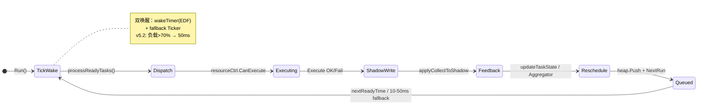
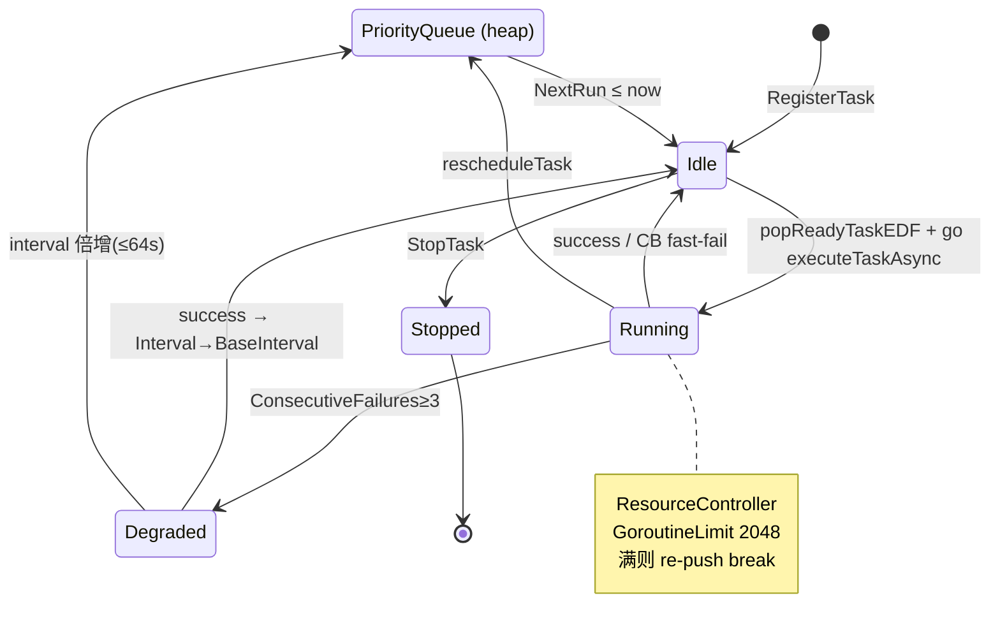
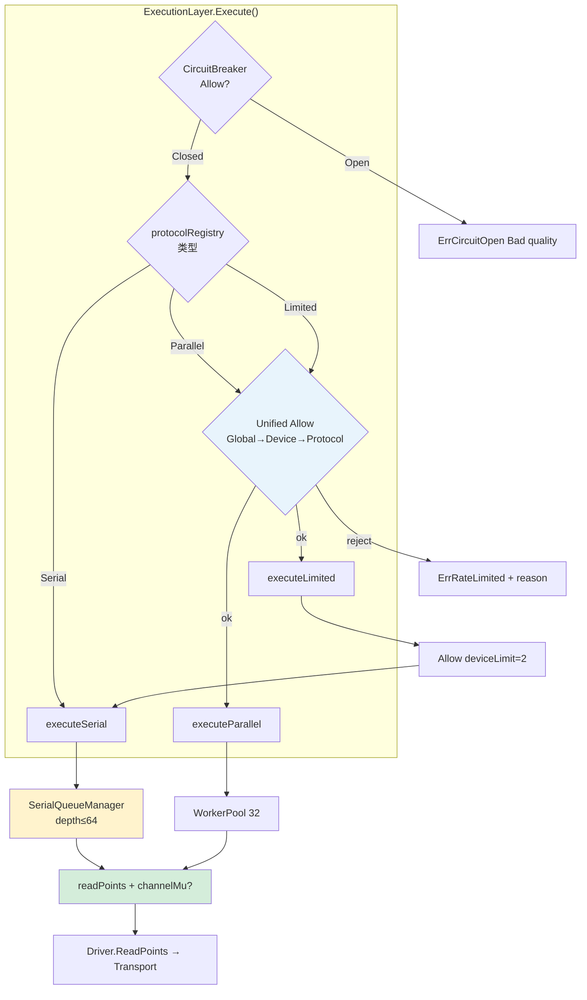
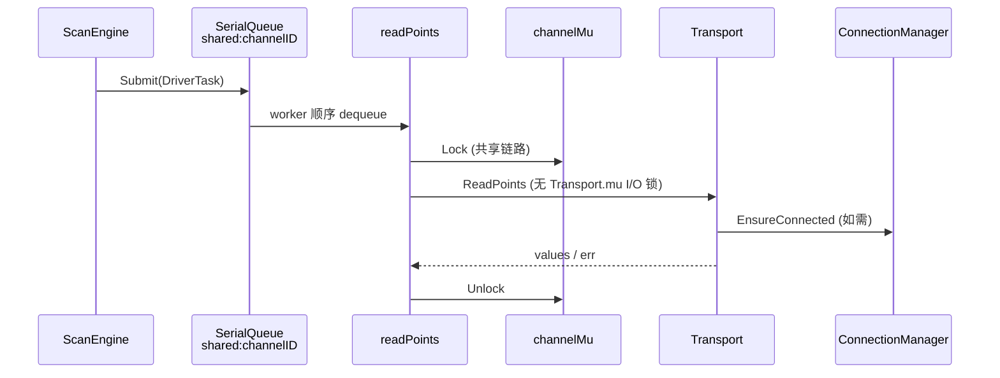
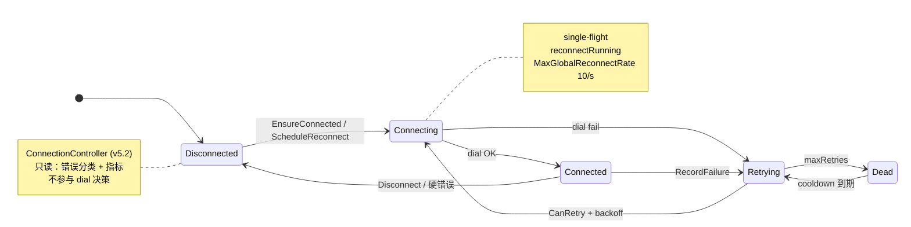
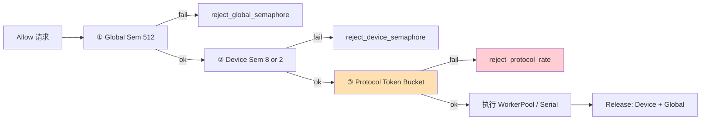
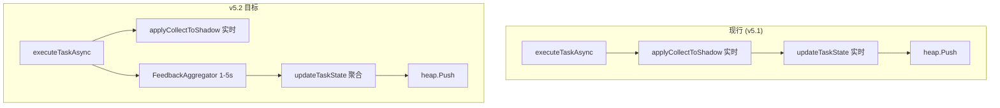

# ScanEngine 执行内核状态机（单页版）

> **关联**：[ScanEngine重构方案.md](./ScanEngine重构方案.md) · [v5.2 稳定版补丁](./ScanEngine重构方案-v5.2-稳定版补丁.md)  
> **用途**：一屏读懂调度、执行、连接、限流四条主路径的状态流转

---

## 1. 总览：调度闭环

**关键文件**：`scan_engine.go`（`dispatchLoop`、`processReadyTasks`、`executeTaskAsync`）  
**任务态**：`ScanTaskStatusIdle | Running | Degraded | Stopped`（`scan_engine.go`）

---

## 2. ScanEngine 任务调度（EDF + 资源门）

| 转换 | 触发 | 函数 |
|------|------|------|
| 降级 | 连续失败 ≥3 | `updateTaskState` |
| 优先级升 | 错过 Deadline | `boostPriorityOnMiss` |
| 防饿死 | 300s 未执行 | `enforceAntiStarvation` |
| 自适应间隔 | 队列/RTT/失败率 | `AdaptiveThrottle.ApplyInterval` |

---

## 3. ExecutionLayer 三路执行

**协议路由**：`channel_manager.go` `registerProtocolToScanEngine`

| 模式 | 协议示例 | 串行机制 | 限流 |
|------|----------|----------|------|
| Serial | modbus, dlt645 | SerialQueue + channelMu(共享) | 队列深度 |
| Parallel | opc-ua, http | WorkerPool | Unified Allow(8) |
| Limited | s7, profinet | SerialQueue + Allow(2) | Unified Allow(2) |

---

## 4. 共享链路 I/O 串行（v5.2 目标）

> **v5.2 铁律**：共享链路 **仅 channelMu** 串行 I/O；Transport.mu 只管连接对象生命周期。

---

## 5. ConnectionManager 生命周期

**Owner**：`internal/driver/connection_manager.go`  
**调用链**：`ModbusTransport.Connect` → `connMgr.EnsureConnected(connectOnce)`  
**禁止**：`core.ConnectionController.CanRetry` 触发 dial（v5.2 移除执行语义）

---

## 6. 统一背压 Allow() 流程（v5.2）

**Serial 路径**：跳过 ①②③，仅 `SerialQueue` 90% 软限 → `ErrQueueFull`

---

## 7. 反馈路径（现行 vs v5.2）

---

## 快速对照表

| 子系统 | 状态 Owner | 入口文件 |
|--------|-----------|----------|
| 调度 | ScanEngine / ScanTask | `scan_engine.go` |
| 执行路由 | ExecutionLayer | `execution_layer.go` |
| 链路串行 | channelMu + SerialQueue | `execution_layer.go`, `serial_queue_manager.go` |
| 连接 | ConnectionManager | `driver/connection_manager.go` |
| 连接观测 | ConnectionController (只读) | `connection_controller.go` |
| 限流 | ThrottlingController (v5.2) | `backpressure_controller.go` |
| 熔断 | DriverCircuitBreaker | `circuit_breaker.go` |

---

*单页版 · 2026-07-05*
