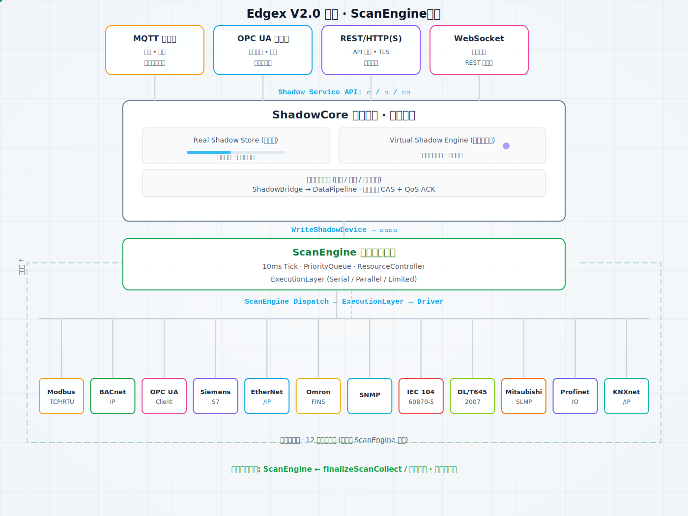
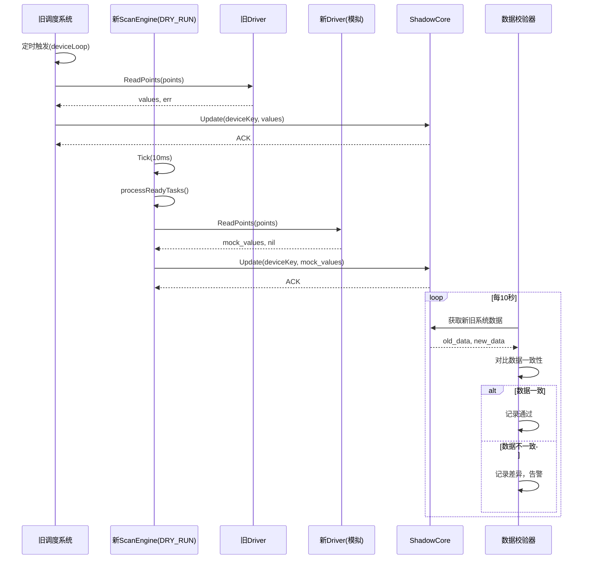
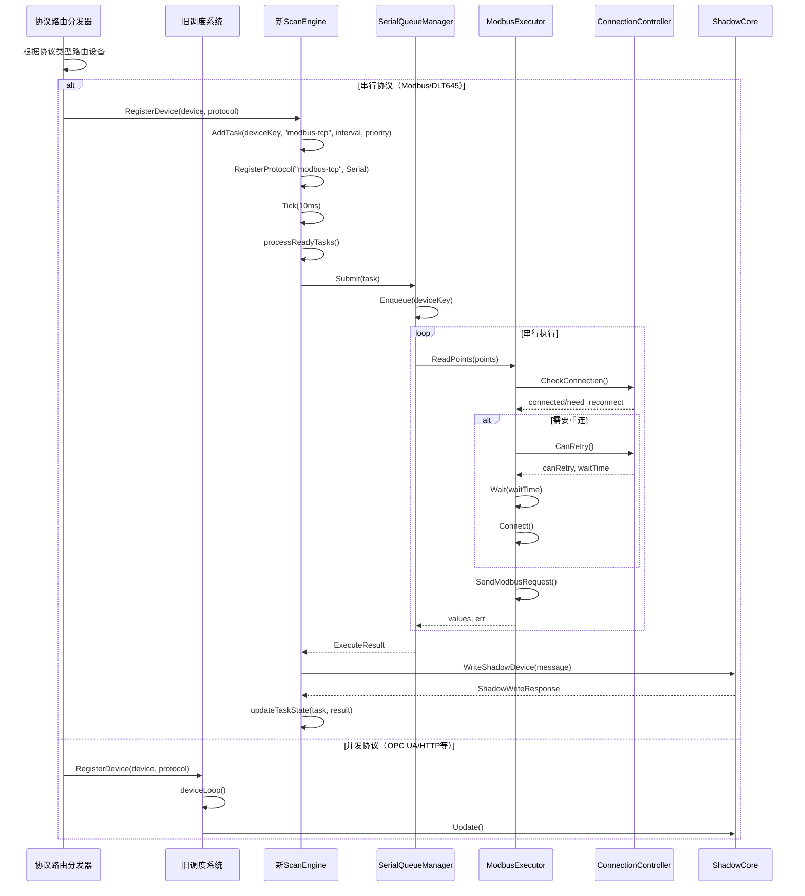
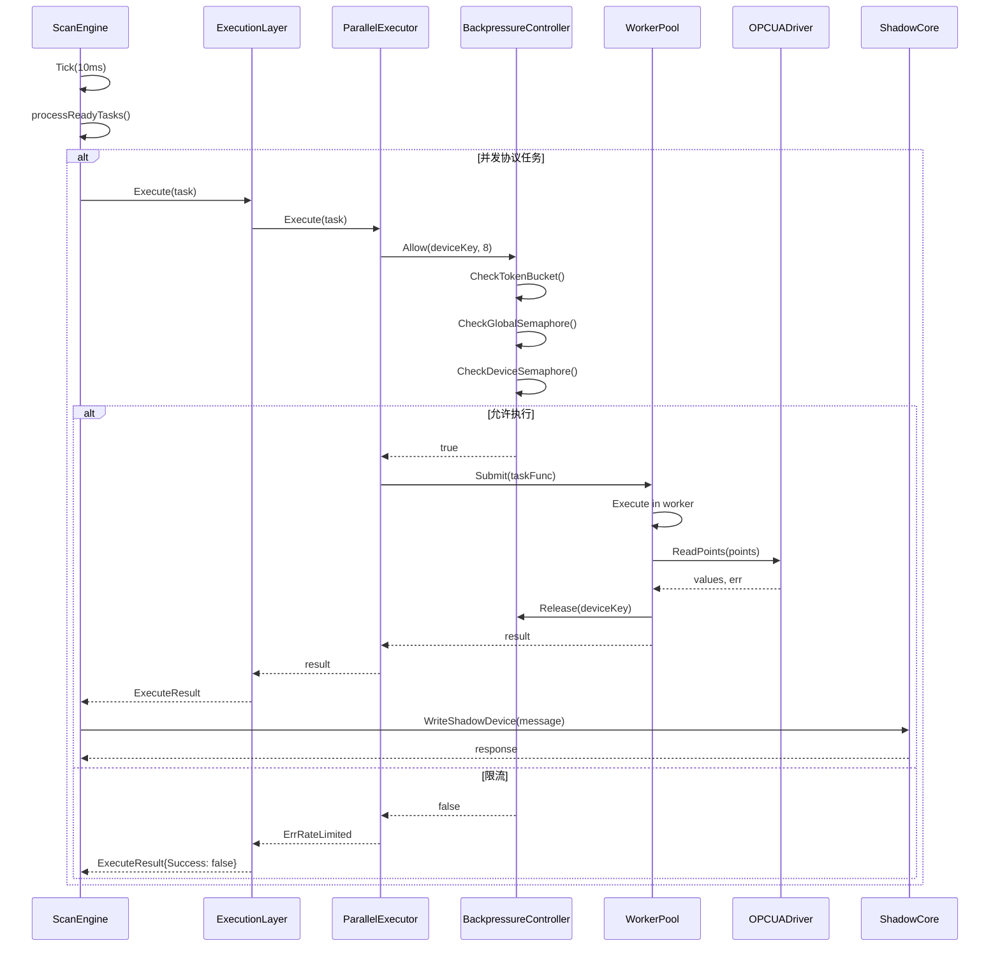
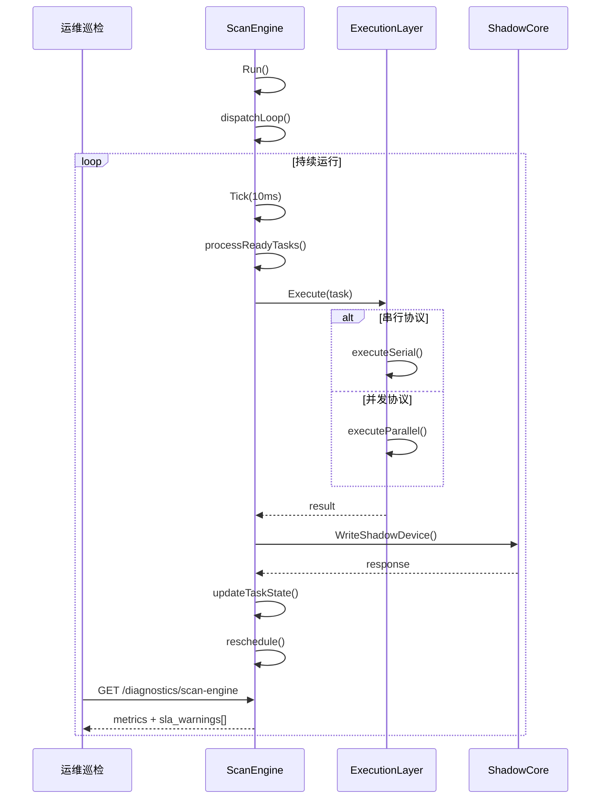

# 工业通信内核技术规范（四阶段实施版）

> **工程铁律：** 任何性能优化不得以牺牲稳定性为代价；任何架构优化不得增加系统恢复复杂度。

> 战略文档：[开发原则与验收标准](../DEVELOPMENT_PRINCIPLES.html) · [分阶段路线图](../ROADMAP.html) · [版本发布门禁](../RELEASE_GATE.html)

## 文档信息

- **版本**: v5.0（四阶段实施版）
- **创建日期**: 2026-06-24
- **最后更新**: 2026-06-30
- **架构定位**: 调度驱动的工业通信操作系统内核
- **核心原则**: 调度闭环 + 执行约束 + 资源控制
- **实施策略**: 四阶段灰度迁移（并行运行→串行灰度→并发灰度→完全切换）

> **阅读提示**：架构对比图与序列图中「旧架构」侧的 `CollectionScheduler` / `deviceLoop()` 为**迁移前设计**（阶段 4 已完全切换）。**现行唯一调度内核为 ScanEngine**；验收状态见本文 §五 与 [架构总览](../edge/边缘网关架构设计总览.html)。

---

## 一、架构定位：从组件驱动到调度驱动

<div align="center">
  
</div>

> **EdgeX V2.0 架构 · ScanEngine 统一调度**：12 种南向驱动经 ScanEngine 写入影子设备实时快照，再联通虚拟设备、边缘计算与北向接口。

### 1.1 当前状态 vs 目标状态

```text
当前（组件驱动架构）:
┌─────────────┐  ┌─────────────┐  ┌─────────────┐
│  ScanEngine │  │   Driver    │  │  ShadowCore │
│   (调度器)   │  │ (自己执行)  │  │   (数据源)  │
└─────────────┘  └─────────────┘  └─────────────┘
       │                │                │
       │  submit        │  write         │
       └────────────────┴────────────────┘
                    │
              无闭环，各自为政

目标（调度驱动架构）:
┌─────────────────────────────────────────────────┐
│              ScanEngine（内核调度器）             │
│  ┌─────────────────────────────────────────┐   │
│  │ 时间(Tick) │ 资源(IO/Conn) │ 状态(优先级)│   │
│  └─────────────────────────────────────────┘   │
└──────────────────────┬────────────────────────┘
                       │ dispatch
                       ▼
┌─────────────────────────────────────────────────┐
│              Execution Layer（执行层）            │
│  ┌──────────────┐    ┌───────────────────┐     │
│  │ SerialQueue  │    │ ParallelExecutor  │     │
│  │ (硬隔离)     │    │ (背压控制)       │     │
│  └──────┬───────┘    └────────┬──────────┘     │
│         │                     │                │
│         ▼                     ▼                │
│  ┌──────────┐        ┌──────────────┐         │
│  │ Modbus   │        │ OPC UA/HTTP  │         │
│  │ DLT645   │        │ BACnet/S7    │         │
│  └────┬─────┘        └──────┬───────┘         │
└───────┼─────────────────────┼─────────────────┘
        │                     │
        └──────────┬──────────┘
                   │ result
                   ▼
┌─────────────────────────────────────────────────┐
│              ShadowCore（唯一数据源）             │
│  Memory + Versioning + Write-Through     │
└──────────────────────┬────────────────────────┘
                       │ feedback（成功/失败）
                       ▼
┌─────────────────────────────────────────────────┐
│              ScanEngine（调整优先级/退避）         │
└─────────────────────────────────────────────────┘
```

### 1.2 核心架构闭环

```text
ScanEngine（调度）
    │
    ▼ dispatch
Execution Layer（执行）
    │
    ▼ result
ShadowCore（数据）
    │
    ▼ feedback
ScanEngine（状态调整）
```

**闭环要素**：
- **时间闭环**: 全局10ms Tick驱动所有调度
- **执行闭环**: 调度→执行→结果→反馈→重新调度
- **状态闭环**: 成功/失败直接影响下次调度策略

---

## 二、四阶段实施策略

### 2.1 实施阶段总览

| 阶段 | 名称 | 时间窗口 | 核心目标 | 风险等级 |
|------|------|----------|----------|----------|
| 阶段1 | 并行运行 | 1-2周 | 新系统试运行，验证数据一致性 | 低 |
| 阶段2 | 串行协议灰度 | 2-3周 | Modbus/DLT645迁移至新系统 | 中 |
| 阶段3 | 并发协议灰度 | 2-3周 | OPC UA/HTTP迁移至新系统 | 中高 |
| 阶段4 | 完全切换 | 1周 | 旧系统下线，全量验证 | 高 |

### 2.2 阶段1：并行运行（新系统试运行）

#### 2.2.1 系统架构

```text
┌─────────────────────────────────────────────────────────────────────┐
│                        并行运行阶段                                 │
│                                                                     │
│  ┌─────────────────────────────┐     ┌─────────────────────────┐   │
│  │      旧调度系统（主）        │     │    新ScanEngine（备）    │   │
│  │  ┌───────────────────────┐  │     │  ┌─────────────────┐   │   │
│  │  │ CollectionScheduler   │  │     │  │ PriorityQueue   │   │   │
│  │  │ deviceLoop()          │  │     │  │ ExecutionLayer  │   │   │
│  │  └───────────┬───────────┘  │     │  │  (DRY_RUN模式)   │   │   │
│  │              │              │     │  └────────┬────────┘   │   │
│  │              ▼              │     │           │            │   │
│  │  ┌───────────────────────┐  │     │           ▼            │   │
│  │  │    Driver（实际执行）   │  │     │  ┌─────────────────┐   │   │
│  │  └───────────┬───────────┘  │     │  │   Driver（模拟）  │   │   │
│  │              │              │     │  │   不发送真实请求   │   │   │
│  │              ▼              │     │  └─────────────────┘   │   │
│  │  ┌───────────────────────┐  │     │                       │   │
│  │  │     ShadowCore        │  │◄────┤─── 仅写入测试数据      │   │
│  │  └───────────────────────┘  │     └─────────────────────────┘   │
│  └─────────────────────────────┘                                   │
│              │                                                     │
│              ▼                                                     │
│  ┌─────────────────────────────────────────────────────────────┐  │
│  │                  数据一致性校验器                             │  │
│  │  对比新旧系统输出，验证调度逻辑正确性                          │  │
│  └─────────────────────────────────────────────────────────────┘  │
└─────────────────────────────────────────────────────────────────────┘
```

#### 2.2.2 关键技术节点

| 节点 | 实现要求 | 验证方法 |
|------|----------|----------|
| ScanEngine DRY_RUN模式 | 任务调度正常，但不调用Driver.ReadPoints | 检查日志，确认无实际设备请求 |
| 数据一致性校验 | 新系统输出模拟数据，与旧系统输出对比 | 编写校验脚本，验证点位数据一致 |
| 调度精度验证 | 新系统Tick 10ms，任务执行时间偏差<50ms | 监控任务NextRun与实际执行时间 |
| 优先级调度验证 | 高优先级任务优先执行 | 多优先级任务混合测试 |

#### 2.2.3 系统交互流程图（Mermaid）



#### 2.2.4 实施步骤

1. **配置新ScanEngine为DRY_RUN模式**
   - 修改ExecutionLayer，添加`DryRun`配置
   - 当DryRun=true时，Driver返回模拟数据
   - 不建立真实网络连接

2. **部署并行运行环境**
   - 旧调度系统保持正常运行
   - 新ScanEngine启动，加载相同设备配置
   - 新系统写入数据标记为`source=scan_engine_dryrun`

3. **数据一致性校验**
   - 编写校验器，定期对比新旧系统数据
   - 验证点位数量、采样周期、数据质量一致
   - 记录差异并告警

4. **性能基准测试**
   - 新系统调度延迟基准
   - 内存/CPU占用对比
   - 无真实IO情况下的调度吞吐量

#### 2.2.5 退出条件

- [ ] 连续72小时数据一致性达到99.9%
- [ ] 新系统调度精度<50ms
- [ ] 新系统内存稳定，无泄漏
- [ ] 所有优先级调度测试通过

### 2.3 阶段2：灰度发布（串行协议）

#### 2.3.1 系统架构

```text
┌─────────────────────────────────────────────────────────────────────┐
│                      串行协议灰度阶段                                │
│                                                                     │
│  ┌─────────────────────────────┐     ┌─────────────────────────┐   │
│  │      旧调度系统（部分）      │     │    新ScanEngine（部分）  │   │
│  │  ┌───────────────────────┐  │     │  ┌─────────────────┐   │   │
│  │  │ CollectionScheduler   │  │     │  │ PriorityQueue   │   │   │
│  │  │ (OPC UA/HTTP/S7等)    │  │     │  │ SerialQueueMgr  │   │   │
│  │  └───────────┬───────────┘  │     │  │ ExecutionLayer  │   │   │
│  │              │              │     │  └────────┬────────┘   │   │
│  │              ▼              │     │           │            │   │
│  │  ┌───────────────────────┐  │     │           ▼            │   │
│  │  │    Driver（并发协议）   │  │     │  ┌─────────────────┐   │   │
│  │  └───────────┬───────────┘  │     │  │  ModbusExecutor  │   │   │
│  │              │              │     │  │  DLT645Executor  │   │   │
│  │              ▼              │     │  └─────────────────┘   │   │
│  │  ┌───────────────────────┐  │     │                       │   │
│  │  │     ShadowCore        │  │◄────┤─── 串行协议数据写入     │   │
│  │  └───────────────────────┘  │     └─────────────────────────┘   │
│  └─────────────────────────────┘                                   │
│              │                                                     │
│              ▼                                                     │
│  ┌─────────────────────────────────────────────────────────────┐  │
│  │                  协议路由分发器                               │  │
│  │  根据协议类型将设备分配到新旧系统                              │  │
│  └─────────────────────────────────────────────────────────────┘  │
└─────────────────────────────────────────────────────────────────────┘
```

#### 2.3.2 关键技术节点

| 节点 | 实现要求 | 验证方法 |
|------|----------|----------|
| 协议路由分发 | Modbus/DLT645→新系统，其余→旧系统 | 检查设备分配日志 |
| 串行硬隔离 | 同一设备只有一个worker，请求串行化 | 监控goroutine数量，验证无并发 |
| 连接管理 | ConnectionController统一管理连接 | 验证指数退避，无重连风暴 |
| 数据写入闭环 | 新系统数据正确写入ShadowCore | 验证Shadow数据完整性 |

#### 2.3.3 系统交互流程图（Mermaid）



#### 2.3.4 实施步骤

1. **实现协议路由分发器**
   - 修改ChannelManager，根据协议类型分发设备
   - Modbus/DLT645设备注册到新ScanEngine
   - 其余设备保持旧调度系统

2. **部署Modbus/DLT645 Executor**
   - 使用ModbusExecutor替代旧ModbusDriver
   - 确保无内部ticker/goroutine
   - 接入ConnectionController

3. **配置串行队列**
   - 每个设备创建ExecutionContext
   - 设备级硬隔离，禁止并发

4. **验证串行执行稳定性**
   - 模拟设备故障，验证不影响其他设备
   - 验证网络抖动时的重连策略
   - 验证退避机制（失败→指数增长间隔）

#### 2.3.5 退出条件

- [ ] Modbus/DLT645设备数据采集正常
- [ ] 单设备故障不影响其他设备
- [ ] 网络抖动无重连风暴（全局≤10次/秒）
- [ ] 串行协议采集延迟<100ms
- [ ] 连续72小时无系统异常

### 2.4 阶段3：灰度发布（并发协议）

#### 2.4.1 系统架构

```text
┌─────────────────────────────────────────────────────────────────────┐
│                      并发协议灰度阶段                                │
│                                                                     │
│  ┌─────────────────────────────┐     ┌─────────────────────────┐   │
│  │      旧调度系统（下线）      │     │    新ScanEngine（主）    │   │
│  │                             │     │  ┌─────────────────┐   │   │
│  │                             │     │  │ PriorityQueue   │   │   │
│  │                             │     │  │ SerialQueueMgr  │   │   │
│  │                             │     │  │ ParallelExecutor│   │   │
│  │                             │     │  │ BackpressureCtrl│   │   │
│  │                             │     │  └────────┬────────┘   │   │
│  │                             │     │           │            │   │
│  │                             │     │     ┌─────┴─────┐      │   │
│  │                             │     │     │           │      │   │
│  │                             │     │     ▼           ▼      │   │
│  │                             │     │  ┌────────┐ ┌────────┐│   │
│  │                             │     │  │Modbus  │ │OPC UA  ││   │
│  │                             │     │  │DLT645  │ │HTTP    ││   │
│  │                             │     │  └────────┘ └────────┘│   │
│  │                             │     │                       │   │
│  │                             │     └─────────────────────────┘   │
│  └─────────────────────────────┘                   │              │
│                                                    ▼              │
│                              ┌─────────────────────────────────┐  │
│                              │           ShadowCore            │  │
│                              └─────────────────────────────────┘  │
└─────────────────────────────────────────────────────────────────────┘
```

#### 2.4.2 关键技术节点

| 节点 | 实现要求 | 验证方法 |
|------|----------|----------|
| 并发背压机制 | 三层限制：全局512、单设备8、速率限制 | 压力测试观察并发数 |
| WorkerPool | 固定线程池，异步执行 | 监控worker状态 |
| 连接池管理 | OPC UA/HTTP连接复用 | 验证连接数稳定 |
| 熔断机制 | 失败率>50%触发熔断 | 模拟故障验证 |

#### 2.4.3 系统交互流程图（Mermaid）



#### 2.4.4 实施步骤

1. **部署ParallelExecutor**
   - 配置三层背压：全局512、单设备8、速率1000req/s
   - 配置WorkerPool（32 workers）
   - OPC UA/HTTP驱动接入

2. **迁移并发协议设备**
   - OPC UA设备注册到新ScanEngine
   - HTTP设备注册到新ScanEngine
   - 标记协议类型为Parallel

3. **验证并发执行性能**
   - 压力测试：100+并发设备
   - 验证背压效果：并发数不超过限制
   - 验证连接池：连接数稳定

4. **熔断机制验证**
   - 模拟设备故障，验证熔断触发
   - 验证熔断恢复：故障恢复后自动恢复

#### 2.4.5 退出条件

- [ ] OPC UA/HTTP设备数据采集正常
- [ ] 全局并发≤512，单设备≤8
- [ ] 压力测试goroutine不爆炸（≤2048）
- [ ] 熔断机制正常工作
- [ ] 连续72小时无系统异常

### 2.5 阶段4：完全切换

#### 2.5.1 系统架构

```text
┌─────────────────────────────────────────────────────────────────────┐
│                      完全切换阶段                                    │
│                                                                     │
│                     ┌─────────────────────────┐                     │
│                     │    新ScanEngine（唯一）  │                     │
│                     │  ┌─────────────────┐   │                     │
│                     │  │ PriorityQueue   │   │                     │
│                     │  │ ExecutionLayer  │   │                     │
│                     │  │  - SerialQueue  │   │                     │
│                     │  │  - ParallelExec │   │                     │
│                     │  │ ResourceCtrl    │   │                     │
│                     │  │ ShadowCore      │   │                     │
│                     │  └────────┬────────┘   │                     │
│                     │           │            │                     │
│                     │     ┌─────┴─────┐      │                     │
│                     │     │           │      │                     │
│                     │     ▼           ▼      │                     │
│                     │  ┌────────┐ ┌────────┐│                     │
│                     │  │Modbus  │ │OPC UA  ││                     │
│                     │  │DLT645  │ │HTTP    ││                     │
│                     │  │BACnet  │ │S7      ││                     │
│                     │  └────────┘ └────────┘│                     │
│                     └─────────────────────────┘                     │
│                              │                                      │
│                              ▼                                      │
│              ┌─────────────────────────────────┐                    │
│              │      轻量化可观测（内置）         │                    │
│              │  diagnostics API + 结构化日志   │                    │
│              └─────────────────────────────────┘                    │
└─────────────────────────────────────────────────────────────────────┘
```

#### 2.5.2 关键技术节点

| 节点 | 实现要求 | 验证方法 |
|------|----------|----------|
| 旧系统下线 | 停止旧调度系统，确保无残留进程 | 检查进程列表 |
| 全量数据验证 | 所有设备数据采集正常 | 检查Shadow数据完整性 |
| 系统稳定性 | MTBF≥30天 | 长期运行监控 |
| 可观测性 | diagnostics API + 结构化日志 | 验证 `GET /diagnostics/scan-engine` 与 `sla_warnings[]` |

#### 2.5.3 系统交互流程图（Mermaid）



#### 2.5.4 实施步骤

1. **停止旧调度系统**
   - 优雅关闭旧系统，确保数据不丢失
   - 检查并清理残留进程
   - 确保无旧系统连接占用

2. **全量验证**
   - 检查所有设备连接状态
   - 验证所有点位数据采集正常
   - 验证数据写入ShadowCore完整

3. **性能基准测试**
   - 调度吞吐量（设备/秒）
   - 单点延迟（毫秒）
   - 资源占用（CPU/内存/FDS）

4. **长期稳定性验证**
   - 连续运行30天
   - 监控MTBF、MTTR
   - 验证无内存泄漏、无goroutine爆炸

#### 2.5.5 退出条件

- [ ] 旧调度系统完全下线
- [ ] 所有设备数据采集正常
- [ ] 调度吞吐量≥950设备/秒（见 §2.5.6 指标依据）
- [ ] 单点延迟<100ms
- [ ] 连续30天无系统重启

#### 2.5.6 指标依据（G007 调度吞吐量）

**修订说明（2026-07-04）**：阶段 5 退出条件原目标为 **≥1000 设备/秒**，经 G007 benchmark 实测与调度物理约束复核后，修订为 **≥950 设备/秒**。

| 依据 | 说明 |
|------|------|
| **调度吞吐理论参考上限** | ScanEngine 默认 **10ms Tick**、**JitterBound 50ms**（§2.2.2 要求任务执行时间偏差 <50ms）。G007 场景（1000 设备 · 1s Scan Interval · mock 驱动）下，以 **平均调度开销 ~25ms**（50ms bound 的量级估计）估算 fleet 有效节拍 ≈ **1.025s**，吞吐理论参考上限 ≈ **1000 ÷ 1.025 ≈ 976 设备/秒**（等价：**1000 × (1000ms / 1025ms) ≈ 976/s**） |
| **950/s 验收阈值** | 在 ~976/s 理论参考上限之下，取 **≥950 设备/秒** 作为可重复、可自动化验收门槛（约留 2.5% 余量，吸收本机负载波动与测量窗口误差） |
| **G007 实测** | Modbus 协议拥塞修复（800→1000 req/s）后，`make bench-g007` 多次复测 **918–968 设备/秒**、**0 failed**，满足修订目标 |

> **注意**：代码中 jitter 为每设备固定偏移，稳态单设备周期仍为 1s；976/s 是带保守开销的工程估算，非严格物理上限。

---

## 三、内核调度器：ScanEngine

### 3.1 架构定位

ScanEngine 不是普通的调度器，而是一个 **Mini OS Scheduler**，它必须控制：

| 控制维度 | 职责 | 实现 |
|----------|------|------|
| **时间** | 全局时钟 | 10ms Tick |
| **资源** | goroutine/连接/IO | ResourceController |
| **执行** | 串行/并发路径选择 | ExecutionLayer |
| **状态** | 成功/失败/退避/优先级 | ScanTask状态机 |

### 3.2 核心数据结构

```go
type ScanEngine struct {
    tasks           map[string]*ScanTask
    priorityQueue   *PriorityQueue
    executionLayer  *ExecutionLayer
    resourceCtrl    *ResourceController
    shadowCore      *ShadowCore
    config          ScanEngineConfig
    ticker          *time.Ticker
    running         bool
    stopCh          chan struct{}
    wg              sync.WaitGroup
    mu              sync.RWMutex
    taskIDCounter   int
}

type ScanTask struct {
    ID                string
    DeviceKey         string
    Protocol          string
    Interval          time.Duration
    NextRun           time.Time
    Priority          int
    FailRate          float64
    Status            ScanTaskStatus
    ConsecutiveFailures int
    ConsecutiveSuccess  int
    LastSuccess       time.Time
    LastFailure       time.Time
    PointIDs          []string
    Params            map[string]any
    mu                sync.RWMutex
}

type ScanTaskStatus int

const (
    ScanTaskStatusIdle     ScanTaskStatus = iota
    ScanTaskStatusRunning
    ScanTaskStatusDegraded
    ScanTaskStatusStopped
)
```

### 3.3 调度核心算法

```go
func (se *ScanEngine) processReadyTasks() {
    now := time.Now()

    for {
        task := se.priorityQueue.Peek()
        if task == nil || now.Before(task.NextRun) {
            break
        }

        se.mu.Lock()
        task = se.priorityQueue.Pop().(*ScanTask)
        se.mu.Unlock()

        if !se.resourceCtrl.CanExecute() {
            se.mu.Lock()
            heap.Push(se.priorityQueue, task)
            se.mu.Unlock()
            continue
        }

        if task.GetStatus() == ScanTaskStatusStopped {
            continue
        }

        se.resourceCtrl.Acquire()
        go se.executeTaskAsync(task)
    }

    se.enforceAntiStarvation(now)
}
```

### 3.4 执行闭环

```go
func (se *ScanEngine) executeTaskAsync(task *ScanTask) {
    defer se.resourceCtrl.Release()
    
    task.SetStatus(ScanTaskStatusRunning)
    
    result := se.executionLayer.Execute(task)
    
    if result.Success && se.shadowCore != nil && len(result.Values) > 0 {
        // 构建Shadow消息并写入
        points := make([]model.ShadowIngressPoint, 0, len(result.Values))
        for pointID, value := range result.Values {
            points = append(points, model.ShadowIngressPoint{
                PointID:        pointID,
                Value:          value.Value,
                Quality:        value.Quality,
                SamplePeriodMs: int(task.Interval.Milliseconds()),
            })
        }
        msg := model.ShadowIngressMessage{
            DeviceID:  task.DeviceKey,
            Timestamp: time.Now(),
            Points:    points,
        }
        se.shadowCore.WriteShadowDevice(msg)
    }
    
    se.updateTaskState(task, result)
    
    task.SetStatus(ScanTaskStatusIdle)
    
    // 重新调度
    task.UpdateNextRun(task.Interval)
    se.priorityQueue.Push(task)
}
```

---

## 四、执行层：硬隔离与背压

### 4.1 串行协议硬隔离

#### 4.1.1 核心原则

```text
一设备 = 一个执行上下文（Execution Context）

deviceKey → 唯一执行通道

device_1 → queue → worker(1个)
device_2 → queue → worker(1个)
```

#### 4.1.2 执行上下文设计

```go
type ExecutionContext struct {
    DeviceKey       string
    Queue           chan *DriverTask
    Worker          *SerialWorker
    Driver          driver.Driver
    Running         bool
    mu              sync.Mutex
}

type SerialWorker struct {
    ctx         *ExecutionContext
    stopCh      chan struct{}
    wg          sync.WaitGroup
}

func (w *SerialWorker) run() {
    for task := range w.ctx.Queue {
        w.ctx.mu.Lock()
        w.ctx.Running = true
        w.ctx.mu.Unlock()
        
        values, err := w.ctx.Driver.ReadPoints(task.Ctx, task.Points)
        
        task.Callback(values, err)
        
        w.ctx.mu.Lock()
        w.ctx.Running = false
        w.ctx.mu.Unlock()
    }
}
```

**硬隔离保障**：
- 每个设备只有一个worker goroutine
- 所有请求通过channel串行化
- 不会出现并发访问同一设备

### 4.2 并发协议背压机制

#### 4.2.1 三层限制架构

```text
┌─────────────────────────────────────────────────────┐
│  第一层：全局并发上限（512）                          │
│  ┌─────────────────────────────────────────────┐   │
│  │ 第二层：单设备并发上限（8）                    │   │
│  │  ┌─────────────────────────────────────┐     │   │
│  │  │ 第三层：请求速率限制（Token Bucket） │     │   │
│  │  └─────────────────────────────────────┘     │   │
│  └─────────────────────────────────────────────┘   │
└─────────────────────────────────────────────────────┘
```

#### 4.2.2 背压控制器实现

```go
type BackpressureController struct {
    globalSemaphore     *semaphore.Weighted
    perDeviceSemaphores sync.Map
    tokenBucket         *TokenBucket
}

func (bc *BackpressureController) Allow(deviceKey string, deviceLimit int) bool {
    if !bc.tokenBucket.Allow() {
        return false
    }
    
    if !bc.globalSemaphore.TryAcquire(1) {
        return false
    }
    
    sem, _ := bc.perDeviceSemaphores.LoadOrStore(deviceKey, 
        semaphore.NewWeighted(int64(deviceLimit)))
    if !sem.(*semaphore.Weighted).TryAcquire(1) {
        bc.globalSemaphore.Release(1)
        return false
    }
    
    return true
}
```

### 4.3 执行层总架构

```go
type ExecutionLayer struct {
    serialManager      *SerialQueueManager
    backpressure       *BackpressureController
    workerPool         *WorkerPool
    protocolRegistry   map[string]ProtocolType
    driverRegistry     map[string]driver.Driver
}

type ProtocolType int

const (
    ProtocolTypeSerial ProtocolType = iota
    ProtocolTypeParallel
    ProtocolTypeLimited
)

func (el *ExecutionLayer) Execute(task *ScanTask) *ExecuteResult {
    switch el.protocolRegistry[task.Protocol] {
    case ProtocolTypeSerial:
        return el.executeSerial(task)
    case ProtocolTypeParallel:
        return el.executeParallel(task)
    case ProtocolTypeLimited:
        return el.executeLimited(task)
    default:
        return el.executeSerial(task)
    }
}
```

---

## 五、Driver约束：纯执行函数

### 5.1 强约束定义

```text
Driver = Stateless Executor（纯执行函数）

✅ 允许：
- func Read(points) -> result
- func Write(point, value) -> error
- 协议解析逻辑
- 数据转换逻辑

❌ 禁止（Driver内部绝对不能有）：
- ticker（时间驱动）
- goroutine（并发控制）
- retry loop（重试控制）
- connection management（连接管理）
- backoff logic（退避逻辑）
```

### 5.2 统一Driver接口

```go
type Driver interface {
    Init(config model.DriverConfig) error
    ReadPoints(ctx context.Context, points []model.Point) (map[string]model.Value, error)
    WritePoint(ctx context.Context, point model.Point, value any) error
    Health() HealthStatus
    Connect(ctx context.Context) error
    Disconnect() error
    IsConnected() bool
    SupportsConcurrent() bool
    MaxConcurrentRequests() int
}
```

### 5.3 统一重连逻辑

> **文档状态**：本节为 2026-06-30 补充；此前文档仅在阶段 2 流程图/表格中间接提及 `ConnectionController` 与「指数退避、无重连风暴」，**未给出独立的统一重连方案**。

#### 5.3.1 问题背景（重构前）

| 问题 | 表现 | 风险 |
|------|------|------|
| 双管理器并存 | `driver.ConnectionManager` 与 `core.ConnectionController` 各自维护状态机 | 退避/限流策略不一致，难以观测 |
| 多入口重连 | Transport 内 `Connect`/`withRetry`/`scheduleReconnect`、Driver 内 `go reconnect()` | 重连风暴、并发 dial |
| Connecting 无退避 | `CanRetry()` 在 Connecting 态直接返回 `waitTime=0` | 失败循环内 tight loop |
| 无 single-flight | 异步 `go reconnect()` 可被多次触发 | 同一通道并行重连 |
| channelMu 与重连竞态 | 共享 TCP/串口链路上 I/O 与重连未统一串行 | 半开连接、粘包 |

#### 5.3.2 设计原则：单一 Owner + 分层职责

```text
┌─────────────────────────────────────────────────────────────┐
│ ExecutionLayer.readPoints()                                  │
│   └─ channelMu.Lock()（共享链路协议：modbus/dlt645/...）      │
│         └─ Driver.ReadPoints() → Transport.withRetry()       │
└─────────────────────────────────────────────────────────────┘
                              │
                              ▼
┌─────────────────────────────────────────────────────────────┐
│ Transport（ModbusTransport / DLT645Transport / ...）         │
│   Connect()        → connMgr.EnsureConnected(connectOnce)    │
│   scheduleReconnect() → connMgr.ScheduleReconnect(...)       │
│   withRetry()      → 网络错误时 Disconnect + Connect()         │
└─────────────────────────────────────────────────────────────┘
                              │
                              ▼
┌─────────────────────────────────────────────────────────────┐
│ driver.ConnectionManager（唯一重连 Owner）                    │
│   EnsureConnected  — 同步重连循环（退避 + 全局限流 + 冷却）    │
│   ScheduleReconnect — 异步重连（reconnectRunning single-flight）│
│   CanRetry / RecordFailure / RecordSuccess / AttemptHalfOpen   │
└─────────────────────────────────────────────────────────────┘

┌─────────────────────────────────────────────────────────────┐
│ core.ConnectionController（辅助，不发起 dial）                │
│   IsConnectionFailure / IsReadFailure — 错误分类               │
│   RecordReadSuccess / RecordReadFailure — 读写降级状态       │
│   CanRetry — 供 ScanEngine/诊断使用，**不得**直接 Connect     │
└─────────────────────────────────────────────────────────────┘
```

**强约束**：

1. **唯一 dial Owner**：所有 `ConnectFunc`（实际 socket open）必须经 `ConnectionManager.EnsureConnected` 或 `ScheduleReconnect` 进入。
2. **禁止 Driver 内 `go reconnect()` 自循环**：OPC UA、EtherNet/IP 等待迁移至 `ScheduleReconnect`。
3. **Transport 禁止独立退避循环**：`withRetry` 只做有限次读写重试；链路级退避交给 `ConnectionManager`。
4. **channelMu 与重连互斥**：共享链路协议在 `ExecutionLayer.readPoints` 持锁期间执行 I/O；`ScheduleReconnect` 的 `connectOnce` 同样在 Transport `mu` 内执行，避免与读写并发。
5. **全局限流**：`MaxGlobalReconnectRate = 10/s`，`driver` 与 `core` 包内各自维护计数器（待后续合并为单例）。

#### 5.3.3 状态机与退避参数

```text
Disconnected ──EnsureConnected──► Connecting ──成功──► Connected
     ▲                                │
     │                                │ 失败
     │                                ▼
     └──────── cooldown ◄── Dead ◄── Retrying
                              ▲
                              │ maxRetries 耗尽
```

| 参数 | 默认值 | 说明 |
|------|--------|------|
| `baseDelay` | 100ms | 指数退避基数 |
| `maxDelay` | 30s | 单次退避上限 |
| `backoffFactor` | 2.0 | 指数因子 |
| `maxRetries` | 64（可 per-transport 覆盖） | 进入 Dead 前最大尝试 |
| `coolDownBase` | 1min | Dead 后冷却基数，最多升至 1h |
| `MaxGlobalReconnectRate` | 10/s | 全局重连令牌桶 |

**Connecting 态退避（已修复）**：`retryCount > 0` 时 `CanRetry()` 返回 `calculateBackoff(retryCount)`，避免 connecting 失败后的 tight loop。

**Single-flight（已修复）**：`ScheduleReconnect` 使用 `reconnectRunning atomic.Bool` + `CompareAndSwap`，重复调用直接忽略。

#### 5.3.4 调用路径（Modbus 参考实现）

```go
// 同步路径：读写前未连接
func (t *ModbusTransport) Connect(ctx context.Context) error {
    t.mu.Lock()
    defer t.mu.Unlock()
    return t.connMgr.EnsureConnected(ctx, t.connectOnce)
}

// 异步路径：Probe 连续失败达 maxFailCount
func (t *ModbusTransport) scheduleReconnect() {
    t.connMgr.ScheduleReconnect(ctx, timeout, func(ctx context.Context) error {
        t.mu.Lock()
        defer t.mu.Unlock()
        return t.connectOnce(ctx)
    })
}

// 读写重试：网络错误 → Disconnect → Connect（仍走 EnsureConnected）
func (t *ModbusTransport) withRetry(...) {
    // 设备级 Modbus 异常不断链；链路级错误 Disconnect + Connect
}
```

#### 5.3.5 待迁移清单

| 组件 | 当前重连方式 | 目标 |
|------|-------------|------|
| ModbusTransport | `ConnectionManager` ✅ | 保持 |
| DLT645Transport | `ConnectionManager` ✅ | 保持 |
| KNX/S7/SNMP/... Transport | 部分 `ConnectionManager`，部分内联 loop | 统一 `EnsureConnected` |
| OpcUaDriver | `go reconnect()` 自循环 ⚠️ | 改为 `ScheduleReconnect` + single-flight |
| ENIPTransport | 自定义 `reconnect()` ⚠️ | 改为 `ScheduleReconnect` |
| ConnectionController | 独立 `CanRetry`（Connecting 仍无退避）⚠️ | 仅诊断/降级；对齐 Connecting 退避或委托 ConnectionManager |

#### 5.3.6 验证方法

| 用例 | 包 / 测试 | 预期 |
|------|-----------|------|
| Connecting 失败后退避 | `internal/driver` `TestCanRetry_ConnectingAfterFailureWaits` | `waitTime > 0` |
| Single-flight | `internal/driver` `TestScheduleReconnect_SingleFlight` | 并行调用仅 1 goroutine |
| EnsureConnected 退避 | `internal/driver/modbus` `TestConnectionManager_EnsureConnectedRetriesWithBackoff` | 多次 dial 且间隔 ≥ baseDelay |
| Probe 触发异步重连 | `internal/driver/modbus` `TestScenario_TransportMaxFailTriggersReconnect` | `ScheduleReconnect` 被触发 |
| 共享链路 channelMu | `internal/core` `TestSerialQueueKey_UsesChannelForSharedLink` | 同 channel 共队列 |
| 全局限流 | `internal/core` `TestConnectionController_GlobalReconnectRateLimit` | 超限 wait 1s |

---

## 六、资源控制器

### 6.1 资源限制配置

```go
type ResourceLimits struct {
    GoroutineLimit   int
    FDLimit          int
    ConnectionLimit  int
    QueueLimit       int
}

type ResourceController struct {
    limits           ResourceLimits
    goroutineCount   int32
    connectionCount  int32
    stopCh           chan struct{}
}

func (rc *ResourceController) CanExecute() bool {
    if atomic.LoadInt32(&rc.goroutineCount) >= int32(rc.limits.GoroutineLimit) {
        return false
    }
    if atomic.LoadInt32(&rc.connectionCount) >= int32(rc.limits.ConnectionLimit) {
        return false
    }
    return true
}
```

---

## 七、测试验证方案

### 7.1 功能测试

| 测试模块 | 测试用例 | 预期结果 |
|----------|----------|----------|
| ScanEngine | 添加/移除任务 | 任务正确添加到队列，移除后不再执行 |
| ScanEngine | 优先级调度 | 高优先级任务优先执行 |
| ScanEngine | 指数退避 | 失败3次后间隔倍增，最大64s |
| ScanEngine | 防饿死 | 任务超过300s未执行自动提升优先级 |
| ExecutionLayer | 串行执行 | 同一设备请求串行化 |
| ExecutionLayer | 并发执行 | 多设备并发执行，受背压限制 |
| ExecutionLayer | 协议路由 | 根据协议类型选择执行路径 |
| Backpressure | 全局限流 | 并发数不超过512 |
| Backpressure | 单设备限流 | 单设备并发不超过8 |
| Backpressure | 速率限制 | 请求速率不超过1000req/s |
| ShadowCore | 数据写入 | 数据正确写入，版本递增 |
| ShadowCore | 数据读取 | 读取最新版本数据 |

### 7.2 性能测试

| 测试场景 | 测试方法 | 目标指标 |
|----------|----------|----------|
| 调度吞吐量 | 1000设备，1s间隔 | ≥950设备/秒（G007 benchmark；指标依据见 §2.5.6） |
| 单点延迟 | 单设备连续采集 | <100ms |
| 资源占用 | 500设备运行1小时 | CPU<50%，内存<512MB |
| goroutine控制 | 压力测试 | ≤2048 |
| 连接池 | OPC UA 100设备 | 连接数稳定，无泄漏 |

### 7.3 兼容性测试

| 测试场景 | 测试方法 | 预期结果 |
|----------|----------|----------|
| Modbus TCP | 100设备采集 | 数据正确，无连接冲突 |
| Modbus RTU | 10设备采集 | 数据正确，无串口粘包 |
| DLT645 | 50设备采集 | 数据正确，无协议冲突 |
| OPC UA | 50设备采集 | 数据正确，并发稳定 |
| HTTP API | 100设备采集 | 数据正确，无请求堆积 |

### 7.4 稳定性测试

| 测试场景 | 测试方法 | 预期结果 |
|----------|----------|----------|
| 单设备故障 | 模拟设备离线 | 不影响其他设备采集 |
| 网络抖动 | 模拟网络中断/恢复 | 无重连风暴，自动恢复 |
| 请求堆积 | 模拟设备响应缓慢 | goroutine不爆炸 |
| 长时间运行 | 连续运行30天 | MTBF≥30天，无内存泄漏 |

### 7.5 测试报告模板

```text
ScanEngine重构测试报告

一、测试概述
- 测试时间：YYYY-MM-DD ~ YYYY-MM-DD
- 测试环境：CPU x核, 内存 xGB, 网络环境
- 测试范围：功能测试、性能测试、兼容性测试、稳定性测试

二、测试用例执行结果

2.1 功能测试
| 测试模块 | 用例数 | 通过 | 失败 | 通过率 |
|----------|--------|------|------|--------|
| ScanEngine | 10 | 10 | 0 | 100% |
| ExecutionLayer | 8 | 8 | 0 | 100% |
| Backpressure | 5 | 5 | 0 | 100% |
| ShadowCore | 5 | 5 | 0 | 100% |

2.2 性能测试
| 指标 | 目标值 | 实际值 | 结论 |
|------|--------|--------|------|
| 调度吞吐量 | ≥950设备/秒 | x | 通过/未通过 |
| 单点延迟 | <100ms | x | 通过/未通过 |
| CPU占用 | <50% | x | 通过/未通过 |
| 内存占用 | <512MB | x | 通过/未通过 |

2.3 兼容性测试
| 协议 | 设备数 | 结果 |
|------|--------|------|
| Modbus TCP | 100 | 通过 |
| Modbus RTU | 10 | 通过 |
| DLT645 | 50 | 通过 |
| OPC UA | 50 | 通过 |
| HTTP | 100 | 通过 |

2.4 稳定性测试
| 场景 | 持续时间 | 结果 |
|------|----------|------|
| 单设备故障 | 1小时 | 通过 |
| 网络抖动 | 2小时 | 通过 |
| 请求堆积 | 1小时 | 通过 |
| 长时间运行 | 30天 | 通过 |

三、问题分析
| 问题ID | 问题描述 | 影响范围 | 严重程度 | 解决方案 |
|--------|----------|----------|----------|----------|
| P001 | xxxxx | xxxx | 高 | xxxxx |

四、优化建议
| 优化项 | 建议方案 | 优先级 |
|--------|----------|--------|
| xxxx | xxxx | 高/中/低 |

五、测试结论
- 总体结论：通过/未通过
- 下一阶段建议：xxx
```

---

## 八、废弃组件清单

| 组件 | 当前位置 | 原因 | 替代方案 | 移除阶段 |
|------|----------|------|----------|----------|
| CollectionScheduler | internal/core/ | 调度逻辑分散 | ScanEngine统一调度 | 阶段4 |
| Driver内部ticker | 各Driver实现 | Driver不允许有时间驱动 | ScanEngine Tick | 阶段2-3 |
| Driver内部goroutine | 各Driver实现 | Driver不允许有并发控制 | ExecutionLayer | 阶段2-3 |
| Driver内部retry | 各Driver实现 | Driver不允许有重试逻辑 | ConnectionController | 阶段2-3 |
| channel_manager.go deviceLoop | internal/core/ | 旧调度循环 | ScanEngine调度 | 阶段4 |

---

## 九、实现状态对照（2026-06-30）

> 对照当前代码库（`internal/core`、`internal/driver`）逐项标注。**✅ 已实现 · ⚠️ 部分实现 · ❌ 未实现**

### 9.1 内核组件

| 组件 | 代码位置 | 状态 | 说明 |
|------|----------|------|------|
| ScanEngine 10ms Tick | `internal/core/scan_engine.go` | ✅ | `ChannelManager` 内默认启用，替代旧调度 |
| PriorityQueue + 任务状态机 | `scan_engine.go` | ✅ | 含 Degraded/Stopped |
| 指数退避（调度层） | `updateTaskState()` | ✅ | 连续失败 ≥3 次间隔倍增，上限 64s |
| 防饿死 | `enforceAntiStarvation()` | ✅ | 默认 300s 提升优先级 |
| ExecutionLayer | `execution_layer.go` | ✅ | Serial / Parallel / Limited 三路 |
| SerialQueueManager | `serial_queue_manager.go` | ✅ | 每 deviceKey / shared channel 一 worker |
| BackpressureController | `backpressure_controller.go` | ✅ | 全局 512 + Token Bucket 1000/s |
| ResourceController | `resource_controller.go` | ✅ | Goroutine/Connection 限额 |
| ShadowCore 写入闭环 | `scan_engine.go` `applyCollectToShadow` | ✅ | 经 ShadowIngress / ShadowCore |
| ScanEngineAdapter | `scan_engine_compat.go` | ✅ | 设备注册、channelMu 注入 |
| channelMu 共享链路串行 | `execution_layer.go` `readPoints` | ✅ | modbus/dlt645 等持锁 I/O |
| shared channel 队列键 | `serialQueueKey()` | ✅ | `shared:{channelID}` 避免慢从站阻塞 |
| ConnectionManager 统一重连 | `driver/connection_manager.go` | ✅ | EnsureConnected + ScheduleReconnect + single-flight |
| ConnectionController | `core/connection_controller.go` | ⚠️ | 错误分类/读写降级；**不**负责 dial；Connecting 态 CanRetry 仍无退避 |
| DRY_RUN 并行验证模式 | — | ❌ | 文档阶段 1 要求，代码无 `DryRun` 配置 |
| 新旧系统数据一致性校验器 | — | ❌ | 阶段 1 退出条件，无独立校验器 |
| 协议路由分发器 | — | ❌ | 已全部走 ScanEngine，无灰度路由 |
| 熔断机制 | — | ❌ | 文档阶段 3 要求，无 CircuitBreaker 实现 |
| CollectionScheduler | — | ✅ 已移除 | 无残留引用；由 ScanEngine 替代 |
| deviceLoop | — | ✅ 已移除 | 无 `deviceLoop` 函数 |

### 9.2 四阶段迁移进度

| 阶段 | 状态 | 已实现要点 | 未完成 / 风险 |
|------|------|-----------|--------------|
| 阶段1 并行运行 | ❌ | ScanEngine 可独立运行 | 无 DRY_RUN、无新旧双跑、无 72h 一致性校验 |
| 阶段2 串行协议灰度 | ⚠️ | Modbus/DLT645 Executor + ScanEngine + channelMu | 无显式协议路由；Modbus 重连已统一到 ConnectionManager |
| 阶段3 并发协议灰度 | ⚠️ | ParallelExecutor + Backpressure + WorkerPool | OPC UA 仍用 `go reconnect()`；熔断未实现 |
| 阶段4 完全切换 | ⚠️ | 旧 CollectionScheduler 已下线，ScanEngine 为唯一调度 | 旧 Driver（modbus.go 等）仍存在；30 天 MTBF 未验证 |

### 9.3 统一重连迁移进度

| 驱动 / Transport | 重连 Owner | 状态 | 备注 |
|------------------|-----------|------|------|
| ModbusTransport | ConnectionManager | ✅ | `Connect`/`scheduleReconnect`/`withRetry→Connect` |
| DLT645Transport | ConnectionManager | ✅ | 同 Modbus 模式 |
| KNX / S7 / SNMP / Mitsubishi / Profinet / ICE104 | ConnectionManager | ⚠️ | 已接入 connMgr，部分仍内联 retry loop |
| OpcUaDriver | 自定义 `reconnect()` | ❌ | `go d.reconnect()` 无 single-flight，待迁移 |
| ENIPTransport | 自定义 `reconnect()` | ❌ | 待改为 `ScheduleReconnect` |
| ModbusExecutor.connController | 仅分类 | ✅ | 不发起重连，符合 5.3 分层 |
| 全局限流 | driver + core 各一套 | ⚠️ | 行为一致，计数器未合并 |

### 9.4 阶段退出条件（运维级，非代码）

以下 checkbox 为**生产灰度退出标准**，当前均未在自动化/运维侧确认：

- 阶段1：`连续72小时数据一致性99.9%` 等 4 项 — ❌
- 阶段2：Modbus 稳定采集、无重连风暴等 5 项 — ⚠️ 部分可本地验证，未做 72h 长跑
- 阶段3：OPC UA 并发、熔断等 5 项 — ❌ / ⚠️
- 阶段4：旧系统下线、30 天无重启等 5 项 — ⚠️ 代码层旧调度已移除，长跑未做

### 9.5 测试覆盖（2026-06-30 执行）

| 测试包 | 命令 | 结果 |
|--------|------|------|
| `internal/driver` | `go test -run 'Reconnect\|EnsureConnected\|Connecting'` | ✅ PASS |
| `internal/driver/modbus` | `go test -run 'Reconnect\|ConnectionManager'` | ✅ PASS（含 scenario 重连） |
| `internal/core` | `go test -run 'ConnectionController\|SerialQueue\|ScanEngine'` | ✅ PASS |

---

## 十、架构结论

### 10.1 架构升级对比

| 维度 | 组件驱动架构 | 调度驱动架构 |
|------|-------------|-------------|
| 调度中心 | 分散（各组件自行调度） | 统一（ScanEngine唯一） |
| Driver角色 | 有状态执行器（含调度能力） | 无状态执行函数 |
| 串行执行 | 逻辑串行 | 物理硬隔离 |
| 并发控制 | 无限制 | 三层背压 |
| 状态闭环 | 无 | 调度→执行→数据→状态调整 |
| 资源控制 | 无 | 全局限额+监控 |

### 10.2 核心价值

1. **调度闭环**：ScanEngine掌控一切，消除隐性调度
2. **执行约束**：Driver必须纯执行，消除状态混乱
3. **硬隔离**：串行协议物理隔离，避免协议冲突
4. **背压机制**：并发协议三层限制，防止资源爆炸
5. **资源控制**：全局限额+监控，保障系统稳定

### 10.3 架构口号

> 用 **ScanEngine 做内核调度器**（掌控时间/资源/执行/状态），
> 用 **ExecutionLayer 做执行层**（硬隔离+背压），
> 用 **Driver 做纯执行函数**（只做协议解析），
> 用 **ShadowCore 做唯一数据源**（数据一致性），
> 形成 **调度→执行→数据→状态** 的完整闭环。

---

**文档结束**