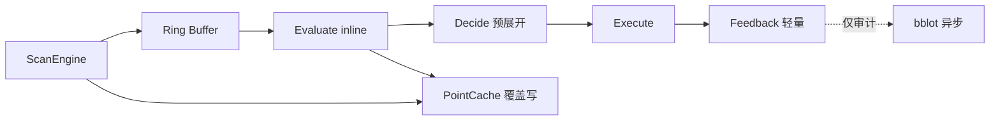
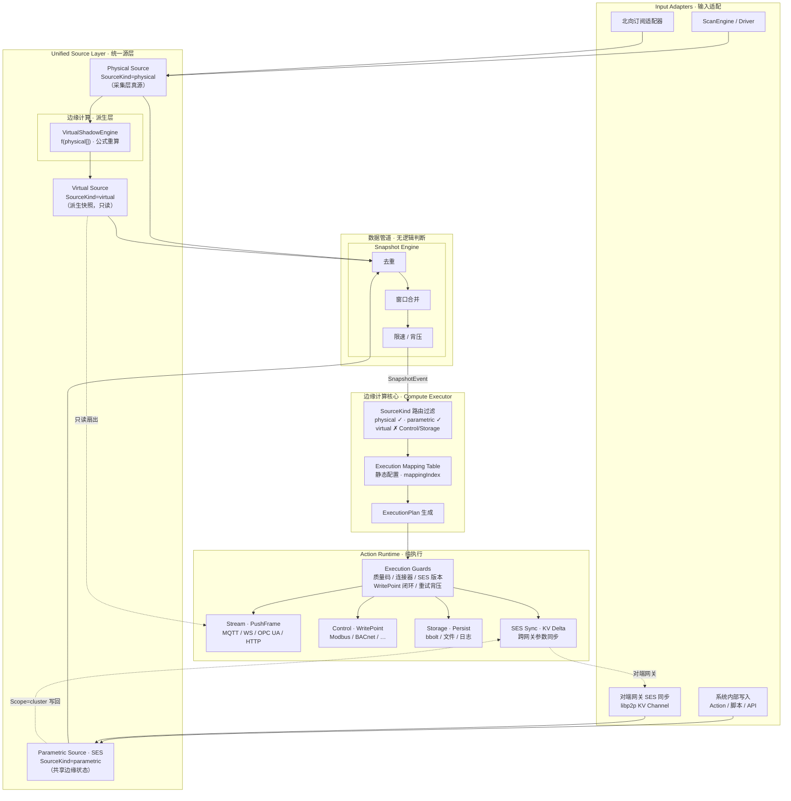
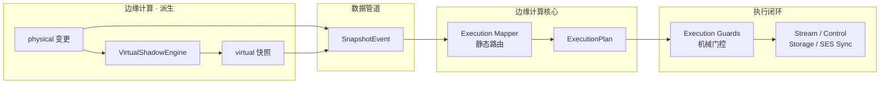

# 【边缘计算】数据源与输出动作设计说明（收敛架构版）

> **工程铁律：** 任何性能优化不得以牺牲稳定性为代价；任何架构优化不得增加系统恢复复杂度。

> **PRIMARY 架构目标（2026-07 收敛）**：EdgeX 工业边缘的**默认正确路径**是 **V2.2 Pipeline Worker**（ARMv7 / RK3588 单线程内联 Pipeline）。本文 §1.2–§1.3 描述的 Snapshot → Compute Executor → Action Runtime 链路对应 **Gateway Rich Profile（V2.1 可选）**；嵌入式部署请参阅 **§1.0 嵌入式 Profile** 与 [边缘计算优化升级 2.0](../TODO/边缘计算优化升级2.0.md)。

> 开发优先级与验收标准见 [开发原则与验收标准](../DEVELOPMENT_PRINCIPLES.html)。

## 一、概述

### 1.0 嵌入式 Profile — Pipeline Worker（PRIMARY · V2.2）

> **定位**：ARMv7 / RK3588 工业控制盒、PLC 边缘节点的**默认架构**。工业稳定优先：无 Intent 对象流、无 Snapshot 扇出、热路径零堆分配。完整设计与 P0 任务见 [边缘计算优化升级 2.0](../TODO/边缘计算优化升级2.0.md)；Go 参考实现见 [ARMv7工业控制内核 Go 参考实现](../TODO/ARMv7工业控制内核 Go 参考实现.md)。

**五段内联 Pipeline**（单 goroutine）：

```text
ScanEngine → Ring Buffer → Evaluate (inline) → Decide (预展开) → Execute → Feedback (轻量)
```

**与本文 Gateway 层的对应关系**：

| 本文 Gateway 概念 | 嵌入式 Profile | 说明 |
| --- | --- | --- |
| Input Adapters / ScanEngine | ① Input Stream | **复用** `scan_engine.go` |
| Unified Source Layer | PointCache 点表 | 固定数组覆盖写，非 Source 对象模型 |
| Snapshot Engine | `allow()` dedup + inline 窗口 | **无 SnapshotEvent 扇出** |
| VirtualShadowEngine | Evaluate 公式槽（init 编译） | 运行时 inline，非 expr 引擎 |
| Compute Executor / Mapping | Decide 预展开 RuleTable | init 从 bbolt 编译，无 mappingIndex 运行时查表 |
| Action Runtime / Guards | Execute 三类型 | control / stream / store；Guards 编译入 RuleSlot |
| Feedback / SES 闭环 | Feedback 轻量 | bblot + last_state；**禁止 Intent 回写** |

**配置（bbolt · 无 YAML）**：`pipeline_rules` · `point_bindings` · `pipeline_stats`（`config.db`）；审计 `runtime.db` · `bblot` 异步写。

> **用户配置指南**：UI 中的 Sources / Condition / Actions 等术语与 Pipeline Worker 底层实现的完整对照，见 [边缘计算 Pipeline 配置指南](../edge/边缘计算Pipeline配置指南.md)；架构映射详见 [边缘计算优化升级 2.0 §8](../TODO/边缘计算优化升级2.0.md#8-功能对齐规则配置语义--pipeline-worker-映射)。

**Profile 差异**：

- **embedded（V2.2 PRIMARY）**：规则 init 预展开为 `RuleTable` / `EvalSlot` / `ActionSlot`；热路径无 expr；Sequence / Delay / Check 简化或不可用。
- **gateway（V2.1 可选）**：保留 `EdgeRules` + ExecutionIntent 富模型；完整 StepChain、Rollback、SES 闭环。

**不适用嵌入式 Profile 的本文章节**（Gateway 专用）：Snapshot Engine 独立模块详述、Execution Mapping / ExecutionPlan、Execution Guards 独立层、SES Sync 跨网关闭环、Intent Lifecycle。嵌入式节点保留 Unified Source **概念**（physical 采集写入 PointCache），但不实例化 Gateway 六段对象流。



本设计针对**嵌入式设备在局域网环境运行**的特点进行优化，主要目标：

1. 去掉所有互联网依赖（外网告警）。
2. 强化本地执行、南向控制、局域网内通信能力。
3. 保证轻量化和嵌入式资源可控。
4. 提供统一的可配置接口：静态配置持久化于 **bbolt**（`config.db`），运行时以**内存结构**服务热路径；失败动作经 **bbolt**（`runtime.db`）离线重发。
5. 前端页面需支持数据源、执行映射与输出动作的配置、监控和操作。

### 1.1 架构收敛方向（Gateway Rich Profile · V2.1 可选）

> **Profile 说明**：本节及 §1.2–§1.3 描述 **Gateway Rich Profile（V2.1）**——适用于边缘网关、Edge Server、复杂联动与 SES 跨网同步。**嵌入式工业控制盒默认路径**为 §1.0 Pipeline Worker，二者共享 ScanEngine 与 bbolt 配置基线，运行时不同。

**定位升级**：从「设备采集系统」升级为「边缘计算数据空间系统」。输入侧不再无限扩展「源类型列表」，而是收敛为**统一 Source 抽象 + 三种生成形式（SourceKind）**。

**当前演进方向正确**：从「规则驱动 + 点位订阅」走向「统一源层 + 快照总线 + 执行闭环」。

**待收敛的核心问题**：文档与实现中虽已弱化「规则订阅」，但仍残留隐式 CEP 语义——`OnSnapshot` + 条件触发 + 组合动作本质上仍是规则引擎。收敛目标是：

| 层级 | 职责边界 | 禁止事项 |
| --- | --- | --- |
| **Input Adapters** | 南向采集 / 北向订阅 / 系统写入 / 对端网关同步 | 不做逻辑判断 |
| **Unified Source Layer** | 三类 Source 归一化（physical / virtual / parametric） | 不做逻辑判断、不做表达式 |
| **Snapshot Engine** | **数据管道**：去重、合并、限速 | 不做条件/表达式判断、**不感知 SourceKind** |
| **Compute Executor** | **边缘计算核心**：静态映射表 → ExecutionPlan；按 SourceKind 区分参与能力 | 不是规则引擎；**不做**阈值 / 表达式 / AND·OR |
| **Action Runtime** | 纯执行 + **Execution Guards（机械性执行门控）** | 不做业务规则；见 **§5.5** |

> **Source 不是设备**：Source 是**可计算的数据生产体**（computable data entity），设备只是 physical 类 Source 的一种写入来源。

### 1.2 推荐数据流

系统分为两条并行能力线：**数据管道**（采集 → 归一化 → 快照，无逻辑判断）与 **边缘计算**（派生计算 + 静态映射 → 执行计划 → 门控执行）。二者在 Snapshot Engine 之后汇合，由 **Compute Executor** 承接边缘计算核心职责。

```
南向采集 / 北向订阅 / 系统写入 / 对端网关 SES 同步
    → Input Adapters
    → Unified Source Layer（Physical / Virtual / Parametric）
        ├─ Physical：采集写入真源
        ├─ Virtual：VirtualShadowEngine 派生计算 f(physical[])（边缘计算 · 派生层，只读）
        └─ Parametric（SES）：共享边缘状态
    → Source Event Stream
    → Snapshot Engine（去重 / 合并 / 限速）——【数据管道，无逻辑判断】
    → Compute Executor / 边缘计算核心
        ├─ SourceKind 路由（physical ✓ · parametric ✓ · virtual ✗ 控制路径）
        ├─ Execution Mapper（静态映射表 · mappingIndex）
        └─ ExecutionPlan 生成
    → Action Runtime
        ├─ Execution Guards（执行前置校验 · 机械门控）
        └─ Stream（PushFrame）/ Control（WritePoint）/ Storage（Persist）/ SES Sync
```

> **与旧 Rule Engine 的本质区别**：边缘计算不再在 Executor 内做 expr / 阈值 / AND·OR；复杂条件上移至 VirtualShadowEngine 派生，Executor 只做**静态快照路由**，Runtime 只做**机械执行门控**（见 §5.5）。

### 1.3 架构图



> **图示分层说明**：
> - **数据管道**（Snapshot Engine）：只做去重 / 合并 / 限速，**不感知** SourceKind，不做任何逻辑判断。
> - **边缘计算核心**（Compute Executor）：承接「快照 → 执行计划」的静态映射；**不是规则引擎**，不做 expr / 阈值 / AND·OR。
> - **边缘计算 · 派生层**（VirtualShadowEngine）：在 Source 层完成复杂公式 / 阈值 / 多源合成，产出 virtual 快照供 UI / 北向只读引用。
> - **Execution Guards**：位于 Action Runtime 入口，对 ExecutionPlan 逐步做机械性前置校验（见 §5.5）。

> **SourceKind 参与能力摘要**（由 Compute Executor 的 SourceKind 路由区分，Snapshot Engine 不感知）：
> - **physical**：可参与 Execution Mapper 映射与控制 / 存储输出。
> - **virtual**：经 VirtualShadowEngine 派生后进入数据管道；**不进入** Execution Mapper 的 Control / Storage 路径（只读扇出至 Stream / UI）。
> - **parametric（SES）**：可参与映射、控制输出与跨网关参数同步。

### 1.3.1 边缘计算闭环（简化视图）

下图突出 **边缘计算** 与 **数据管道** 的边界，以及派生计算、静态映射、机械门控三段分工：



> **闭环语义**：业务条件在 **派生层** 预计算（如 `high_alarm = temp > 80`）→ **Mapper** 静态绑定派生源快照 → **Guards** 确认可机械执行 → **Action** 落地。Executor 不承载 CEP 窗口或表达式运行时。

### 1.4 配置持久化与运行时原则

> **文档约定**：下文出现的 YAML / JSON 片段**仅用于说明配置字段语义**，便于阅读与评审。**代码库不引入 YAML 解析依赖**（如 `gopkg.in/yaml.v3`），运行时也不从 YAML 文件加载业务配置。

| 维度 | 机制 | 说明 |
| --- | --- | --- |
| **持久化** | `data/config.db`（bbolt） | Execution Mapping、SES Parameter Set、Virtual Source、Snapshot Engine 设置、Stream/Control/Storage/SES 连接器等**静态配置**，经 `ConfigStore` 以 **JSON** 序列化写入对应 Bucket |
| **运行时** | 内存结构 | Source 缓存（ShadowCore / SESCore）、Snapshot 队列、Mapping 索引（`mappingIndex[source_id]`）、Virtual 派生引擎等；启动或 API 变更时从 DB 加载/更新，**热路径只访问内存** |
| **运行时数据** | `data/runtime.db`（bbolt） | 采集值、离线重发队列、规则状态等可清理数据，与配置库分离 |
| **禁止** | 运行时 YAML | 禁止为业务配置引入 YAML 解析；禁止配置文件热重载（与现有 `edgex-db-runtime-architecture` 一致） |

**与现有代码对齐**（`internal/storage/config_store.go`、`internal/config/config.go`）：

- 双库分离：`config.db` 强一致写入，`runtime.db` 可治理清理。
- 现有 Bucket：`Channels`、`Devices`、`Northbound`、`EdgeRules`、`VirtualShadows`、`System` 等。
- 收敛架构**计划新增** Bucket（同库、同 JSON 序列化模式）：`ExecutionMappings`、`SESParameterSets`、`SnapshotEngine`、`ActionConnectors` 等。

配置变更路径：`Web UI / REST API → Manager → 更新内存 → ConfigStore.Save* → config.db`；重启自 DB 恢复，无文件热重载。

---

## 二、Unified Source Layer（统一源层）

### 2.1 设计原则：收敛而非扩展

**禁止**继续追加「北向订阅源」「脚本源」「AI 源」等独立源类型。一切输入均归一化为 **Source** 实体，仅通过 **SourceKind** 区分三种**生成形式**：

| SourceKind | 名称 | 生成方式 | 典型示例 |
| --- | --- | --- | --- |
| `physical` | 物理影子源 | 采集层写入（PLC / 传感器 / BACnet / Modbus / 北向订阅） | `ch1.boiler01.temp` |
| `virtual` | 虚拟影子源 | ShadowDevice 派生计算（温差、能耗估算、状态合成） | `vdev-avg-temp` |
| `parametric` | 参数源（SES） | 本地 / 远端可写共享边缘状态 | 设定值、覆写标志、控制模式、外部 KPI、AI 结果 |

> **与旧术语对照**：`real` → `physical`；`parameter` / `SystemParameterSet` → `parametric` / **SES（Shared Edge State）**；`virtual` 保持不变。

### 2.2 统一 Source 模型

```go
type SourceKind string

const (
    SourceKindPhysical   SourceKind = "physical"
    SourceKindVirtual    SourceKind = "virtual"
    SourceKindParametric SourceKind = "parametric"
)

type Scope string

const (
    ScopeLocal         Scope = "local"          // 仅本机
    ScopeCluster       Scope = "cluster"        // 局域网集群内同步
    ScopeMultiGateway  Scope = "multi-gateway"  // 跨网关（SES Sync）
)

// Source — 可计算的数据生产体，非「设备」
type Source struct {
    ID        string                 // 全局唯一，见 §2.3 命名空间
    Name      string                 // 用户可见名称
    Kind      SourceKind             // physical | virtual | parametric
    Scope     Scope                  // local | cluster | multi-gateway
    Value     any                    // 单值或 map[string]ShadowPoint
    Version   int64                  // 单调递增
    Timestamp int64                  // Unix 毫秒
    Meta      map[string]any         // 写入方、质量、对端节点 ID 等
}
```

**三种生成形式的特性**：

| 特性 | physical | virtual | parametric（SES） |
| --- | --- | --- | --- |
| 写入来源 | ScanEngine / 北向订阅 | VirtualShadowEngine 重算 | 本地 API / Action 回写 / SES Sync |
| 可读 | 是 | 是 | 是 |
| 可写 | 经南向 Control | **否**（只读） | 是（含跨网关） |
| 跨网关同步 | 否 | 否 | 是（Scope ≥ cluster） |
| 版本 / 冲突策略 | Version + Timestamp | 依赖 physical 版本 | Version + Timestamp + **Priority / LWW** |
| 进入 Execution Mapper | **是** | **否**（只读扇出） | **是** |

### 2.3 统一标识规则

| SourceKind | ID 命名空间 | 示例 |
| --- | --- | --- |
| physical | `{channel_id}.{device_id}[.{point_id}]` | `ch1.boiler01` / `ch1.boiler01.temp` |
| virtual | `vdev-{id}` 或配置 ID | `vdev-avg-temp` |
| parametric | `ses.{set_id}[.{point_id}]` | `ses.site-mode` / `ses.site-mode.operating_mode` |

> **与静态配置的区别**：`SystemConfig`（网络、时间、LDAP 等）属于**安装/运维配置**，变更不进入 Source Event Stream。SES 参数属于**运行时数据真源**，值变更产生事件，可被 Execution Mapper 绑定。

### 2.4 三种生成形式详述

#### 2.4.1 Physical Shadow Source（物理影子源）

- **本质**：采集层真源快照，对应现有 `ShadowDevice`（`SourceType=real`）。
- **写入路径**：ScanEngine → ShadowIngress → ShadowCore。
- **能力**：可参与 Compute Executor 的计算映射与南向 Control 输出。

```go
// 实现层仍可使用 ShadowDevice，映射为 SourceKind=physical
type ShadowDevice struct {
    ID         string
    ChannelID  string
    State      map[string]ShadowPoint
    Version    uint64
    UpdatedAt  time.Time
}
```

#### 2.4.2 Virtual Shadow Source（虚拟影子源）

- **本质**：`VirtualShadow = f(physical Source[])`，派生只读快照。
- **写入路径**：VirtualShadowEngine 订阅 physical 变更后重算。
- **能力**：UI 实时页、北向只读引用（OPC UA 读、MQTT mirror topic）；**禁止**进入 Execution Mapper 的控制 / 存储路径。

```go
type VirtualDerivation struct {
    Dependencies []string            // physical Source ID 引用
    Formulas     map[string]string   // pointID → formula 或 source_ref
}
```

#### 2.4.3 Parametric Source · SES（共享边缘状态）

- **本质**：跨网关可观测、可写、版本化的**运行时参数真源**，非 YAML 静态字段，非 MQTT 模板占位符。
- **典型用途**：设定值（setpoint）、覆写标志（override）、控制模式、外部 KPI、AI 推理结果。
- **同步通道**：**SES Sync Channel** — 轻量级 KV 状态同步（复用 libp2p 传输），**不是消息总线**。

```go
// SES 参数集 — 逻辑上为 SourceKind=parametric 的聚合视图
type SESParameterSet struct {
    SetID      string
    Name       string
    Scope      Scope                  // local | cluster | multi-gateway
    Version    int64
    Timestamp  int64
    Points     map[string]SESPoint
}

type SESPoint struct {
    ShadowPoint                               // Value / Quality / Version / UpdatedAt
    DataType   string
    RW         string                         // "r" | "rw"
    Default    any
    EnumValues []string                       `json:"enum_values,omitempty"`
    RemoteRW   bool                           // 是否允许对端网关远程写
    Priority   int                            // 跨网关冲突时的写入优先级
}
```

**SES 写入路径**：

```
┌─────────────────┬──────────────────────────────────────────────────┐
│ 写入方          │ 路径                                              │
├─────────────────┼──────────────────────────────────────────────────┤
│ 前端 / REST API │ SESHandler → SESCore.Write                       │
│ Action 回写     │ Action Runtime → SESCore.Write                   │
│ 系统内部服务    │ SESCore.Write（Meta.writer=system）                │
│ 对端边缘网关    │ libp2p SES Sync Channel → SESCore.Write          │
│                 │   （Meta.writer=peer:{node_id}）                  │
└─────────────────┴──────────────────────────────────────────────────┘
                              ↓
                    SESCore（内存真源 + bbolt 持久化）
                              ↓
                    emit Source Event（Kind=parametric）
                              ↓
                    Snapshot Engine（数据管道）
                              ↓
                    Compute Executor / 边缘计算核心 → SES Sync / Control
```

**SES Sync 与 Config Sync 分离**：

| 维度 | Config Sync（现有 `internal/sync`） | SES Sync Channel（计划） |
| --- | --- | --- |
| 同步对象 | 通道/设备/映射等**配置快照** | **运行时参数值**（SES Points） |
| 一致性 | 最终一致 + LWW | Version + Timestamp + Priority / LWW |
| 传输 | libp2p Gossip / Pull | 复用 libp2p，独立 KV delta topic |
| 语义 | 配置分发 | **轻量 KV 状态同步，非 Pub/Sub 总线** |

### 2.5 Source Event Stream 与 SnapshotEvent

Unified Source Layer 将所有 Source 变更归一化后，经 **Source Event Stream** 投递 Snapshot Engine。Snapshot Engine **不区分 SourceKind**，只做管道化处理：

```go
type SnapshotEvent struct {
    SourceID  string                 // 见 §2.3 命名空间
    Kind      SourceKind             // 携带 Kind 供下游 Executor 使用；Engine 本身不据此分支
    Version   int64
    Points    map[string]ShadowPoint // parametric 复用 ShadowPoint 结构
    Timestamp int64
    Meta      SnapshotMeta
}

type SnapshotMeta struct {
    Writer     string // "scan" | "northbound" | "system" | "peer:{node_id}"
    PeerNodeID string // parametric 且远端写入时填充
    Priority   int    // 跨网关写入优先级
}
```

**触发语义**：`OnSnapshot(SourceID, Version)` — Source 级原子事件，不使用 `OnPointChange`。

---

## 三、三条铁律

以下约束为架构级不变量，任何实现与配置均不得违反：

| # | 铁律 | 说明 |
| --- | --- | --- |
| **1** | **Source 不参与逻辑** | Source 仅承载数据，不是触发器。不做阈值 / 公式 / AND/OR 判断；复杂派生归 virtual，映射归 Executor。 |
| **2** | **Parametric 不可递归** | 禁止 `Parametric → Virtual → Parametric` 循环依赖。virtual 的 Dependencies **仅允许引用 physical**；parametric 不得被 virtual 公式间接引用后再写回 SES。 |
| **3** | **跨网关写必须带版本三元组** | 所有 Scope ≥ cluster 的 SES 写入**必须**携带 `Version + Timestamp + Priority`（或等价 LWW 键），否则 Sync Channel 拒绝合并。 |

---

## 四、Snapshot Engine（纯管道，无逻辑判断）

### 4.1 职责

Snapshot Engine **只做**：

- **去重**：同 Source 同版本 / 同窗口内重复丢弃
- **合并**：`window_ms` 窗口内多点位合并为一次 `SnapshotEvent`
- **限速**：队列深度、背压、Pack 高优先级

**禁止**：条件表达式、阈值判断、AND/OR 组合、按 SourceKind 分支（这些属于 Compute Executor 或已移除的规则引擎）。

> **不变量**：Snapshot Engine 自收敛架构确立以来**职责不变** — 仅 merge / dedup / versioning，**不感知** physical / virtual / parametric 语义差异。

### 4.2 与 Compute Executor 的分工

| 环节 | Snapshot Engine | Compute Executor |
| --- | --- | --- |
| 收到 virtual 事件 | 管道化处理（去重/合并） | **过滤**，不生成 Control / Storage 计划 |
| 收到 physical 事件 | 管道化处理 | 正常映射 |
| 收到 parametric 事件 | 管道化处理 | 正常映射；Scope ≥ cluster 时可附加 SES Sync 步骤 |

### 4.3 与现有代码对齐

| 能力 | 当前实现 | 差距 / 迁移 |
| --- | --- | --- |
| 点位缓冲 | `DataPipeline.pointBuf` | 演进为 Source 级 SnapshotEvent 合并 |
| 批量写入 | `ShadowIngress`（8ms 窗口） | 可复用为 merge 层 |
| 独立 Snapshot Bus | **尚未实现** | 从 DataPipeline 拆出 `internal/snapshot/` |
| ShadowBridge | 推送 `[]model.Value` | 改为 `SnapshotEvent`；virtual 扇出由 Executor 过滤 |

推荐配置（持久化于 `config.db` → `SnapshotEngine` Bucket，运行时加载为内存 `SnapshotEngineConfig`）：

```go
// model/snapshot_engine.go — 持久化 + 运行时共用
type SnapshotEngineConfig struct {
    WindowMS       int              `json:"window_ms"`
    QueueCapacity  int              `json:"queue_capacity"`
    Dedup          bool             `json:"dedup"`
    RateLimit      SnapshotRateLimit `json:"rate_limit"`
    Priority       SnapshotPriority  `json:"priority"`
}

type SnapshotRateLimit struct {
    MaxEventsPerSec int `json:"max_events_per_sec"` // 0 = 不限
}

type SnapshotPriority struct {
    Pack string `json:"pack"` // "high" | "normal"
    Cell string `json:"cell"` // "high" | "normal"
}
```

JSON 存储示例（**文档示意**，实际经 `ConfigStore.saveJSON` 写入 bbolt）：

```json
{
  "window_ms": 250,
  "queue_capacity": 10000,
  "dedup": true,
  "rate_limit": { "max_events_per_sec": 0 },
  "priority": { "pack": "high", "cell": "normal" }
}
```

---

## 五、Compute Executor（取代 Rule Engine）

### 5.1 设计原则

**不是规则引擎**。无表达式运行时、无动态订阅、无 AND/OR 条件树。

数据路径：`SnapshotEvent → Execution Mapper → ExecutionPlan → Action Runtime`

Execution Mapper 是**静态映射表**（bbolt 持久化 + 内存索引），配置驱动、无状态。

**SourceKind 差异由 Executor 处理**（非 Snapshot Engine）：

| SourceKind | 参与计算映射 | 参与 Control 输出 | 参与 SES Sync 输出 |
| --- | --- | --- | --- |
| physical | **是** | **是** | 否 |
| virtual | **否** | **否** | 否 |
| parametric | **是** | **是** | Scope ≥ cluster 时**是** |

### 5.2 Execution Mapping Table

映射表以 Go 结构体定义，持久化于 `config.db` → `ExecutionMappings` Bucket；启动时加载至内存 `mappingIndex[source_id]`。

```go
// model/execution_mapping.go
type ExecutionMapping struct {
    ID      string              `json:"id"`
    Enable  bool                `json:"enable"`
    Source  MappingSource       `json:"source"`
    On      string              `json:"on"` // 固定 "snapshot"
    Plan    []ActionStepConfig  `json:"plan"`
}

type MappingSource struct {
    Kind      SourceKind `json:"kind"`       // physical | parametric（默认 physical）；不支持 virtual
    SourceID  string     `json:"source_id"`  // physical: "{channel}.{device}"；parametric: "ses.{set_id}"
    PointIDs  []string   `json:"point_ids,omitempty"` // 空 = 整 Source 快照
}

type ActionStepConfig struct {
    Action  string         `json:"action"` // stream | control | storage | ses_sync
    Target  string         `json:"target"` // 连接器实例 ID
    Mode    string         `json:"mode,omitempty"`
    Frame   string         `json:"frame,omitempty"`
    Mapping map[string]any `json:"mapping,omitempty"`
    Config  map[string]any `json:"config,omitempty"`
}
```

JSON 存储示例（**文档示意**）：

```json
[
  {
    "id": "map-temp-alarm",
    "enable": true,
    "source": {
      "kind": "physical",
      "source_id": "ch1.boiler01",
      "point_ids": ["temp"]
    },
    "on": "snapshot",
    "plan": [
      { "action": "stream", "target": "mqtt-north-01", "frame": "push_frame" }
    ]
  },
  {
    "id": "map-site-mode-control",
    "enable": true,
    "source": {
      "kind": "parametric",
      "source_id": "ses.site-mode",
      "point_ids": ["operating_mode"]
    },
    "on": "snapshot",
    "plan": [
      {
        "action": "control",
        "target": "modbus-ch2-dev03",
        "mapping": {
          "point_id": "holding_001",
          "value_from": "${Points.operating_mode.Value}"
        }
      },
      { "action": "ses_sync", "target": "ses-cluster-01" }
    ]
  },
  {
    "id": "map-valve-control",
    "enable": true,
    "source": {
      "kind": "physical",
      "source_id": "ch1.plc01",
      "point_ids": ["valve_cmd"]
    },
    "on": "snapshot",
    "plan": [
      { "action": "control", "target": "modbus-ch2-dev03", "mode": "write_point" }
    ]
  }
]
```

映射表字段说明：

| 字段 | 说明 |
| --- | --- |
| `source.kind` | `physical`（默认）或 `parametric`；**不支持 virtual** |
| `source.source_id` | physical：`{channel}.{device}`；parametric：`ses.{set_id}` |
| `source.point_ids` | 可选；空 = 整 Source 快照 |
| `on` | 固定 `snapshot` |
| `plan[]` | 有序动作：stream / control / storage / ses_sync |

> **复杂逻辑归属**：跨设备公式 → **Virtual Source**；跨网关共享运行态 → **Parametric Source（SES）**；映射表只做「快照 → 动作」静态路由。

### 5.3 ExecutionPlan

```go
type ExecutionPlan struct {
    MappingID string
    Event     SnapshotEvent
    Steps     []ActionStep
}

type ActionStep struct {
    Category string         // "stream" | "control" | "storage" | "ses_sync"
    Target   string
    Config   map[string]any
}
```

### 5.4 与现有代码对齐

| 概念 | 当前实现 | 迁移说明 |
| --- | --- | --- |
| Rule Engine | `EdgeComputeManager` + expr | **逐步废弃** |
| 点位订阅索引 | `ruleIndex[channel/device/point]` | 替换为 `mappingIndex[source_id]`（自 `ExecutionMappings` Bucket 加载） |
| SourceType=real | `shadow_core.go` | 映射为 `SourceKind=physical` |
| SourceType=parameter | **未实现** | 新建 `internal/ses/`，见 §十一 |
| 规则条件校验 | `EdgeComputeManager.executeRule` + expr | 业务条件 → Virtual Source；机械门控 → Action Runtime（§5.5） |

### 5.5 执行前置校验（Execution Guards）

> **读者关切**：从 Rule Engine 收敛到 Execution Mapper 后，「规则校验去哪了？」——**并未删除**，而是拆成三层：**静态路由**、**机械门控**、**复杂逻辑上移**。收敛架构**不恢复**完整 CEP 规则引擎（无 expr 运行时、无 AND/OR 条件树、无窗口聚合触发器）。

#### 5.5.1 三层职责划分

| 层级 | 职责 | 典型能力 | 禁止 |
| --- | --- | --- | --- |
| **Execution Mapper** | **数据路由**：快照 → 执行计划 | `enable`、`source_id` / `point_ids` 匹配、`SourceKind` 过滤（virtual 不进控制路径） | 阈值、表达式、AND/OR、窗口、状态保持 |
| **Action Runtime** | **执行门控**：动作能否安全落地 | 质量码、连接器状态、SES 版本/权限、WritePoint 闭环、重试/背压 | 跨设备业务公式、告警语义 |
| **Virtual Source / 上游** | **复杂逻辑**：何时「业务上应触发」 | 温差、阈值告警位、多源 AND 合成、防抖/计数派生 | 直接写南向设备（只读扇出） |

数据流中的位置（**边缘计算核心** 与 **数据管道** 分界见 §1.2 / §1.3）：

```
[数据管道] SnapshotEvent（去重 / 合并 / 限速，无逻辑）
  → [边缘计算核心 · Mapper] SourceKind 路由 + 静态匹配 → ExecutionPlan（路由层，无表达式）
  → [Action Runtime · Guards] 逐步机械校验 → 允许 / 拒绝 / 降级
  → [Action] Stream / Control / Storage / SES Sync
```

**与旧 Rule Engine 对照**：旧 `EdgeComputeManager` 把「路由 + 业务条件 + 动作序列门控」混在同一层；收敛后 **Mapper 只回答「哪条快照绑定哪组动作」**，**Runtime 只回答「这组动作现在能不能机械地执行」**，**Virtual Source 回答「业务条件是否成立」**（产出新的 physical/parametric 快照供 Mapper 消费）。

#### 5.5.2 保留的校验（按层）

##### A. Execution Mapper — 静态路由过滤（配置：`ExecutionMappings` Bucket → 内存 `mappingIndex`）

| 校验项 | 说明 | 配置字段 / 机制 |
| --- | --- | --- |
| 映射启用 | 禁用映射不参与计划生成 | `ExecutionMapping.enable` |
| 源匹配 | 仅当 `SnapshotEvent.SourceID` 命中映射 | `source.source_id` |
| 点位子集 | 可选；空 = 整 Source；非空 = 快照含指定 point 才命中 | `source.point_ids` |
| SourceKind 门控 | virtual **不生成** Control / Storage 计划；parametric 受 Scope 约束 | Executor 硬编码 + `source.kind` |
| 触发语义 | 固定快照驱动，无逐点订阅 | `on: "snapshot"`（唯一值） |

> Mapper **不**读取 `Condition` / `Expression`；若 UI 需「仅高温时写阀」——应先把「高温」算成 Virtual 或 parametric 点位（如 `alarm_high=1`），再让 Mapper 绑定该派生源。

##### B. Action Runtime — 机械性执行门控（运行时内存 + `runtime.db`）

| 校验项 | 说明 | 现有代码参考 | 收敛归属 |
| --- | --- | --- | --- |
| 数据质量 | `Quality=Bad` 时跳过或标记失败 Control/Stream | 驱动层已产 Bad；Runtime **待统一** | `internal/action/` Control/Stream 入口 |
| 连接器可用 | 目标连接器 `enable`、连接状态 | 北向/南向 Manager | Action 连接器注册表 |
| SES 写入权限 | `RemoteRW`、Scope、枚举/datatype 合法 | **计划** `SESCore.Write` | `internal/ses/` |
| SES 冲突合并 | 铁律 #3：`Version + Timestamp + Priority` 拒绝 stale 写 | **计划** | SES Sync / SESCore |
| Control 闭环 | Check → Delay → Write → Confirm → 影子刷新 | `executeCheck` / `executeSequence` / `executeDelay`（规则动作内） | Control Runtime **一等步骤**，非 expr |
| 写前读 / RMW | 位操作写前读当前值 | `calculateRMW` | Control `write_point` 模式 |
| 动作节流 | 单步 `interval` 最小间隔 | `shouldSkipActionInterval` | Runtime 步骤级配置 |
| 失败重试 | 可幂等动作离线队列 | `FailedAction` → `runtime.db` `DataCache` | 保持 bbolt 重发 |
| 背压 / 熔断 | 队列满、驱动熔断 | `ExecutionLayer` 采集侧 | Control 写路径复用同类保护 |

Control · WritePoint 闭环（**机械校验**，非业务规则）：

```go
// Action Runtime 内 Control 步骤 — 配置驱动，无 expr 引擎
type ControlStepConfig struct {
    Mode           string        `json:"mode"`            // write_point
    PreCheck       *ReadCheck    `json:"pre_check,omitempty"`   // 写前读 + 简单相等/范围（非 expr 树）
    Delay          time.Duration `json:"delay,omitempty"`
    Confirm        *ReadCheck    `json:"confirm,omitempty"`     // 写后确认 + 重试
    OnFail         []ActionStep  `json:"on_fail,omitempty"`     // 回滚步骤
}
```

> **与旧 `check` 动作的关系**：现有 `EdgeComputeManager.executeCheck` 使用 **expr 求值**确认点位——收敛后 **Confirm 仅允许机械比较**（等于/不等/范围），复杂确认逻辑应在上游 Virtual Source 预计算「可写」标志。

##### C. Virtual Source / Parametric — 复杂业务条件（配置：`VirtualShadows` / `SESParameterSets` Bucket）

| 旧 Rule Engine 能力 | 收敛去向 | 示例 |
| --- | --- | --- |
| 阈值 `condition: "t1 > 80"` | Virtual 公式 → 派生 `alarm` 点位 | `alarm = (ch1.boiler01.temp > 80) ? 1 : 0` |
| 多源 AND/OR | Virtual 多 physical 依赖 + 公式 | `ready = (t1 > 1) && (t2 > 3)` |
| 窗口聚合触发 | Virtual 或 **上游系统**；**不在 Executor 内做 CEP** | 滑动均值超阈 → 派生 `avg_temp_alarm` |
| 状态保持 `duration` / `count` | Virtual 防抖公式，或 parametric 闩锁位 | 连续 N 次或持续 T 秒才置位 |
| `calculation` 型规则 | Virtual Source 派生值 | 能耗估算 → 新 point |
| `TriggerMode: on_change` | Virtual 边沿检测，或 Mapper 绑定「事件型」派生源 | 仅 0→1 跃迁产生快照 |

#### 5.5.3 明确移除的能力（不回归 CEP）

以下能力随 **EdgeRule / expr** 废弃，**不在 Execution Mapper 或 Action Runtime 复现**：

| 移除项 | 原位置 | 替代 |
| --- | --- | --- |
| `expr` 条件运行时 | `evaluateThreshold` / `evaluateCalculation` | Virtual Source 公式（配置在 bbolt，内存重算） |
| `TriggerLogic` AND/OR/EXPR 树 | `EdgeRule.TriggerLogic`（字段存在，**代码未实现**） | Virtual 单公式表达 |
| 规则级 `CheckInterval` 节流 | `executeRule` 入口 | Snapshot Engine 限速 + Mapping 级可选 `min_interval`（**静态**，非表达式） |
| 规则级窗口 CEP | `evaluateWindow` | 上游或 Virtual；Snapshot Engine 仅 merge |
| 规则状态机 `StateConfig` | `state_hold` / ALARM 语义 | Virtual 派生 + parametric 告警位 |
| 多源别名 env 拼装 | `rule.Sources[].Alias` + valueCache | Virtual Dependencies 声明式引用 |

#### 5.5.4 校验类型总表

| 校验类型 | 所属层 | 是否持久化配置 | 示例 |
| --- | --- | --- | --- |
| 源/点位静态匹配 | Execution Mapper | `config.db` → `ExecutionMappings` | `ch1.boiler01` + `["temp"]` |
| 映射 enable | Execution Mapper | 同上 | `enable: false` 时不生成 Plan |
| SourceKind 路由 | Compute Executor | 代码 invariant + mapping.kind | virtual 不触发 Control |
| 快照去重/合并 | Snapshot Engine | `config.db` → `SnapshotEngine` | 同 Version 丢弃 |
| 质量码门控 | Action Runtime | 连接器/步骤默认策略 | Bad 跳过 WritePoint |
| SES 版本/优先级 | Action Runtime + SESCore | 运行时 + `SESParameterSets` | stale Version 拒绝 |
| SES RemoteRW | SESCore | `SESParameterSets` | 对端写 `remote_rw: false` 拒绝 |
| WritePoint 写前检查 | Action Runtime | Plan 步骤 / 连接器模板 | 读回确认设备在线 |
| WritePoint 写后确认 | Action Runtime | `confirm` + retry | 读回值等于期望值 |
| 失败离线重发 | Action Runtime | `runtime.db` | MQTT/Control 失败入队 |
| 阈值/AND/OR/窗口告警 | **Virtual Source** | `VirtualShadows` Bucket | `temp > 80 && mode == auto` |
| 跨网关参数冲突 | SES Sync | 运行时 delta | Priority 高者胜 |

> **配置原则不变**：上表「持久化配置」均经 **bbolt JSON**（`ConfigStore.saveJSON`）写入 `config.db` 或 `runtime.db`；热路径只读内存结构；**禁止** YAML 文件与 expr 运行时。

#### 5.5.5 配置示例：告警联动（收敛写法）

**错误（回归规则引擎）**：在 Execution Mapping 上挂 `condition: "temp > 80"`。

**正确**：Virtual Source 计算告警语义 → **parametric（SES）闩锁位**承载可写运行态 → Mapper 静态绑定闩锁 → Runtime 机械执行。

```json
{
  "id": "vdev-temp-alarm",
  "enable": true,
  "points": [
    {
      "point_id": "high_alarm",
      "formula": "ch1.boiler01.temp > 80 ? 1 : 0"
    }
  ]
}
```

Virtual 仅用于 UI / 北向只读展示（§2.4.2）。告警闩锁写入 parametric：

```json
{
  "id": "site-alarms",
  "name": "站点告警闩锁",
  "scope": "local",
  "points": [
    {
      "point_id": "temp_high_active",
      "datatype": "bool",
      "readwrite": "RW",
      "priority": 10
    }
  ]
}
```

> **闩锁写入方（计划 P6）**：VirtualShadowEngine 在 `high_alarm` **边沿**（0→1 / 1→0）时调用 `SESCore.Write` 更新 `ses.site-alarms.temp_high_active`；不在 Mapper / Runtime 内做 expr 判断。

```json
{
  "id": "map-temp-alarm-control",
  "enable": true,
  "source": {
    "kind": "parametric",
    "source_id": "ses.site-alarms",
    "point_ids": ["temp_high_active"]
  },
  "on": "snapshot",
  "plan": [
    {
      "action": "control",
      "target": "modbus-ch2-valve",
      "mode": "write_point",
      "config": {
        "confirm": { "point_id": "holding_001", "expect": 1, "retry": 3, "interval": "500ms" }
      }
    }
  ]
}
```

Mapper 在 `temp_high_active` 快照变更时生成 Plan；Runtime 的 `confirm` 仅验证**写是否成功**，不重复判断「是否高温」。

#### 5.5.6 与现有代码差距

| 能力 | 代码现状 | 收敛目标 |
| --- | --- | --- |
| 业务条件（expr/窗口/状态） | **已实现** — `EdgeComputeManager` | 迁移至 Virtual Source；P4 废弃 |
| 静态映射 | **未实现** — 无 `internal/executor/` | P2 `ExecutionMappings` + `mappingIndex` |
| Control check/sequence | **已实现** — 嵌在规则 `actions[]` | 提升为 Action Runtime 一等 Control 步骤 |
| `TriggerLogic` AND/OR | **仅模型字段**，无执行逻辑 | 不实现；用 Virtual 公式 |
| 质量码写入门控 | **分散** — 驱动产 Bad，规则层未统一拦截 | Action Runtime 统一 Guard |
| SES 写入校验 | **未实现** | P6/P8 SESCore + Sync |

---

## 六、Action Runtime（纯执行 + 机械门控，四类输出）

所有输出收敛为 **4 类**，UI 与配置统一使用此分类。Runtime **不做业务规则判断**（阈值/AND/OR/窗口见 §5.5），但**必须**承担 **Execution Guards**：质量码、连接器状态、SES 权限与版本、Control 写闭环、失败重试等机械性前置校验。

### 6.1 Stream · PushFrame（流式推送）

**用途**：北向局域网数据分发，只推送、不控制。physical / virtual（只读 mirror）/ parametric 均可作为帧来源。

| 协议 | 实现位置（现有） |
| --- | --- |
| MQTT | `internal/northbound/mqtt` |
| WebSocket | `internal/server` |
| OPC UA Server | `internal/northbound/opcua` |
| HTTP / SparkplugB | `internal/northbound/*` |

### 6.2 Control · WritePoint（南向控制）

**用途**：向局域网设备写点位。典型输入为 physical 或 parametric Source 快照。

| 能力 | 说明 |
| --- | --- |
| 协议 | Modbus / BACnet / OPC UA / … |
| 闭环 | Check → Delay → Write → Confirm → Snapshot Refresh（**机械门控**，见 §5.5.2） |
| 容错 | 失败入 bbolt 重试队列 |

### 6.3 Storage · Persist（持久化）

**用途**：本地落盘，不参与控制、不触发二次映射。

| 类型 | 说明 |
| --- | --- |
| bbolt | `DeviceStorageManager` / 历史 bucket |
| 文件 | CSV / JSON 轮转 |
| 日志 | 按 mapping 分文件 |

### 6.4 SES Sync · KV Delta（跨网关参数同步）

**用途**：将 Scope ≥ cluster 的 parametric Source 变更，经轻量 KV delta 同步至对端网关。**不是消息总线**，不承载 Stream 帧或控制指令。

| 能力 | 说明 |
| --- | --- |
| 传输 | 复用 libp2p 通道，独立 topic（如 `/ses/delta`） |
| 载荷 | `{ source_id, point_id, value, version, timestamp, priority, writer }` |
| 冲突 | 接收方 SESCore 按铁律 #3 合并（LWW 或 priority 高者胜） |
| 与 Config Sync | **完全分离** — Config Sync 同步 **bbolt 配置结构**（通道/设备等静态定义），SES Sync 同步**运行时参数值** |

### 6.5 与现有代码对齐

| 旧概念 | 收敛后 |
| --- | --- |
| 北向局域网上报 | Stream · PushFrame |
| 南向控制动作 | Control · WritePoint |
| 本地日志 / 数据库 | Storage · Persist |
| 对端网关参数同步 | **SES Sync · KV Delta（计划）** |
| Parameter Sync（旧文档术语） | 并入 SES Sync |

---

## 七、Virtual Shadow（派生源 · 只读 · 边缘计算派生层）

职责摘要（详见 §2.4.2）：VirtualShadowEngine 是边缘计算在 Source 层的**派生计算**入口，与 Compute Executor 的**静态映射**分工互补。

```
physical Source 变更
    → VirtualShadowEngine（边缘计算 · 派生层）
    → virtual Source = f(physical[])
    → Snapshot Engine（数据管道）
    → Compute Executor 过滤 virtual（不生成 Control / Storage 计划）
    → Stream / UI 只读扇出
```

### 7.1 与现有代码差距（需修复）

当前 `WriteVirtualShadowDevice` → `enqueueNotify` → `ShadowBridge` → `DataPipeline`，会导致 virtual 变更**间接触发** `EdgeComputeManager`。

**迁移步骤**：

1. Unified Source Layer 归一化后，virtual 事件进入 Snapshot Engine（管道化）
2. Compute Executor 过滤 virtual，不生成 Control / Storage 计划
3. 北向 mirror 走显式 Stream 配置，不经过 Execution Mapper 控制路径
4. UI WebSocket 继续订阅 virtual 变更

---

## 八、数据源页面设计

### 8.1 数据源列表视图

| 字段 | 描述 | 可操作性 |
| --- | --- | --- |
| Source ID | 系统唯一标识 | 不可修改 |
| 名称 | 用户自定义 | 可编辑 |
| SourceKind | physical / virtual / parametric | 可筛选 |
| Scope | local / cluster / multi-gateway（parametric） | 可编辑 |
| 快照版本 | 最新 Version | 可刷新 |
| 协议类型 | Modbus/BACnet/…（physical）；「派生」（virtual）；「SES」（parametric） | 不可修改 |
| 状态 | 在线 / 离线 / 异常 | 高亮 |
| 远程可写 | parametric 专用 | 可编辑 |
| 执行映射数 | 绑定该 Source 的 Mapping 数量 | 跳转 |

> **移除**：「订阅规则数」——不再存在规则订阅概念。

### 8.2 数据源详细页

1. **基本信息**：ID / 名称 / SourceKind / Scope / 连接或派生定义
2. **实时数据**：最新值 / Timestamp / Quality / Version
3. **执行映射**：绑定的 Mapping 列表；virtual 显示「不可绑定控制」
4. **管道指标**：Snapshot Engine P95/P99、队列深度
5. **操作**：
   - physical：测试连接 / 立即采集 / 启停
   - virtual：重算 / 依赖检查
   - parametric：本地读写 / SES 同步状态 / 对端写入审计

---

## 九、输出动作与 Execution Mapping 页面

### 9.1 总体原则

1. **局域网优先**：所有输出只在局域网内执行。
2. **四类输出**：Stream / Control / Storage / SES Sync。
3. **配置驱动**：Execution Mapping Table 静态绑定（`config.db` 持久化，内存 `mappingIndex` 服务运行时），**非规则编辑器**。
4. **触发源约束**：
   - Mapper 消费 **physical** 与 **parametric** 的 SnapshotEvent
   - **virtual 不触发** Control / Storage
   - SES Sync 仅服务于 Scope ≥ cluster 的 parametric Source

### 9.2 页面结构

| 页面 | 内容 |
| --- | --- |
| 执行映射列表 | mapping ID、SourceKind、Source ID、plan 摘要 |
| 映射编辑 | 选 physical / parametric 源 → 添加四类动作步骤（保存至 `ExecutionMappings` Bucket） |
| 连接器管理 | Stream / Control / Storage / SES 连接器实例（`ActionConnectors` Bucket） |
| 动作监控 | 成功率、延迟、SES Sync 冲突次数 |

---

## 十、配置示例

> **再次说明**：以下 JSON 片段**仅作字段语义示意**。实际持久化路径为 `ConfigStore.saveJSON` → `data/config.db` 对应 Bucket；运行时由 Manager 加载至内存，**不解析 YAML 文件**。

### 10.1 Snapshot Engine（`SnapshotEngine` Bucket）

见 §4.3 `SnapshotEngineConfig` 与 JSON 示例。

### 10.2 Execution Mapping（`ExecutionMappings` Bucket）

见 §5.2 `ExecutionMapping` 与 JSON 示例。

### 10.3 SES Parameter Set（`SESParameterSets` Bucket）

```go
// model/ses.go — 配置定义（与 §2.4.3 SESParameterSet 运行时视图分离）
type SESParameterSetConfig struct {
    ID     string           `json:"id"`
    Name   string           `json:"name"`
    Scope  Scope            `json:"scope"`
    Points []SESPointConfig `json:"points"`
}

type SESPointConfig struct {
    PointID    string   `json:"point_id"`
    DataType   string   `json:"datatype"`
    EnumValues []string `json:"enum_values,omitempty"`
    ReadWrite  string   `json:"readwrite"` // "R" | "RW"
    RemoteRW   bool     `json:"remote_rw"`
    Priority   int      `json:"priority"`
}
```

```json
[
  {
    "id": "site-mode",
    "name": "站点运行模式",
    "scope": "cluster",
    "points": [
      {
        "point_id": "operating_mode",
        "datatype": "enum",
        "enum_values": ["auto", "manual", "maintenance"],
        "readwrite": "RW",
        "remote_rw": true,
        "priority": 10
      }
    ]
  }
]
```

### 10.4 Virtual Source（`VirtualShadows` Bucket，沿用现有模式）

与现有 `VirtualShadowDeviceConfig`（`internal/model/types.go`）对齐，经 bbolt 持久化、内存派生引擎消费：

```go
// 现有实现 — internal/model/types.go
type VirtualShadowDeviceConfig struct {
    ID          string                  `json:"id"`
    Name        string                  `json:"name"`
    Enable      bool                    `json:"enable"`
    Points      []VirtualShadowPointDef `json:"points"`
    // Dependencies 由 Points 内 formula 引用推断
}
```

```json
{
  "id": "vdev-avg-temp",
  "name": "平均温度",
  "enable": true,
  "points": [
    {
      "point_id": "avg_temp",
      "formula": "(ch1.boiler01.temp + ch1.boiler02.temp) / 2"
    }
  ]
}
```

> Virtual Source **无** Execution Mapping 控制绑定；仅 UI / 北向只读扇出。

---

## 十一、迁移路径（代码 → 收敛架构）

| 阶段 | 任务 | 涉及包 | 说明 |
| --- | --- | --- | --- |
| **P0** | Virtual 切断 Execution 扇出 | `shadow_bridge.go`, `virtual_shadow_engine.go` | 消除隐式规则触发 |
| **P1** | 引入 `SnapshotEvent` + Snapshot Engine | `internal/snapshot/` | Source 级事件取代逐点 Value |
| **P2** | Execution Mapper 并行于 EdgeComputeManager | `internal/executor/` | 静态映射先迁；`ExecutionMappings` Bucket + 内存 `mappingIndex` |
| **P3** | Action Runtime 四类接口 | `internal/action/` | 含 SES Sync 占位；连接器配置入 `ActionConnectors` Bucket |
| **P4** | 废弃 EdgeRule / expr；Execution Guards 迁入 Action Runtime | `edge_compute_manager.go`, `internal/action/` | 业务条件 → Virtual Source；机械门控 → Runtime（§5.5） |
| **P5** | Source 模型统一 | `model/types.go`, `shadow_core.go` | `SourceKind` 取代分散 SourceType |
| **P6** | 引入 SESCore + bbolt | `internal/ses/`（新建） | parametric 运行时内存真源 + `SESParameterSets` Bucket 持久化定义 |
| **P7** | Mapper 支持 `kind=parametric` | `internal/executor/` | 与 physical 同等映射 |
| **P8** | SES Sync Channel | `internal/ses/sync.go` | Scope ≥ cluster 跨网关 KV delta |
| **P9** | UI 统一 Source 管理页 | 前端 | 按 SourceKind 分 tab，非无限源类型列表 |

**配置存储迁移要点**（对齐 `internal/storage/config_store.go` 现有模式）：

| 配置类型 | 目标 Bucket | 序列化 | 运行时内存结构 |
| --- | --- | --- | --- |
| Snapshot Engine 设置 | `SnapshotEngine` | JSON | `SnapshotEngine` 实例内部队列/窗口状态 |
| Execution Mapping | `ExecutionMappings` | JSON 数组 | `mappingIndex[source_id][]ExecutionMapping` |
| SES Parameter Set 定义 | `SESParameterSets` | JSON 数组 | `SESCore` 内存真源 + 定义索引 |
| Virtual Source | `VirtualShadows`（已有） | JSON | `VirtualShadowEngine` |
| Stream/Control/Storage/SES 连接器 | `ActionConnectors` | JSON | Action Runtime 连接器注册表 |
| 失败动作离线队列 | `runtime.db` 专用 Bucket | JSON | 重试调度器内存队列 |

> **禁止**：为上述配置引入 YAML 文件读写或 `yaml.v3` 依赖；导入/导出 API 使用 JSON（与现有 `/api/config/export` 一致）。

**代码现状摘要**：

| 组件 | 状态 |
| --- | --- |
| physical（ShadowCore） | **已实现** — `internal/core/shadow_core.go` |
| virtual（VirtualShadowEngine） | **已实现** — 需切断 Execution 扇出 |
| parametric / SES | **未实现** — 本节为计划扩展；`internal/sync` 仅同步配置，不同步运行时参数值 |
| SES Sync Channel | **未实现** — 复用 libp2p 传输，新增 KV delta 协议 |

---

## 十二、数据可靠性与容错

| 机制 | 说明 |
| --- | --- |
| 本地缓存 | bbolt 缓存失败 Stream/Control 动作，离线重发 |
| 背压 | Snapshot Engine 队列满时丢弃低优先级 Cell |
| SES 冲突 | 按 Version + Timestamp + Priority 合并；冲突计数可观测 |
| 重试策略 | 固定间隔 / 指数退避 / 手动重发 |
| 安全 | 局域网内执行；SES RemoteRW=false 拒绝远端写 |

---

## 十三、与旧版文档差异摘要

| 旧设计 | 收敛后 |
| --- | --- |
| 无限扩展源类型列表 | **统一 Source + 3 种 SourceKind** |
| Shadow Layer + Parameter Source Layer 并列 | **Unified Source Layer** 归一化 |
| real / virtual / parameter | physical / virtual / parametric（SES） |
| SystemParameterSet | **SES（Shared Edge State）** |
| Parameter Sync | **SES Sync Channel**（KV delta，非消息总线） |
| 三类输出 Stream/Control/Storage | **四类输出** + SES Sync |
| Snapshot Engine 按 SourceType 过滤 virtual | Engine **不感知 Kind**；Executor 过滤 |
| 规则执行单元 | Compute Executor + Execution Mapping Table |
| 规则条件校验（expr / 窗口 / 状态保持） | **Virtual Source / SES 派生** + Mapper 静态路由 + Runtime 机械门控（§5.5） |

---

## 十四、后续设计议题（推荐）

**SES 跨网关一致性模型** — 当前采用 Version + Timestamp + Priority / LWW 的轻量策略，足以覆盖大多数边缘场景。若未来出现多写者高频冲突或分区合并需求，可在以下方向择一深化（**本次不过度设计**）：

- **轻量 CRDT**：适用于少数高频共享计数器 / 集合类参数
- **主从版本域**：指定 gateway master，slave 只读或受限写
- **Vector Clock 扩展**：与现有 Config Sync 的 Vector Clock 对齐，统一运维模型

建议作为独立设计文档立项，在 P8 SES Sync Channel 落地后根据实际冲突率数据决策。

---

*文档版本：统一 Source 收敛版 · bbolt 持久化 + 内存运行时 · 与代码迁移路径对齐 · 2026-07*
