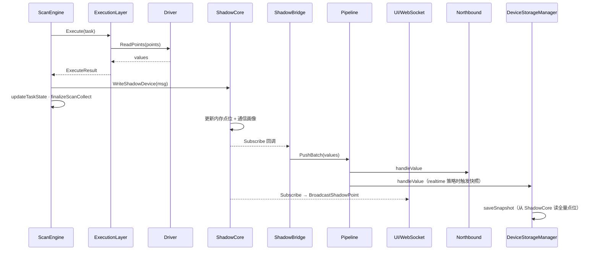

# 6. 影子设备设计

> **工程铁律：** 任何性能优化不得以牺牲稳定性为代价；任何架构优化不得增加系统恢复复杂度。

> 开发优先级与验收标准见 [开发原则与验收标准](../DEVELOPMENT_PRINCIPLES.html)。

## 6.1 核心设计理念

- **统一内部数据面**：每个物理设备对应唯一影子设备（`shadow-{deviceID}`），内存维护全量点位与通信画像；所有实时读写的权威数据源是 ShadowCore。
- **统一扇出面**：影子变更经 `ShadowBridge` 扇出到 `DataPipeline`，北向推送、边缘规则、设备历史落库与 UI 推送共享同一数据源。
- **嵌入式友好**：影子设备纯内存态；掉电后由采集引擎重建实时态，历史数据由 `DeviceStorageManager` 从影子全量快照落盘保留。

## 6.2 分层架构

```text
┌───────────────────────────────────────────────────────────────────────────┐
│ Northbound Adapters (MQTT / OPC UA / REST / Modbus-TCP Server / Others)   │
│  - OPC UA Read：GetShadowPoint 按需读影子                                     │
│  - Pipeline 订阅：ShadowBridge 扇出后的批量值                                 │
└───────────────────────────────┬───────────────────────────────────────────┘
                                │
              REST /api/values/realtime  │  WebSocket /api/ws/values
              GetDevicePoints（优先影子）  │  ShadowCore.Subscribe
                                │
┌───────────────────────────────┴───────────────────────────────────────────┐
│ Shadow Core（唯一实时模型中心）                                              │
│  - Real Shadow Store（纯内存，每设备一个）                                    │
│  - Communication Profile（RTT/MTU/Gap 通信画像）                            │
│  - Atomic Write / CAS（版本号 + CompareAndSwap）                             │
│  - Virtual Shadow Engine（公式依赖图，代码已实现，生产路径待挂载）              │
└───────────────────────────────┬───────────────────────────────────────────┘
                                │ Subscribe → ShadowBridge
                                │
┌───────────────────────────────┴───────────────────────────────────────────┐
│ DataPipeline（扇出总线）                                                     │
│  → NorthboundManager  → EdgeComputeManager  → DeviceStorageManager          │
│  → values 最新值缓存（runtime.db，仅兼容回退，热路径不再写入）                 │
└───────────────────────────────┬───────────────────────────────────────────┘
                                │
┌───────────────────────────────┴───────────────────────────────────────────┐
│ ScanEngine（内核调度器）+ ChannelManager（CRUD / ScanEngineAdapter）          │
│  ExecutionLayer → Driver.ReadPoints（纯执行）                               │
│  采集成功 → ShadowIngressMessage → WriteShadowDevice                        │
│  北向/REST 写点 → publishWrittenValue → WriteShadowDevice                   │
└───────────────────────────────┬───────────────────────────────────────────┘
                                │
                     Southbound Drivers + ConnectionManager
```

### 6.2.1 关键组件职责

| 组件 | 职责 | 关键文件 |
|------|------|----------|
| `ShadowCore` | 每设备唯一影子，内存全量点位 + 通信画像 | `internal/core/shadow_core.go` |
| `ShadowBridge` | 影子变更 → Pipeline 批量扇出 | `internal/core/shadow_bridge.go` |
| `ScanEngine` | 内核调度器；经 ExecutionLayer 驱动 Driver，采集结果写入影子 | `scan_engine.go`, `execution_layer.go` |
| `ExecutionLayer` | Serial 硬隔离 / Parallel 背压 / Limited 低并发 | `execution_layer.go`, `serial_queue_manager.go` |
| `ChannelManager` | CRUD、`ScanEngineAdapter` 注册任务、`finalizeScanCollect` | `channel_manager.go` |
| `DeviceStorageManager` | 从影子读取全量点位，写入 `device_history_*`（每设备最多 1000 条） | `internal/core/device_storage_manager.go` |
| `Server` | WebSocket 推送、REST 实时值 API | `internal/server/server.go` |

## 6.3 关键流程

### 6.3.1 南向采集入影子



步骤说明：

1. **ScanEngine** 到期任务经 **ExecutionLayer**（Serial / Parallel / Limited）调用 Driver `ReadPoints`；Driver 为纯执行函数，连接由 **ConnectionManager** 保障。
2. `ScanEngine` 构造 `ShadowIngressMessage`，调用 `ShadowCore.WriteShadowDevice`，并 `updateTaskState` / `finalizeScanCollect` 完成调度闭环。
3. 影子内存更新后，订阅者并行扇出：
   - `ShadowBridge` → `DataPipeline` → 北向 / 边缘规则 / 历史触发。
   - `Server` 订阅 → WebSocket 推送 UI。
   - 虚拟公式点位经 `WriteVirtualShadowDevice` 走同一订阅链路（`virtual-{id}`）。
4. `DeviceStorageManager` 在定时或 realtime 策略下，从真实影子读取**全量点位**落盘。

> 说明：`ShadowIngress`（`main.go` 已挂载，256 缓冲 / 8ms 批量）作高吞吐可选缓冲；ScanEngine 主路径直连 `WriteShadowDevice`。

### 6.3.2 北向读取与写入

**读取**

- OPC UA Server：`ReadHandler` 调用 `SouthboundManager.GetShadowPoint` → `ChannelManager` → `ShadowCore`。
- MQTT/Sparkplug 等：订阅 `DataPipeline`，数据源自 `ShadowBridge` 扇出。

**写入**

1. 北向/REST 写点请求进入 `ChannelManager.WritePoint`。
2. 驱动下发成功后，`publishWrittenValue` 调用 `ShadowCore.WriteShadowDevice`。
3. 影子更新后经 `ShadowBridge` 扇出，UI 与北向缓存保持一致。

### 6.3.3 设备历史（影子衍生）

设备历史是影子点位的**全量快照**：

| 项 | 约定 |
|----|------|
| 数据源 | `ShadowCore.GetShadowDevice("shadow-{deviceID}")` |
| 快照内容 | 该设备全部点位的 `pointID → value` |
| 默认策略 | `minute_aligned`，每分钟最多一条 |
| 保留上限 | 每设备 `maxRecords = 1000`（默认） |
| 存储位置 | `runtime.db` / `device_history_{deviceID}` |

### 6.3.4 重启恢复

| 数据 | 恢复方式 |
|------|----------|
| 设备配置 | `config.db` 强持久，完整恢复 |
| 影子实时态 | **不恢复**；启动后由 ScanEngine 重新采集填充 |
| 设备历史 | 从 `device_history_*` 读取最近 1000 条/设备 |
| 北向 OPC UA | 重建地址空间，Read 时从影子取实时值（采集就绪前可能为空） |

目标：启动后尽快恢复采集与配置服务；影子实时态由 ScanEngine 重新填充。

## 6.4 核心数据结构

### 6.4.1 点位标准报文（ScanEngine / 写点 → ShadowCore）

```yaml
messageId: "uuid"          # 可选
deviceId: "physical-device-id"
channelId: "channel-id"
timestamp: "2026-03-04T12:00:00.000Z"
points:
  - pointId: "pack_voltage"
    value: 742.3
    unit: "V"
    quality: "good"
    samplePeriodMs: 1000
    collectedAt: "2026-03-04T12:00:00.000Z"
    degraded: false
meta:
  source: "scan_engine"    # 或 write_point
```

### 6.4.2 真实影子设备结构

```yaml
shadowDeviceId: "shadow-rack-01"      # 固定规则：shadow-{physicalDeviceId}
physicalDeviceId: "rack-01"
channelId: "ch-modbus-1"
version: 202603040001
updatedAt: "2026-03-04T12:00:00.001Z"
points:
  pack_voltage:
    value: 742.3
    unit: "V"
    quality: "good"
    samplePeriodMs: 1000
    collectedAt: "2026-03-04T12:00:00.000Z"
    updatedAt: "2026-03-04T12:00:00.001Z"
    version: 202603040001
communicationProfile:               # 通信画像（RTT/MTU/Gap）
  avgRttUs: 12000
  recommendedMtu: 120
  recommendedGap: 10
```

约束：**每个物理设备仅一个真实影子设备**，包含该设备全部点位的最新值。

### 6.4.3 设备历史快照结构

```yaml
ts: 1741084800                        # Unix 秒
data:                                 # 来自影子全量点位
  pack_voltage: 742.3
  pack_current: 125.0
  soc: 87.5
```

### 6.4.4 虚拟影子设备结构

```yaml
virtualDeviceId: "virtual-energy-mix-01"
version: 202603040010
formulaPoints:
  total_power: "device1.voltage * device1.current"
dependencies:
  - "device1.voltage"
  - "device1.current"
points:                               # 计算结果
  total_power:
    value: 92787.5
    quality: "good"
```

## 6.5 UI 与 API 数据路径

| 场景 | 路径 | 数据源 |
|------|------|--------|
| 点位列表首次加载 | `GET /api/channels/:id/devices/:id/points` | 优先 `getDevicePointsFromShadow`，无影子时驱动直读 |
| 实时值刷新 | `GET /api/values/realtime?channel_id&device_id` | `ShadowCore.GetShadowDevice`，回退 `values` bucket |
| 实时推送 | `WebSocket /api/ws/values` | `ShadowCore.Subscribe` → `BroadcastShadowPoint` |
| 历史查询 | `GET /api/devices/:id/history` | `DeviceStorageManager` / `device_history_*` |
| 通信画像 | `GET /api/channels/:id/metrics` | `ShadowCore.GetDeviceOptimization` |
| 虚拟设备配置 CRUD | `GET/POST/PUT/DELETE /api/virtual-shadows` | `config.db` VirtualShadows bucket |
| 虚拟设备拼积木 UI | `/virtual-shadows` | 映射 / 公式两种点位模式 |
| 点位库来源 | `GET /api/virtual-shadows/sources` | ChannelManager 全量点位 |

## 6.6 一致性校验

当前实现：

- `ShadowCore.CheckConsistency(deviceID, t)`：校验影子点位 quality（代码已实现）。
- 三端（影子 / 虚拟影子 / 北向缓存）全量一致性对比：**尚未暴露 REST API**。

规划：

- 对外提供 `/api/shadow/:deviceId/consistency`。
- 虚拟影子挂载后纳入校验范围。

## 6.7 实现状态审查（2026-Q2）

| 能力 | 状态 | 说明 |
|------|------|------|
| 每设备唯一影子（内存全量点位） | ✅ 已实现 | `shadow-{deviceID}` |
| 采集 → 影子 | ✅ 已实现 | `ScanEngine.WriteShadowDevice` |
| 影子 → Pipeline 扇出 | ✅ 已实现 | `ShadowBridge` |
| 影子 → 北向 OPC UA 读 | ✅ 已实现 | `GetShadowPoint` |
| 影子 → 北向 Pipeline 推送 | ✅ 已实现 | 经 `ShadowBridge` |
| 写点回写影子 | ✅ 已实现 | `publishWrittenValue` |
| 影子 → UI WebSocket | ✅ 已实现 | `SetShadowCore` 订阅 |
| 影子 → UI/REST 实时查询 | ✅ 已实现 | `/api/values/realtime` |
| 影子 → 设备历史全量快照 | ✅ 已实现 | `DeviceStorageManager.SetShadowCore` |
| 通信画像（RTT/MTU/Gap） | ✅ 已实现 | `ShadowDeviceOptimizer` |
| CAS 乐观写 | ✅ 已实现 | `CompareAndSwap` |
| ShadowIngress 生产挂载 | ⚠️ 可选 | 主路径 ScanEngine 直写 |
| VirtualShadowEngine 生产挂载 | ✅ 已实现 | `main.go` 随 ShadowCore 初始化 |
| 虚拟影子结果扇出 Pipeline/UI/北向 | ✅ 已实现 | `WriteVirtualShadowDevice` + `ShadowBridge` |
| 写操作审计链 | ⚠️ 待办 | 北向写点无完整 audit log |
| 三端一致性 REST API | ⚠️ 待办 | 仅单元测试覆盖 |
| 虚拟影子配置持久化 + REST CRUD | ✅ 已实现 | `config.db` + `/api/virtual-shadows` |
| 虚拟影子拼积木 UI | ✅ 已实现 | `/virtual-shadows`；点位列表可跳转预填 |
| 拓扑变更后虚拟设备重载 | ✅ 已实现 | `VirtualShadowManager.ReloadAll` |
| `values` bucket 热路径双写 | ⛔ 已移除 | 实时值以影子为准；`values` 仅兼容回退与手动清理 |

**结论**：以 Shadow 为核心的实时数据面、北向共享、UI 更新、设备历史衍生等主路径**已满足**当前工业采集需求。文档早期零丢数 / ShadowIngress 必经等描述已过时，本章已同步修正。

## 6.8 性能与容量目标

| 指标 | 目标 | 备注 |
|------|------|------|
| 影子读写延迟 | P99 ≤ 5ms | 纯内存，基准测试见 `shadow_performance_test.go` |
| 虚拟公式计算 | P99 ≤ 15ms | 引擎待生产挂载 |
| 虚拟点位传播 | ≤ 100ms | 依赖 Subscribe 链路 |
| 稳态采集吞吐 | 按 ScanEngine 调度能力 | 弱资源设备以点位批次与间隔控制为准 |
| 设备历史 | 1000 条/设备 | 超出删最旧 |

## 6.9 待办（按优先级）

1. **P2** 北向写操作审计日志（device / point / version / operator）。
2. **P2** 对外暴露影子一致性校验 API。
3. **P3** 高吞吐场景评估是否启用 `ShadowIngress` 批量缓冲替代 ScanEngine 直写。

## 6.10 ARMv7 高频读写优化（2026-Q3）

面向工业网关 **ARMv7 32-bit**（如 Cortex-A7/A8）的高频采集刷新场景，ShadowCore 热路径做了专项优化。

### 6.10.1 ARMv7 对齐规则与修复

| 风险 | 说明 | 修复 |
|------|------|------|
| 64-bit atomic 未对齐 | ARMv7 对 `atomic.Load/Store/AddUint64` 要求 8 字节对齐，否则 **runtime panic** | `ShadowCore.versionCounter` 改为 `atomic.Uint64` 并置于 struct **第一个字段** |
| unsafe 指针 | 影子路径无 `unsafe` 用法 | 无需改动；测试禁止引入未对齐 atomic |
| sync.Map | 影子路径使用 `map` + `RWMutex`，非 sync.Map | 无 misaligned entry 风险 |

`ShadowPoint.Version`（uint64）仅在有 mutex 保护的路径上读写，不做 lock-free atomic，符合当前设计。

### 6.10.2 已实施优化

| 优化项 | 文件 | 效果 |
|--------|------|------|
| **Delta-only 通知** | `shadow_core.go` | `WriteShadowDevice` / `WriteShadowPoint` / `CompareAndSwap` 仅推送变更点位，不再克隆全量 `device.Points` |
| **sync.Pool 复用 scratch map** | `shadow_pool.go` | 写路径临时 `changed` map 借还池，减少高频 alloc |
| **浅拷贝通知 payload** | `shadow_pool.go` | 标量 value 浅拷贝；仅 map/slice 复合类型深拷贝 |
| **ResolvePublishTarget 零克隆** | `shadow_core.go` | ShadowBridge / WebSocket 解析 channel/device 不再调用 `GetShadowDevice` 全量克隆 |
| **订阅者单 goroutine 扇出** | `shadow_core.go` | 每次写仅 `go notifySubscribers` 一次，订阅回调同步执行，避免 N×M goroutine 风暴 |
| **shadow ID 字符串拼接** | `shadow_core.go` | `"shadow-" + deviceID` 替代 `fmt.Sprintf` |

### 6.10.3 内存池策略

```text
WriteShadowDevice
  └─ borrowShadowPointsMap()     ← sync.Pool（scratch，写锁内）
  └─ cloneShadowPointsForNotify() ← 独立 alloc（订阅者可能持有引用）
  └─ returnShadowPointsMap()      ← scratch 归还池
  └─ go notifySubscribers()       ← 单 goroutine，同步调用全部订阅者
```

池化对象：`map[string]ShadowPoint` scratch（≤256 条目归还池，超大 map 直接 GC）。

### 6.10.4 基准与压测

- 单元/基准：`internal/core/shadow_core_armv7_test.go`
- 集成压测（需 `-tags integration`）：`shadow_performance_test.go`、`shadow_stress_test.go`
- 性能报告：`docs/testing/shadow_armv7_performance_2026Q3.md`

### 6.10.5 终极优化方案（Ultimate Optimization Plan）

**Q4 已落地（2026 Q3）**

| 优先级 | 项 | 状态 | 实现要点 |
|--------|-----|------|----------|
| P1 | 订阅者 worker pool | ✅ | `shadow_notify_pool.go`：默认 6 worker，按 deviceID hash 分区，保证同设备 best-effort 有序；写路径 unlock 后入队 |
| P1 | Copy-on-write device snapshot | ✅ | `shadow_cow.go`：`shadowDeviceEntry` + `atomic.Pointer[cowShadowSnapshot]`，读路径 `viewFromSnapshot` 共享 Points map（1 alloc） |
| P2 | 零拷贝 ring buffer | ✅ | `shadow_ring_buffer.go`：固定容量环形队列 + `ApplyShadowWrites` 批量 apply |
| P2 | ShadowIngress 生产挂载 | ✅ | `cmd/main.go` ScanEngine → ShadowIngress（8ms/256 缓冲）→ ShadowCore |
| P3 | 通信画像惰性更新 | ✅ | RTT 绝对阈值 10ms 或相对 5% 才刷新 profile |

**Q3 已落地（基线）**

- Delta notify + 浅拷贝 + scratch map 池化
- ARMv7-safe `atomic.Uint64` 版本计数
- ResolvePublishTarget 轻量路径
- 订阅 goroutine 收敛 → Q4 升级为固定 worker pool

性能报告：`docs/testing/shadow_optimization_report_2026Q3.md`

**ARMv7 部署建议**

- 交叉编译：`GOOS=linux GOARCH=arm GOARM=7 go build`
- 对齐验证：`go test ./internal/core/ -run ARMv7`
- 10k tag 全链路：见 `q3_10k_tag_benchmark_test.go` 与 Q3 benchmark 文档
