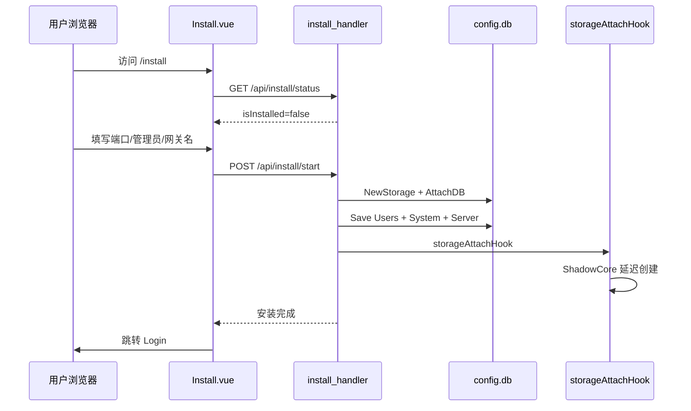
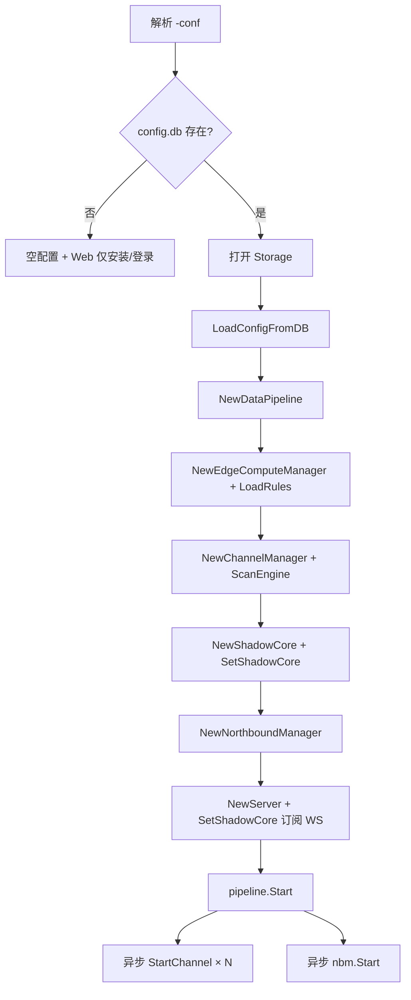
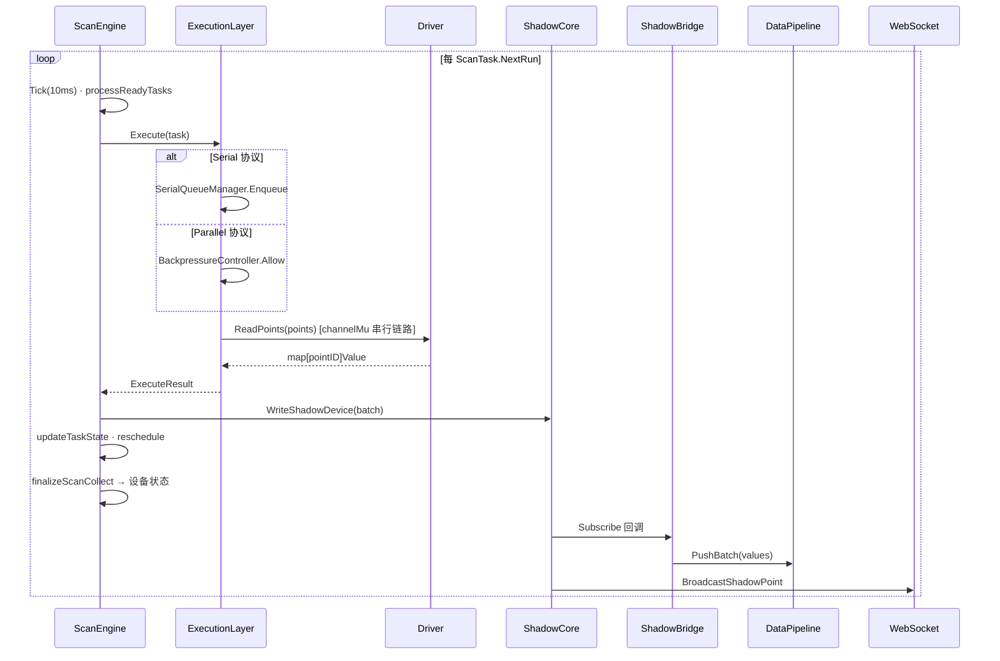

# 边缘网关架构设计总览

> **工程铁律：** 任何性能优化不得以牺牲稳定性为代价；任何架构优化不得增加系统恢复复杂度。

本文档从**安装 → 初始化 → 南向配置 → 采集运行 → 边缘计算 → 北向推送**完整梳理 EdgeX 边缘网关的系统生命周期，并对照 **Kepware 级工业应用标准**（高吞吐、防饿死、可预测调度）给出能力评估与分阶段优化规划。

> 战略文档（开发决策必读）：
> - [开发原则与验收标准](../DEVELOPMENT_PRINCIPLES.html)
> - [分阶段路线图](../ROADMAP.html)
> - [版本发布门禁](../RELEASE_GATE.html)

> 相关文档：
> - 运行时 DB 架构：`docs/operations/edgex-db-runtime-architecture.md`
> - 影子设备设计：`docs/edge/6. 影子设备设计.md`
> - ScanEngine 重构：`docs/TODO/ScanEngine重构方案.md`
> - Q2 方案与审查：`docs/[TODO]边缘计算南向采集优化方案2026第二季度.md`
> - **Q3 实施规划**：`docs/[TODO]边缘计算南向采集优化方案2026第三季度.md`

---

## 1. 设计目标与对标基准

### 1.1 工业级目标（对标 Kepware / KEPServerEX）

| 维度 | 工业级期望 | EdgeX 当前定位 |
|------|-----------|----------------|
| **高吞吐** | 单网关 1 万+ Tag，毫秒级批量 I/O，块读合并 | ScanEngine + 协议驱动，Modbus 块读/OPC UA 订阅，规模待压测标定 |
| **防饿死** | 低优先级/慢设备不被高负载永久阻塞 | 优先级堆 + 300s 防饿死 + 失败降级退避 |
| **可预测调度** | 采集周期稳定、抖动可控、可观测 | 基于 `NextRun` 最小堆，10ms 调度 tick，失败时动态拉长间隔 |
| **统一数据面** | Tag 数据库 → 单一运行时快照 → 北向/规则/历史一致 | **ShadowCore 为 UI/REST 真源；ShadowBridge → DataPipeline 扇出已挂载** |
| **Store & Forward** | 断网缓存、恢复补发 | 北向 `NorthboundCache` 已有；南向历史依赖 pipeline |
| **热配置** | 增删 Tag/通道不重启 | API 写 DB + 内存热更新 + ScanEngine 重注册 ✓ |

### 1.2 核心架构原则

1. **配置唯一源**：`data/config.db`（bbolt，强一致写入），`data/runtime.db` 存储运行时数据。
2. **运行时真源**：**ShadowCore 影子快照**（纯内存），UI WebSocket 与 REST 优先读影子。
3. **调度驱动采集**：**ScanEngine** 作为内核调度器（10ms Tick + 优先级堆 + 资源控制），经 **ExecutionLayer** 分发至 Driver 纯执行；形成 **调度→执行→数据→状态** 闭环。
4. **扩展总线**：**DataPipeline** 经 **ShadowBridge** 扇出，承载边缘规则、北向推送、历史落库。

### 1.3 调度驱动架构（ScanEngine 内核）

自 2026-06 起，南向采集由 **组件驱动**（各 Driver 自带 ticker/goroutine/重连）迁移为 **调度驱动**（ScanEngine 统一掌控时间、资源、执行与状态）。详见 `docs/TODO/ScanEngine重构方案.md`。

<div align="center">
  
</div>

> **Edgex V2.0 架构 · ScanEngine 统一调度**：12 种南向驱动经 ScanEngine 写入影子设备实时快照，再联通虚拟设备、边缘计算与北向接口。

```text
ScanEngine（内核调度器）
  │  10ms Tick · PriorityQueue · ResourceController · ScanTask 状态机
  ▼ dispatch
ExecutionLayer（执行层）
  │  SerialQueueManager（串行硬隔离）· ParallelExecutor + BackpressureController（三层背压）
  ▼ ReadPoints / WritePoint
Driver（无状态执行函数，禁止内部 ticker/goroutine/retry/连接管理）
  │  链路级重连经 driver.ConnectionManager（EnsureConnected / ScheduleReconnect）
  ▼ result
ShadowCore（唯一数据源）
  │  WriteShadowDevice → ShadowBridge → DataPipeline
  ▼ feedback
ScanEngine（updateTaskState：退避 / 优先级 / Degraded）
ChannelManager（finalizeScanCollect → 设备在线状态）
```

| 控制维度 | 组件 | 职责 |
|----------|------|------|
| **时间** | ScanEngine 10ms Tick | 全局调度时钟，`NextRun` 最小堆 |
| **资源** | ResourceController | Goroutine / Connection 全局限额 |
| **执行** | ExecutionLayer | 按协议 Serial / Parallel / Limited 三路分发 |
| **状态** | ScanTask 状态机 + ChannelManager | 失败退避、防饿死、FinalizeCollect |
| **连接** | ConnectionManager（driver 包） | 唯一 dial Owner；Transport 经 EnsureConnected |
| **诊断** | ConnectionController（core 包） | 错误分类与读写降级；**不**发起 Connect |

**ChannelManager 定位**：通道/设备/点位 CRUD、驱动生命周期、`ScanEngineAdapter` 注册任务；**不再**持有 per-device `deviceLoop`（已由 ScanEngine 替代）。

---

## 2. 系统分层总览

```text
┌─────────────────────────────────────────────────────────────────────────────┐
│  Web UI (Vue)          REST API              WebSocket (/api/ws/values)      │
│  Install / Login / 通道·设备·点位 / 边缘规则 / 北向 / 系统设置              │
└───────────────────────────────┬─────────────────────────────────────────────┘
                                │
┌───────────────────────────────┴─────────────────────────────────────────────┐
│  Server Layer (internal/server)                                              │
│  install_handler · server.go (CRUD + WS + metrics)       │
└───────────────────────────────┬─────────────────────────────────────────────┘
                                │
        ┌───────────────────────┼───────────────────────┐
        │                       │                       │
┌───────▼────────┐    ┌─────────▼─────────┐   ┌────────▼────────┐
│ ConfigManager  │    │  ChannelManager    │   │ NorthboundMgr   │
│ + ConfigStore  │    │  + ScanEngine      │   │ MQTT/HTTP/OPCUA │
│ → config.db    │    │  + StateManager    │   │ SparkplugB/edgeOS│
└────────────────┘    └─────────┬─────────┘   └────────┬────────┘
                                  │                       │
                    ┌─────────────▼─────────────┐         │
                    │      ShadowCore           │         │
                    │  Real Shadow（纯内存）    │         │
                    │  VirtualShadowEngine      │         │
                    │  DeviceCommunicationProfile│        │
                    └─────────────┬─────────────┘         │
                                  │ Subscribe             │
                    ┌─────────────▼─────────────┐   ┌─────▼─────┐
                    │  WebSocket 广播           │   │ DataPipeline│
                    │  (影子快照推送)           │   │ → ECM / NB  │
                    └───────────────────────────┘   └───────────┘
                                  ▲
                    ┌─────────────┴─────────────┐
                    │  ScanEngine（内核调度器）   │
                    │  PriorityQueue · 防饿死     │
                    │  ResourceController         │
                    │  ExecutionLayer             │
                    │   SerialQueue · Parallel    │
                    │   Backpressure · WorkerPool │
                    └─────────────┬─────────────┘
                                  │ ReadPoints（Driver 纯执行）
                    ┌─────────────▼─────────────┐
                    │  Southbound Drivers       │
                    │  Modbus · OPC UA · BACnet │
                    │  S7 · EtherNet/IP · DLT645│
                    │  + ConnectionManager 重连  │
                    └───────────────────────────┘
                                  │
                    feedback ◄────┘ updateTaskState / finalizeScanCollect
```

---

## 3. 全生命周期梳理

### 阶段 0：环境准备

| 项 | 说明 |
|----|------|
| 运行目录 | 工作目录下 `data/`（安装时创建） |
| 主数据库 | `data/config.db`（配置，强一致）+ `data/runtime.db`（运行时，可清理/compact） |
| 日志 | `logs/gateway.edgex.log` |
| 前端 | Vite 构建 UI，生产环境由 Go Server 托管静态资源 |

---

### 阶段 1：安装（Install）

**触发条件**：`data/config.db` 不存在或为空 → 安装模式。



| 步骤 | 组件 | 关键文件 |
|------|------|----------|
| 路由守卫 | 未安装跳转 `/install` | `ui/src/router/index.js` |
| 安装页 | 端口、管理员、网关信息 | `ui/src/views/Install.vue` |
| 安装 API | 校验、建库、写用户 | `internal/server/install_handler.go` |
| 安装判定 | `Users` bucket 有数据即已安装 | `ConfigStore.IsSystemInitialized()` |
| 空配置启动 | 无 DB 时内存默认配置 | `config.NewConfigManagerWithEmptyConfig` |

**安装后状态**：

- DB 含：Users、System、Server（端口/日志级别）
- **尚无** Channels / Devices / Northbound / EdgeRules（用户登录后配置）
- ShadowCore 在 `storageAttachHook` 中按需创建并绑定 ScanEngine

**已知限制**：

- 存储路径 UI 固定为 `data`，不可选
- 安装流程不预置通道/设备/北向

---

### 阶段 2：系统初始化（Startup）

**入口**：`cmd/main.go`



| 序号 | 组件 | 职责 |
|------|------|------|
| 1 | `ConfigManager` | 从 DB 加载 Channels / Devices / Northbound / EdgeRules / System / Users |
| 2 | `DataPipeline` | 异步批处理：`values` 落库、边缘规则、北向推送、WS（pipeline 路径） |
| 3 | `EdgeComputeManager` | 加载规则，注册 `pipeline.handleValue` |
| 4 | `ChannelManager` | 通道/设备/点位 CRUD；内嵌 `ScanEngineAdapter` 注册调度任务 |
| 5 | `ShadowCore` | 影子快照（纯内存）；ScanEngine 写入；ShadowBridge → Pipeline；Subscribe → WebSocket |
| 6 | `NorthboundManager` | 北向客户端启动；注册 `pipeline.handleValue` |
| 7 | `DeviceStorageManager` | 按设备存储策略写历史 |
| 8 | `Server` | HTTP/WS；`getDevicePoints` 优先读影子 |

**配置持久化路径**（所有 CRUD 统一）：

```text
API → Manager 内存更新 → saveFunc → ConfigManager.SaveConfig
    → ConfigStore.SaveAllConfig → config.db
```

---

### 阶段 3：添加采集通道（Southbound Channel）

**API**：`POST /api/channels` → `ChannelManager.AddChannel`

| 步骤 | 动作 |
|------|------|
| 1 | `EnsureChannelID`；OPC UA 配置归一化 |
| 2 | 设备级预处理（Modbus 自动点位范围等） |
| 3 | `drv.GetDriver(protocol)` 工厂创建驱动实例 |
| 4 | `driver.Init({ChannelID, Config})` |
| 5 | 注册通道 + 驱动 + 每通道互斥锁 |
| 6 | `StateManager.RegisterNode`（通道与设备状态树） |
| 7 | `saveFunc` → DB |

**启动通道**：`StartChannel`（Enable=true 时）

| 步骤 | 动作 |
|------|------|
| 1 | `driver.Connect` |
| 2 | `registerProtocolToScanEngine` 注册执行策略 |
| 3 | 每个启用设备 `registerDeviceToScanEngine` |
| 4 | `scanEngineAdapter.Start()` → ScanEngine.Run |

**协议 → ExecutionLayer 执行模式**（`registerProtocolToScanEngine`）：

| 执行模式 | 协议 | 行为 |
|----------|------|------|
| Serial | modbus-*、dlt645、omron-fins、mitsubishi-slmp | `SerialQueueManager`：每 deviceKey / 共享 channel 一 worker，经 `channelMu` 硬隔离 |
| Parallel | opc-ua、http、rest、mqtt | `ParallelExecutor` + `BackpressureController`（全局 512 / 单设备 8 / 1000 req/s） |
| Limited | s7、bacnet-ip、ethernet-ip | 低并发（2）+ 串行读 |

**涉及环境/存储**：

- 配置：`Channels` bucket + 各 `Devices/{id}`
- 内存：`cm.channels`、`cm.drivers`、`cm.driverMus`
- 运行时：驱动连接、OPC UA Subscription（Connect 后 lazy 创建）

---

### 阶段 4：添加设备（Device）

**API**：`POST /api/channels/:channelId/devices`

| 步骤 | 动作 |
|------|------|
| 1 | 分配/校验 Device ID（BACnet 实例 ID 唯一性等） |
| 2 | 协议 Bootstrap（Modbus 自动点位、OPC UA 合并 endpoint 等） |
| 3 | `sanitizeDeviceConfig`；初始化 `StopChan` |
| 4 | 追加到通道设备列表；StateManager 注册 |
| 5 | 若通道已启用 → `registerDeviceToScanEngine` |
| 6 | `saveChannels` → DB |

**ScanEngine 任务注册**（`ScanEngineAdapter.RegisterDevice`）：

```text
RemoveTasksByDeviceKey → GroupPointsByScanClass（fast/normal/slow）
→ 每 Scan Class 一个 ScanTask（AddTaskWithScanClass）
→ params: points, driverConfig, channelMu, channelID
```

| 参数 | 来源 | 说明 |
|------|------|------|
| `Interval` | Scan Class 或 `device.Interval` | fast=100ms / normal=设备默认 / slow=10s |
| `Priority` | 默认 5 | 成功升优先级（上限 10）；防饿死提到 10 |
| `Points` | 按 Scan Class 分组的点位 | 驱动 ReadPoints 批量入参 |

**设备通信状态**（`CommunicationManageTemplate`）：

- Online / Offline / Degraded
- ScanEngine 采集完成后经 `SetCollectFinalize` → `ChannelManager.finalizeScanCollect` → `FinalizeCollect`（含链路级 vs 设备级错误隔离，见 `channel_device_state.go`）

---

### 阶段 5：添加点位（Points）

**API**：`POST/PUT/DELETE .../devices/:deviceId/points`

| 步骤 | 动作 |
|------|------|
| 1 | `validatePoint`（按协议校验地址/类型） |
| 2 | 更新设备 `Points` 列表 |
| 3 | **`restartDeviceLocked`**：Unregister + Register ScanEngine 任务 |
| 4 | OPC UA：`ensureSubscription` 检测 PointIDs 变化 → 重建 MonitoredItems |
| 5 | `saveChannels` → DB |

**采集 → 影子 → 扇出数据流**（调度闭环主路径）：



**影子点位时间语义**：

| 字段 | 含义 |
|------|------|
| `collected_at` | 设备侧采集完成时间（驱动 ReadPoints 返回 TS） |
| `updated_at` | 影子快照写入时间 |
| `timestamp` | 兼容字段，等同 `collected_at` |

**REST 读点**：`GetDevicePoints` **优先** `getDevicePointsFromShadow`，无影子时回退驱动直读。

---

### 阶段 6：添加边缘计算规则（Edge Rules）

**API**：`/api/edge/rules` CRUD

| 项 | 说明 |
|----|------|
| 持久化 | `EdgeRules` bucket |
| 加载 | 启动时 `ecm.LoadRules(cfg.EdgeRules)` |
| 触发 | `DataPipeline` → `EdgeComputeManager.handleValue` |
| 索引 | O(1)：`channelID/deviceID/pointID` |
| 规则类型 | 阈值、状态、表达式计算、滑动窗口 |
| 动作 | 写点（DeviceIO）、MQTT/HTTP 北向、告警状态（RuleState bucket） |
|  worker | 10 workers，队列 1000，满则丢弃 |

**触发路径**（`cmd/main.go`）：ScanEngine → ShadowCore → **ShadowBridge** → DataPipeline → `EdgeComputeManager.handleValue`。

**剩余差距**：规则 `Window` / `RuleState` 与影子快照的强一致同步、复杂窗口规则在高压下的背压策略仍待 Q3 验收。

---

### 阶段 7：添加北向通道（Northbound）

**API**：北向配置 CRUD（经 `NorthboundManager` + `saveFunc`）

**支持协议**（`internal/northbound/`）：

| 类型 | 包路径 | 说明 |
|------|--------|------|
| MQTT | `mqtt/` | 发布/订阅写点 |
| HTTP | `http/` | REST 推送 |
| OPC UA Server | `opcua/` | 对外暴露 Tag |
| Sparkplug B | `sparkplugb/` | 工业 MQTT 规范 |
| edgeOS MQTT | `edgos_mqtt/` | EdgeOS 集成 |
| edgeOS NATS | `edgos_nats/` | EdgeOS 集成 |

**启动**：`NorthboundManager.Start` → 各 enabled 配置 `client.Start()`

**数据流**（`main.go` 已挂载 ShadowBridge）：

```text
ScanEngine → ShadowCore.WriteShadowDevice
    → ShadowBridge.Subscribe → DataPipeline.PushBatch
        → EdgeComputeManager / NorthboundManager / DeviceStorageManager
设备状态变更 → cm.SetStatusHandler → OnDeviceStatusChange → 北向生命周期通知
离线 → storage.NorthboundCache / DataCache
```

**说明**：北向 telemetry 与边缘规则依赖 Pipeline 扇出；OPC UA Server 读点仍可直接经 `GetShadowPoint` 读影子。

---

## 4. 核心运行时组件详解

### 4.1 ScanEngine（内核调度器）

**定位**：Mini OS Scheduler — 统一掌控**时间**（10ms Tick）、**资源**（ResourceController）、**执行**（ExecutionLayer 分发）、**状态**（ScanTask 状态机 + 采集收尾回调）。

**文件**：`internal/core/scan_engine.go`、`scan_engine_compat.go`（ScanEngineAdapter）

| 机制 | 配置默认值 | 说明 |
|------|-----------|------|
| 调度 tick | 10ms | `processReadyTasks` 扫描到期任务 |
| 任务队列 | 最小堆 `NextRun` | 同刻到期按 Priority 降序 |
| Scan Class | fast / normal / slow | 每类独立 ScanTask（`AddTaskWithScanClass`） |
| Worker | 32 | Parallel 协议 WorkerPool |
| 队列上限 | 10000 | SerialQueueManager |
| 防饿死 | 300s | 超期 Idle 任务 Priority=10 立即重排 |
| 资源上限 | Goroutine 2048 / Connection 500 | ResourceController |
| 失败退避 | 连续 3 次失败 | 间隔 ×2，上限 64s，状态 Degraded |
| 采集收尾 | `SetCollectFinalize` | 回调 `ChannelManager.finalizeScanCollect` |

**调度闭环**：`dispatch → ExecutionLayer.Execute → applyCollectToShadow → updateTaskState → 重新入堆`。

**可预测性分析**：

- ✓ 每 ScanTask 独立 `BaseInterval`，堆调度保证平均周期
- ✓ Scan Class 支持同设备多周期任务
- △ 10ms tick 引入 ≤10ms 抖动
- △ 资源满时任务重新入堆，可能顺延
- △ 失败退避使周期 **动态变化**（工业场景需可配置是否退避，见 Q3-B）

### 4.2 ExecutionLayer（执行层）

**文件**：`execution_layer.go`、`serial_queue_manager.go`、`backpressure_controller.go`、`resource_controller.go`

| 路径 | 组件 | 行为 |
|------|------|------|
| Serial | `SerialQueueManager` | 一设备（或共享 channel）一 worker；`serialQueueKey()` 避免慢从站阻塞整总线 |
| Parallel | `ParallelExecutor` + `BackpressureController` | 全局 512 并发 / 单设备 8 / Token Bucket 1000 req/s |
| Limited | 低并发串行读 | s7、bacnet-ip、ethernet-ip 等 |

**共享链路串行**：modbus/dlt645 等在 `readPoints` 持 `channelMu` 执行 I/O，与 `ConnectionManager.ScheduleReconnect` 互斥。

### 4.3 Driver 层与 ConnectionManager

**Driver 强约束**（无状态执行函数）：

- ✅ 允许：`ReadPoints` / `WritePoint`、协议解析、数据转换
- ❌ 禁止：内部 ticker、goroutine、retry loop、连接管理、退避逻辑

**连接管理**（`internal/driver/connection_manager.go`）：

| 组件 | 职责 |
|------|------|
| `ConnectionManager` | **唯一 dial Owner**：`EnsureConnected`（同步退避）、`ScheduleReconnect`（single-flight 异步重连） |
| `ConnectionController`（core） | 错误分类、读写降级；**不**发起 Connect |
| Transport | `Connect` / `withRetry` / `scheduleReconnect` 均委托 ConnectionManager |

**待迁移**：OpcUaDriver、ENIPTransport 仍含自定义 `go reconnect()`（见 ScanEngine 重构方案 §5.3.5）。

### 4.4 ChannelManager

**文件**：`internal/core/channel_manager.go`

- 通道/设备/点位 CRUD、驱动工厂、`StartChannel` / `StopChannel`
- `ScanEngineAdapter`：协议注册、设备任务注册、热更新 `restartDeviceLocked`
- `finalizeScanCollect`：链路级 vs 设备级错误隔离 → `StateManager.FinalizeCollect`
- **已移除**：`deviceLoop`、`collectDevice`、`CollectionScheduler`（ScanEngine 为唯一调度）

### 4.5 ShadowCore（影子设备）

**文件**：`internal/core/shadow_core.go`

| 能力 | 状态 |
|------|------|
| 内存快照 | `realShadows[shadow-{deviceID}]` |
| 持久化 | 无；重启后由 ScanEngine 重新填充 |
| 通信画像 | RTT / MTU / Gap（ShadowDeviceOptimizer） |
| 订阅通知 | `Subscribe` → WebSocket |
| VirtualShadow | 公式依赖图（`VirtualShadowEngine`） |

**ShadowIngress**（`shadow_ingress.go`）：`main.go` 已挂载（256 缓冲 / 8ms 批量）；ScanEngine 主路径仍直连 `WriteShadowDevice`，Ingress 作高吞吐可选缓冲。

### 4.6 DataPipeline（数据总线）

**文件**：`internal/core/pipeline.go`

- 每点位最多缓冲 2 条，异步 `drainAndProcess`
- Handler 链：Storage.SaveValue、EdgeCompute、Northbound、WebSocket（pipeline 形态）

**与 Shadow 关系**：ScanEngine → ShadowCore → **ShadowBridge** → DataPipeline 扇出（`main.go` `wireShadowStack`）。

### 4.7 存储布局（data/config.db + data/runtime.db）

| 类别 | Bucket | 用途 |
|------|--------|------|
| 配置 | ConfigVersion, Server, Channels, Devices, Northbound, EdgeRules, System, Users | 安装后所有配置 CRUD |
| 运行时 | values, RuleState, Window, DataCache, NorthboundCache | 历史值、规则态、北向缓存 |

---

## 5. 端到端生命周期一览表

| 阶段 | 用户操作 | API/入口 | 内存组件 | 持久化 | 采集/运行影响 |
|------|----------|----------|----------|--------|---------------|
| 安装 | 安装向导 | `/api/install/*` | ConfigManager.AttachDB | Users, System, Server | 无采集 |
| 登录 | 用户名密码 | `/api/login` | Session | Users 读 | — |
| 加通道 | 通道列表新建 | `POST /api/channels` | drivers map | Channels | 需 StartChannel |
| 启通道 | 启用开关 | `StartChannel` | ScanEngine tasks | — | Connect + 注册任务 |
| 加设备 | 设备列表 | `POST .../devices` | ScanTask | Devices/{id} | RegisterDevice |
| 加点位 | 点位列表 | `POST .../points` | ScanTask 刷新 | Devices/{id} | restartDevice |
| 边缘规则 | 规则页 | `/api/edge/rules` | ECM index | EdgeRules | 需 Pipeline 触发 |
| 北向 | 北向配置 | Northbound API | NBM clients | Northbound | 需 Pipeline 或 Shadow 订阅 |
| 运行 | — | WS + REST | ShadowCore | values | ScanEngine 周期写影子 |

---

## 6. 能力差距评估（对标 Kepware 工业标准）

### 6.1 已具备能力

| 能力 | EdgeX 实现 |
|------|-----------|
| 多协议南向 | Modbus / OPC UA / BACnet / S7 / EtherNet/IP / DLT645 / Omron / Mitsubishi |
| 统一 DB 配置 | config.db + runtime.db 双源，热更新 |
| 调度驱动内核 | ScanEngine 10ms Tick + PriorityQueue + 调度闭环 |
| ExecutionLayer | Serial 硬隔离 + Parallel 三层背压 + Limited |
| Driver 纯执行 | 禁止 Driver 内部 ticker/goroutine/retry；ConnectionManager 统一重连 |
| Scan Class | fast/normal/slow 多任务 per 设备 |
| 防饿死 | 300s 超时提升优先级 |
| 背压 | BackpressureController + SerialQueue 上限 |
| 影子快照 | ShadowCore 纯内存 + 双时间戳 |
| Pipeline 扇出 | ShadowBridge → DataPipeline → ECM / NBM / 历史 |
| UI 实时 | Shadow Subscribe → WebSocket |
| 北向多协议 | MQTT / OPC UA Server / SparkplugB / edgeOS |
| 边缘规则引擎 | 阈值/表达式/窗口 |
| 设备状态闭环 | finalizeScanCollect → FinalizeCollect |
| 通信画像 | RTT / MTU / Gap 优化器（读路径消费待加强） |

### 6.2 关键不足（P0 — 影响工业可用性）

| # | 不足 | 影响 | 现状 |
|---|------|------|------|
| **G1** | **ScanEngine → RTT 画像未闭环** | Gap/MTU 优化器未驱动 ExecutionLayer 读分片 | Execute 后未系统调用 `UpdateDeviceRTT` |
| **G2** | **部分 Driver 重连未统一** | OpcUa / ENIP 仍 `go reconnect()`，无 single-flight | Modbus/DLT645 已走 ConnectionManager |
| **G3** | **Scan Class 产品化不足** | UI 未全面暴露 fast/slow 配置 | 代码已支持 `GroupPointsByScanClass` |
| **G4** | **OPC UA 双时钟** | 订阅 1s vs ScanTask Interval 解耦 | 已通过 collected_at 缓解显示 |
| **G5** | **大规模块读优化未贯通** | Modbus Gap/MTU 画像未反馈到 ExecutionLayer 分片 | 优化器写画像，读路径未消费 |
| **G6** | **熔断机制缺失** | 高失败率设备无法自动熔断 | ScanEngine 重构方案阶段 3 要求，未实现 |

### 6.3 中等不足（P1 — 规模与运维）

| # | 不足 | 说明 |
|---|------|------|
| G7 | 无 Tag 数据库抽象 | 无别名、分层、缩放因子集中管理 |
| G8 | Sync 联机已禁用 | 无热备/配置同步 |
| G9 | 调度可观测性不足 | 已有 `/api/diagnostics/scan-engine`；per-device 直方图待完善 |
| G10 | 10ms 全局 tick | 万级任务时 CPU 空转；可改 event-driven timer |
| G11 | 四阶段灰度未完整执行 | DRY_RUN 双跑、72h 一致性校验、熔断等待运维验证 |

### 6.4 长期不足（P2 — 对标 Kepware 高级特性）

| # | 不足 |
|---|------|
| G12 | 无冗余通道 Failover |
| G13 | 无驱动级自动 Tag 发现持久化流水线 |
| G14 | 无采集 vs 发布速率独立配置（Publish Rate） |
| G15 | 虚拟 Tag / 聚合 Tag 未产品化 |
| G16 | 审计链 / 写点 CAS 未全链路启用 |

---

## 7. 优化规划（Roadmap）

### Phase 1 — 统一数据面（P0， largely ✅）

**目标**：Shadow 为真源，Pipeline 为扇出，北向/规则/历史与 UI 一致。

```text
ScanEngine 读点成功
    → ShadowCore.WriteShadowDevice（保持）
    → ShadowBridge.Subscribe → DataPipeline.PushBatch（main.go 已挂载）
        ├→ EdgeComputeManager
        ├→ NorthboundManager
        └→ DeviceStorageManager / values
    → WebSocket（ShadowCore.Subscribe）
```

| 任务 | 状态 | 说明 |
|------|------|------|
| 1.1 Shadow→Pipeline 桥接 | ✅ | `shadow_bridge.go` + `main.go` |
| 1.2 ScanEngine 状态回写 | ✅ | `SetCollectFinalize` → `finalizeScanCollect` |
| 1.3 移除死代码 | ✅ | `collectDevice` / `deviceLoop` 已移除 |
| 1.4 集成测试 | ✅ | `shadow_pipeline_integration_test.go` |

**剩余验收**：复杂边缘规则 Window 同步、高压下 Pipeline 背压策略。

---

### Phase 2 — 可预测调度增强（P0，2–3 sprint）

**目标**：对标 Kepware「稳定 Scan Rate + 防饿死」。

| 任务 | 说明 |
|------|------|
| 2.1 Scan Class | 点位/设备标签：`fast(100ms)` / `normal(1s)` / `slow(10s)`，ScanEngine 多 Interval 任务或点位分组 |
| 2.2 可配置退避 | `degrade_on_failure: true/false`；工业模式关闭退避，仅报 Quality=Bad |
| 2.3 调度指标 | Prometheus：`scan_scheduled_lag_ms`、`scan_overdue_total`、`starvation_rescue_total` |
| 2.4 Event-driven 定时 | 堆顶 `NextRun` 睡眠 + 10ms 兜底扫描，降 CPU |
| 2.5 优先级策略 | 通道级默认优先级；Manual Boost API |

**验收**：100 设备 × 100 点，95% 采集落在 `[Interval, Interval+50ms]`； starving 设备 5min 内必被 rescue。

---

### Phase 3 — 高吞吐 I/O（P1，3–4 sprint）

**目标**：万 Tag 级吞吐。

| 任务 | 说明 |
|------|------|
| 3.1 Modbus 块读 | ExecutionLayer 读前 `GapOptimizer` 分片，合并 contiguous 寄存器 |
| 3.2 OPC UA 批量 Read | 超 N 点分批 + MaxNodesPerRead 自适应 |
| 3.3 Shadow 批量写 | WriteShadowDevice 已批量 |
| 3.4 Pipeline 批处理 | IngestBatch 减少 handler 调用 |
| 3.5 压测基线 | 复用 `scan_engine_large_scale_test.go`，出报告 1w/5w Tag |

---

### Phase 4 — 工业运维与 Tag 模型（P2）

| 任务 | 说明 |
|------|------|
| 4.1 Tag 数据库层 | 统一点位 ID、别名、EU、缩放 |
| 4.2 Store & Forward 统一 | 南向 values + 北向 cache 一致策略 |
| 4.3 启用 ShadowIngress QoS | 可选 QoS1 写入 |
| 4.4 联机 Sync 重构 | 修复 YAML 路径问题后启用 libp2p |
| 4.5 冗余通道 | 主备驱动 + 自动切换 |

---

## 8. 推荐目标架构（Target State）

```text
                    ┌─────────────────────────────────┐
                    │         Tag Database (DB)        │
                    │  Channel / Device / Point / Rule │
                    └───────────────┬─────────────────┘
                                    │ CRUD → config.db
                    ┌───────────────▼─────────────────┐
                    │   ScanEngine（内核调度器）        │
                    │  ScanClass · Priority · 防饿死   │
                    │  ResourceController · Metrics    │
                    │  ExecutionLayer（Serial/Parallel）│
                    └───────────────┬─────────────────┘
                                    │ ReadPoints（Driver 纯执行）
                    ┌───────────────▼─────────────────┐
                    │         ShadowCore (SoT)         │
                    │  collected_at / updated_at（纯内存）│
                    └───────────────┬─────────────────┘
                                    │ ShadowBridge 扇出
              ┌─────────────────────┼─────────────────────┐
              │                     │                     │
      ┌───────▼──────┐    ┌────────▼────────┐   ┌───────▼──────┐
      │  WebSocket   │    │  DataPipeline    │   │ VirtualShadow│
      │  UI 实时     │    │  ECM · NBM · Hist│   │  公式 Tag    │
      └──────────────┘    └─────────────────┘   └──────────────┘
```

**设计约束**：

1. **单一调度点**：ScanEngine 掌控全部南向采集 timing；Driver 禁止内部调度。
2. **单一写入点**：ScanEngine（南向读）与 WritePoint（北向写）均经 ShadowCore。
3. **单一读出点（UI）**：REST/WS 读 Shadow，不直读驱动（驱动直读仅 Diagnostics API）。
4. **Pipeline 只做扇出**，不做真源。
5. **连接唯一 Owner**：`driver.ConnectionManager` 负责全部 dial / 退避 / single-flight 重连。

---

## 9. 关键源码索引

| Concern | Path |
|---------|------|
| 启动入口 | `cmd/main.go` |
| 安装 | `internal/server/install_handler.go` |
| 配置/DB | `internal/config/config.go`, `internal/storage/config_store.go` |
| 通道/设备/点 | `internal/core/channel_manager.go`, `channel_device_state.go` |
| 调度引擎 | `internal/core/scan_engine.go`, `scan_engine_compat.go` |
| 执行层 | `internal/core/execution_layer.go`, `serial_queue_manager.go`, `backpressure_controller.go` |
| 连接管理 | `internal/driver/connection_manager.go`, `internal/core/connection_controller.go` |
| 影子/扇出 | `internal/core/shadow_core.go`, `shadow_bridge.go`, `shadow_device_optimizer.go` |
| 管道 | `internal/core/pipeline.go`, `shadow_ingress.go` |
| 边缘规则 | `internal/core/edge_compute_manager.go` |
| 北向 | `internal/core/northbound_manager.go`, `internal/northbound/*` |
| ScanEngine 规范 | `docs/TODO/ScanEngine重构方案.md` |
| HTTP/WS | `internal/server/server.go` |
| 安装 UI | `ui/src/views/Install.vue` |
| 点位 UI | `ui/src/views/PointList.vue` |
| DB 架构 | `docs/operations/edgex-db-runtime-architecture.md` |

---

## 10. 总结

EdgeX 已完成 **调度驱动南向采集内核** 的主体交付：**ScanEngine 统一调度 → ExecutionLayer 硬隔离/背压 → Driver 纯执行 → ShadowCore 运行时快照 → ShadowBridge/Pipeline 扇出 → WebSocket/REST 读影子**，具备工业网关的骨架能力（多协议、防饿死、背压、ConnectionManager 统一重连）。

距离 **Kepware 级工业标准** 的核心差距在于：

1. **画像与读路径未闭环** — RTT/MTU/Gap 未驱动 ExecutionLayer 块读分片；
2. **部分 Driver 重连待迁移** — OpcUa/ENIP 尚未完全接入 ConnectionManager single-flight；
3. **Scan Class 与可观测 SLA** — 代码已支持多 Class，产品化与调度指标验收仍在 Q3；
4. **四阶段灰度运维验证** — 熔断、72h 长跑、DRY_RUN 双跑等待生产确认。

**下一步最高优先级**：Q3-B **Gap → Modbus 读路径**、**ScanEngine → RTT 画像闭环**，随后 **万 Tag 压测** 与 **OpcUa 重连统一**。

---

*文档维护：架构变更时请同步更新 §1.3 调度驱动架构、§3 生命周期与 §6 差距表；ScanEngine 细节以 `docs/TODO/ScanEngine重构方案.md` 为准。*
