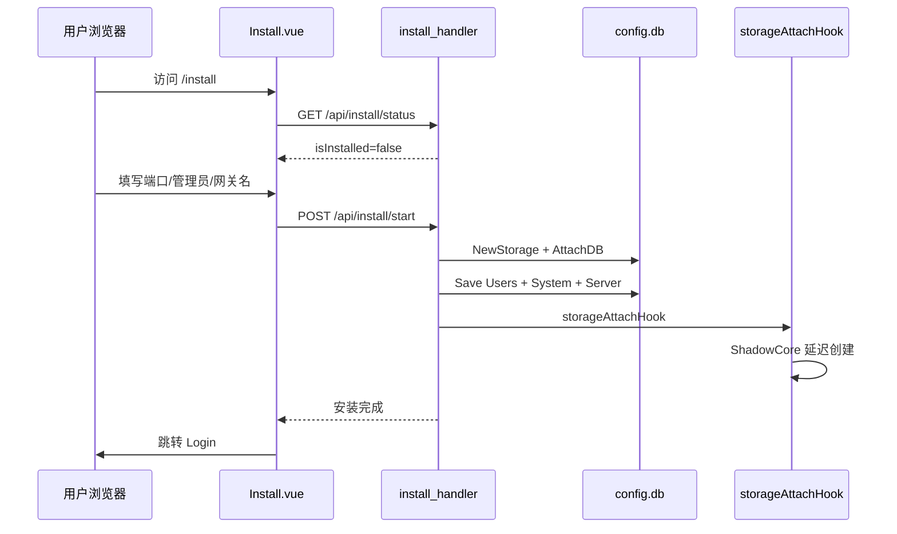
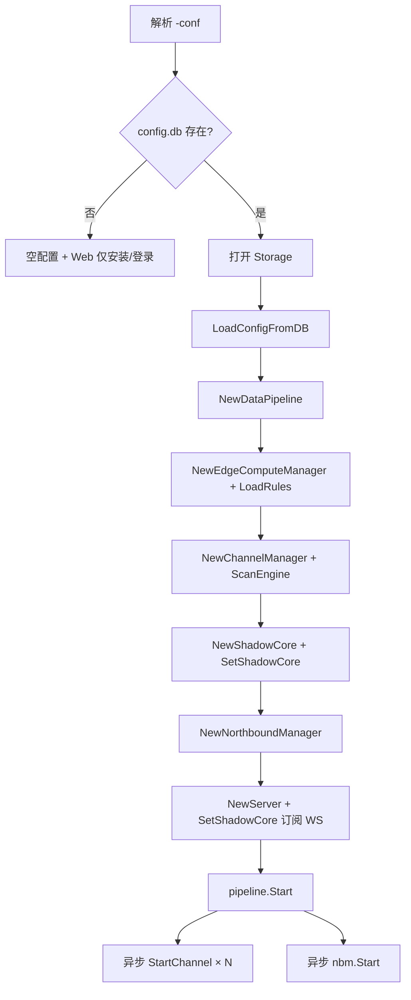
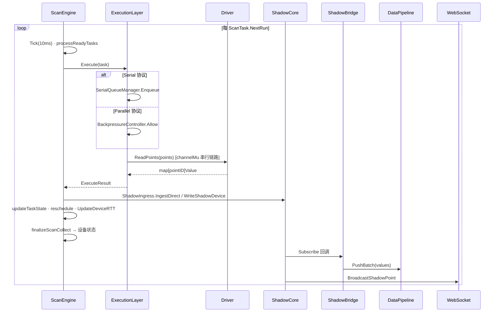

# 边缘网关架构设计总览

> **工程铁律：** 任何性能优化不得以牺牲稳定性为代价；任何架构优化不得增加系统恢复复杂度。

本文档从**安装 → 初始化 → 南向配置 → 采集运行 → 边缘计算 → 北向推送**完整梳理 EdgeX 边缘网关的系统生命周期，并对照 **Kepware 级工业应用标准**（高吞吐、防饿死、可预测调度）给出能力评估与分阶段优化规划。

> 战略文档（开发决策必读）：
> - [开发原则与验收标准](../DEVELOPMENT_PRINCIPLES.html)
> - [分阶段路线图](../ROADMAP.html)
> - [版本发布门禁](../RELEASE_GATE.html)

> 相关文档：
> - 运行时 DB 架构：`docs/operations/edgex-db-runtime-architecture.md`
> - 影子设备设计：`docs/edge/6. 影子设备设计.md`
> - ScanEngine 重构：`docs/TODO/ScanEngine重构方案.md`
> - Q2 方案与审查：`docs/[TODO]边缘计算南向采集优化方案2026第二季度.md`
> - **Q3 实施与验收**：`docs/[TODO]边缘计算南向采集优化方案2026第三季度.md`
> - **SLA 评估与达标**：`docs/TODO/SLA评估.md` · `docs/testing/sla_completion_report_2026Q3.md` · `docs/testing/deterministic_sla_report.md`
> - **Shadow 性能优化**：`docs/testing/shadow_optimization_report_2026Q3.md`
> - **SLA 运维手册**：`docs/deployment/sla_monitoring.md`

---

## 1. 设计目标与对标基准

### 1.1 工业级目标（对标 Kepware / KEPServerEX）

| 维度 | 工业级期望 | EdgeX 当前定位 |
|------|-----------|----------------|
| **高吞吐** | 单网关 1 万+ Tag，毫秒级批量 I/O，块读合并 | ScanEngine + 协议驱动，Modbus 块读/OPC UA 订阅，规模待压测标定 |
| **防饿死** | 低优先级/慢设备不被高负载永久阻塞 | 优先级堆 + 300s 防饿死 + EDF miss 提权 + rescue 计数 |
| **可预测调度** | 采集周期稳定、抖动可控、可观测 | 事件驱动最小堆 + wake timer；EDF 出队 + hard jitter clamp；P95 lag ~7ms（10k tag mock） |
| **统一数据面** | Tag 数据库 → 单一运行时快照 → 北向/规则/历史一致 | **ShadowCore SoT；ShadowIngress 批量写入；ShadowBridge → DataPipeline 扇出** |
| **统计 SLA** | 可度量 lag/drift/miss、故障隔离、轻量化运维 | Phase A–C ✅；B1–B5 ≥95%；diagnostics + `sla_warnings` + UI 通道监控 |
| **Store & Forward** | 断网缓存、恢复补发 | 北向 `NorthboundCache` 已有；南向历史依赖 pipeline |
| **热配置** | 增删 Tag/通道不重启 | API 写 DB + 内存热更新 + ScanEngine 重注册 ✓ |

### 1.2 核心架构原则

1. **配置唯一源**：`data/config.db`（bbolt，强一致写入），`data/runtime.db` 存储运行时数据。
2. **运行时真源**：**ShadowCore 影子快照**（纯内存），UI WebSocket 与 REST 优先读影子。
3. **调度驱动采集**：**ScanEngine** 作为内核调度器（事件驱动堆 + EDF + 断路器 + 自适应 throttle），经 **ExecutionLayer** 分发至 Driver 纯执行；形成 **调度→执行→数据→状态** 闭环。
4. **扩展总线**：**DataPipeline** 经 **ShadowBridge** 扇出，承载边缘规则、北向推送、历史落库。
5. **统计 SLA 可观测**：零外部依赖 — HTTP diagnostics、`sla_warnings`、结构化日志与 UI 轮询（见 [SLA 运维手册](../deployment/sla_monitoring.html)）。

### 1.3 调度驱动架构（ScanEngine 内核）

自 2026-06 起，南向采集由 **组件驱动** 迁移为 **调度驱动**（ScanEngine 统一掌控时间、资源、执行与状态）。

> **ScanEngine 技术规范**（组件职责、四阶段迁移、Driver 约束、背压参数）以 [ScanEngine 重构方案](../TODO/ScanEngine重构方案.html) 为准；组件清单与数据流见 [5. 实现架构](5. 实现架构.html)。

<div align="center">
  
</div>

> **EdgeX V2.0 架构 · ScanEngine 统一调度**：12 种南向驱动经 ScanEngine 写入影子设备实时快照，再联通虚拟设备、边缘计算与北向接口。

**ChannelManager 定位**：通道/设备/点位 CRUD、驱动生命周期、`ScanEngineAdapter` 注册任务；**不再**持有 per-device `deviceLoop`。

---

### 1.4 SLA 调度架构（2026 Q3 已交付）

ScanEngine 定位为具备**多协议采集、优先级调度、故障隔离、统计 SLA 可观测**的边缘调度引擎，适合 **≤10k tag 中小规模生产**（详见 [SLA 评估](../TODO/SLA评估.html)）。

```text
┌──────────────── ScanEngine（内核调度器）────────────────────────────┐
│  PriorityQueue（最小堆）· EDF 出队 · hard jitter clamp              │
│  Event-driven wake timer + 10ms fallback tick                       │
│  Anti-starvation（300s rescue）· Adaptive throttle · GC backpressure│
│  Per-device Circuit Breaker · Per-protocol congestion token bucket  │
└────────────────────────────┬────────────────────────────────────────┘
                             │ dispatch
┌────────────────────────────▼────────────────────────────────────────┐
│  ExecutionLayer — Serial / Parallel / Limited                       │
│  Gap/MTU 块读分片 · channelMu 硬隔离 · BackpressureController       │
└────────────────────────────┬────────────────────────────────────────┘
                             │ ReadPoints
┌────────────────────────────▼────────────────────────────────────────┐
│  ShadowIngress（256 缓冲 / 8ms flush）→ ShadowCore（COW SoT）       │
│  → ShadowBridge → DataPipeline → ECM / NBM / 历史 / WebSocket       │
└─────────────────────────────────────────────────────────────────────┘
                             ▲
                    GET /api/diagnostics/scan-engine
                    sla_warnings · CB state · serial_queue_depth
```

**工业边界达标（B1–B5 ≥95%，2026-07）**：

| 边界 | 能力 | 状态 |
|------|------|------|
| B1 故障隔离 | 每设备 CB + 串行队列 + E2E 故障传播测试 | ✅ |
| B2 调度稳定 | lag P95 <100ms、drift <50ms、miss=0（mock gate） | ✅ |
| B3 压力反压 | backpressure + per-device RTT throttle | ✅ |
| B4 10k tag 性能 | zero-alloc 热路径、GC pause <20ms | ✅ |
| B5 协议验证 | Modbus 仿真器 IT + soak 门控 | ✅ |
| B6 确定性调度 | EDF + hard jitter clamp；P99 lag <150ms（统计 SLA） | ⚠️ 85%（板端 P99 待验） |

**P99 书面承诺**（mock/x86，非硬实时 PLC）：见 [确定性 SLA 报告](../testing/deterministic_sla_report.html)。

---

## 2. 系统分层总览

```text
┌─────────────────────────────────────────────────────────────────────────────┐
│  Web UI (Vue)          REST API              WebSocket (/api/ws/values)      │
│  Install / Login / 通道·设备·点位 / 边缘规则 / 北向 / 系统设置              │
└───────────────────────────────┬─────────────────────────────────────────────┘
                                │
┌───────────────────────────────┴─────────────────────────────────────────────┐
│  Server Layer (internal/server)                                              │
│  install_handler · server.go (CRUD + WS + metrics)       │
└───────────────────────────────┬─────────────────────────────────────────────┘
                                │
        ┌───────────────────────┼───────────────────────┐
        │                       │                       │
┌───────▼────────┐    ┌─────────▼─────────┐   ┌────────▼────────┐
│ ConfigManager  │    │  ChannelManager    │   │ NorthboundMgr   │
│ + ConfigStore  │    │  + ScanEngine      │   │ MQTT/HTTP/OPCUA │
│ → config.db    │    │  + StateManager    │   │ SparkplugB/edgeOS│
└────────────────┘    └─────────┬─────────┘   └────────┬────────┘
                                  │                       │
                    ┌─────────────▼─────────────┐         │
                    │      ShadowCore           │         │
                    │  ShadowIngress 批量写入   │         │
                    │  COW 快照 · Notify Pool   │         │
                    │  VirtualShadowEngine      │         │
                    │  DeviceCommunicationProfile│        │
                    └─────────────┬─────────────┘         │
                                  │ Subscribe             │
                    ┌─────────────▼─────────────┐   ┌─────▼─────┐
                    │  WebSocket 广播           │   │ DataPipeline│
                    │  (影子快照推送)           │   │ → ECM / NB  │
                    └───────────────────────────┘   └───────────┘
                                  ▲
                    ┌─────────────┴─────────────┐
                    │  ScanEngine（内核调度器）   │
                    │  EDF · CB · Anti-starvation │
                    │  Adaptive throttle · Metrics│
                    │  ExecutionLayer             │
                    │   SerialQueue · Parallel    │
                    │   Backpressure · WorkerPool │
                    └─────────────┬─────────────┘
                                  │ ReadPoints（Driver 纯执行）
                    ┌─────────────▼─────────────┐
                    │  Southbound Drivers       │
                    │  Modbus · OPC UA · BACnet │
                    │  S7 · EtherNet/IP · DLT645│
                    │  + ConnectionManager 重连  │
                    └───────────────────────────┘
                                  │
                    feedback ◄────┘ updateTaskState / finalizeScanCollect
```

---

## 3. 全生命周期梳理

### 阶段 0：环境准备

| 项 | 说明 |
|----|------|
| 运行目录 | 工作目录下 `data/`（安装时创建） |
| 主数据库 | `data/config.db`（配置，强一致）+ `data/runtime.db`（运行时，可清理/compact） |
| 日志 | `logs/gateway.edgex.log` |
| 前端 | Vite 构建 UI，生产环境由 Go Server 托管静态资源 |

---

### 阶段 1：安装（Install）

**触发条件**：`data/config.db` 不存在或为空 → 安装模式。



| 步骤 | 组件 | 关键文件 |
|------|------|----------|
| 路由守卫 | 未安装跳转 `/install` | `ui/src/router/index.js` |
| 安装页 | 端口、管理员、网关信息 | `ui/src/views/Install.vue` |
| 安装 API | 校验、建库、写用户 | `internal/server/install_handler.go` |
| 安装判定 | `Users` bucket 有数据即已安装 | `ConfigStore.IsSystemInitialized()` |
| 空配置启动 | 无 DB 时内存默认配置 | `config.NewConfigManagerWithEmptyConfig` |

**安装后状态**：

- DB 含：Users、System、Server（端口/日志级别）
- **尚无** Channels / Devices / Northbound / EdgeRules（用户登录后配置）
- ShadowCore 在 `storageAttachHook` 中按需创建并绑定 ScanEngine

**已知限制**：

- 存储路径 UI 固定为 `data`，不可选
- 安装流程不预置通道/设备/北向

---

### 阶段 2：系统初始化（Startup）

**入口**：`cmd/main.go`



| 序号 | 组件 | 职责 |
|------|------|------|
| 1 | `ConfigManager` | 从 DB 加载 Channels / Devices / Northbound / EdgeRules / System / Users |
| 2 | `DataPipeline` | 异步批处理：`values` 落库、边缘规则、北向推送、WS（pipeline 路径） |
| 3 | `EdgeComputeManager` | 加载规则，注册 `pipeline.handleValue` |
| 4 | `ChannelManager` | 通道/设备/点位 CRUD；内嵌 `ScanEngineAdapter` 注册调度任务 |
| 5 | `ShadowCore` | 影子快照（纯内存）；ScanEngine 写入；ShadowBridge → Pipeline；Subscribe → WebSocket |
| 6 | `NorthboundManager` | 北向客户端启动；注册 `pipeline.handleValue` |
| 7 | `DeviceStorageManager` | 按设备存储策略写历史 |
| 8 | `Server` | HTTP/WS；`getDevicePoints` 优先读影子 |

**配置持久化路径**（所有 CRUD 统一）：

```text
API → Manager 内存更新 → saveFunc → ConfigManager.SaveConfig
    → ConfigStore.SaveAllConfig → config.db
```

---

### 阶段 3：添加采集通道（Southbound Channel）

**API**：`POST /api/channels` → `ChannelManager.AddChannel`

| 步骤 | 动作 |
|------|------|
| 1 | `EnsureChannelID`；OPC UA 配置归一化 |
| 2 | 设备级预处理（Modbus 自动点位范围等） |
| 3 | `drv.GetDriver(protocol)` 工厂创建驱动实例 |
| 4 | `driver.Init({ChannelID, Config})` |
| 5 | 注册通道 + 驱动 + 每通道互斥锁 |
| 6 | `StateManager.RegisterNode`（通道与设备状态树） |
| 7 | `saveFunc` → DB |

**启动通道**：`StartChannel`（Enable=true 时）

| 步骤 | 动作 |
|------|------|
| 1 | `driver.Connect` |
| 2 | `registerProtocolToScanEngine` 注册执行策略 |
| 3 | 每个启用设备 `registerDeviceToScanEngine` |
| 4 | `scanEngineAdapter.Start()` → ScanEngine.Run |

**协议 → ExecutionLayer 执行模式**（`registerProtocolToScanEngine`）：

| 执行模式 | 协议 | 行为 |
|----------|------|------|
| Serial | modbus-*、dlt645、omron-fins、mitsubishi-slmp | `SerialQueueManager`：每 deviceKey / 共享 channel 一 worker，经 `channelMu` 硬隔离 |
| Parallel | opc-ua、http、rest、mqtt | `ParallelExecutor` + `BackpressureController`（全局 512 / 单设备 8 / 1000 req/s） |
| Limited | s7、bacnet-ip、ethernet-ip | 低并发（2）+ 串行读 |

**涉及环境/存储**：

- 配置：`Channels` bucket + 各 `Devices/{id}`
- 内存：`cm.channels`、`cm.drivers`、`cm.driverMus`
- 运行时：驱动连接、OPC UA Subscription（Connect 后 lazy 创建）

---

### 阶段 4：添加设备（Device）

**API**：`POST /api/channels/:channelId/devices`

| 步骤 | 动作 |
|------|------|
| 1 | 分配/校验 Device ID（BACnet 实例 ID 唯一性等） |
| 2 | 协议 Bootstrap（Modbus 自动点位、OPC UA 合并 endpoint 等） |
| 3 | `sanitizeDeviceConfig`；初始化 `StopChan` |
| 4 | 追加到通道设备列表；StateManager 注册 |
| 5 | 若通道已启用 → `registerDeviceToScanEngine` |
| 6 | `saveChannels` → DB |

**ScanEngine 任务注册**（`ScanEngineAdapter.RegisterDevice`）：

```text
RemoveTasksByDeviceKey → GroupPointsByScanClass（fast/normal/slow）
→ 每 Scan Class 一个 ScanTask（AddTaskWithScanClass）
→ params: points, driverConfig, channelMu, channelID
```

| 参数 | 来源 | 说明 |
|------|------|------|
| `Interval` | Scan Class 或 `device.Interval` | fast=100ms / normal=设备默认 / slow=10s |
| `Priority` | 默认 5 | 成功升优先级（上限 10）；防饿死提到 10 |
| `Points` | 按 Scan Class 分组的点位 | 驱动 ReadPoints 批量入参 |

**设备通信状态**（`CommunicationManageTemplate`）：

- Online / Offline / Degraded
- ScanEngine 采集完成后经 `SetCollectFinalize` → `ChannelManager.finalizeScanCollect` → `FinalizeCollect`（含链路级 vs 设备级错误隔离，见 `channel_device_state.go`）

---

### 阶段 5：添加点位（Points）

**API**：`POST/PUT/DELETE .../devices/:deviceId/points`

| 步骤 | 动作 |
|------|------|
| 1 | `validatePoint`（按协议校验地址/类型） |
| 2 | 更新设备 `Points` 列表 |
| 3 | **`restartDeviceLocked`**：Unregister + Register ScanEngine 任务 |
| 4 | OPC UA：`ensureSubscription` 检测 PointIDs 变化 → 重建 MonitoredItems |
| 5 | `saveChannels` → DB |

**采集 → 影子 → 扇出数据流**（调度闭环主路径）：



**影子点位时间语义**：

| 字段 | 含义 |
|------|------|
| `collected_at` | 设备侧采集完成时间（驱动 ReadPoints 返回 TS） |
| `updated_at` | 影子快照写入时间 |
| `timestamp` | 兼容字段，等同 `collected_at` |

**REST 读点**：`GetDevicePoints` **优先** `getDevicePointsFromShadow`，无影子时回退驱动直读。

---

### 阶段 6：添加边缘计算规则（Edge Rules）

**API**：`/api/edge/rules` CRUD

| 项 | 说明 |
|----|------|
| 持久化 | `EdgeRules` bucket |
| 加载 | 启动时 `ecm.LoadRules(cfg.EdgeRules)` |
| 触发 | `DataPipeline` → `EdgeComputeManager.handleValue` |
| 索引 | O(1)：`channelID/deviceID/pointID` |
| 规则类型 | 阈值、状态、表达式计算、滑动窗口 |
| 动作 | 写点（DeviceIO）、MQTT/HTTP 北向、告警状态（RuleState bucket） |
|  worker | 10 workers，队列 1000，满则丢弃 |

**触发路径**（`cmd/main.go`）：ScanEngine → ShadowCore → **ShadowBridge** → DataPipeline → `EdgeComputeManager.handleValue`。

**剩余差距**：规则 `Window` / `RuleState` 与影子快照的强一致同步、复杂窗口规则在高压下的背压策略仍待 Phase 2 验收。

---

### 阶段 7：添加北向通道（Northbound）

**API**：北向配置 CRUD（经 `NorthboundManager` + `saveFunc`）

**支持协议**（`internal/northbound/`）：

| 类型 | 包路径 | 说明 |
|------|--------|------|
| MQTT | `mqtt/` | 发布/订阅写点 |
| HTTP | `http/` | REST 推送 |
| OPC UA Server | `opcua/` | 对外暴露 Tag |
| Sparkplug B | `sparkplugb/` | 工业 MQTT 规范 |
| edgeOS MQTT | `edgos_mqtt/` | EdgeOS 集成 |
| edgeOS NATS | `edgos_nats/` | EdgeOS 集成 |

**启动**：`NorthboundManager.Start` → 各 enabled 配置 `client.Start()`

**数据流**（`main.go` 已挂载 ShadowBridge）：

```text
ScanEngine → ShadowCore.WriteShadowDevice
    → ShadowBridge.Subscribe → DataPipeline.PushBatch
        → EdgeComputeManager / NorthboundManager / DeviceStorageManager
设备状态变更 → cm.SetStatusHandler → OnDeviceStatusChange → 北向生命周期通知
离线 → storage.NorthboundCache / DataCache
```

**说明**：北向 telemetry 与边缘规则依赖 Pipeline 扇出；OPC UA Server 读点仍可直接经 `GetShadowPoint` 读影子。

---

## 4. 核心运行时组件详解

> ScanEngine / ExecutionLayer / Driver 约束与默认参数详见 [ScanEngine 重构方案](../TODO/ScanEngine重构方案.html) 与 [5. 实现架构](5. 实现架构.html)。本节仅保留生命周期视角下的组件定位。

### 4.1 ScanEngine（内核调度器）

**定位**：Mini OS Scheduler — 统一掌控时间、资源、执行分发与 ScanTask 状态机。调度闭环：`dispatch → Execute → ShadowIngress/WriteShadow → updateTaskState → 重新入堆`。

**Q3 SLA 能力**（详见 [SLA 评估](../TODO/SLA评估.html)）：

| 能力 | 实现 |
|------|------|
| 事件驱动调度 | 最小堆 + wake timer + 10ms fallback |
| EDF + hard jitter | `popReadyTaskEDF`、`enforceHardJitterClamp`、miss 提权 |
| 每设备断路器 | 5 timeout / 40% 失败率 Open；HalfOpen 30s |
| 自适应降速 | `adaptive_throttle.go` — RTT >2× 基线 interval ×1.5–×4 |
| GC 反压 | `gc_monitor.go` → backpressure rate ×0.5 |
| Object pool | `scan_point_pool.go` — 热路径 **0 allocs/op** |
| 协议拥塞控制 | `protocol_congestion.go` — per-protocol token bucket |
| SLA 指标 | lag P95、drift、miss_deadline、CB、serial_queue_depth |

### 4.2 ExecutionLayer（执行层）

Serial（modbus/dlt645/fins）/ Parallel（opc-ua/http/mqtt）/ Limited（s7/bacnet/enip）三路分发；共享链路经 `channelMu` 与 ConnectionManager 互斥。

### 4.3 Driver 层与 ConnectionManager

Driver 为无状态执行函数（禁止内部 ticker/goroutine/retry）。链路级重连统一经 `ConnectionManager`（唯一 dial Owner）。OpcUa/ENIP 自定义重连待迁移（见 ScanEngine 重构方案 §5.3.5）。

### 4.4 ChannelManager

**文件**：`internal/core/channel_manager.go`

- 通道/设备/点位 CRUD、驱动工厂、`StartChannel` / `StopChannel`
- `ScanEngineAdapter`：协议注册、设备任务注册、热更新 `restartDeviceLocked`
- `finalizeScanCollect`：链路级 vs 设备级错误隔离 → `StateManager.FinalizeCollect`
- **已移除**：`deviceLoop`、`collectDevice`、`CollectionScheduler`（ScanEngine 为唯一调度）

### 4.5 ShadowCore（影子设备）

**文件**：`internal/core/shadow_core.go`、`shadow_ingress.go`、`shadow_cow.go`、`shadow_notify_pool.go`

| 能力 | 状态 |
|------|------|
| 内存快照 | `realShadows[shadow-{deviceID}]`；COW `atomic.Pointer` 读路径 |
| 采集写入 | **ShadowIngress**（256 缓冲 / 8ms flush）→ `ApplyShadowWrites` 批量 apply |
| 订阅扇出 | 固定 6 worker pool + hash 分区（有界 goroutine） |
| 持久化 | 无；重启后由 ScanEngine 重新填充 |
| 通信画像 | RTT / MTU / Gap；惰性刷新（Δ≥10ms 或 ≥5% 才更新） |
| 订阅通知 | `Subscribe` → WebSocket |
| VirtualShadow | 公式依赖图（`VirtualShadowEngine`） |

**写入路径规范**（Q3-A4）：

- **采集主路径**：ScanEngine → `ShadowIngress.IngestDirect` → ring buffer → flush → `ApplyShadowWrites`
- **写点/REST 低延迟路径**：直写 `ShadowCore.WriteShadowDevice`
- **读路径**：REST/WS 优先 COW 快照；`GetShadowDevice` ~4.3× 快于深拷贝基线

详见 [Shadow Q4 优化报告](../testing/shadow_optimization_report_2026Q3.html)。

### 4.6 DataPipeline（数据总线）

**文件**：`internal/core/pipeline.go`

- 每点位最多缓冲 2 条，异步 `drainAndProcess`
- Handler 链：Storage.SaveValue、EdgeCompute、Northbound、WebSocket（pipeline 形态）

**与 Shadow 关系**：ScanEngine → ShadowCore → **ShadowBridge** → DataPipeline 扇出（`main.go` `wireShadowStack`）。

### 4.7 存储布局（data/config.db + data/runtime.db）

| 类别 | Bucket | 用途 |
|------|--------|------|
| 配置 | ConfigVersion, Server, Channels, Devices, Northbound, EdgeRules, System, Users | 安装后所有配置 CRUD |
| 运行时 | values, RuleState, Window, DataCache, NorthboundCache | 历史值、规则态、北向缓存 |

### 4.8 SLA 可观测与运维（Phase C ✅）

**原则**：零外部依赖 — 无 Prometheus/Grafana 强制依赖（见 [开发原则](../DEVELOPMENT_PRINCIPLES.html)）。

| 通路 | 机制 | 入口 |
|------|------|------|
| **读** | REST diagnostics JSON | `GET /api/diagnostics/scan-engine` |
| **判** | 内置 `sla_warnings[]` | 阈值对齐 `scan_engine_metrics.go` |
| **告** | zap WARN 日志 + channel Event Log | CB Open/Reject、lag/drift 超限 |
| **看** | UI 通道监控 SLA 区块 | `ChannelMetricsPanel.vue` |

**核心 SLA 阈值**（x86 mock）：

| 指标 | 字段 | 阈值 |
|------|------|------|
| 调度 lag P95 | `scan_lag_p95_ms` | <100ms |
| 漂移均值 | `scan_drift_avg_ms` | <50ms |
| miss deadline | `scan_miss_deadline_total` | 稳态 =0 |
| GC pause max | `gc_pause_max_ms` | <20ms |

运维巡检详见 [SLA 轻量化运维手册](../deployment/sla_monitoring.html)；Phase A–C 完成报告见 [sla_completion_report_2026Q3](../testing/sla_completion_report_2026Q3.html)。

## 5. 端到端生命周期一览表

| 阶段 | 用户操作 | API/入口 | 内存组件 | 持久化 | 采集/运行影响 |
|------|----------|----------|----------|--------|---------------|
| 安装 | 安装向导 | `/api/install/*` | ConfigManager.AttachDB | Users, System, Server | 无采集 |
| 登录 | 用户名密码 | `/api/login` | Session | Users 读 | — |
| 加通道 | 通道列表新建 | `POST /api/channels` | drivers map | Channels | 需 StartChannel |
| 启通道 | 启用开关 | `StartChannel` | ScanEngine tasks | — | Connect + 注册任务 |
| 加设备 | 设备列表 | `POST .../devices` | ScanTask | Devices/{id} | RegisterDevice |
| 加点位 | 点位列表 | `POST .../points` | ScanTask 刷新 | Devices/{id} | restartDevice |
| 边缘规则 | 规则页 | `/api/edge/rules` | ECM index | EdgeRules | 需 Pipeline 触发 |
| 北向 | 北向配置 | Northbound API | NBM clients | Northbound | 需 Pipeline 或 Shadow 订阅 |
| 运行 | — | WS + REST | ShadowCore | values | ScanEngine 周期写影子 |

---

## 6. 能力差距评估（对标 Kepware 工业标准）

> **2026-07 更新：** Q3 南向采集闭环与 SLA Phase A–D 核心已交付；本节反映当前状态，非 2026-06 初版差距。

### 6.1 已具备能力（Q3 交付）

| 能力 | EdgeX 实现 |
|------|-----------|
| 多协议南向 | Modbus / OPC UA / BACnet / S7 / EtherNet/IP / DLT645 / Omron / Mitsubishi / Profinet IO / KNX |
| 统一 DB 配置 | config.db + runtime.db 双源，热更新 |
| 调度驱动内核 | 事件驱动堆 + EDF + hard jitter clamp + 调度闭环 |
| ExecutionLayer | Serial 硬隔离 + Parallel 三层背压 + Limited；Gap/MTU 块读分片 |
| Driver 纯执行 | 禁止 Driver 内部 ticker/goroutine/retry |
| Scan Class | fast/normal/slow 多任务 per 设备；`degrade_on_failure` 工业模式 |
| 故障隔离 | 每设备 CB + 串行队列 + E2E 故障传播（B1 ✅） |
| 统计 SLA | lag P95 ~7ms（10k mock）、diagnostics、`sla_warnings`、UI 监控（B2–B5 ✅） |
| 防饿死 | 300s rescue + EDF miss 提权 |
| 背压与 throttle | BackpressureController + per-device RTT adaptive throttle |
| 影子快照 | ShadowIngress + COW + Worker Pool；~952k tags/sec 批量 apply |
| Pipeline 扇出 | ShadowBridge → DataPipeline → ECM / NBM / 历史 |
| 点位降级 | `point_degradation_manager.go` — 故障 Tag 不拖死同批读 |
| 通信画像闭环 | Execute 后 `UpdateDeviceRTT`；Gap → Modbus 读分片；MTU → batchSize |
| 北向多协议 | MQTT / OPC UA Server / SparkplugB / edgeOS；统一 reconnect 模块 |
| 边缘规则引擎 | 阈值/表达式/窗口；经 Pipeline 触发 |
| Store & Forward | `store_forward.go` + 北向 cache |

### 6.2 剩余差距（P0 — 影响全面工业承诺）

| # | 不足 | 影响 | 现状 |
|---|------|------|------|
| **G1** | **部分 Driver 重连未统一** | OpcUa / ENIP 仍独立 `go reconnect()` | Modbus/DLT645 等已走 ConnectionManager |
| **G2** | **Phase 2 工业验证未完成** | 各协议 24h/72h 联机报告未全覆盖 | Modbus 仿真器 IT ✅；diagslave/现场待验 |
| **G3** | **ARMv7 板端 P99 未验** | 边缘硬件 SLA 书面承诺待复测 | `scripts/bench_armv7.sh` 脚本就绪 |
| **G4** | **Scan Class UI 产品化** | 代码已支持，UI 未全面暴露 fast/slow | `model/scan_class.go` 已落地 |

### 6.3 中等不足（P1 — 规模与运维）

| # | 不足 | 说明 |
|---|------|------|
| G5 | 无 Tag 数据库抽象 | 无别名、分层、缩放因子集中管理 |
| G6 | Sync 联机已禁用 | 无热备/配置同步（libp2p 预研中） |
| G7 | 真实驱动 10k 压测 | 当前 mock 基线 ~11.6k points/s；Modbus/OPC UA 真机待测 |
| G8 | 72h 长跑验收 | soak 框架 + CI short gate ✅；目标硬件 72h 可选 |
| G9 | OPC UA / S7 长时会话 soak | D-04 框架就绪，联机待 Phase 2 |

### 6.4 长期不足（P2 — 对标 Kepware 高级特性）

| # | 不足 |
|---|------|
| G10 | 无冗余通道 Failover |
| G11 | 无驱动级自动 Tag 发现持久化流水线 |
| G12 | 北向 Publish Rate 独立限频（采集全写 Shadow，北向 batch 合并待 Q4） |
| G13 | 虚拟 Tag / 跨通道聚合 Tag 产品化（进行中） |
| G14 | 硬实时 PLC cycle 保证（统计 SLA 已承诺 P99，非 Kepware 确定性模式） |

---

## 7. 优化规划（Roadmap）

> 与 [分阶段路线图](../ROADMAP.html) 及 [Q3 采集优化方案](../[TODO]边缘计算南向采集优化方案2026第三季度.html) §11 对齐。

### Phase 1 — 统一数据面（✅ 已完成）

| 任务 | 状态 | 说明 |
|------|------|------|
| Shadow→Pipeline 桥接 | ✅ | `shadow_bridge.go` + `main.go` |
| ScanEngine 状态回写 | ✅ | `finalizeScanCollect` |
| 死代码清理 | ✅ | `deviceLoop` / `collectDevice` 已移除 |
| ShadowIngress 写入规范 | ✅ | 采集经 Ingress；写点直写 ShadowCore |
| 集成测试 | ✅ | `shadow_pipeline_integration_test.go` |

---

### Phase 2 — 可预测调度 + SLA（✅ Q3 核心已完成）

| 任务 | 状态 | 说明 |
|------|------|------|
| Scan Class 多任务 | ✅ | fast/normal/slow per 设备 |
| Event-driven 调度 | ✅ | wake timer + 10ms fallback |
| 调度 SLA 指标 | ✅ | lag P95/drift/miss + diagnostics API |
| 每设备断路器 | ✅ | Phase A — `circuit_breaker.go` |
| EDF + hard jitter | ✅ | Phase D — 确定性统计 SLA |
| 点位降级 | ✅ | `point_degradation_manager.go` |
| soak / 10k benchmark | ✅ | `soak_test.go`、`q3_10k_tag_benchmark_test.go` |

**剩余**：Scan Class UI 全面暴露；复杂边缘规则 Window 强一致。

---

### Phase 3 — 高吞吐 I/O（✅ Q3-B/C 已完成，Q4 扩展）

| 任务 | 状态 | 说明 |
|------|------|------|
| Modbus Gap 块读 | ✅ | ExecutionLayer → ModbusExecutor 分片 |
| OPC UA 分批 Read | ✅ | chunk 100 nodes |
| RTT/MTU 画像闭环 | ✅ | Execute 后 UpdateDeviceRTT |
| Shadow COW + Worker Pool | ✅ | 读路径 ~4.3×；有界 goroutine |
| 1w Tag 压测基线 | ✅ | P95 lag 7.37ms；报告已归档 |
| 真实驱动 10k / 100k points/s | ⏳ Q4 | mock 基线 ~11.6k points/s |

---

### Phase 4 — 工业运维与 Tag 模型（进行中 / Q4）

| 任务 | 状态 | 说明 |
|------|------|------|
| Diagnostics UI | ✅ | ChannelMetricsPanel SLA 区块 |
| SLA 运维手册 | ✅ | `deployment/sla_monitoring.md` |
| Phase 2 工业验证 | 🔄 | 各协议联机 24h/72h 报告 |
| ARMv7 板端验收 | 🔄 | 2h/72h + SLA 复验 |
| Tag 数据库层 | ⏳ Q4 | 别名、EU、缩放 |
| 冗余通道 Failover | ⏳ Q4 | 主备驱动切换 |
| libp2p 多节点同步 | 🔄 预研 | 配置同步 + 租约 |

---

## 8. 推荐目标架构（Target State — 2026 Q3 已达成主体）

```text
                    ┌─────────────────────────────────┐
                    │    Tag 配置 (scan_class, interval) │
                    │         config.db               │
                    └───────────────┬─────────────────┘
                                    │
                    ┌───────────────▼─────────────────┐
                    │   ScanEngine（内核调度器）        │
                    │  EDF · CB · ScanClass · Metrics  │
                    │  Adaptive throttle · GC monitor  │
                    │  ExecutionLayer（Gap/MTU 块读）   │
                    └───────────────┬─────────────────┘
                                    │ ShadowIngress
                    ┌───────────────▼─────────────────┐
                    │   ShadowCore (SoT) — COW 快照    │
                    │  collected_at / updated_at       │
                    └───────────────┬─────────────────┘
                                    │ ShadowBridge 扇出
              ┌─────────────────────┼─────────────────────┐
              │                     │                     │
      ┌───────▼──────┐    ┌────────▼────────┐   ┌───────▼──────┐
      │  WebSocket   │    │  DataPipeline    │   │ VirtualShadow│
      │  + Diagnostics│   │  ECM · NBM · Hist│   │  公式 Tag    │
      └──────────────┘    └─────────────────┘   └──────────────┘
```

**设计约束**（不变）：

1. **单一调度点**：ScanEngine 掌控全部南向采集 timing；Driver 禁止内部调度。
2. **单一写入点**：ScanEngine（南向读）与 WritePoint（北向写）均经 ShadowCore / ShadowIngress。
3. **单一读出点（UI）**：REST/WS 读 Shadow COW 快照；驱动直读仅 Diagnostics API。
4. **Pipeline 只做扇出**，不做真源。
5. **统计 SLA 可观测**：diagnostics + 日志 + UI，零外部 TSDB 依赖。

---

## 9. 关键源码索引

| Concern | Path |
|---------|------|
| 启动入口 | `cmd/main.go` |
| 调度引擎 + SLA | `internal/core/scan_engine.go`, `scan_engine_metrics.go`, `circuit_breaker.go` |
| EDF / jitter | `scan_engine.go` — `popReadyTaskEDF`, `enforceHardJitterClamp` |
| 执行层 | `internal/core/execution_layer.go`, `serial_queue_manager.go`, `backpressure_controller.go` |
| 自适应 / GC | `adaptive_throttle.go`, `gc_monitor.go`, `protocol_congestion.go` |
| Object pool | `scan_point_pool.go` |
| 影子 / 扇出 | `shadow_core.go`, `shadow_ingress.go`, `shadow_cow.go`, `shadow_notify_pool.go`, `shadow_bridge.go` |
| 画像 | `rtt_manager.go`, `mtu_manager.go`, `gap_optimizer.go` |
| 点位降级 | `point_degradation_manager.go` |
| 诊断 API | `internal/server/diagnostics_handler.go` |
| Q3 benchmark | `q3_10k_tag_benchmark_test.go`, `integration/soak_test.go` |
| SLA 文档 | `docs/TODO/SLA评估.md`, `docs/deployment/sla_monitoring.md` |

---

## 10. 总结

> 结构化状态见 [ROADMAP.md](../ROADMAP.html)；SLA 达标矩阵见 [SLA评估](../TODO/SLA评估.html)。

EdgeX 已于 **2026 Q3** 完成工业边缘网关**主体架构闭环**：

```text
ScanEngine（EDF + CB + SLA metrics）
  → ExecutionLayer（块读 + 隔离 + 背压）
  → ShadowIngress → ShadowCore（COW SoT）
  → ShadowBridge → DataPipeline → ECM / NBM / 历史 / WebSocket
```

**工业定位**：具备 **统计 SLA** 的 Production-Ready 候选调度器（B1–B5 ≥95%），适合 **≤10k tag 中小规模生产**；diagnostics 三通路（读/判/告/看）完整。

**距 Kepware 级仍存差距**：

1. **硬实时 cycle 保证** — 已承诺 P99 统计 SLA，非 PLC 级确定性；
2. **OpcUa/ENIP 重连统一** — ConnectionManager single-flight 待迁移；
3. **Phase 2 工业验证** — 各协议 24h/72h 联机报告与 ARMv7 板端 P99 复验；
4. **万 Tag 真实驱动压测** — mock 基线已建立，真机 10k 待 Q4。

**下一步优先级**：Phase 2 工业验证队列 → ARMv7 板端 SLA 复验 → OpcUa 重连统一 → Q4 真实驱动 10k 压测。

---

*文档维护：架构变更时请同步更新 §1.4 SLA 架构、§6 差距表与 §7 Roadmap；ScanEngine 细节以 `docs/TODO/ScanEngine重构方案.md` 为准；SLA 以 `docs/TODO/SLA评估.md` 为准。*
