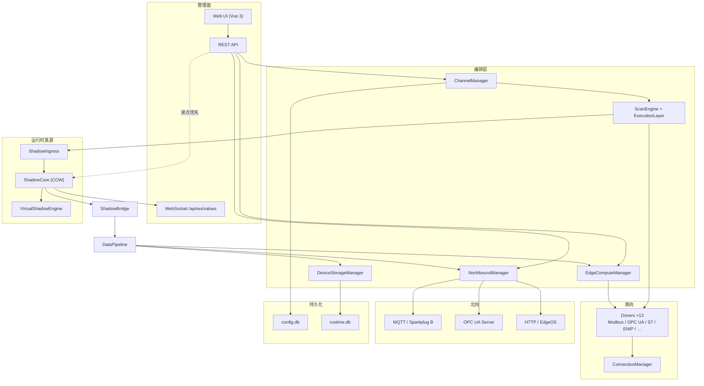
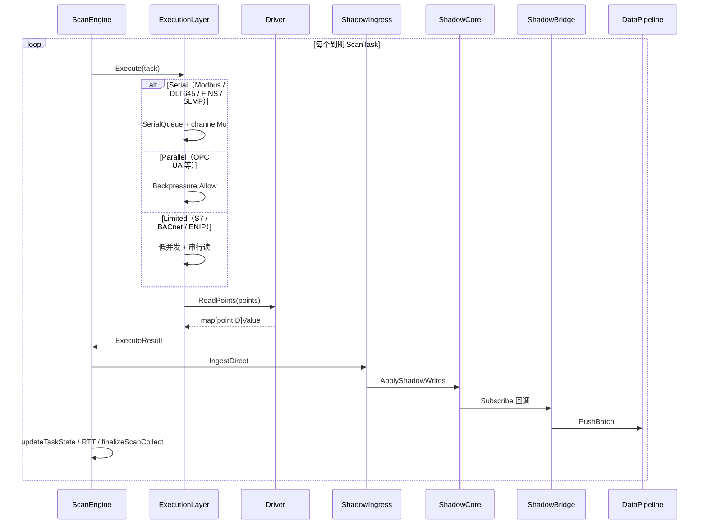
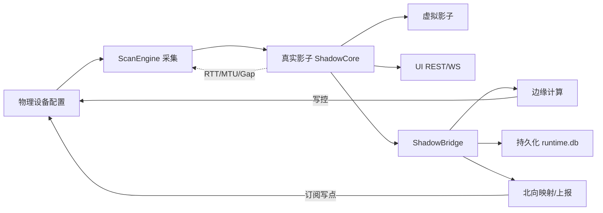

---

## layout: default
title: 边缘网关架构设计总览
description: EdgeX 系统总览、南向采集、影子设备热路径与工业级稳定性设计（权威架构文档）
version: v3.0
date: 2026-07-12
status: 现行

# 边缘网关架构设计总览

> **工程铁律：** 任何性能优化不得以牺牲稳定性为代价；任何架构优化不得增加系统恢复复杂度。

本文档是 EdgeX **运行时架构权威说明**，以 **影子设备（ShadowCore）** 为数据枢纽，梳理南向采集 → 影子 → 边缘计算 / 持久化 / UI → 北向上报的完整热路径。


| 相关文档                                                          | 说明                       |
| ------------------------------------------------------------- | ------------------------ |
| [影子设备设计](6.%20影子设备设计.html)                                    | Shadow 模型与 COW / Ingress |
| [影子设备系统联动关系](影子设备系统联动关系文档.html)                               | 组件关联细节                   |
| [南向驱动矩阵](../drivers/index.html)                               | 协议能力与覆盖率                 |
| [产品说明](../guide/产品说明.html) / [PRODUCT](../guide/PRODUCT.html) | 能力与价值                    |
| [用户手册](../guide/USER_MANUAL.html)                             | 部署与操作                    |
| [ScanEngine 重构方案](../TODO/ScanEngine重构方案.html)                | 调度内核规范                   |


---


## 1. 系统总览


### 1.1 设计原则

1. **配置唯一源**：`data/config.db`（bbolt）；运行时历史与缓存在 `data/runtime.db`。
2. **运行时真源**：纯内存 **ShadowCore**；REST / WebSocket 优先读影子。
3. **调度驱动采集**：**ScanEngine** 统一时间、资源、执行与任务状态；Driver 为纯执行（禁止内部 ticker / 自建重连循环）。
4. **统一扇出**：**ShadowBridge → DataPipeline** 承载边缘规则、北向推送、历史落库。
5. **统计 SLA 可观测**：`GET /api/diagnostics/scan-engine` + `sla_warnings` + UI 通道监控。


### 1.2 分层架构（Mermaid）




### 1.3 核心组件一览


| 组件                  | 路径                                       | 职责                                   |
| ------------------- | ---------------------------------------- | ------------------------------------ |
| ChannelManager      | `internal/core/channel_manager.go`       | 通道/设备/点位 CRUD、驱动生命周期、ScanEngine 任务注册 |
| ScanEngine          | `internal/core/scan_engine.go`           | EDF 调度、断路器、防饿死、自适应 throttle          |
| ExecutionLayer      | `internal/core/execution_layer.go`       | Serial / Parallel / Limited 执行 + 背压  |
| ShadowCore          | `internal/core/shadow_core.go`           | 内存影子 SoT、COW 读、订阅通知                  |
| ShadowIngress       | `internal/core/shadow_ingress.go`        | 采集批量写入（缓冲 + 定时 flush）                |
| ShadowBridge        | `internal/core/shadow_bridge.go`         | 影子变更 → Pipeline 扇出                   |
| DataPipeline        | `internal/core/pipeline.go`              | 异步批处理总线（每点最多缓冲 2 条）                  |
| VirtualShadowEngine | `internal/core/virtual_shadow_engine.go` | 公式派生虚拟设备                             |
| NorthboundManager   | `internal/core/northbound_manager.go`    | 北向客户端生命周期与推送                         |
| Drivers             | `internal/driver/*`                      | 协议 ReadPoints / WritePoints          |


---


## 2. 南向采集


### 2.1 采集流程（调度 → 执行 → 影子）




| 阶段  | 行为                                                      | 关键代码                      |
| --- | ------------------------------------------------------- | ------------------------- |
| 注册  | `StartChannel` → Connect → `registerDeviceToScanEngine` | `channel_manager.go`      |
| 调度  | 最小堆 + wake timer + 10ms fallback；EDF 出队                 | `scan_engine.go`          |
| 执行  | 按协议模式分发；`channelMu` 硬隔离共享链路                             | `execution_layer.go`      |
| 读点  | Driver 无状态 `ReadPoints`；Gap/MTU 块读分片                    | `internal/driver/*`       |
| 写入  | 采集主路径经 ShadowIngress；REST 写点可直写 ShadowCore              | `shadow_ingress.go`       |
| 状态  | `finalizeScanCollect`：链路级 vs 设备级错误隔离                    | `channel_device_state.go` |


### 2.2 连接、写入与重连


| 能力    | 实现                                                                           |
| ----- | ---------------------------------------------------------------------------- |
| 连接状态机 | Disconnected → Connecting → Connected → Retrying → Dead（`ConnectionManager`） |
| 重连    | 指数退避 + 冷却期；每日零点重置重试计数                                                        |
| 写入    | `ChannelManager` / 边缘动作 → Driver `WritePoints`；成功后可回写影子                      |
| 热配置   | 点位增删 → `restartDeviceLocked` 重注册 ScanTask，无需重启进程                             |


> 说明：多数驱动已走公共 ConnectionManager；OPC UA / EtherNet/IP 部分会话恢复逻辑仍在驱动内（见差距 G1）。


### 2.3 协议差异对比

注册来源：`cmd/main.go` 空白导入。覆盖率见 [南向驱动测试报告](../testing/南向驱动测试报告.html)。


| 协议              | 注册名                                                 | 执行模式     | 读特点                    | 写         | 发现/扫描              | 备注                     |
| --------------- | --------------------------------------------------- | -------- | ---------------------- | --------- | ------------------ | ---------------------- |
| Modbus TCP/RTU  | `modbus-tcp` / `modbus-rtu` / `modbus-rtu-over-tcp` | Serial   | Gap 块读合并；非法地址 24h SKIP | 是         | —                  | 点位冷却 `markPointFailed` |
| BACnet IP       | `bacnet-ip`                                         | Limited  | 对象属性读；故障隔离             | 是         | Scan + ScanObjects | 多设备隔离                  |
| OPC UA          | `opc-ua`                                            | Parallel | 订阅 / 分批 Read           | 是         | Scan + ScanObjects | 安全策略 + 凭证              |
| Siemens S7      | `s7`                                                | Limited  | DB/M/I/Q 区域读           | 是         | —                  | rack/slot              |
| EtherNet/IP     | `ethernet-ip`                                       | Limited  | CIP Tag / Class2 属性    | 是         | —                  | Logix Tag 路径           |
| Omron FINS      | `omron-fins`                                        | Serial   | TCP/UDP 区读             | 是         | —                  | 源/目的节点                 |
| SNMP            | `snmp`                                              | —        | GET/BULK               | 是         | ScanObjects        | v2c / v3 USM           |
| IEC 104         | `iec60870-5-104`                                    | —        | 总召唤 + 自发               | 单点遥控      | —                  | M1 已交付                 |
| DL/T645         | `dlt645`                                            | Serial   | 表地址 + DI               | 是         | —                  | 串口/TCP                 |
| Mitsubishi SLMP | `mitsubishi-slmp`                                   | Serial   | MC 3E                  | 是         | —                  | frame/network/station  |
| Profinet IO     | `profinet-io`                                       | —        | 槽位 IO                  | 是         | —                  | 可仿真                    |
| KNXnet/IP       | `knxnet-ip`                                         | —        | 组地址                    | 是         | 网关发现               | TCP/UDP                |
| EtherCAT        | `ethercat`                                          | —        | PDO + SDO              | PDO + SDO | 是                  | M1；可仿真主站               |


**Scan Class**：`fast`（~~100ms）/~~ `normal`~~（设备 Interval）/~~ `slow`~~（~~10s）——每设备可注册多任务，故障点可 `degrade_on_failure`。

---


## 3. 影子设备模型


### 3.1 三类设备对照


| 类型       | 标识                  | 数据来源                      | 持久化       | 用途            |
| -------- | ------------------- | ------------------------- | --------- | ------------- |
| **真实影子** | `shadow-{deviceID}` | 南向 `ReadPoints` → Ingress | 否（内存）     | UI/规则/北向统一读模型 |
| **物理设备** | Channel.Devices     | 配置 DB + 驱动连接              | config.db | 采集目标与点位定义     |
| **虚拟影子** | `virtual-{id}`      | 公式依赖真实影子                  | 配置在 DB    | 跨设备聚合、派生指标    |


```text
物理设备 (config) ──采集──► 真实影子 (ShadowCore) ──公式──► 虚拟影子
                              │
                              ├── WebSocket / REST（UI）
                              ├── ShadowBridge → Pipeline → 边缘规则 / 北向 / 历史
                              └── 通信画像（RTT / MTU / Gap）反哺调度与块读
```


### 3.2 生命周期

1. **创建**：设备注册到 ScanEngine 后，首次写入 Ingress 时惰性建立影子条目。
2. **更新**：`ApplyShadowWrites` 批量 COW 更新；仅变更点进入 Notify。
3. **通知**：固定 worker pool（默认 6）hash 分区，有界扇出。
4. **销毁**：设备删除 / 通道停止时移除任务与影子条目。
5. **重启恢复**：影子不落盘；进程重启后由 ScanEngine 重新填充（配置仍在 config.db）。


### 3.3 时间语义


| 字段             | 含义                     |
| -------------- | ---------------------- |
| `collected_at` | 驱动采集完成时间               |
| `updated_at`   | 影子写入时间                 |
| `timestamp`    | 兼容字段，等同 `collected_at` |


---


## 4. 数据热路径（最佳实践）


### 4.1 一句话路径

**南向 ReadPoints → ShadowIngress 批量落地 ShadowCore → ShadowBridge 扇出 DataPipeline → 边缘规则 / 历史落库 / 北向上报；UI 经 WebSocket/REST 直读影子。**

### 4.2 推荐落地步骤（Modbus 示例）

1. **建通道**：协议 `modbus-tcp`，配置 IP/Port/Timeout；执行模式自动为 Serial。
2. **建设备与点位**：Holding/Coil 地址规范化；合理设置 Interval 与 Scan Class。
3. **启通道**：`Connect` + 注册 ScanTask；观察 `GET /api/diagnostics/scan-engine`。
4. **确认影子**：UI 实时值或 REST 读点应命中影子（非驱动直读回退）。
5. **挂边缘规则**（可选）：阈值/表达式订阅 Pipeline；写控走 DeviceIO。
6. **挂北向**：MQTT / Sparkplug / OPC UA Server 映射影子点位；弱网依赖 NorthboundCache。
7. **历史**：设备存储策略 → `DeviceStorageManager` → runtime.db。


### 4.3 代码锚点


| 步骤        | 文件                                                                     |
| --------- | ---------------------------------------------------------------------- |
| 启动装配      | `cmd/main.go`（`wireShadowStack`）                                       |
| 调度执行      | `internal/core/scan_engine.go` · `execution_layer.go`                  |
| Modbus 块读 | `internal/driver/modbus/scheduler.go`（`readGroup` / `markPointFailed`） |
| ENIP Tag  | `internal/driver/ethernetip/scheduler.go`（`processTagValue`）           |
| 影子写入      | `internal/core/shadow_ingress.go` · `shadow_core.go`                   |
| 扇出        | `internal/core/shadow_bridge.go` · `pipeline.go`                       |
| 边缘        | `internal/core/edge_compute_manager.go`                                |
| 北向        | `internal/core/northbound_manager.go` · `internal/northbound/*`        |
| 历史        | `internal/core/device_storage_manager.go` · `internal/storage/*`       |


### 4.4 反模式（避免）

- 绕过 Shadow 直接让北向/规则订阅驱动回调（数据面分裂）。
- 在 Driver 内自建 ticker / 无限重试（破坏 ScanEngine SLA）。
- 无背压地向 Pipeline 同步阻塞推送（拖死采集环）。
- 把影子当历史库（影子仅内存；历史走 runtime.db / 北向缓存）。

---


## 5. 关联关系整体网络




| 链路       | 说明                                                   |
| -------- | ---------------------------------------------------- |
| 影子 ↔ UI  | Subscribe → WebSocket；`getDevicePoints` 优先影子         |
| 影子 ↔ 边缘  | Bridge → Pipeline → `EdgeComputeManager.handleValue` |
| 影子 ↔ 持久化 | Pipeline → Storage / DeviceStorageManager            |
| 影子 ↔ 北向  | Pipeline → NBM；OPC UA Server 可读 `GetShadowPoint`     |
| 虚拟 ↔ 真实  | VirtualShadowEngine 依赖图增量计算                          |
| 画像 ↔ 调度  | RTT 自适应降速；Gap/MTU 影响块读分片                             |


---


## 6. 工业级稳定性设计


| 维度        | 机制                                                    | 位置                                               |
| --------- | ----------------------------------------------------- | ------------------------------------------------ |
| **超时**    | 驱动/连接 timeout；任务执行可取消                                 | Driver + ExecutionLayer                          |
| **背压**    | Parallel：全局 512 / 单设备 8 / 限速；Pipeline 每点缓冲 ≤2         | `backpressure_controller.go` · `pipeline.go`     |
| **隔离**    | 每设备 Circuit Breaker；Serial 队列 + `channelMu`；链路/设备错误分离 | `circuit_breaker.go` · `channel_device_state.go` |
| **防饿死**   | 300s rescue + EDF miss 提权                             | `scan_engine.go`                                 |
| **抖动**    | hard jitter clamp；统计 SLA P95/P99                      | `scan_engine_edf`*                               |
| **幂等/合并** | Ingress 批量 apply；Pipeline 同点覆盖旧值                      | ShadowIngress · DataPipeline                     |
| **点位降级**  | 故障 Tag 冷却，不拖死同批                                       | `point_degradation_manager.go` · Modbus SKIPPED  |
| **快照恢复**  | 配置强一致落盘；影子重启后由采集重建                                    | config.db + ScanEngine                           |
| **断网补发**  | NorthboundCache / Store&Forward                       | `store_forward.go` · northbound cache            |
| **可观测**   | diagnostics · `sla_warnings` · 结构化日志 · UI 面板          | `scan_engine_metrics.go`                         |


**统计 SLA 门控（x86 mock，≤10k tag）**：lag P95 <100ms · drift <50ms · miss=0（稳态）· GC pause <20ms。详见 [SLA 运维手册](../deployment/sla_monitoring.html)。

---


## 7. 启动与配置闭环（简表）


| 阶段   | 入口                            | 结果                                                   |
| ---- | ----------------------------- | ---------------------------------------------------- |
| 安装   | `/api/install/*`              | 创建 config.db（Users/System/Server）                    |
| 启动   | `cmd/main.go`                 | Pipeline → CM+ScanEngine → ShadowCore → NBM → Server |
| CRUD | REST → Manager → `SaveConfig` | 热更新内存 + 写 DB                                         |
| 运行   | ScanEngine 周期                 | 影子填充 → Bridge 扇出                                     |


```text
API → Manager 内存更新 → saveFunc → ConfigManager.SaveConfig → config.db
```

---


## 8. 已知差距与演进


| ID  | 项                                        | 状态      |
| --- | ---------------------------------------- | ------- |
| G1  | OPC UA / ENIP 重连未完全统一到 ConnectionManager | 进行中     |
| G2  | 各协议 24h/72h 联机报告未全覆盖                     | Phase 2 |
| G3  | ARMv7 板端 P99 复验                          | 脚本就绪    |
| G4  | Scan Class UI 全面暴露                       | 代码已支持   |
| G5+ | Tag 数据库抽象、冗余 Failover、北向独立限频             | Q4 规划   |


路线图见 [ROADMAP](../ROADMAP.html)；发布门禁见 [RELEASE_GATE](../RELEASE_GATE.html)。

---


## 9. 文档与测试索引

- 驱动能力：[drivers/index.md](../drivers/index.md) · [index_en.md](../drivers/index_en.md)
- 热路径单测：`internal/core/channel_manager_hotpath_test.go`、`internal/driver/modbus/scheduler_hotpath_test.go`、`internal/driver/ethernetip/process_tag_test.go`
- 集成：`internal/core/shadow_pipeline_integration_test.go`
- 测试报告：[testing/南向驱动测试报告.md](../testing/南向驱动测试报告.md)

