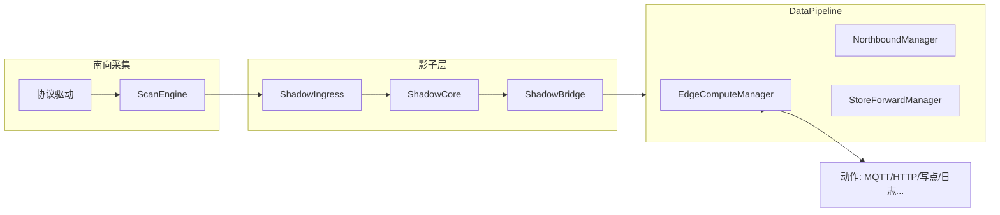

# 边缘计算基础功能

> **文档定位：** 规则引擎与数据流转说明。介绍 EdgeX 边缘计算的当前架构、数据闭环与规则执行能力。规则配置细节见 [边缘计算规则帮助](边缘计算规则帮助.html)；API 见 [边缘计算 API](../API/Edge_Computing_CN.html)。

| 项 | 内容 |
|----|------|
| 版本 | 与代码同步（2026-07） |
| 实现入口 | `cmd/main.go` · `internal/core/edge_compute_manager.go` |
| 配置存储 | `data/config.db` → `EdgeRules` 桶 |
| 运行时存储 | `data/runtime.db`（状态、窗口缓冲、失败重试、错误日志） |

---

## 一、能力概览

EdgeX 边缘计算在网关上提供**事件驱动的本地规则引擎**，与南向采集、影子设备、北向推送共用同一数据快照，实现：

1. **多源数据订阅** — 一条规则可绑定多个南向点位，用别名在表达式中引用
2. **四类规则** — Threshold / State / Window / Calculation
3. **动作链编排** — Log、设备写点、MQTT/HTTP 北向、Sequence、Delay、Check、Database
4. **防抖动与去重** — 状态维持（duration/count）、`on_change` 边沿触发
5. **可观测** — 规则运行时状态、引擎指标、错误日志与失败动作重试

> 规则由 **EdgeComputeManager**（Go + [expr-lang/expr](https://github.com/expr-lang/expr)）执行，**不是**独立的嵌入式 Pipeline Worker 进程。

---

## 二、总体架构

### 2.1 分层职责

| 层次 | 组件 | 职责 |
|------|------|------|
| 采集调度 | ScanEngine | EDF 优先级队列、熔断、自适应节流；驱动采集结果写入 Shadow |
| 影子快照 | ShadowCore | 南向点位统一快照；VirtualShadowEngine 可写入计算点位 |
| 数据管道 | ShadowBridge → DataPipeline | 影子变更扇出为 `model.Value`，供规则、北向、历史共用 |
| 规则引擎 | EdgeComputeManager | 索引匹配规则 → 调度器批处理 → Worker 池评估与执行动作 |
| 北向/存储 | NorthboundManager、StoreForward | 与规则并行消费 Pipeline，互不阻塞 |

** wiring 代码：** `cmd/main.go` 中 `wireShadowStack` 将 `ShadowBridge` 挂到 `ShadowCore`，`EdgeComputeManager.Start()` 注册 `handleValue` 为 Pipeline 处理器。

### 2.2 数据流（单点更新）

1. 驱动经 ScanEngine 完成采集 → ShadowIngress 合并写入 ShadowCore
2. ShadowBridge 订阅变更，批量 `Push` 到 DataPipeline
3. EdgeComputeManager 更新 `valueCache`，按 `channelID/deviceID/pointID` 索引查找关联规则
4. 满足 `check_interval` 后，任务进入 **edgeRuleScheduler**（默认 250ms 批窗口合并同规则触发）
5. Worker 池（10 协程）执行 `executeRule`：评估条件 → 状态维持 → 并行执行动作链

---

## 三、规则引擎核心机制

### 3.1 规则模型

规则结构定义于 `internal/model/types.go` 的 `EdgeRule`：

| 字段 | 说明 |
|------|------|
| `type` | `threshold` · `state` · `window` · `calculation` |
| `sources[]` | 数据源列表，含 `alias`、`channel_id`、`device_id`、`point_id` |
| `condition` | 布尔表达式（Threshold/State/Window 触发条件） |
| `expression` | 计算表达式（Calculation 类型） |
| `check_interval` | 评估周期，如 `500ms`、`5s`、`1m` |
| `trigger_mode` | `always`（默认）或 `on_change`（状态边沿才执行动作） |
| `priority` | 数值越大优先级越高；调度批内按优先级排序 |
| `state` | 可选 `{ duration, count }` 防抖动 |
| `window` | Window 类型：`size`、`interval`、`aggr_func` |
| `actions[]` | 动作链 |

**持久化：** Upsert 规则后写入 `config.db` 的 `EdgeRules` 桶；启动时 `LoadRules` 重建索引。

### 3.2 规则类型与评估逻辑

| 类型 | 评估方式 | 典型用途 |
|------|----------|----------|
| **threshold** | `condition` 为 true 时触发 | 越限告警、组合逻辑 |
| **state** | 与 threshold 相同 evaluator；配合 `state` 维持 | 持续异常才报警 |
| **window** | 缓冲样本 → 聚合 → 对聚合结果评估 `condition` | 滑动平均、变化率 |
| **calculation** | 每次周期执行 `expression`，成功即触发动作 | 派生指标、单位换算 |

**Window 聚合函数：** `avg`、`min`、`max`、`sum`、`count`、`rate`（Δ值/Δ秒）。

**运行时状态：** `NORMAL` → `WARNING`（维持中）→ `ALARM`；见 `RuleRuntimeState`。

### 3.3 调度与性能参数

| 参数 | 默认值 | 说明 |
|------|--------|------|
| 批窗口 | 250ms | 同规则多次触发合并为一次 |
| Worker 数 | 10 | 规则评估并发 |
| 任务队列 | 1000 | 满则丢弃并计数 `rules_dropped` |
| Pending 上限 | 5000 | 超限淘汰低优先级待调度任务 |
| 失败重试 | 30s 周期 | 仅 `mqtt`、`device_control`，最多 10 次 |

### 3.4 表达式环境

- 触发点：`value`
- 各源别名：如 `t1`、`p1`（缺失源为 `NaN`，比较结果为 false）
- 位运算：`bitget`、`bitset`、`bitand`、`bitor`、`bitxor`、`bitnot`、`bitshl`、`bitshr`
- 语法糖：`v.4` / `v.bit.4` 表示第 4 位（1-based）

> **注意：** UI 中的 `trigger_logic`（AND/OR）**当前未在引擎中实现**；多源逻辑请写在 `condition` 中，如 `t1 > 80 && p2 < 10`。UI 中 `window.type`（sliding/tumbling）为展示字段，引擎仅依据 `size`、`interval`、`aggr_func` 行为。

---

## 四、动作输出

支持的动作类型（`executeSingleAction`）：

| 类型 | 说明 |
|------|------|
| `log` | 写入网关日志 `[EdgeAction]` |
| `device_control` | 写南向点位；支持 `targets[]` 批量与 RMW 位表达式 |
| `mqtt` | 引用 `mqtt_config_id` 或内联 client，模板变量 `${alias}` |
| `http` | 引用 `http_config_id` 或内联 URL/body |
| `database` | 写入 runtime 桶（默认 `rule_events`） |
| `sequence` | 顺序执行 `steps[]` |
| `delay` | 等待 `duration` |
| `check` | 读点校验表达式，失败可执行 `on_fail[]` |

MQTT/HTTP 动作推荐使用 **`mqtt_config_id` / `http_config_id`** 引用已有北向配置（UI 模版字段 `mqtt_id` 保存时需对应为 `mqtt_config_id`）。

---

## 五、可观测与运维

### 5.1 运行时数据（runtime.db）

| 桶 | 内容 |
|----|------|
| `RuleState` | 各规则 `RuleRuntimeState` |
| `WindowData` | Window 规则样本缓冲 |
| `DataCache` | 失败动作重试队列 |
| `bblot` | 分钟级错误快照 |
| `edge_events` / `edge_failures` | 结构化错误事件 |

### 5.2 API 与 UI

- 规则 CRUD：`GET/POST /api/edge/rules`，`DELETE /api/edge/rules/:id`
- 运行时：`GET /api/edge/states`，`GET /api/edge/metrics`
- 日志：`GET /api/edge/logs`，`GET /api/edge/events`，`GET /api/edge/failures`
- UI：**边缘计算** 页签 — 规则列表、场景模版、记录与日志

### 5.3 与 ScanEngine 的关系

规则引擎**不直接调用驱动**；它消费 ShadowBridge 推送的 Pipeline 数据。采集 SLA（扫描滞后、漂移）由 ScanEngine 独立监控（`GET /api/diagnostics/scan-engine`）。规则 `check_interval` 应**不低于**相关点位的采集周期，避免空评估。

---

## 六、快速上手

1. 在南向通道中配置设备与点位，确认 Shadow 页可见实时值
2. **边缘计算 → 新建规则**，绑定数据源并设置别名
3. 选择规则类型，编写 `condition` 或 `expression`
4. 添加动作链（建议先用 `log` 验证，再加 MQTT/写点）
5. 启用规则，在「记录与日志」与 `/api/edge/states` 观察运行状态

**下一步阅读：**

- [边缘计算规则帮助](边缘计算规则帮助.html) — 配置详解
- [边缘计算最佳实践](../guide/EDGE_COMPUTING_BEST_PRACTICES.html) — 编排与性能
- [场景手册](EDGE_COMPUTING_SCENARIO_MANUAL.html) — 工业示例
- [边缘计算 API](../API/Edge_Computing_CN.html) — 自动化集成
