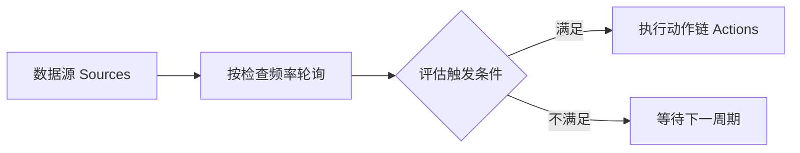
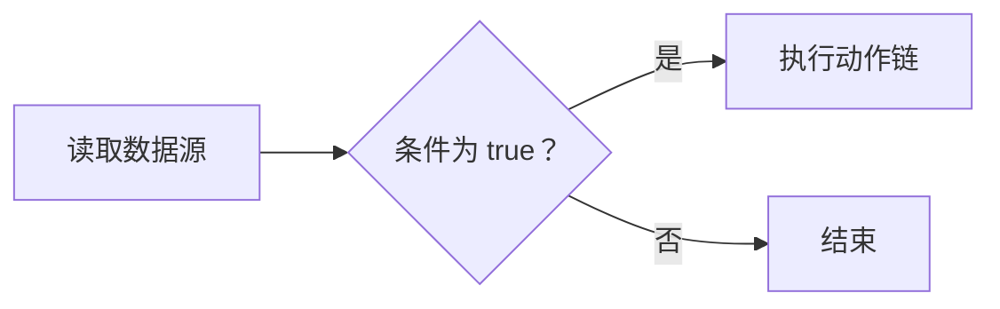
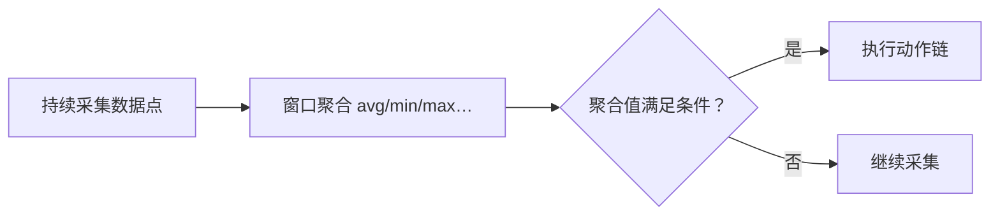
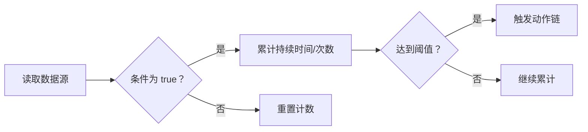
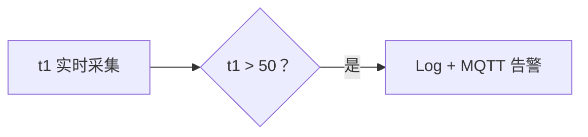
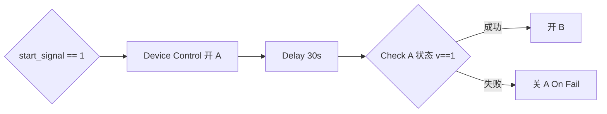
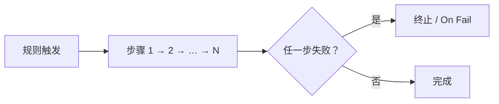
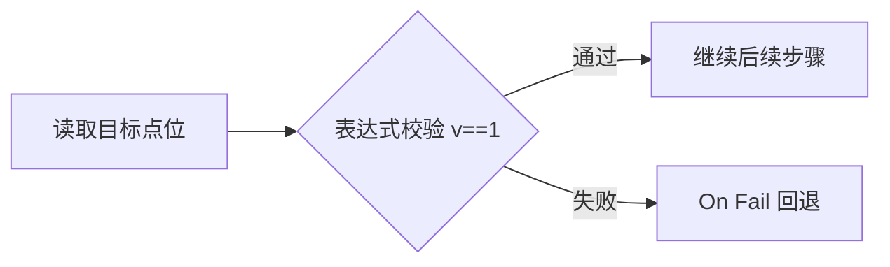

# 边缘计算规则帮助

> 规则类型、触发条件、动作链路与表达式语法说明，便于配置阈值报警、联动控制与数据计算。

| 项 | 内容 |
|----|------|
| 版本 | V1.0 |
| 更新 | 2026-07-05 |
| 适用 | EdgeCompute 规则管理界面 |
| UI 同步 | `ui/src/views/EdgeCompute.vue` · `ui/src/components/edge-compute/EdgeComputeHelpDrawer.vue` |
| 技术对照 | [边缘计算 Pipeline 配置指南](边缘计算Pipeline配置指南.html) · [优化升级 2.0 §8](../TODO/边缘计算优化升级2.0.html#8-功能对齐规则配置语义--pipeline-worker-映射) |

> **配置存储**：规则持久化于 bbolt（`config.db` → `EdgeRules`），**不使用 YAML**。保存后由 Pipeline Worker init 编译为 `pipeline_rules` / `pipeline_actions`。

---

## 基础概念

边缘计算规则由四部分组成：**数据源（Sources）**、**触发条件（Condition）**、**动作（Actions）** 与 **运行参数**（触发模式、检查频率、优先级）。



**示例**：温度点位别名 `t1`，每 5s 检查；条件 `t1 > 80` 满足时发送 MQTT 告警。

### 数据源 (Sources)

规则的输入变量。为每个源绑定南向点位（通道 / 设备 / 测点），并设置简短**别名**（如 `t1`、`p1`），以便在表达式中引用。

> **Pipeline 实现**：`point_bindings` 表将 `channel_id/device_id/point_id` 编译为 `SourceIdx`（uint32）；别名仅用于 init 表达式解析，热路径无字符串查找。

### 触发条件 (Condition)

返回 true/false 的**布尔表达式**。仅当条件满足时触发动作链（**Calculation 类型除外**）。

示例：`t1 > 80`、`bitget(v,3)==1`、`t1 > 80 && p1 < 10`。

> **Pipeline 实现**：init 编译为 `RuleSlot.op` + `threshold`（定点整数比较）；热路径禁止 runtime expr。

### 动作 (Actions)

规则触发后按顺序执行的**动作链**，可串联多个步骤（Log、MQTT、设备控制、Sequence 等）。

> **Pipeline 实现**：embedded 以 `ActionSlot` 单步或内联链为主；gateway 支持完整 `StepChain`（含 Delay、Check、On Fail）。

### 触发模式

| 模式 | 说明 |
|------|------|
| **始终触发**（always） | 每次检查满足条件即执行动作 |
| **仅状态改变时触发**（on_change） | 仅在 false→true 或 true→false **边沿**时执行，适合**告警去重** |

> **Pipeline 实现**：`on_change` → `RuleSlot.edge_trigger = true` + `Feedback.lastState` 记录上次状态。

### 检查频率

规则评估周期，如 `1s`、`5s`、`1m`。频率越高响应越快，CPU 占用也越高。

> **Pipeline 实现**：源级 `allow()` 节流 + 规则级 `RuleSlot.minInterval`（对应 UI `check_interval`）。

### 优先级

数值**越大优先级越高**；多条规则同时触发时按优先级排序执行。

> **Pipeline 实现**：init 时 `RuleTable.slots` 按 priority **降序排列**，`Match()` 返回首条命中。

---

## 规则类型详解

### Threshold（阈值触发）

当数据源数值满足布尔条件表达式时触发动作。最常用的规则类型。



**示例**：温度 `t1 > 80` → 发送 MQTT 告警到 `alarm/temp`。

| 项 | 说明 |
|----|------|
| **适用场景** | 温度/压力越限报警、开关量状态检测、多点位组合逻辑判断 |
| **核心配置** | 数据源 + 触发条件（如 `t1 > 80`） |
| **支持运算** | 数值比较（>、<、≥、≤、==、!=）、逻辑组合（&&、\|\|、!）、位操作（bitget、bitset、bitand、bitor） |
| **可选防抖动** | 在「状态维持」中设置持续时间或连续次数，避免瞬时波动误触发 |

> **Pipeline 实现**：`EvalSlot` Passthrough → `RuleSlot{op, threshold, actionIdx}` → `execute()`（control / stream / store 三类型之一）。

---

### Calculation（计算公式）

对输入数据执行数学表达式计算，输出派生值。每次检查周期都会执行计算。


**示例**：`t1` 为摄氏温度 → 计算 `t1 * 1.8 + 32` → MQTT 推送华氏温度。

| 项 | 说明 |
|----|------|
| **适用场景** | 单位换算（℃→℉）、能耗折算、多传感器加权平均、数据预处理 |
| **核心配置** | 数据源 + 计算公式（如 `t1 * 1.8 + 32`） |
| **支持运算** | 四则运算（+、-、*、/、%、^）、函数调用、复杂嵌套表达式 |
| **注意** | **无触发条件字段**；计算结果通过动作（如 MQTT 推送、数据库存储）输出 |

> **Pipeline 实现**：`EvalSlot{EvalFormula, InIdx, Coef}` 定点乘加（scale=1000）；结果写入 PointCache / 影子点，**不经过 Condition 触发链**。

---

### Window（时间/计数窗口）

在指定时间窗口或计数窗口内对数据进行聚合统计，再对聚合结果评估触发条件。



**示例**：最近 10s 温度平均值 `avg > 50` → 记录 Warn 日志。

| 项 | 说明 |
|----|------|
| **适用场景** | 滑动平均监控、峰值检测、流量速率统计、时段能耗汇总 |
| **窗口类型** | `sliding`（滑动窗口）/ `tumbling`（跳跃窗口） |
| **窗口大小** | 时间格式如 `10s`、`5m`，或计数格式如 `100` |
| **聚合函数** | `avg`、`min`、`max`、`sum`、`count`、`rate`（变化率） |
| **示例** | 窗口 `avg > 50` 表示最近 10 秒内平均值超过 50 时触发 |

> **Pipeline 实现**：`EvalSlot{EvalWindowAvg/Min/Max/Sum/Count/Rate, WindowN, buf[]}`；init 分配固定环形缓冲，runtime inline 累加，无 runtime 队列。

---

### State（状态持续）

当触发条件**持续满足**指定时间或**连续满足**指定次数后才触发动作，用于防抖动和持续异常检测。



**示例**：`t1 > 80` 连续 30s → 发送 Error 级日志与 MQTT 告警。

| 项 | 说明 |
|----|------|
| **适用场景** | 设备持续过热报警、振动异常持续检测、避免瞬时干扰触发 |
| **核心配置** | 触发条件 + 状态维持（持续时间 `duration` 或连续次数 `count`） |
| **持续时间** | 如 `30s` 表示条件需连续满足 30 秒才触发 |
| **连续次数** | 如 `5` 表示条件需连续 5 次检查均满足才触发 |
| **与 Threshold 区别** | Threshold 条件满足即触发（可配可选防抖）；State 以**持续时间为核心语义** |

> **Pipeline 实现**：`EvalSlot` debounce counter + 计时字段；满足 duration/count 后联动 `RuleSlot.match()`；状态存于 slot 字段（非 map）。

---

## 常见场景最佳实践

### 场景 A：简单越限报警 (Threshold)

**目标**：当温度 (`t1`) 超过 50 度时，记录日志并发送 MQTT 告警。



**示例**：`t1 = 52.3` → 条件成立 → Log(Warn) + MQTT(`alarm/temp`)

| 配置项 | 值 |
|--------|-----|
| 类型 | Threshold |
| 数据源 | 添加温度点位，别名设为 `t1` |
| 触发条件 | `t1 > 50` |
| 动作 | ① Log 级别 Warn「温度过高: ${t1}」② MQTT Topic「alarm/temp」 |

> **Pipeline 实现**：单条 `RuleSlot` + 多步 `ActionSlot`（store → stream）；建议 `trigger_mode: on_change` 告警去重。

---

### 场景 B：顺序联动控制 (Sequence Workflow)

**目标**：启动设备 A，等待 30 秒，确认 A 已启动后再启动设备 B；若 A 启动失败则回退关闭 A。



**示例**：`start_signal == 1` → 开 A → 等 30s → Check A → 开 B（失败则关 A）

| 配置项 | 值 |
|--------|-----|
| 类型 | Threshold（或 State） |
| 触发条件 | `start_signal == 1` |
| 动作 | Sequence → Device Control(A) → Delay 30s → Check(A) → Device Control(B) |

**注意**：Sequence 中 Check 失败且未在 On Fail 中处理时，整个序列终止，后续步骤不会执行。

> **Pipeline 实现**：gateway 完整 `StepChain` + `on_fail_idx`；embedded 建议拆为多条独立规则。

---

### 场景 C：批量设备控制 (Batch Control)

**目标**：一键关闭所有相关设备 (A, B, C)。


**示例**：手动触发 → 并行写入 A/B/C 开关点位 = 0

| 配置项 | 值 |
|--------|-----|
| 动作 | Device Control，开启 Batch Control |
| 目标列表 | 设备 A/B/C 开关点位，值均为 0 |

批量控制并行下发写入请求，响应速度优于连续单点控制。

> **Pipeline 实现**：init 展开为多步 `control` StepChain；Executor 按 channel 串行写，失败 counter 统计不阻塞 Worker。

---

### 场景 D：位运算与状态字控制 (Bitwise)

**目标**：仅修改状态字的第 4 位（置 1），保持其他位不变。

```mermaid
flowchart LR
  A[读取当前值 v] --> B[bitset(v, 4) 计算]
  B --> C[写入新值 RMW]
```

**示例**：读当前值 `v` → `bitset(v, 4)` → 写回（RMW）

| 配置项 | 值 |
|--------|-----|
| 动作 | Device Control |
| 表达式 | `bitset(v, 4)` 或 `v \| 8`（0-based index） |
| 说明 | 系统自动读取当前值 → 计算新值 → 写入（Read-Modify-Write） |
| RMW 机制 | 网关处理并发冲突，避免修改某位时覆盖其他位的同期变化 |

> **Pipeline 实现**：`EvalBitSet` opcode 序列 → `control` WritePoint；告警场景可用 `bitget(v,n)==1` 编译为 `EvalBitGet` + `RuleSlot{eq,1}`。

---

## 表达式语法参考


**示例**：

- 条件 `bitget(v, 3) == 1` 表示状态字第 4 位为 1 时触发
- 计算 `t1 * 1.8 + 32` 将摄氏度转为华氏度

| 符号 / 函数 | 含义 | 示例 |
|------------|------|------|
| `v` / `value` | 当前触发点位的实时值 | 单源 Threshold 中引用当前点 |
| `t1`, `p1` | 规则 Sources 中定义的别名 | `t1 > 80 && p1 < 100` |
| `bitget(v, n)` | 读取第 n 位（0-based），返回 0/1 | `bitget(v, 3) == 1` |
| `bitset(v, n)` | 将第 n 位置 1 | `bitset(v, 4)` 写回状态字 |
| `bitclr(v, n)` | 将第 n 位置 0 | `bitclr(v, 2)` |
| `bitand(a, b)` | 按位与 | `bitand(v, 0xFF)` |
| `bitor(a, b)` | 按位或 | `bitor(v, 8)` |

> **Pipeline 实现**：上述函数在 init 编译为 `EvalBitGet` / `EvalBitSet` / `EvalBitClr` / `EvalBitAnd` / `EvalBitOr` opcode；比较与逻辑编译为 `RuleSlot.op` 或多段 Eval。**embedded** 无法静态展开的复杂表达式请在 init 报错，或改用 Gateway Profile。

---

## 动作类型详解

Pipeline 底层将动作归纳为三类 Execute：**control**（南向写点）、**stream**（MQTT/HTTP 北向）、**store**（日志/bbolt 持久化）。

### Log（日志）

记录规则触发信息到系统日志。


**示例**：触发后写入 Warn 日志「温度过高: ${t1}」

| 配置 | 说明 |
|------|------|
| Level | 日志级别（Info / Warn / Error） |
| Message | 支持 `${v}` 或 `${alias}` 模板变量 |

> **Pipeline 实现**：`ActionSlot{kind: store}` → bbolt 分钟摘要 / 系统日志。

---

### Device Control（设备控制）

向设备写入值，支持单点、批量与表达式计算（含 RMW 位操作）。


**示例**：触发 → 计算 `bitset(v,4)` → 写入状态字点位

| 配置 | 说明 |
|------|------|
| 单点模式 | 直接控制一个点位 |
| 批量模式 | 同时控制多个点位，并行下发 |
| Expression | 可选，用于计算写入值（支持位操作 RMW） |

> **Pipeline 实现**：`ActionSlot{kind: control}` → `ChannelManager.WritePoint`。

---

### MQTT Push（MQTT 推送）

通过已配置的北向 MQTT 通道发送消息；Topic / Payload 支持 `${alias}` 模板变量。


**示例**：Topic `alarm/temp`，Payload「温度异常: ${t1}」

> **Pipeline 实现**：`ActionSlot{kind: stream, connector: mqtt-*}`。

---

### HTTP Push（HTTP 推送）

调用已配置的北向 HTTP 接口上报数据或触发外部系统。


**示例**：POST 北向 HTTP 接口，Body 携带 `${t1}`、`${p1}` 实时值

> **Pipeline 实现**：`ActionSlot{kind: stream, method, url}`。

---

### Database（存储）

将规则计算结果或触发数据写入本地数据库，便于历史查询与分析。


**示例**：计算结果 `avg_temp` 写入本地库，供历史趋势查询

> **Pipeline 实现**：`ActionSlot{kind: store}` → bbolt `config.db` 或本地库 bucket。

---

### Sequence（顺序执行）

严格按顺序执行子动作；任一步骤失败（如 Check 未处理 On Fail）则整个序列终止。



**示例**：开阀 → Delay 5s → Check 压力 → 开泵

> **Pipeline 实现**：gateway `StepChain[]` 预展开；embedded 简化为内联 control 链或建议拆规则。

---

### Delay（延时）

在 Sequence 中暂停指定时间后再执行后续步骤，常用于设备启动等待。


**示例**：Sequence 中开设备 A 后 Delay 30s 再 Check 状态

> **Pipeline 实现**：`StepChain.delay_ms`；embedded 为 ms 级 busy-wait，gateway 为独立 step。

---

### Check（校验）

读取目标点位并按表达式校验；支持重试与 On Fail 回退序列。



**示例**：读 A 状态 `v==1`，重试 3 次；失败执行 On Fail 关 A

| 配置 | 说明 |
|------|------|
| Expression | 校验公式（如 `v == 1`） |
| Retry | 失败重试次数与间隔 |
| On Fail | 校验最终失败后执行的回退动作序列 |

> **Pipeline 实现**：`StepChain.check_op` + `on_fail_idx`；**embedded 不支持**，请使用 Gateway Profile。

---

## 配置建议


**示例**：先配置 Threshold 越限告警并验证 MQTT 推送，确认无误后再叠加 Sequence 多步联动与 On Fail 回退。

1. **一规则一职责**：每条规则只负责一个具体功能，便于维护和排查。
2. **告警去重**：越限报警建议使用「仅状态改变时触发」，避免重复推送。
3. **防抖动**：对波动较大的传感器，使用 State 类型或设置持续时间/连续次数。
4. **复杂联动**：多步骤设备启停使用 Sequence + Check + On Fail 实现安全回退。
5. **性能优化**：非紧急规则使用较长检查频率（如 30s、1m）；合并功能相似的规则。
6. **定期维护**：禁用或删除不再使用的规则；通过「记录与日志」排查异常。

> **Pipeline 实现**：安全联锁设高 `priority`；非紧急规则拉长 `check_interval` 降低 `allow()` 频率；复杂 Sequence 在 embedded 拆多条 `RuleSlot` 以保证热路径零堆分配。

---

## 相关文档

- [边缘计算 Pipeline 配置指南](边缘计算Pipeline配置指南.html) — 用户配置 ↔ V2.2 Pipeline Worker 技术对照与 bbolt JSON 样例
- [边缘计算优化升级 2.0 §8](../TODO/边缘计算优化升级2.0.html#8-功能对齐规则配置语义--pipeline-worker-映射) — 完整映射表
- [ARMv7 参考实现 §6.3](../TODO/ARMv7工业控制内核 Go 参考实现.html) — RuleTable 预展开与 Go 结构
- [数据源与输出动作设计 §1.0](../architecture/数据源与输出动作设计.html) — 嵌入式 Profile

---

*维护：与 `EdgeComputeHelpDrawer.vue` 用户文案同步 · Pipeline 注释随 V2.2 Worker 演进更新*
