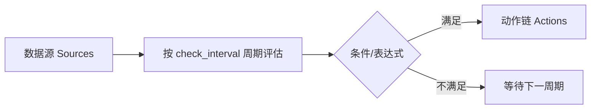

# 边缘计算规则帮助

> 规则类型、触发条件、动作链路与表达式语法说明。与 UI 帮助抽屉（`EdgeComputeHelpDrawer.vue`）内容一致，技术实现以 `internal/core/edge_compute_manager.go` 为准。

| 项 | 内容 |
|----|------|
| 适用 | EdgeCompute 规则管理界面 |
| 配置存储 | `data/config.db` → `EdgeRules`（JSON，非 YAML） |
| 表达式引擎 | [expr-lang/expr](https://github.com/expr-lang/expr) |

---

## 基础概念

边缘计算规则由四部分组成：**数据源（Sources）**、**触发条件（Condition/Expression）**、**动作（Actions）** 与 **运行参数**（触发模式、检查频率、优先级）。



**示例：** 温度别名 `t1`，每 `5s` 检查；条件 `t1 > 80` 满足时发送 MQTT 告警。

### 数据源 (Sources)

为每个源绑定 `channel_id` / `device_id` / `point_id`，并设置**别名**（如 `t1`）供表达式引用。引擎在 `valueCache` 中维护最新值，缺失源在表达式中为 `NaN`。

### 触发条件 (Condition)

布尔表达式。Threshold、State、Window 在条件为 true 时触发；**Calculation** 类型使用 `expression` 字段，每次周期计算成功即触发动作。

### 动作 (Actions)

规则触发后按配置顺序执行。顶层 `actions[]` 之间**并行**；`sequence` 动作内的 `steps[]` **串行**。

### 触发模式

| 模式 | 值 | 说明 |
|------|-----|------|
| 始终触发 | `always` | 每次评估满足条件即执行（默认） |
| 仅状态改变 | `on_change` | 仅在 `NORMAL↔ALARM` 边沿执行，适合告警去重 |

### 检查频率 (check_interval)

Go `time.ParseDuration` 格式：`500ms`、`1s`、`5s`、`1m`。引擎按源点位更新节流，同一规则两次评估间隔不低于此值。

### 优先级 (priority)

整数，**越大越优先**。调度器批 flush 时按 priority 降序 dispatch。

---

## 规则类型详解

### Threshold（阈值触发）

当 `condition` 为 true 时触发。最常用类型。

| 项 | 说明 |
|----|------|
| 适用 | 温度/压力越限、开关量、多点位组合 |
| 配置 | `sources` + `condition`，如 `t1 > 80` |
| 运算 | 比较、逻辑 `&&` `\|\|` `!`、位函数 |
| 防抖动 | 可选 `state: { duration: "10s", count: 3 }` |

**示例：** `t1 > 80` → MQTT 主题 `alarm/temp`。

### State（状态持续）

与 Threshold **共用同一评估器**；通常配合 `state` 维持使用。条件持续满足达到 `duration` 或连续 `count` 次后才进入 `ALARM` 并执行动作。

**示例：** 振动 `v1 > 5` 且 `state.count: 5`（连续 5 次）才告警。

### Window（窗口聚合）

先缓冲样本，再聚合，最后对聚合结果评估 `condition`。

| 字段 | 说明 |
|------|------|
| `window.size` | 时间窗如 `60s`，或计数窗如 `100` |
| `window.interval` | 聚合步长；未到步长 tick 仅缓冲不评估 |
| `window.aggr_func` | `avg` `min` `max` `sum` `count` `rate` |
| `condition` | 对聚合结果变量 `value` 判断，如 `value > 5` |

> UI 中 `window.type`（sliding/tumbling）**不影响引擎分支**；时间窗按 `size` 截断样本，计数窗保留最近 N 条。

**示例：** 60s 内振动 `avg`，`condition: value > 5 && rpm > 100`。

### Calculation（计算公式）

每次 `check_interval` 执行 `expression`，成功则触发动作（无需 condition）。

**示例：** `expression: (t1 + t2 + t3) / 3` → 写虚拟点位或 MQTT 上报。

---

## 状态维持 (StateConfig)

```json
"state": {
  "duration": "10s",
  "count": 3
}
```

- 仅设 `duration`：条件连续满足达到时长后触发
- 仅设 `count`：连续满足 N 次后触发
- 两者同时设：**先达到者**生效

适用于任何带 `state` 的规则类型，不仅限于 `type: state`。

---

## 表达式语法参考

### 变量

| 变量 | 含义 |
|------|------|
| `value` | 当前触发点位的数值 |
| 源别名 | `sources[].alias`，如 `t1`、`p1` |
| `v` | 用于 device_control / check 子表达式 |

### 位操作

| 函数 | 说明 |
|------|------|
| `bitget(val, pos)` | 取位（pos 为 0-based） |
| `bitset(val, pos, bit)` | 置位后返回新值 |
| `bitand` / `bitor` / `bitxor` / `bitnot` / `bitshl` / `bitshr` | 位运算 |

**语法糖：** `v.4` 或 `v.bit.4` → 第 4 位（1-based 输入，内部转 0-based）。

**示例：**

```
bitget(t1, 0) == 1 && t2 > 80
t1 * 1.8 + 32
bitset(v, 4)
```

> UI 帮助中的 `bitclr` **尚未实现**；清零请用 `bitset(v, pos, 0)`。

### 模板变量

动作 `message`、`body`、写点 `value` 支持 `${alias}` 或 `${value}`，由 `os.Expand` 替换。

---

## 动作类型详解

### log

```json
{ "type": "log", "config": { "level": "warn", "message": "温度 ${t1} 越限" } }
```

`level`: `debug` | `info` | `warn` | `error`。

### device_control

单点：

```json
{
  "type": "device_control",
  "config": {
    "channel_id": "ch1",
    "device_id": "dev1",
    "point_id": "coil_01",
    "value": "1",
    "expression": "bitset(v, 3)"
  }
}
```

- `expression` 存在时执行读-改-写（RMW）
- `targets[]` 可批量写多点
- `config.interval` 可限制单动作最小间隔

### mqtt

```json
{
  "type": "mqtt",
  "config": {
    "mqtt_config_id": "nb-mqtt-01",
    "topic": "edge/alarm/temp",
    "message": "{\"temp\":${t1}}",
    "send_strategy": "batch"
  }
}
```

### http

```json
{
  "type": "http",
  "config": {
    "http_config_id": "nb-http-01",
    "body": "{\"value\":${value}}"
  }
}
```

亦支持内联 `url`、`method`、`body`。

### database

```json
{ "type": "database", "config": { "bucket": "rule_events" } }
```

### sequence

```json
{
  "type": "sequence",
  "config": {
    "steps": [
      { "type": "device_control", "config": { "...": "..." } },
      { "type": "delay", "config": { "duration": "2s" } },
      { "type": "log", "config": { "level": "info", "message": "完成" } }
    ]
  }
}
```

### delay

```json
{ "type": "delay", "config": { "duration": "3s" } }
```

### check

写点后校验读回值：

```json
{
  "type": "check",
  "config": {
    "channel_id": "ch1",
    "device_id": "dev1",
    "point_id": "status",
    "expression": "v == 1",
    "retry": 3,
    "interval": "500ms",
    "timeout": "5s",
    "on_fail": [ { "type": "log", "config": { "level": "error", "message": "校验失败" } } ]
  }
}
```

---

## 配置建议

1. **一规则一职责** — 便于排查与启停
2. **告警去重** — 越限类用 `trigger_mode: on_change`
3. **防抖动** — 波动传感器加 `state.duration` 或 `state.count`
4. **复杂联动** — `sequence` + `delay` + `check` + `on_fail`
5. **性能** — 非紧急规则用 `30s`/`1m`；避免 hundreds 条规则共享极短 `check_interval`
6. **维护** — 定期清理禁用规则；通过「记录与日志」查看 `edge_events`

---

## 相关文档

- [边缘计算基础功能](边缘计算基础功能.html) — 架构与数据流
- [场景手册](EDGE_COMPUTING_SCENARIO_MANUAL.html) — 完整 JSON 示例
- [边缘计算 API](../API/Edge_Computing_CN.html) — 程序化配置
