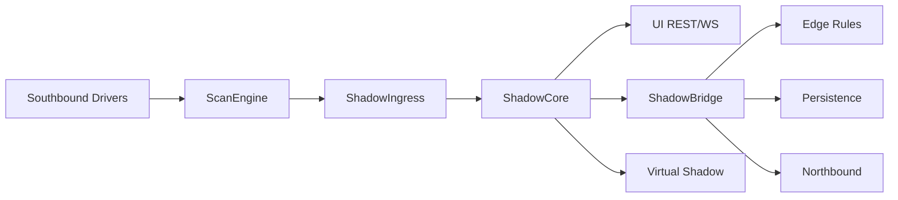

# Edge Gateway Architecture Overview

> **Engineering rule:** Never trade stability for performance; never increase recovery complexity for architectural cleverness.

> **中文权威版：** [边缘网关架构设计总览](../edge/边缘网关架构设计总览.html)

## 1. System overview

EdgeX is a **schedule-driven** industrial edge gateway:

1. **Config SoT** — `data/config.db` (bbolt); runtime history in `data/runtime.db`
2. **Runtime SoT** — in-memory **ShadowCore** (COW); REST/WebSocket prefer shadow reads
3. **Collection** — **ScanEngine** owns time, resources, and task state; drivers are pure executors
4. **Fan-out** — **ShadowBridge → DataPipeline** feeds edge rules, northbound publish, and history
5. **SLA** — `GET /api/diagnostics/scan-engine` + `sla_warnings` + UI channel metrics

## 2. Southbound collection

| Stage | Behavior | Code |
|-------|----------|------|
| Register | Connect + register ScanTasks | `channel_manager.go` |
| Schedule | Min-heap, EDF, anti-starvation, throttle | `scan_engine.go` |
| Execute | Serial / Parallel / Limited + `channelMu` | `execution_layer.go` |
| Read | `ReadPoints`; Gap/MTU batching | `internal/driver/*` |
| Write shadow | Ingress batch apply (collect path) | `shadow_ingress.go` |
| Status | Link vs device error isolation | `channel_device_state.go` |

### Protocol execution modes

| Mode | Protocols | Behavior |
|------|-----------|----------|
| Serial | Modbus, DL/T645, FINS, Mitsubishi SLMP | Per-device/channel queue + mutex |
| Parallel | OPC UA (and similar) | Backpressure (global/device/rate) |
| Limited | S7, BACnet IP, EtherNet/IP | Low concurrency + serial read |

Full capability matrix: [Driver Matrix (EN)](../drivers/index_en.html).

## 3. Shadow model

| Kind | ID | Source | Durable? |
|------|-----|--------|----------|
| Real shadow | `shadow-{deviceID}` | Southbound collect | No (memory) |
| Physical device | Channel.Devices | Config DB + driver | Yes |
| Virtual shadow | `virtual-{id}` | Formula over real shadows | Config yes |

Lifecycle: lazy create on first ingress → COW update → bounded notify pool → drop on device remove. After process restart, shadows refill from ScanEngine (config remains on disk).

## 4. Hot-path best practice

**ReadPoints → ShadowIngress → ShadowCore → ShadowBridge → DataPipeline → edge / history / northbound; UI reads shadow directly.**

1. Create channel + device + points (set Scan Class / interval)
2. Start channel; watch diagnostics SLA
3. Confirm UI/REST values come from shadow
4. Attach edge rules (optional) and northbound mappings
5. Enable device history policy if local TS needed

Avoid: bypassing Shadow for northbound/rules; driver-owned tickers; unbounded sync pushes into the pipeline.

## 5. Stability highlights

| Concern | Mechanism |
|---------|-----------|
| Timeout | Driver/connect timeouts; cancellable execute |
| Backpressure | Parallel limits; Pipeline ≤2 samples/point |
| Isolation | Per-device circuit breaker; serial queues |
| Anti-starvation | 300s rescue + EDF miss boost |
| Point degrade | Failed tags cooldown (e.g. Modbus SKIPPED) |
| Store & forward | NorthboundCache / store_forward |
| Observability | diagnostics + sla_warnings + UI |

## 6. Related links

- [中文架构总览](../edge/边缘网关架构设计总览.html)
- [Product Guide](../guide/PRODUCT.html) · [产品说明](../guide/产品说明.html)
- [User Manual](../guide/USER_MANUAL.en.html) · [用户手册](../guide/USER_MANUAL.html)
- [Southbound Test Report](../testing/southbound-driver-test-report.html)
