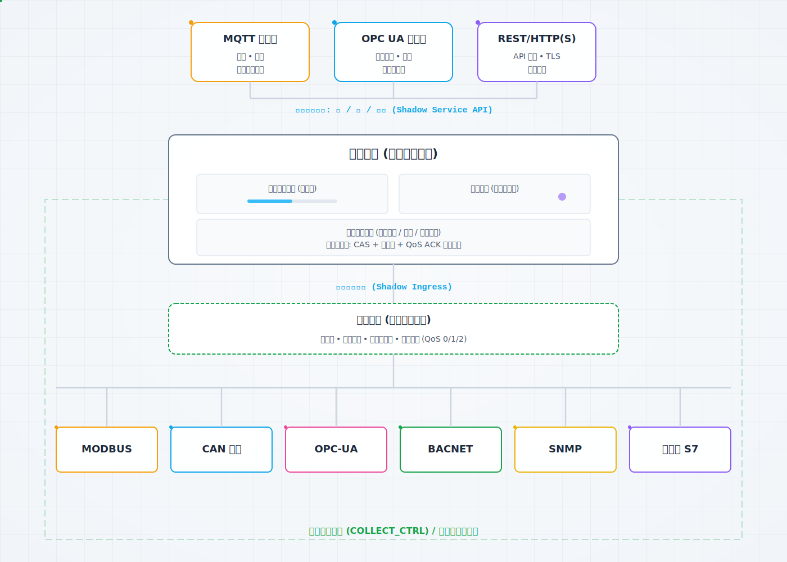
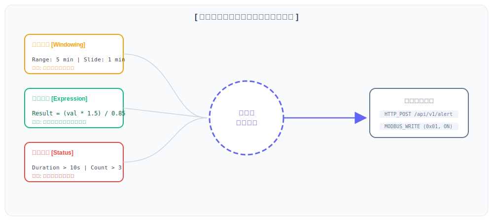
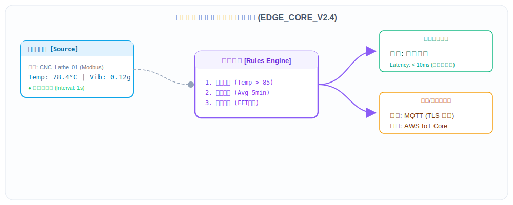
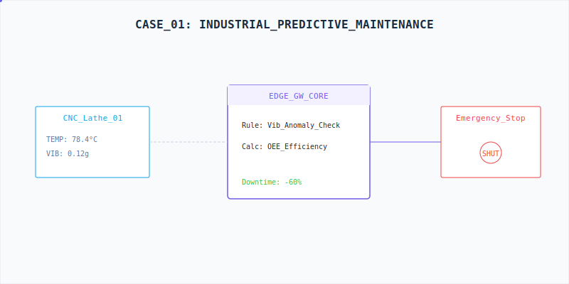
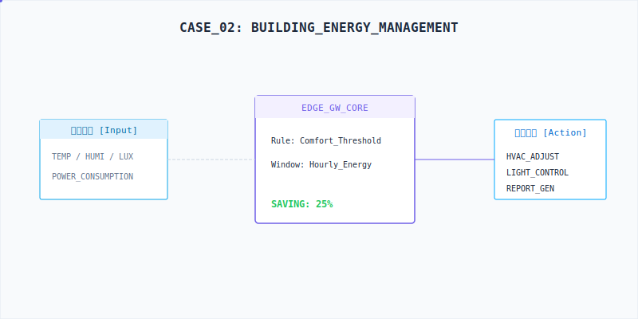
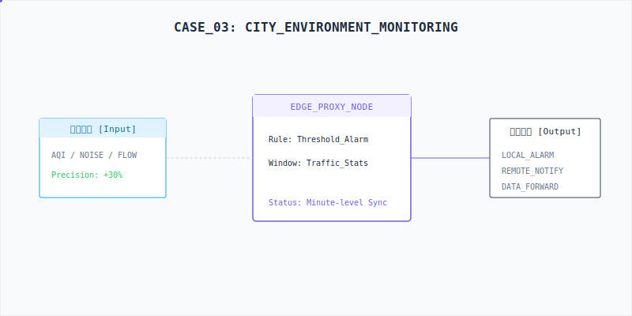

# 边缘计算最佳实践

## 目录

1. [概述](#概述)
2. [核心概念](#核心概念)
3. [实施步骤](#实施步骤)
4. [性能优化策略](#性能优化策略)
5. [安全防护措施](#安全防护措施)
6. [常见问题解决方案](#常见问题解决方案)
7. [成功案例分析](#成功案例分析)
8. [最佳实践建议](#最佳实践建议)
9. [附录](#附录)

---

## 概述

边缘计算作为一种分布式计算范式，正在越来越多地应用于工业自动化、物联网、智能城市等领域。本最佳实践文档旨在提供一套全面的指导，帮助用户在边缘网关系统中高效、安全地实施边缘计算。

<div align="center">
  
  <p><small>图 1: 边缘计算数据流程图</small></p>
</div>

### 边缘计算的优势

- **低延迟**：数据处理在本地进行，响应时间快
- **带宽节省**：减少数据传输量，降低网络成本
- **离线运行**：在网络中断时仍能正常工作
- **数据隐私**：敏感数据本地处理，减少数据泄露风险
- **可扩展性**：支持大规模设备部署

### 适用场景

- **实时监控与告警**：工业设备状态监控、环境参数监测
- **智能控制**：基于条件的自动控制、设备联动
- **数据预处理**：数据过滤、聚合、异常检测
- **预测性维护**：设备故障预测、维护周期优化

---

## 核心概念

### 规则类型

- **阈值规则**：基于设定的阈值触发动作
- **状态规则**：基于状态持续时间触发动作
- **窗口规则**：基于时间或计数窗口触发动作
- **计算规则**：基于计算公式结果触发动作

### 动作类型

- **设备控制**：控制设备的开关、参数等
- **MQTT 消息**：发送 MQTT 消息
- **HTTP 调用**：调用 HTTP 接口
- **本地告警**：触发本地告警
- **批量控制**：同时控制多个设备

### 数据流

1. **数据采集**：从设备采集原始数据
2. **数据预处理**：对数据进行过滤、转换等处理
3. **规则评估**：根据规则条件评估是否触发
4. **动作执行**：执行触发的动作
5. **数据转发**：将处理后的数据转发到云端或其他系统

---

## 实施步骤

### 1. 需求分析

#### 1.1 业务需求分析

- **明确监控目标**：确定需要监控的参数和指标
- **定义告警条件**：明确什么情况下需要触发告警
- **确定控制逻辑**：定义设备控制的逻辑和策略
- **评估数据量**：估算数据采集和处理的规模

#### 1.2 技术需求分析

- **硬件资源评估**：评估边缘设备的CPU、内存、存储等资源
- **网络带宽评估**：评估网络带宽和稳定性
- **延迟要求**：确定应用对响应时间的要求
- **可靠性要求**：确定系统的可靠性和可用性要求

### 2. 架构设计

<div align="center">
  
  <p><small>图 2: 边缘计算流程图</small></p>
</div>

#### 2.1 系统架构设计

- **分层架构**：数据采集层、数据处理层、边缘计算层、数据转发层
- **数据流设计**：数据从采集到处理再到转发的完整流程
- **模块划分**：明确各模块的职责和边界
- **接口设计**：设计模块间的接口和数据格式

#### 2.2 规则设计

- **规则类型选择**：根据业务需求选择合适的规则类型
- **规则优先级**：设置规则的执行优先级
- **规则依赖关系**：处理规则间的依赖关系
- **规则分组**：对规则进行合理分组，提高管理效率

### 3. 配置与部署

#### 3.1 设备配置

- **设备添加**：添加需要监控和控制的设备
- **数据点配置**：配置设备的数据点和采集参数
- **通信参数**：配置设备的通信参数和协议设置

#### 3.2 规则配置

<div align="center">
  
  <p><small>图 3: 边缘计算核心组件图</small></p>
</div>

- **规则创建**：创建边缘计算规则
- **条件配置**：配置规则的触发条件
- **动作配置**：配置规则触发后执行的动作
- **参数调优**：调整规则的参数以达到最佳效果

#### 3.3 系统配置

- **资源配置**：配置系统的CPU、内存等资源
- **存储配置**：配置数据存储和日志存储
- **网络配置**：配置网络连接和数据转发
- **安全配置**：配置系统的安全参数

### 4. 测试与验证

#### 4.1 功能测试

- **规则测试**：测试规则的触发条件和执行逻辑
- **动作测试**：测试规则触发后执行的动作
- **边界测试**：测试规则在边界条件下的表现
- **异常测试**：测试规则在异常情况下的处理能力

#### 4.2 性能测试

- **响应时间测试**：测试规则的响应时间
- **吞吐量测试**：测试系统的处理能力
- **资源使用测试**：测试系统的资源使用情况
- **稳定性测试**：测试系统在长时间运行下的稳定性

#### 4.3 集成测试

- **端到端测试**：测试整个系统的端到端流程
- **兼容性测试**：测试系统与其他系统的兼容性
- **回归测试**：确保修改不会破坏现有功能

---

## 性能优化策略

### 1. 规则优化

#### 1.1 规则设计优化

- **简化规则条件**：减少复杂的条件表达式
- **合并相似规则**：将功能相似的规则合并
- **优化规则顺序**：按照执行频率和复杂度排序规则
- **使用适当的规则类型**：根据业务需求选择合适的规则类型

#### 1.2 表达式优化

- **简化表达式**：减少表达式的复杂度
- **避免重复计算**：使用变量存储中间结果
- **使用高效函数**：选择执行效率高的函数
- **避免复杂逻辑**：减少嵌套的逻辑表达式

### 2. 系统优化

#### 2.1 资源优化

- **CPU 优化**：合理分配CPU资源，避免资源争用
- **内存优化**：优化内存使用，减少内存泄漏
- **存储优化**：合理配置存储，定期清理数据
- **网络优化**：优化网络传输，减少网络延迟

#### 2.2 数据处理优化

- **批量处理**：采用批量处理方式，减少处理开销
- **缓存策略**：合理使用缓存，减少重复计算
- **数据过滤**：在源头过滤不需要的数据
- **数据压缩**：对传输的数据进行压缩

#### 2.3 并发处理

- **并行执行**：合理利用多核CPU，并行执行规则
- **异步处理**：采用异步处理方式，提高系统吞吐量
- **队列管理**：使用消息队列，平衡系统负载
- **线程池**：合理配置线程池大小

### 3. 硬件优化

#### 3.1 硬件选择

- **CPU 选择**：根据计算需求选择合适的CPU
- **内存配置**：根据数据量配置足够的内存
- **存储选择**：选择高速存储设备
- **网络设备**：选择高性能网络设备

#### 3.2 硬件扩展

- **横向扩展**：增加设备数量，分散负载
- **纵向扩展**：升级设备硬件，提高单机性能
- **边缘节点部署**：在多个边缘节点部署计算任务
- **负载均衡**：在多个设备间均衡负载

---

## 安全防护措施

### 1. 系统安全

#### 1.1 访问控制

- **用户认证**：实施强密码策略和多因素认证
- **权限管理**：基于角色的权限控制，最小权限原则
- **访问审计**：记录所有系统访问和操作

#### 1.2 网络安全

- **网络隔离**：实施网络分段，隔离边缘设备网络
- **加密传输**：使用TLS/SSL加密所有网络通信
- **防火墙**：配置防火墙规则，限制网络访问

#### 1.3 数据安全

- **数据加密**：加密存储敏感数据
- **数据备份**：定期备份配置和数据
- **数据脱敏**：对敏感数据进行脱敏处理

### 2. 设备安全

#### 2.1 设备认证

- **设备身份验证**：实施设备身份认证机制
- **证书管理**：使用数字证书确保设备身份

#### 2.2 固件安全

- **固件更新**：定期更新设备固件
- **固件验证**：验证固件的完整性和真实性

### 3. 应用安全

#### 3.1 代码安全

- **代码审查**：定期进行代码审查
- **漏洞扫描**：使用工具扫描代码漏洞

#### 3.2 运行时安全

- **异常监控**：监控系统异常行为
- **入侵检测**：部署入侵检测系统

---

## 常见问题解决方案

### 1. 规则执行问题

#### 1.1 规则不触发

**问题描述**：配置的规则没有按照预期触发

**可能原因**：
- 规则条件设置错误
- 数据源没有数据
- 数据格式不匹配
- 规则被禁用

**解决方案**：
- 检查规则条件是否正确
- 检查数据源是否正常采集数据
- 检查数据格式是否符合规则要求
- 检查规则是否处于启用状态

#### 1.2 规则执行延迟

**问题描述**：规则触发后执行动作的延迟较大

**可能原因**：
- 系统负载过高
- 规则复杂度高
- 动作执行时间长
- 网络延迟

**解决方案**：
- 优化系统资源使用
- 简化规则条件
- 优化动作执行逻辑
- 检查网络连接

### 2. 数据问题

#### 2.1 数据采集失败

**问题描述**：无法从设备采集数据

**可能原因**：
- 设备连接失败
- 设备通信参数错误
- 设备故障
- 网络连接问题

**解决方案**：
- 检查设备连接状态
- 验证设备通信参数
- 检查设备是否正常运行
- 检查网络连接

#### 2.2 数据质量问题

**问题描述**：采集的数据质量差，有异常值

**可能原因**：
- 设备传感器故障
- 信号干扰
- 采集参数设置不当
- 数据传输错误

**解决方案**：
- 检查设备传感器
- 减少信号干扰
- 调整采集参数
- 检查数据传输链路

### 3. 系统问题

#### 3.1 系统性能下降

**问题描述**：系统运行速度变慢，响应时间变长

**可能原因**：
- CPU 使用率过高
- 内存不足
- 磁盘空间不足
- 进程过多

**解决方案**：
- 检查CPU使用情况，优化资源分配
- 增加内存或优化内存使用
- 清理磁盘空间
- 关闭不必要的进程

#### 3.2 系统崩溃

**问题描述**：系统突然崩溃，无法正常运行

**可能原因**：
- 硬件故障
- 软件 bug
- 资源耗尽
- 配置错误

**解决方案**：
- 检查硬件状态
- 查看系统日志，定位错误原因
- 增加系统资源
- 修正配置错误

### 4. 网络问题

#### 4.1 网络连接中断

**问题描述**：边缘设备与云端的网络连接中断

**可能原因**：
- 网络设备故障
- 网络配置错误
- 网络拥塞
- 外部网络问题

**解决方案**：
- 检查网络设备状态
- 验证网络配置
- 减少网络负载
- 联系网络服务提供商

#### 4.2 数据传输延迟

**问题描述**：数据从边缘设备传输到云端的延迟较大

**可能原因**：
- 网络带宽不足
- 网络拥塞
- 路由问题
- 数据量过大

**解决方案**：
- 增加网络带宽
- 优化数据传输
- 检查网络路由
- 减少数据传输量

---

## 成功案例分析

### 案例一：智能工厂设备监控

<div align="center">
  
  <p><small>图 4: 智能工厂设备监控架构</small></p>
</div>

#### 项目背景

制造企业拥有多条生产线，需要实时监控设备运行状态，及时发现设备异常，避免生产线停机造成的损失。

#### 解决方案

- **部署边缘网关**：在每个生产车间部署边缘网关
- **配置采集规则**：采集设备的温度、振动、电流等参数
- **设置边缘计算规则**：
  - 阈值规则：当温度超过阈值时触发告警
  - 状态规则：当振动持续异常时触发告警
  - 计算规则：计算设备运行效率和能耗
- **配置动作**：
  - 本地告警：在现场触发声光告警
  - 远程通知：通过短信和邮件通知运维人员
  - 设备控制：在紧急情况下自动停机

### 案例二：智能楼宇能源管理

<div align="center">
  
  <p><small>图 5: 智能楼宇能源管理架构</small></p>
</div>

#### 项目背景

某商业楼宇需要优化能源使用，降低能耗成本，同时确保舒适的室内环境。

#### 解决方案

- **部署边缘网关**：在楼宇各楼层部署边缘网关
- **配置采集规则**：采集温度、湿度、光照、能耗等数据
- **设置边缘计算规则**：
  - 阈值规则：当温度超出舒适范围时调整空调
  - 窗口规则：统计不同时段的能耗情况
  - 计算规则：计算能源使用效率
- **配置动作**：
  - 设备控制：自动调整空调、照明等设备
  - 数据转发：将汇总数据发送到云端
  - 报表生成：生成能耗分析报表

### 案例三：智能城市环境监测

<div align="center">
  
  <p><small>图 6: 智能城市环境监测架构</small></p>
</div>

#### 项目背景

某城市需要实时监测空气质量、噪音、交通流量等环境参数，为城市管理提供决策依据。

#### 解决方案

- **部署边缘网关**：在城市各个监测点部署边缘网关
- **配置采集规则**：采集空气质量、噪音、交通流量等数据
- **设置边缘计算规则**：
  - 阈值规则：当空气质量超标时触发告警
  - 窗口规则：统计不同时段的交通流量
  - 计算规则：预测空气质量变化趋势
- **配置动作**：
  - 本地告警：在监测点显示告警信息
  - 远程通知：向相关部门发送告警信息
  - 数据转发：将数据发送到城市管理平台

---

## 最佳实践建议

### 1. 规则设计建议

- **保持规则简洁**：每个规则只负责一个具体功能
- **合理设置优先级**：根据业务重要性设置规则优先级
- **使用规则分组**：按功能或设备类型对规则进行分组
- **定期审查规则**：定期检查和优化规则配置

### 2. 系统配置建议

- **合理分配资源**：根据规则数量和复杂度分配系统资源
- **定期备份配置**：定期备份规则和系统配置
- **监控系统状态**：实时监控系统的资源使用情况
- **设置合理的日志级别**：避免过多的日志影响系统性能

### 3. 部署建议

- **分阶段部署**：先在小规模环境测试，再逐步扩展
- **监控部署效果**：部署后持续监控系统性能和稳定性
- **文档化部署过程**：记录部署过程和配置参数
- **建立回滚机制**：确保在出现问题时能够快速回滚

### 4. 维护建议

- **定期更新系统**：及时更新系统软件和固件
- **定期检查设备**：检查设备的运行状态和健康状况
- **培训维护人员**：培训维护人员熟悉系统操作和故障处理
- **建立故障处理流程**：建立标准化的故障处理流程

---

## 附录

### 性能基准测试

| 测试项 | 标准值 | 最佳值 |
| :--- | :--- | :--- |
| 规则响应时间 | < 20ms | < 10ms |
| 数据处理吞吐量 | > 1000 条/秒 | > 5000 条/秒 |
| CPU 使用率 | < 50% | < 30% |
| 内存使用率 | < 60% | < 40% |

### 推荐配置

#### 硬件配置

| 场景 | CPU | 内存 | 存储 | 网络 |
| :--- | :--- | :--- | :--- | :--- |
| 小型场景 | 双核 1GHz | 2GB | 16GB | 100Mbps |
| 中型场景 | 四核 2GHz | 4GB | 32GB | 1Gbps |
| 大型场景 | 八核 3GHz | 8GB+ | 64GB+ | 1Gbps+ |

### 配置示例

#### 规则配置示例

```yaml
- id: temperature-monitoring
  name: 温度监控
  type: threshold
  enable: true
  priority: 1
  check_interval: "5s"
  trigger_mode: "on_change"
  sources:
    - alias: temp
      channel_id: modbus-tcp-1
      device_id: sensor-1
      point_id: temperature
      point_name: 温度
  condition: temp > 80
  actions:
    - type: device_control
      config:
        interval: "1s"
        targets:
          - channel_id: modbus-tcp-1
            device_id: fan-1
            point_id: speed
            point_name: 风扇速度
            value: "100"
```

#### 系统配置示例

```yaml
# 边缘计算系统配置
edge_compute:
  # 规则引擎配置
  engine:
    # 最大并发数
    max_concurrency: 4
    # 规则执行超时时间
    timeout: "10s"
  # 存储配置
  storage:
    # 数据存储路径
    data_path: "/var/lib/edgex/data"
    # 日志存储路径
    log_path: "/var/log/edgex"
  # 网络配置
  network:
    # MQTT 服务器配置
    mqtt:
      broker: "localhost:1883"
      topic: "edgex/events"
```
