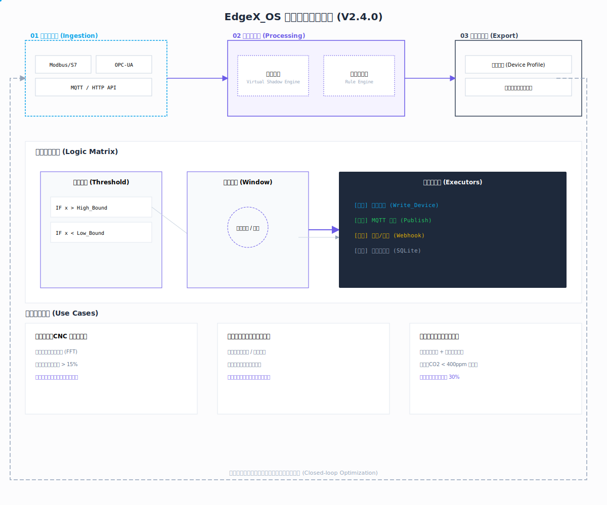

# 边缘网关用户手册

## 目录

1. [简介](#简介)
2. [系统架构](#系统架构)
3. [快速开始](#快速开始)
4. [南向采集](#南向采集)
5. [北向数据共享](#北向数据共享)
6. [边缘计算](#边缘计算)
7. [系统管理](#系统管理)
8. [故障排查](#故障排查)
9. [附录](#附录)

---

## 简介

边缘网关是一个集成了数据采集、边缘计算、数据转发等功能的边缘设备管理平台。本用户手册旨在帮助用户快速了解和使用边缘网关的各项功能。

<div align="center">
  
  <p><small>图 1: 边缘计算数据流程图</small></p>
</div>

### 主要功能

- **多协议数据采集**：支持 Modbus、BACnet、OPC UA、MQTT 等多种工业协议
- **边缘计算**：支持阈值告警、状态管理、窗口计算等边缘智能分析
- **数据转发**：支持 MQTT、HTTP 等多种北向数据转发方式
- **设备管理**：支持设备的添加、编辑、删除和监控
- **系统监控**：提供系统运行状态、资源使用情况的监控

---

## 系统架构

边缘网关采用分层架构设计，主要包括以下层次：

1. **数据采集层**：负责从各种设备和系统中采集数据
2. **数据处理层**：负责数据的清洗、转换和边缘计算
3. **数据转发层**：负责将处理后的数据转发到云端或其他系统
4. **应用服务层**：提供用户界面和 API 接口
5. **系统管理层**：负责系统的配置、监控和维护

系统数据流：
```
设备 → 数据采集 → 数据处理 → 边缘计算 → 数据转发 → 云端/本地系统
```

---

## 快速开始

### 系统要求

- **硬件要求**：
  - CPU：至少 1GHz 双核处理器
  - 内存：至少 2GB RAM
  - 存储：至少 16GB 存储空间
  - 网络：支持以太网或 Wi-Fi

- **软件要求**：
  - 操作系统：Linux (Ubuntu 20.04+) 或 Windows 10+
  - 浏览器：Chrome 80+、Firefox 75+、Safari 13+

### 安装步骤

1. **下载安装包**：从官方网站下载适合您系统的安装包
2. **安装系统**：按照安装向导的提示完成安装
3. **启动服务**：安装完成后，系统会自动启动相关服务
4. **访问界面**：打开浏览器，输入 `http://<设备IP>:8080` 访问管理界面
5. **登录系统**：使用默认用户名和密码登录（默认：admin/admin）

### 初始配置

1. **修改默认密码**：登录后，立即修改默认密码以确保系统安全
2. **配置网络**：根据您的网络环境配置网络参数
3. **添加设备**：添加您需要管理的设备和数据源
4. **配置规则**：根据业务需求配置边缘计算规则
5. **设置转发**：配置数据转发目标和参数

---

## 南向采集

### 支持的协议

- **Modbus**：支持 RTU、TCP 模式
- **BACnet**：支持 IP、MS/TP 模式
- **OPC UA**：支持标准 OPC UA 协议
- **MQTT**：支持作为 MQTT 客户端接收数据
- **HTTP**：支持通过 HTTP API 接收数据

### 设备管理

1. **添加设备**：
   - 进入「设备管理」页面
   - 点击「添加设备」按钮
   - 选择协议类型并填写设备信息
   - 点击「保存」完成添加

2. **编辑设备**：
   - 在设备列表中找到需要编辑的设备
   - 点击「编辑」按钮
   - 修改设备信息
   - 点击「保存」完成编辑

3. **删除设备**：
   - 在设备列表中找到需要删除的设备
   - 点击「删除」按钮
   - 确认删除操作

### 数据点管理

- **自动发现**：支持自动发现设备的数据点
- **手动添加**：支持手动添加数据点
- **数据点映射**：支持数据点的重命名和类型映射
- **采集频率**：支持设置数据点的采集频率

---

## 北向数据共享

### 支持的转发方式

- **MQTT**：支持将数据发布到 MQTT  broker
- **HTTP**：支持将数据推送到 HTTP 服务器
- **WebSocket**：支持通过 WebSocket 推送数据
- **本地存储**：支持将数据存储到本地数据库

### 配置步骤

1. **添加转发通道**：
   - 进入「北向数据」页面
   - 点击「添加通道」按钮
   - 选择转发类型并填写配置信息
   - 点击「保存」完成添加

2. **配置数据模板**：
   - 选择需要转发的数据点
   - 配置数据格式和转换规则
   - 设置转发条件和频率

3. **测试连接**：
   - 点击「测试连接」按钮
   - 检查连接状态和数据传输情况

---

## 边缘计算

### 概念

边缘计算是指在靠近数据源的边缘设备上进行数据处理和分析的技术。通过边缘计算，可以：

- **降低延迟**：数据处理在本地进行，减少网络传输时间
- **节省带宽**：只将有价值的数据传输到云端
- **提高可靠性**：即使在网络中断的情况下也能正常工作
- **增强安全性**：敏感数据可以在本地处理，减少数据泄露风险

### 架构

边缘计算模块采用分层架构：

1. **数据输入层**：接收来自数据源的实时数据
2. **数据管道层**：缓冲和分发数据到规则引擎
3. **规则执行层**：执行各类边缘计算规则
4. **结果处理层**：处理规则执行结果并触发相应动作
5. **状态管理层**：管理规则的运行状态和持久化

### 规则类型

#### 1. 阈值规则（Threshold）

基于设定的阈值条件触发动作，支持：
- 数值比较（>、<、≥、≤、==、!=）
- 逻辑组合（&&、||、!）
- 位操作（bitget、bitset、bitand、bitor）

#### 2. 计算规则（Calculation）

对输入数据进行计算处理，支持：
- 数学运算（+、-、*、/、%、^）
- 函数调用
- 复杂表达式

#### 3. 窗口规则（Window）

基于时间窗口或计数窗口进行统计分析，支持：
- 滑动窗口
- 跳跃窗口
- 统计函数（平均值、最大值、最小值、总和等）

#### 4. 状态规则（State）

基于持续状态进行判断，支持：
- 持续时间条件
- 连续次数条件
- 状态变化触发

### 动作类型

#### 1. 设备控制（device_control）

控制设备的开关、调节等操作，支持：
- 单点控制
- 批量控制
- 表达式计算值

#### 2. 日志记录（log）

记录规则触发情况和相关数据

#### 3. 工作流动作

- **序列执行（sequence）**：按顺序执行多个动作
- **延迟（delay）**：延迟指定时间执行动作
- **条件检查（check）**：根据条件决定是否继续执行

### 配置步骤

1. **添加规则**：
   - 进入「边缘计算」页面
   - 点击「添加规则」按钮
   - 选择规则类型并填写规则信息
   - 配置触发条件和动作
   - 点击「保存」完成添加

2. **编辑规则**：
   - 在规则列表中找到需要编辑的规则
   - 点击「编辑」按钮
   - 修改规则信息
   - 点击「保存」完成编辑

3. **启用/禁用规则**：
   - 在规则列表中找到需要操作的规则
   - 点击「启用」或「禁用」按钮

4. **测试规则**：
   - 点击「测试」按钮
   - 输入测试数据
   - 查看规则执行结果

### 监控与调试

- **规则状态**：查看规则的当前状态和执行情况
- **执行日志**：查看规则的执行历史和详细日志
- **性能监控**：查看规则的执行时间和资源使用情况
- **故障诊断**：查看规则执行失败的原因和错误信息

### 应用场景

1. **设备监控与告警**：
   - 温度、湿度等环境参数监控
   - 设备运行状态监控
   - 异常情况及时告警

2. **智能控制**：
   - 基于条件的自动控制
   - 设备联动控制
   - 节能优化控制

3. **数据预处理**：
   - 数据过滤和清洗
   - 数据聚合和统计
   - 异常数据检测

4. **预测性维护**：
   - 设备故障预测
   - 维护周期优化
   - 备件管理优化

---

## 系统管理

### 用户管理

- **添加用户**：创建新的系统用户
- **编辑用户**：修改用户信息和权限
- **删除用户**：删除不需要的用户
- **权限管理**：设置用户的操作权限

### 系统配置

- **网络配置**：配置网络参数和连接
- **系统参数**：配置系统运行参数
- **存储配置**：配置数据存储参数
- **安全配置**：配置系统安全参数

### 系统监控

- **资源监控**：监控 CPU、内存、磁盘使用情况
- **服务状态**：监控系统服务的运行状态
- **网络状态**：监控网络连接和数据传输情况
- **日志管理**：查看系统日志和操作记录

### 备份与恢复

- **数据备份**：备份系统配置和数据
- **配置导出**：导出系统配置
- **恢复系统**：从备份恢复系统

---

## 故障排查

### 常见问题

1. **设备连接失败**：
   - 检查设备电源和网络连接
   - 检查设备地址和端口配置
   - 检查设备是否正常运行

2. **数据采集异常**：
   - 检查设备通信状态
   - 检查数据点配置
   - 检查采集频率设置

3. **规则执行失败**：
   - 检查规则条件配置
   - 检查数据源状态
   - 检查动作配置

4. **数据转发失败**：
   - 检查网络连接
   - 检查转发目标配置
   - 检查数据格式配置

### 诊断工具

- **Ping 测试**：测试网络连接
- **设备扫描**：扫描可用设备
- **日志查看**：查看系统和应用日志
- **性能分析**：分析系统性能问题

### 技术支持

- **在线文档**：访问官方文档获取帮助
- **技术论坛**：参与技术论坛讨论
- **支持热线**：联系技术支持热线
- **远程协助**：请求远程技术支持

---

## 附录

### 术语表

| 术语 | 解释 |
| ---- | ---- |
| 边缘计算 | 在靠近数据源的边缘设备上进行数据处理和分析的技术 |
| 南向采集 | 从设备采集数据的过程 |
| 北向转发 | 将数据发送到云端或其他系统的过程 |
| 规则引擎 | 执行边缘计算规则的核心组件 |
| 数据管道 | 处理和传输数据的通道 |
| 阈值规则 | 基于设定阈值触发动作的规则 |
| 状态规则 | 基于持续状态判断的规则 |
| 窗口规则 | 基于时间或计数窗口的规则 |

### 快捷键

| 操作 | 快捷键 |
| ---- | ---- |
| 保存 | Ctrl + S |
| 取消 | Esc |
| 复制 | Ctrl + C |
| 粘贴 | Ctrl + V |
| 搜索 | Ctrl + F |

### 版本历史

| 版本 | 日期 | 变更内容 |
| ---- | ---- | ---- |
| v1.0 | 2026-03-27 | 初始版本 |

