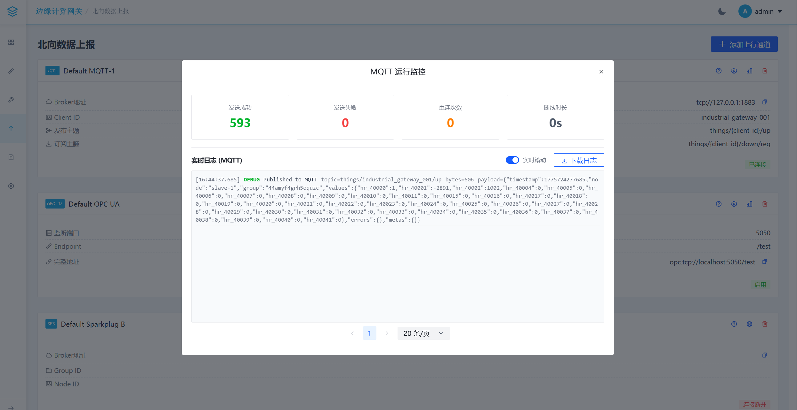

# Industrial Edge Gateway 产品说明

## 目录

1. [简介](#简介)
2. [主要特性](#主要特性)
3. [技术栈](#技术栈)
4. [快速开始](#快速开始)
5. [API 概览](#api-概览)
6. [配置结构](#配置结构)
7. [更新记录](#更新记录)
8. [License](#license)

---

## 简介

Industrial Edge Gateway 是一个轻量级的工业边缘计算网关，旨在连接工业现场设备（南向）与云端/上层应用（北向），并提供本地边缘计算能力。项目采用 Go 语言开发后端，Vue 3 开发前端管理界面。

<div align="center">
  
  <p><small>图 1: 数据流向示意图</small></p>
</div>

---

## 主要特性

### 智能采集优化 (Smart Collection Optimization)

<div align="center">
  
  <p><small>ScanEngine 调度驱动架构</small></p>
</div>

> **Edgex V2.0 架构 · ScanEngine 统一调度**：12 种南向驱动经 ScanEngine 写入影子设备实时快照，再联通虚拟设备、边缘计算与北向接口。

基于设备画像的自适应采集系统，实现南向通信的智能优化：

**核心优势：**
- **自适应参数**：无需手动配置，系统自动学习最优采集参数
- **效率提升**：批量读取优化，减少通信次数，提升吞吐量
- **稳定性增强**：智能心跳保活，快速故障检测与自动恢复
- **可观测性**：完整的设备画像与性能统计，支持运行监控

**核心组件：**

| 组件 | 技术原理 | 优化目标 |
| :--- | :--- | :--- |
| **RTT 管理器** | 采用 EWMA 算法实时监测设备往返延迟，动态计算最优超时阈值 | 避免超时设置不当导致的通信失败，实现超时参数自适应 |
| **MTU 管理器** | 自动探测设备最大传输单元，智能协商单次通信数据包大小 | 在保证可靠性前提下最大化数据吞吐量，提升批量采集效率 |
| **Gap 优化器** | 基于设备负载状态与响应特性，动态调整通信请求时间间隔 | 实现采集效率与设备负载的最佳平衡，提升总线通信效率 |
| **影子设备系统** | 统一内部数据模型，支持真实/虚拟影子设备，纯内存运行时快照 | 提供数据一致性校验；重启后由采集引擎重建 |
| **智能画像** | 自动学习设备 RTT、MTU、稳定性等特征参数 | 为每个设备建立通信画像，支持智能决策 |
| **采集调度器** | 基于设备画像优化采集顺序，支持批量读取优化 | 提升整体采集效率，降低通信开销 |

### 轻量级部署 (Lightweight Deployment)

单文件部署，零依赖，多架构支持，适合各种边缘计算场景：

**核心优势：**
- **单文件部署** → 一个可执行文件搞定，无需安装
- **零依赖** → 不需要额外安装任何库或环境
- **多架构支持** → ArmV7、Arm32/64、X86/64 全覆盖
- **轻量级** → 128MB内存就能跑，1GB存储空间

**硬件要求：**

| 配置项 | 最低配置 | 推荐配置 |
| :--- | :--- | :--- |
| **内存** | 128MB | 512MB+ |
| **存储** | 1GB | 4GB+ |
| **CPU** | 单核 | 双核+ |

**适用设备：**
- 树莓派（全系列）
- 工业网关（Arm/X86）
- 虚拟机/云主机
- 嵌入式设备

### 南向采集协议 (Southbound)

> Driver matrix: [设备驱动](../drivers/index.html) · [Test Report](../testing/southbound-driver-test-report.html)

| Protocol | Registry Key | Status | Description |
| :--- | :--- | :--- | :--- |
| **Modbus TCP / RTU / RTU Over TCP** | `modbus-tcp`, `modbus-rtu`, `modbus-rtu-over-tcp` | Production | simonvetter/modbus; MTU probe, exponential backoff, 24h cooldown |
| **BACnet IP** | `bacnet-ip` | Production | Discovery, object scan, batch-read fallback, fault isolation |
| **OPC UA Client** | `opc-ua` | Production | Read/write, subscription, Scan/ScanObjects, auto-reconnect |
| **Siemens S7** | `s7` | Production | S7-200Smart/1200/1500/300/400; DB, I/Q, M, T, C areas |
| **EtherNet/IP (ODVA)** | `ethernet-ip` | Production | Rockwell PLCs; Tag batch read via anviod/ethernet-ip |
| **Omron FINS (TCP/UDP)** | `omron-fins` | Production | anviod/fins; CIO/D/W/H/EM areas; TCP/UDP dual mode |
| **SNMP v2c/v3** | `snmp` | Production | Community / USM; OID bulk collect; ScanObjects |
| **IEC 60870-5-104** | `iec60870-5-104` | M1 delivered | General interrogation, spontaneous report, single command |
| **DL/T645-2007** | `dlt645` | Implemented | Protocol implementation; 17 unit tests |
| **Mitsubishi SLMP** | `mitsubishi-slmp` | Production | MC Protocol; 7 unit tests |
| **Profinet IO** | `profinet-io` | Implemented | DCP/RPC I/O modules; local interface binding; 6 unit tests |
| **KNXnet/IP** | `knxnet-ip` | Production | Gateway discovery; group address read/write; TCP/UDP; 10 unit tests |

### 北向上报协议 (Northbound)

| 协议 | 状态 | 说明 |
| :--- | :--- | :--- |
| **MQTT** | 已交付 | 支持自定义 Topic、Payload 模板，支持批量点位映射与反向控制 |
| **Sparkplug B** | 已交付 | 支持 NBIRTH, NDEATH, DDATA 消息规范 |
| **OPC UA Server** | 已交付 | 基于 `awcullen/opcua` 实现，支持多种认证方式，支持双向互通 |

### 边缘计算与管理

- **规则引擎**: 内置轻量级规则引擎，支持 `expr` 表达式进行逻辑判断和联动控制
- **日志系统**: 支持 WebSocket 实时推送、历史日志查询与 CSV 导出
- **可视化管理**: 基于 Vue 3 + Vuetify 的现代化 UI，支持通道监控、点位管理、登录安全等功能
- **配置管理**: 采用模块化 YAML 配置，支持热重载（部分）
- **离线支持**: 前端依赖已优化，支持完全离线局域网运行

---

## 边缘计算指南

<div align="center">
  
  <p><small>图 2: 虚拟影子引擎示意图</small></p>
</div>

本网关内置强大的边缘计算引擎，支持基于规则的本地联动控制，特别针对工业位操作进行了深度优化。

### 1. 表达式语法

规则引擎兼容 `expr` 语言，并扩展了工业场景专用的语法糖：

**基础变量：**
- `v`: 当前点位的实时值 (Value)

**位操作增强：**
支持 1-based (v.N) 和 0-based (v.bit.N) 两种风格：

| 语法/函数 | 索引方式 | 说明 | 等效函数 |
| :--- | :--- | :--- | :--- |
| **`v.N`** | **1-based** | 获取第 N 位 (从1开始) | `bitget(v, N-1)` |
| **`v.bit.N`** | **0-based** | 获取第 N 位 (索引从0开始) | `bitget(v, N)` |

**内置位运算函数：**
- `bitget(v, n)`: 获取第 n 位 (0/1)
- `bitset(v, n)`: 将第 n 位置 1
- `bitclr(v, n)`: 将第 n 位置 0
- `bitand(a, b)`, `bitor(a, b)`, `bitxor(a, b)`, `bitnot(a)`
- `bitshl(v, n)` (左移), `bitshr(v, n)` (右移)

### 2. 智能写入机制 (Read-Modify-Write)

当对寄存器进行位操作写入时，网关采用 RMW (读-改-写) 机制，确保不破坏其他位的状态。

**流程：**
1. **Read**: 驱动读取当前点位完整值
2. **Modify**: 根据公式计算新值
3. **Write**: 将新值写入设备

### 3. 工作流引擎 (Workflow Engine)

<div align="center">
  
  <p><small>图 3: 边缘流示意图</small></p>
</div>

规则引擎支持高级工作流编排：
- **Sequence (序列)**: 按顺序执行一系列动作
- **Delay (延时)**: 在动作之间插入等待时间
- **Check (检查)**: 验证某个条件是否满足

<div align="center">
  
  <p><small>图 4: 边缘核心示意图</small></p>
</div>

---

## 技术栈

### 后端: Go 1.25+
- Web 框架: [Fiber](https://github.com/gofiber/fiber)
- MQTT: [Paho MQTT](https://github.com/eclipse/paho.mqtt.golang)
- Modbus: [simonvetter/modbus](https://github.com/simonvetter/modbus)
- OPC UA: [gopcua/opcua](https://github.com/gopcua/opcua)
- 表达式引擎: [expr](https://github.com/expr-lang/expr)

### 前端: Vue 3
- 构建工具: Vite
- UI 库: Vuetify 3
- 路由: Vue Router 4
- HTTP 客户端: Axios

---

## 快速开始

### 前置要求
- [Go](https://go.dev/dl/) 1.25+
- [Node.js](https://nodejs.org/) 16+ (仅用于编译前端)

### 1. 启动后端

```bash
# 获取依赖
go mod tidy

# 运行网关
go run cmd/main.go

# 或者指定配置目录
go run cmd/main.go -conf ./conf/
```

### 2. 编译前端

```bash
cd ui

# 安装依赖
npm install

# 编译生产环境代码
npm run build
```

访问 `http://localhost:8082` (默认端口) 即可进入管理界面。  
默认账号见 `conf/users.yaml`（admin / passwd@123）。

### 3. 设备扫描与点位管理（BACnet）
- 通道页面进入设备 → 点位列表 → 点击"扫描点位"即可从设备读取对象列表
- 勾选后点击"添加选定点位"，系统将以 `Type:Instance` 地址批量注册
- 发现流程：优先单播 WhoIs，失败后进行多网口广播；仍失败时使用配置地址回退构造设备并标记为离线

### 4. OPC UA 服务端指南

**安全连接：**
- 默认启用 `Basic256Sha256` (SignAndEncrypt) 安全策略
- 自动生成有效期 10 年的自签名证书
- 支持 `admin` / `admin` (默认) 登录

**双向互通：**
- **数据上报**: 所有南向通道采集的数据自动映射到 OPC UA 地址空间
- **反向控制**: 支持客户端直接修改点位值，网关自动透传写入指令至底层设备

---

## API 概览

所有 API 需要携带认证头：`Authorization: Bearer <token>`

| 功能 | API | 方法 |
| :--- | :--- | :--- |
| 扫描通道设备 | `/api/channels/:channelId/scan` | POST |
| 扫描设备对象 | `/api/channels/:channelId/devices/:deviceId/scan` | POST |
| 获取点位列表 | `/api/channels/:channelId/devices/:deviceId/points` | GET |
| 添加点位 | `/api/channels/:channelId/devices/:deviceId/points` | POST |
| 更新点位 | `/api/channels/:channelId/devices/:deviceId/points/:pointId` | PUT |
| 删除点位 | `/api/channels/:channelId/devices/:deviceId/points/:pointId` | DELETE |
| 实时数据订阅 | `/api/ws/values` | GET |
| 获取边缘计算日志 | `/api/edge/logs` | GET |
| 导出边缘计算日志 | `/api/edge/logs/export` | GET |

---

## 配置结构

配置文件已拆分为模块化 YAML 文件，位于 `conf/` 目录：

- `server.yaml`: HTTP 服务器端口、静态资源路径
- `channels.yaml`: 南向通道及设备配置
- `northbound.yaml`: 北向 MQTT/SparkplugB 配置
- `edge_rules.yaml`: 边缘计算规则配置
- `system.yaml`: 系统级网络配置
- `users.yaml`: 用户账号管理
- `storage.yaml`: 数据库路径配置

**示例（BACnet 通道片段）：**

```yaml
id: bac-test-1
protocol: bacnet-ip
config:
  interface_port: 47808
devices:
  - id: "2228316"
    enable: true
    interval: 2s
    config:
      device_id: 2228316
      ip: 192.168.3.112
      port: 47808
    points:
      - id: AnalogInput_0
        name: Temperature.Indoor
        address: AnalogInput:0
        datatype: float32
        readwrite: R
```

---

## 更新记录

### 🕒 最近更新

- **2026-06**:
  - **SNMP v2c/v3 & Omron FINS drivers released**
  - **Profinet IO & KNXnet/IP drivers**: I/O module access and building automation gateway integration
  - **IEC 60870-5-104 M1**: general interrogation, spontaneous report, remote control
  - **Southbound driver test report**: unit tests, benchmarks, boundary scenario matrix
  - **ConnectionManager**: unified connection state machine across all production drivers

- **2026-02-25**:
  - **点位管理增强**: 实现点位批量删除功能，支持基于搜索关键词和质量状态的响应式实时过滤
  - **Modbus 稳定性优化**: 增加非法数据地址自动检测与 24 小时长冷却机制

- **2026-02-24**:
  - **TCP 链路深度监控**: 增加本地 IP:端口、远程 IP:端口、链接时长及最后断开时间显示
  - **链路展示优化**: 前端显示优化为直观的 `本地 -> 远程` 连接模式

- **2026-02-20**:
  - **Modbus 智能 MTU 探测**: 自动探测并保存从站支持的最大寄存器数量
  - **Modbus 指数退避重连**: 优化连接策略，避免网络抖动时的频繁重连尝试

---

## 📸 界面预览 (Gallery)

### 概览与系统

#### 登录页


#### 首页监控


#### 系统设置


### 南向采集 (BACnet / OPC UA)

#### 通道列表


#### 通道监控指标


#### BACnet 设备发现


#### BACnet 设备发现结果


#### BACnet 点位扫描


#### OPC UA模型扫描


#### OPC UA模型扫描结果


#### OPC UA数据订阅


#### OPC UA数据转换


### 边缘计算

#### 计算监控


#### 规则配置


#### 边缘计算规则支持类型


#### 边缘计算规则支持动作类型


#### 规则帮助手册


#### 规则日志


### 北向数据

#### 北向总览


#### MQTT 监控


#### MQTT 手册


---

## License

Mozilla Public License 2.0 (MPL-2.0)