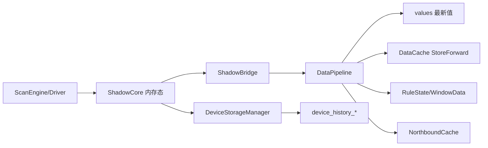
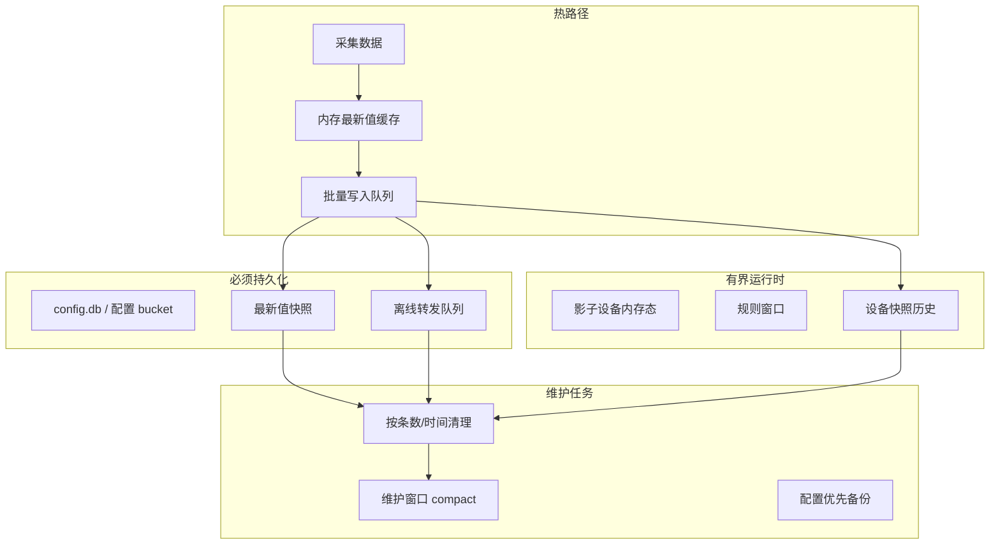

# 当前存储策略审查与 ARMv7 工业化优化方案

| 项 | 内容 |
|----|------|
| 适用范围 | EdgeX 工业网关在 ARMv7、低内存、eMMC/SD 卡等弱资源设备上的运行时存储 |
| 当前状态 | 已实施双数据库拆分：`data/config.db`（配置）+ `data/runtime.db`（运行时），底层为 bbolt |
| 目标 | 降低写放大、控制空间增长、提升掉电恢复能力，并保留工业现场可维护性 |
| 建议优先级 | 高 |

---

## 1. 结论摘要

当前存储方案已经比早期 YAML 运行时写入更集中：配置数据以 `data/config.db` 为唯一权威数据源，运行时数据存储在 `data/runtime.db`，`conf/` 仅用于首次安装或升级导入。这一方向是正确的，适合嵌入式设备减少文件散落和配置双写。

但在 ARMv7 等弱资源设备上，当前方案仍有明显的运行时写放大风险：

- 高频采集值经 `DataPipeline` 后，每个点位都会触发 `SaveValue` 独立 bbolt 事务。
- `StoreForwardManager` 会把每个采集值再次写入 `DataCache`，且每次写入后扫描缓存做 prune。
- 设备历史的 `realtime` 策略会在每个点位更新时异步保存整设备快照（应改为从影子设备读取全量点位后定时落盘）。
- bbolt 删除数据后文件不会自动变小，缺少在线 compact / 离线 vacuum 策略。
- 配置保存采用 `SaveAllConfig` 全量重写，配置规模大时会拖慢 API 保存并与采集写事务竞争。

工业现场推荐采用“配置库稳定、实时值内存优先、缓存批量落盘、历史分级保留、维护窗口压缩”的方案，而不是把所有运行时事件都逐条写入同一个 bbolt 文件。

---

## 2. 当前存储策略审查

### 2.1 主存储组件

| 组件 | 当前职责 | 关键文件 |
|------|----------|----------|
| `storage.Storage` | 运行时数据、最新值、缓存、历史、北向离线消息 | `internal/storage/boltdb.go` |
| `storage.ConfigStore` | Server、Channels、Devices、Northbound、EdgeRules、System、Users 等配置 | `internal/storage/config_store.go` |
| `config.ConfigManager` | 从 DB 加载配置、保存配置 | `internal/config/config.go` |
| `DataPipeline` | 采集数据合并、分发 handler、批量 handler | `internal/core/pipeline.go` |
| `StoreForwardManager` | 南向缓存与北向离线缓存 | `internal/core/store_forward.go` |
| `ShadowCore` | 每物理设备一个影子设备，内存态实时维护全量点位与通信画像，不落盘 | `internal/core/shadow_core.go` |
| `DeviceStorageManager` | 从影子设备读取点位做全量快照，写入 `device_history_*`，每设备最多 1000 条 | `internal/core/device_storage_manager.go` |

### 2.2 当前 bucket 分类

| 类型 | Bucket | 特点 |
|------|--------|------|
| 配置 | `ConfigVersion`、`Server`、`Channels`、`Devices`、`Northbound`、`EdgeRules`、`System`、`Users` | 重启必须恢复，不应随意清理 |
| 最新值 | `values` | 按 `PointID` 覆盖写，逻辑上不无限增长 |
| 缓存 | `DataCache`、`NorthboundCache` | 离线转发或缓存，必须有硬上限和过期策略 |
| 规则运行时 | `RuleState`、`WindowData` | 可恢复但不是长期历史 |
| 历史 | `device_history_{deviceID}` | 影子点位全量快照，按设备动态 bucket，每设备最多 1000 条 |

### 2.3 高频写入路径



当前实际压力点不在“是否使用 bbolt”，而在“高频数据是否逐点、逐事务、重复落盘”。

---

## 3. ARMv7 弱资源设备风险

### 3.1 写放大

1. 最新值、StoreForward、设备历史可能对同一批采集数据形成多份落盘（影子设备本身不落盘，仅内存态）。
2. `SaveValue` 每个点位一次事务，点位规模上来后 bbolt 单写事务会成为瓶颈。
3. `StoreForwardManager.cacheSouthbound()` 每个点位写一次 `DataCache`，随后 `pruneSouthbound()` 全表扫描计数并删除。
4. `DeviceStorageManager` 的 `realtime` 策略会在每次点位更新时保存整设备快照，极易把“实时采集”变成“实时写盘”。

### 3.2 空间增长

1. bbolt 删除 key 后不会自动缩小 DB 文件，长期运行后逻辑数据变小但文件仍可能很大。
2. JSON 存储易读，但对 CPU、磁盘空间和 GC 都不友好。
3. 动态 bucket `device_history_{deviceID}` 在设备多时会增加 bucket 元数据和统计扫描成本。
4. 整库备份、整库导出需要额外空间，弱资源设备可能无法承受“双份数据库 + JSON 导出文件”。

### 3.3 CPU 与内存

1. 配置保存 `SaveAllConfig` 会重写全部配置，设备和点位多时 marshal 成本高。
2. `ExportDB` / `ValidateDB` 会把 bucket 数据复制进内存，现场大库存在 OOM 风险。
3. `GetBucketStats()` 逐 bucket 遍历所有 key 统计大小，不适合作为高频监控接口。
### 3.4 掉电与文件系统

1. 当前 bbolt 打开参数使用 `NoGrowSync: true`，有利于性能，但掉电时对最近扩展页面的耐受性需要结合文件系统验证。
2. eMMC/SD 卡随机写能力弱，频繁小事务会降低寿命并造成长尾延迟。
3. 工业现场经常存在异常断电，不能只追求吞吐，还要保证配置、最后状态、离线消息可恢复。

---

## 4. 工业化目标架构

推荐将存储分为四类，不再用同一种写入策略处理全部数据。



### 4.1 分层策略

| 层级 | 数据 | 建议策略 |
|------|------|----------|
| L0 内存热数据 | 影子设备（每设备一个，全量点位 + 通信画像）、最新点位值、短期指标 | 纯内存，重启后由采集重建 |
| L1 关键持久化 | 配置、用户、系统设置、北向离线消息 | 强一致写入，低频事务，明确备份 |
| L2 可恢复运行时 | RuleState、WindowData | 批量写入，启动可重建 |
| L3 历史与审计 | 设备快照历史（影子点位全量）、规则日志、诊断日志 | 默认分钟级采样，每设备最多 1000 条 |
| L4 运维产物 | 备份、导出、compact 临时文件 | 只在维护窗口执行，必须检查剩余空间 |

---

## 5. 推荐存储方案

### 5.1 配置与运行时拆分（已实现）

当前已实现双数据库方案，配置数据与运行时数据分别存储在两个 bbolt 文件：

| 文件 | 数据 | 写入频率 | 建议 |
|------|------|----------|------|
| `data/config.db` | 配置、用户、系统设置、设备定义 | 低 | 强一致、每次保存 fsync、优先备份 |
| `data/runtime.db` | 最新值、缓存、WAL、历史、规则状态 | 高 | 批量写、可清理、可 compact |

**关键约束：所有配置数据必须存储在 `config.db` 中，不得新增独立配置文件。**

拆库的收益：

- 配置备份不再携带大量运行时缓存。
- 运行时 compact 不影响配置读写。
- 异常增长时可以清理 `runtime.db`，不破坏设备配置。

**实现细节：**

- `Storage` 结构新增 `configDB` 和 `runtimeDB` 双实例。
- 通过 `IsConfigBucket()` 判断 bucket 类型，路由到对应数据库。
- 配置类 bucket（`ConfigVersion`、`Server`、`Channels`、`Devices`、`Northbound`、`EdgeRules`、`System`、`Users`）存储在 `config.db`。
- 运行时 bucket（`DataCache`、`values`、`device_history_*` 等）存储在 `runtime.db`。
- 清理接口 `ClearBucket` 禁止清理配置 bucket，确保配置安全。

### 5.2 最新值写入：从逐点事务改为批量事务

当前 `SaveValue(val)` 是每点一次 bbolt `Update`。建议增加批量接口：

```go
func (s *Storage) SaveValuesBatch(vals []model.Value) error
```

行为建议：

1. `DataPipeline` drain 后收集一批 `[]model.Value`。
2. 对同一 `ChannelID/DeviceID/PointID` 只保留最新值。
3. 每 200ms、500 条、或 256KB payload 触发一次批量写，三者先到先写。
4. 单事务内完成多个 `b.Put()`，减少事务数量和 fsync 压力。
5. 点位 key 建议从 `PointID` 升级为 `channelID/deviceID/pointID`，避免不同设备同名点覆盖。

ARMv7 默认参数：

| 参数 | 默认值 | 说明 |
|------|--------|------|
| 最新值 flush 间隔 | 200ms | 平衡 UI 实时性与写放大 |
| 最新值最大批量 | 500 点 | 控制单事务耗时 |
| 最新值最大 payload | 256KB | 避免大事务占用内存 |
| 写失败内存缓冲 | 2 批 | 磁盘短抖动时保留最近值 |

### 5.3 StoreForward：只在离线或显式审计时落盘

当前南向 StoreForward 对每条采集值都写 `DataCache`，这对弱资源设备不适合。建议改为分模式：

| 模式 | 适用场景 | 落盘行为 |
|------|----------|----------|
| `disabled` | 默认工业采集，只需要最新值和北向实时转发 | 不写南向历史缓存 |
| `offline_only` | 北向断链时保留待发送数据 | 仅北向失败后写离线队列 |
| `audit_sampled` | 需要采样审计 | 按设备/点位采样间隔写入 |
| `full` | 调试或法规要求 | 全量写入，但必须限制时长和空间 |

建议默认值：

```yaml
storage:
  storeForward:
    southboundMode: offline_only
    maxRecords: 2000
    maxBytes: 16MB
    pruneInterval: 30s
```

关键优化：

- 不在每次写入后 prune，改为后台定时 prune。
- 使用计数器或 bucket stats 缓存估算数量，避免每条数据全表扫描。
- prune 单次最多删除固定数量，例如 200 条，避免长事务。
- 离线消息按 `configID/timestamp/seq` 分前缀，方便范围删除。

### 5.4 设备快照历史：从影子设备全量落盘

设备快照的数据源是影子设备（`ShadowCore`），不是逐点增量拼接。每个物理设备对应唯一影子设备，快照时读取影子内全部点位写入一条记录。

建议：

1. 默认策略使用 `minute_aligned`，每设备每分钟最多一条全量快照。
2. 禁用或严格限制 `realtime`，仅允许调试开启。
3. 每设备历史固定 `maxRecordsPerDevice: 1000`，超出后删最旧记录。
4. `saveSnapshot` 从 `ShadowCore.GetShadowDevice("shadow-{deviceID}")` 读取点位，不在 `DeviceStorageManager` 内维护第二份内存副本。

推荐默认：

```yaml
storage:
  history:
    enabled: true
    strategy: minute_aligned
    interval: 1m
    maxRecordsPerDevice: 1000
    maxAge: 24h
    realtime:
      enabled: false
      maxDuration: 10m
```

### 5.5 影子设备：纯内存态，无 WAL

影子设备是实时数据权威源，重启后由采集引擎重新填充，不需要 WAL 或 checkpoint。

模型约束：

- 每个物理设备仅一个影子设备（`shadow-{deviceID}`）。
- 影子设备包含该设备全部点位最新值及通信画像（RTT/MTU/Gap 等）。
- 采集写入只更新内存；`ShadowBridge` 扇出到 `DataPipeline` 供北向、规则与 UI 使用。
- 掉电后影子状态丢失属预期行为；配置与设备快照历史（若已落盘）仍可恢复。

收益：

- 消除高频 `shadow_wal` 写入，显著降低写放大。
- 去掉 WAL 恢复、压缩、offset 管理等代码路径，降低复杂度。

### 5.6 bbolt 文件治理

建议保留 bbolt，但需要明确嵌入式参数和维护策略。

打开参数建议：

| 参数 | 配置建议 | 说明 |
|------|----------|------|
| `Timeout` | 5s 到 30s 可配置 | 慢盘允许等待，但应暴露告警 |
| `NoGrowSync` | ARMv7 默认可开启 | 性能优先；关键配置库可关闭 |
| `NoFreelistSync` | runtime 可评估开启 | 降低写放大，但启动恢复会扫描 freelist |
| `InitialMmapSize` | 8MB 到 32MB | 减少频繁 mmap 增长 |
| `FreelistType` | hashmap | 大库删除多时更友好 |

compact / vacuum 建议：

1. 只在维护窗口执行，例如每日凌晨或用户手动触发。
2. compact 前检查剩余空间至少大于当前 DB 文件大小的 1.2 倍。
3. runtime compact 可失败不影响配置；config compact 必须先备份。
4. 对低空间设备，优先清理 runtime bucket，再 compact。

### 5.7 导出与备份

当前整库 export 会把数据复制到内存，弱资源设备不适合大库运行时导出。

建议：

- 配置导出走 `ConfigStore.ExportAllConfig()`，不包含 runtime bucket。
- runtime 导出必须支持流式导出，按 bucket 和 batch 写文件。
- 默认备份只备份配置库；运行时库只做现场诊断可选导出。
- 恢复时优先恢复配置，再根据需要清空或重建运行时数据。

---

## 6. 推荐落地阶段

### 阶段一：低风险止血

1. 给 StoreForward 增加开关，默认不全量缓存南向采集值。
2. 把 `pruneSouthbound()` 从每条写入改为定时后台任务。
3. 限制 `realtime` 设备历史策略，UI/API 增加提示和最大时长。
4. 新增 `SaveValuesBatch()`，让 `DataPipeline` 最新值落库走批量事务。
5. 修正 `values` key，使用 `channelID/deviceID/pointID`。

阶段一完成后，能显著降低写 IOPS 和 SD/eMMC 磨损。

### 阶段二：运行时有界化

1. 对 `DataCache`、`NorthboundCache`、`WindowData`、`RuleState`、`device_history_*` 增加 `maxBytes`。
2. 引入后台 retention worker，按时间、条数、字节数三维清理。
3. `GetBucketStats()` 改为低频采样或缓存统计，避免每次 API 全库扫描。
4. `DeviceStorageManager` 改为从 `ShadowCore` 读取全量点位快照，移除内部 duplicate 缓存。
5. 增加磁盘水位保护，超过阈值后降级历史和缓存写入。

### 阶段三：配置与运行时拆库

1. 新增存储配置：

```yaml
storage:
  mode: embedded
  configPath: data/config.db
  runtimePath: data/runtime.db
```

2. 配置 DB 使用强一致写入和优先备份。
3. runtime DB 允许清理、compact、重建。
4. UI 数据管理页面区分“清理运行时数据”和“备份配置”。

### 阶段四：工业增强

1. 增加掉电恢复测试：采集写入中断电、重启校验配置与最新值。
2. 增加慢盘测试：模拟 20ms 到 200ms 写延迟。
3. 支持按设备/点位配置本地历史采样策略。
4. 对高价值审计场景提供可选二进制编码或压缩块存储。

---

## 7. 默认配置建议

面向 256MB 到 512MB RAM、单核或双核 ARMv7、eMMC/SD 卡设备：

```yaml
storage:
  profile: armv7-low-resource
  latest:
    flushInterval: 200ms
    maxBatchPoints: 500
    maxBatchBytes: 262144
  storeForward:
    southboundMode: offline_only
    maxRecords: 2000
    maxBytes: 16MB
    pruneInterval: 30s
  northboundOffline:
    maxRecordsPerChannel: 1000
    maxBytesPerChannel: 8MB
  history:
    enabled: true
    strategy: minute_aligned
    maxRecordsPerDevice: 1000
    maxAge: 24h
  maintenance:
    compactEnabled: true
    compactWindow: "03:00-04:00"
    minFreeSpaceBeforeCompact: "120%"
  diskGuard:
    warnPercent: 75
    degradePercent: 85
    readonlyPercent: 95
```

降级规则：

| 磁盘水位 | 行为 |
|----------|------|
| `>=75%` | 告警，缩短 history 保留 |
| `>=85%` | 停止南向审计缓存，只保留北向离线必要数据 |
| `>=95%` | runtime 进入只读保护，拒绝非关键历史写入，配置保存仍允许但需告警 |

---

## 8. 验收指标

### 8.1 性能指标

| 场景 | 目标 |
|------|------|
| 1000 点、1s 采集周期 | 平均写事务数低于 10 次/s |
| 5000 点、5s 采集周期 | CPU 单核占用低于 40% |
| 最新值 API 查询 | P95 低于 100ms |
| 配置保存 | 设备 1000、点位 5000 时 P95 低于 2s |
| 重启恢复 | 配置与快照历史恢复；影子设备由采集重建，目标 5s 内完成启动 |

### 8.2 空间指标

| 项 | 目标 |
|----|------|
| runtime DB 24h 增长 | 可预测，符合 maxBytes / maxRecords |
| 删除缓存后文件膨胀 | compact 后可回收到合理大小 |
| 备份配置 | 不依赖 runtime DB 大小 |
| 低空间保护 | 不破坏配置库，不导致服务崩溃 |

### 8.3 可靠性指标

1. 采集中断电后，配置必须完整恢复。
2. 影子设备内存态掉电后丢失属预期；设备快照历史保留最近 1000 条/设备。
3. 北向断链期间离线队列达到上限时应丢旧保新或按策略拒绝，不允许无限增长。
4. runtime DB 损坏时，应支持清空重建并继续使用已有配置启动。

---

## 9. 建议代码改造清单

| 优先级 | 改造项 | 目标文件 |
|--------|--------|----------|
| P0 | 新增 `SaveValuesBatch()`，替换逐点 `SaveValue()` 热路径 | `internal/storage/boltdb.go`、`cmd/main.go` |
| P0 | StoreForward 增加模式开关，默认 `offline_only` | `internal/core/store_forward.go` |
| P0 | StoreForward prune 改为后台定时，避免每条写入全表扫描 | `internal/core/store_forward.go` |
| P0 | 限制或禁用 `realtime` 历史默认策略 | `internal/core/device_storage_manager.go` |
| P0 | 移除 ShadowCore WAL，影子设备改为纯内存态 | `internal/core/shadow_core.go` |
| P0 | 设备快照从 ShadowCore 读取全量点位，每设备 1000 条 | `internal/core/device_storage_manager.go` |
| P1 | 增加 runtime bucket `maxBytes` 与磁盘水位降级 | `internal/storage/boltdb.go` |
| P1 | `GetBucketStats()` 改为缓存统计或低频采样 | `internal/storage/boltdb.go` |
| P2 | 配置库与运行时库拆分 | `cmd/main.go`、`internal/config`、`internal/storage` |
| P2 | 流式导出/导入，避免整库复制进内存 | `internal/storage/bbolt_export.go`、`internal/storage/bbolt_import.go` |
| P2 | 维护窗口 compact / vacuum | `internal/storage`、`internal/server` |

---

## 10. 最终建议

保留 bbolt 作为嵌入式存储是合理的，它纯 Go、部署简单、适合工业网关配置和有界运行时数据。但当前策略需要从“所有数据直接落盘”调整为“热数据内存合并、关键数据强持久、运行时数据有界、历史数据采样、维护窗口回收”。

对于 ARMv7 弱资源设备，最优先的三件事是：

1. 批量写最新值，减少 bbolt 事务数。
2. 南向 StoreForward 默认不要全量写盘，只在离线或审计模式启用。
3. 建立 runtime retention 与 compact 机制，避免 DB 文件长期膨胀。

完成这些改造后，系统可以更接近工业现场对稳定性、可维护性和闪存寿命的要求，同时保留现有单机部署和安装流程的简单性。
