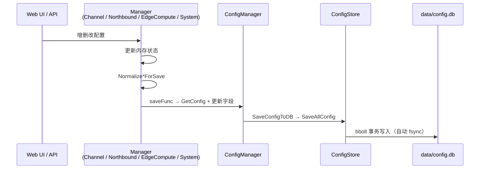

# edgex 运行时架构（双数据库：config.db + runtime.db）

| 项 | 内容 |
|----|------|
| 版本 | v2.2 |
| 日期 | 2026-06-26 |
| 状态 | 已实施 |

---

## 1. 设计原则

- **双数据库分离**：配置数据存储在 `data/config.db`，运行时数据存储在 `data/runtime.db`
- **配置库强一致**：`config.db` 使用 `NoGrowSync: false`，每次保存自动 fsync，优先备份
- **运行时库可治理**：`runtime.db` 允许清理、compact、重建，不影响配置
- **无文件热重载**：配置变更经 API/Manager 写库后立即生效于内存；重启从 DB 恢复
- **关键约束**：所有配置数据必须存储在 `config.db` 中，不得新增独立配置文件

---

## 2. 启动流程

### 2.1 安装模式 vs 运行模式

| 阶段 | config.db | runtime.db | ConfigManager | 配置来源 |
|------|-----------|----------|---------------|----------|
| 首次启动 | 不存在 | 不存在 | `NewConfigManagerWithEmptyConfig` | 内存默认值 |
| 安装完成 | 创建 `data/config.db` | 创建 `data/runtime.db` | `AttachDB` | 写入 Users / System / Server |
| 正常运行 | 已存在 | 已存在 | `NewConfigManagerWithDB` | 从 config.db 加载全部配置 |

### 2.2 初始化判定（cmd/main.go）

初始化流程只需检测 `config.db` 是否存在：

- **存在且非空**：进入运行模式，加载配置后启动各 Manager
- **存在但为空**：进入安装模式，等待首次安装写入
- **不存在**：进入安装模式，使用内存默认配置

`runtime.db` 无需单独判定，由 `NewStorage` 自动创建。

---

## 3. 配置持久化数据流

所有配置 CRUD 走同一路径，最终写入 `config.db`：



### 3.1 各模块 saveFunc 绑定（cmd/main.go）

| Manager | 更新字段 | 归一化 |
|---------|----------|--------|
| ChannelManager | `cfg.Channels` + Devices bucket | `NormalizeDevicesForSave` |
| NorthboundManager | `cfg.Northbound` | `NormalizeNorthboundForSave` |
| EdgeComputeManager | `cfg.EdgeRules` | `NormalizeEdgeRulesForSave` |
| SystemManager | `cfg.System` / `cfg.Users` | 直接经 ConfigManager |

---

## 4. DB Bucket 布局

### 4.1 配置库 Bucket（`data/config.db` — `internal/storage/config_store.go`）

| Bucket | Key | 内容 | 可清理 |
|--------|-----|------|--------|
| `ConfigVersion` | `version` | 配置 schema 版本 | 否 |
| `Server` | `server` | HTTP 端口、日志级别 | 否 |
| `Channels` | `channels` | 南向采集通道列表（设备引用） | 否 |
| `Devices` | `{device_id}` | 设备完整配置（含 points） | 否 |
| `Northbound` | `northbound` | 北向通道（MQTT/HTTP/OPC UA/SparkplugB/edgeOS） | 否 |
| `EdgeRules` | `edge_rules` | 边缘计算规则 | 否 |
| `System` | `system` | 主机名、网络、时间等 | 否 |
| `Users` | `users` | 用户账号 | 否 |

### 4.2 运行时库 Bucket（`data/runtime.db` — `internal/storage/boltdb.go`）

| Bucket | 用途 | 可清理 |
|--------|------|--------|
| `values` | 采集点位最新值 | 是 |
| `RuleState` | 边缘规则运行时状态 | 是 |
| `DataCache` | 南向缓存 | 是 |
| `WindowData` | 边缘规则窗口数据 | 是 |
| `NorthboundCache` | 北向发送缓存 | 是 |
| `device_history_{deviceID}` | 设备历史快照 | 是 |

`HasConfigData()` 检测 `Channels`、`Devices`、`Northbound`、`EdgeRules` 任一 bucket 有数据即认为已完成安装。

### 4.3 Bucket 路由机制

```go
func (s *Storage) getDBByBucket(bucketName string) *bbolt.DB {
    if IsConfigBucket(bucketName) {
        return s.configDB   // → data/config.db
    }
    return s.runtimeDB       // → data/runtime.db
}
```

`ClearBucket()` 禁止清理配置 bucket，确保配置安全。

---

## 5. API 入口与 Manager 映射

| API 前缀 | Manager | 持久化字段 | 目标 DB |
|----------|---------|------------|---------|
| `/api/channels`, `/api/devices`, `/api/points` | ChannelManager | Channels + Devices | config.db |
| `/api/northbound/*` | NorthboundManager | Northbound | config.db |
| `/api/edge/rules` | EdgeComputeManager | EdgeRules | config.db |
| `/api/system/*`, `/api/users/*` | SystemManager | System + Users | config.db |
| `/api/config/export`, `/api/config/import` | ConfigManager | 全量配置导入导出 | config.db |
| `/api/install/start` | InstallHandler | Server + System + Users | config.db |
| `/api/data/stats` | Storage | 数据库统计（双库） | config.db + runtime.db |
| `/api/data/clear-cache` | Storage | 清理运行时 bucket | runtime.db |
| `/api/data/clear-all-runtime` | Storage | 清空所有运行时数据（重建） | runtime.db |
| `/api/data/backup-config` | Storage | 备份配置库 | config.db |
| `/api/data/compact-runtime` | Storage | 压缩运行时库 | runtime.db |

---

## 6. 数据库治理

### 6.1 配置库（config.db）

| 特性 | 策略 |
|------|------|
| 写入一致性 | `NoGrowSync: false`，每次 `Update()` 自动 fsync |
| 备份 | `BackupConfigDB()` / `POST /api/data/backup-config` |
| 清理 | **禁止清理**，`ClearBucket()` 拒绝配置 bucket |
| Compact | 不在运行时 compact，仅备份后离线处理 |

### 6.2 运行时库（runtime.db）

| 特性 | 策略 |
|------|------|
| 写入性能 | `NoGrowSync: true`，优先性能 |
| 清理 | `ClearBucket()` / `ClearAllRuntimeBuckets()`，按 bucket 或全量清理 |
| Compact | `CompactRuntimeDB()` / `POST /api/data/compact-runtime`，回收已删除数据空间 |
| 重建 | `ClearAllRuntimeBuckets()` 清空所有运行时数据，配置不受影响 |

### 6.3 UI 数据管理页面

UI 数据管理页面区分两类操作：

| 操作 | 说明 | 目标 DB |
|------|------|---------|
| 清理运行时数据 | 清空 `runtime.db` 中的运行时 bucket，不影响配置 | runtime.db |
| 备份配置 | 备份 `config.db` 到指定目录 | config.db |

---

## 7. 已移除的废弃能力

| 组件 | 说明 |
|------|------|
| `saveDeviceToFile` | 设备 YAML 双写 |
| `NewConfigManager`（文件运行时） | 文件模式 ConfigManager |
| `StartWatch` / 文件热重载 | DB 模式下不再需要 |
| `POST /api/install/save` | 安装写 YAML |
| `SystemManager` confDir 文件 fallback | 已删除 |
| `ChannelManager.dataDir` | Sync 遗留字段 |
| `cmd/main.go` migrateDir 复制工具 | 无调用方 |
| SyncManager 运行时 YAML 同步 | 已禁用 |
| `edgex.db` 迁移工具 | 已删除，不再支持旧库迁移 |
| `AutoMigrateConfigFromDir` / `MigrateConfigToDB` | YAML→DB 迁移已删除 |
| `POST /api/data/migrate-legacy` | 一次性迁移 API 已删除 |
| `internal/migration` 包 | 已删除 |
| 影子运行时落盘 | ShadowCore 已纯内存；`NewStorage` 启动时删除遗留 bucket；升级后若 `runtime.db` 偏大，执行 compact-runtime 回收空间 |

---

## 8. 测试策略

### 8.1 默认 CI（快速）

```bash
go test ./internal/config/... ./internal/storage/... ./internal/core/... ./internal/server/...
```

- 配置持久化：`save_persistence_test.go`、`migration_integrity_test.go`
- Manager saveFunc：`channel_manager_persistence_test.go`、`northbound_manager_persistence_test.go`、`edge_compute_manager_persistence_test.go`
- 双数据库路由：`boltdb_test.go` 中 `IsConfigBucket` / `getDBByBucket` 测试
- 配置 bucket 保护：`ClearBucket` 拒绝配置 bucket 测试

### 8.2 集成 / 压力测试（>30s，需显式启用）

以下测试文件带 `//go:build integration` 标签，默认不编译：

```bash
go test -tags=integration ./internal/core/... -timeout 15m
```

| 文件 | 说明 |
|------|------|
| `scan_engine_large_scale_test.go` | 大规模 ScanEngine soak |
| `shadow_stress_test.go` | ShadowCore 并发/长时间压测 |
| `shadow_performance_test.go` | ShadowCore 性能基准 |
| `edge_rules_coverage_test.go` | 边缘规则场景覆盖报告 |

---

## 9. 运维备忘

**备份配置库**

```bash
cp data/config.db data/config.db.bak
# 或使用 API
curl -X POST http://localhost:8080/api/data/backup-config
```

**压缩运行时库**

自旧版升级后，若 `runtime.db` 体积异常偏大，启动时会自动删除遗留的影子运行时 bucket，但 bbolt 文件大小不会立即缩小；执行 compact 可回收磁盘占用。

```bash
# 通过 API 压缩（不影响配置库）
curl -X POST http://localhost:8080/api/data/compact-runtime
```

**清空运行时数据（重建）**

```bash
# 清空所有运行时 bucket，配置不受影响
curl -X POST http://localhost:8080/api/data/clear-all-runtime
```

**验证配置已落库**

- UI 添加通道/北向/边缘规则后重启，配置应完整恢复
- `conf/` 下不应出现新的运行时写入文件
- `data/config.db` 应包含 Channels、Devices、Northbound 等 bucket
- `data/runtime.db` 不应包含配置 bucket
